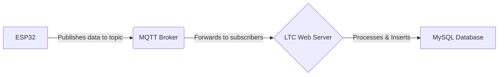

In this phase you will be working in your team, using the jobs board as an active snapshot of the status of the project.

# Sprint 1

## Objectives:

- Implement the initial set of challenges.
- Redesign the CTF website for optimal navigation and user experience.
- Rewrite the website content to match the established lore.

## Activities:

### Challenge Implementation:

- Develop the technical infrastructure for the challenges, including servers, databases, and scoring mechanisms.
- Implement the challenge logic and ensure that they are secure and bug-free.
- Test the challenges thoroughly to ensure they are functioning as intended.

### Website Redesign:

- Implement the website redesign prototype, ensuring that the website is responsive, accessible, and visually appealing.
- Integrate the challenges into the website and create user-friendly interfaces for challenge submission and scoring.
- Conduct user testing to gather feedback and make necessary adjustments.

### Content Rewriting:

- Rewrite the existing website content to align with the established lore.
- Write original content that provides a clear explanation of the CTF lore, challenge rules, and scoring system.
- Ensure that the content is engaging, informative, and contributes to the overall competition atmosphere.

## Timeline:

Sprint 1 is expected to take approximately 4 weeks to complete.

# ESP32 "Network" Diagram

This is the rough outline of how the ESP32 and RP2040 Feathers interact with existing infrastructure.

![[esp32NetworkDiagram.png]]

# MQTT

**MQTT (Message Queuing Telemetry Transport):**

- It's a lightweight, publish-subscribe messaging protocol.
- Ideal for constrained devices (like ESP32s) and unreliable networks.
- It is based on a broker.

**How it works (in this context):**

1. **ESP32 Feathers (Publishers/Subscribers):**
    - These devices either:
        - **Publish:** Send sensor data (e.g., temperature, humidity) to specific "topics" on the MQTT broker.
        - **Subscribe:** Listen to specific topics on the broker to receive commands or updates.
2. **MQTT Broker (Server):**
    - Acts as a central hub.
    - Receives messages published to topics.
    - Forwards messages to any clients subscribed to those topics.
3. **LTC Web Server/Other processing component:**
    - It contains logic to store and retrieve from the database.
    - Subscribes to relevant topics on the MQTT broker to receive data from ESP32s.
    - Processes the received data (e.g., filtering, averaging).
    - Interfaces with the MySQL database.
4. **MySQL Database:**
    - Stores the data received from the ESP32s (via the processing component).
    - Data can be retrieved for analysis, visualisation, etc.

**Interface Flow:**

