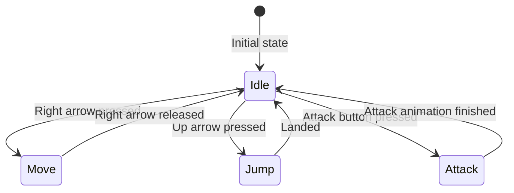

In game development, **design patterns** are reusable solutions to common problems that arise during software design. They help developers write more maintainable, scalable, and efficient code. Two widely used design patterns in game development are the **Singleton** and the **Finite State Machine (FSM)**.


---
# Presentation

[[Digital Technologies/_shared/_presentations/Design Patterns|Design Patterns]]

---

# Definitions


## Singleton Pattern

**Purpose:**  
Ensures a class has only one instance and provides a global point of access to it.

**Use in Games:**  
Singletons are often used for managing game-wide systems such as:

- Game managers
- Audio managers
- Input managers
- Configuration settings

In **Godot Engine**, singletons are often referred to as **autoloads**. 

**Example:**

```csharp
public class GameManager {
    private static GameManager instance;

    private GameManager() { }

    public static GameManager Instance {
        get {
            if (instance == null) {
                instance = new GameManager();
            }
            return instance;
        }
    }

    public void StartGame() {
        // Game start logic
    }
}
```

**Pros:**

- Easy access to global data
- Ensures only one instance exists

**Cons:**

- Can lead to tightly coupled code
- Difficult to test and extend

### Godot Example

In **Godot Engine**, singletons are often referred to as **autoloads**. Here's how you can create and use a singleton in Godot:

1. **Create a Script**: Write a script that will act as your singleton. For example, you might create a script called `Global.gd` to manage game states.
    
    ```gdscript
    extends Node
    
    var score = 0
    
    func increase_score(points):
        score += points
    ```
    
2. **Set Up Autoload**: To make this script a singleton, go to **Project > Project Settings > Autoload**. Add your script (`Global.gd`) and give it a name (e.g., `Global`). This will make the script globally accessible.
    
3. **Access Singleton**: You can now access the singleton from any other script in your project using the name you assigned. For example:
    
    ```gdscript
    func _on_Player_scored(points):
        Global.increase_score(points)
    ```
    

By using `Global.gd` as your singleton, you can easily manage and access shared data or functionality across different scenes and scripts in your game. This can help keep your code organized and reduce dependencies between different parts of your project.


---

## Finite State Machine (FSM)

### Video Explanations

<iframe width="560" height="315" src="https://www.youtube.com/embed/ow_Lum-Agbs?si=5BigIyS3tOoi13j5" title="YouTube video player" frameborder="0" allow="accelerometer; autoplay; clipboard-write; encrypted-media; gyroscope; picture-in-picture; web-share" referrerpolicy="strict-origin-when-cross-origin" allowfullscreen></iframe>


<iframe width="560" height="315" src="https://www.youtube.com/embed/-1Gz46Ihk5A?si=2vo2ZWYNRzztYapU" title="YouTube video player" frameborder="0" allow="accelerometer; autoplay; clipboard-write; encrypted-media; gyroscope; picture-in-picture; web-share" referrerpolicy="strict-origin-when-cross-origin" allowfullscreen></iframe>

### Explanation

**Purpose:**  
Models behavior using a limited number of states and transitions between them based on inputs or events.

**Use in Games:**  
FSMs are commonly used for:

- AI behavior (e.g., patrol, chase, attack)
- Game menus
- Player state (e.g., idle, running, jumping)

**Example:**

```csharp
public enum EnemyState { Idle, Patrol, Chase, Attack }

public class Enemy {
    private EnemyState currentState;

    public void Update() {
        switch (currentState) {
            case EnemyState.Idle:
                // Idle behavior
                break;
            case EnemyState.Patrol:
                // Patrol behavior
                break;
            case EnemyState.Chase:
                // Chase behavior
                break;
            case EnemyState.Attack:
                // Attack behavior
                break;
        }
    }

    public void ChangeState(EnemyState newState) {
        currentState = newState;
    }
}
```

**Pros:**

- Clear structure for behavior
- Easy to debug and extend
- Encourages modular code

**Cons:**

- Can become complex with many states
- May require refactoring for scalability

### High Level Overview
This shows the high level view of the transitions between states for an example player movement state machine.



# Implementation

The singleton pattern is implemented in the project with the `Global.gd` script.

