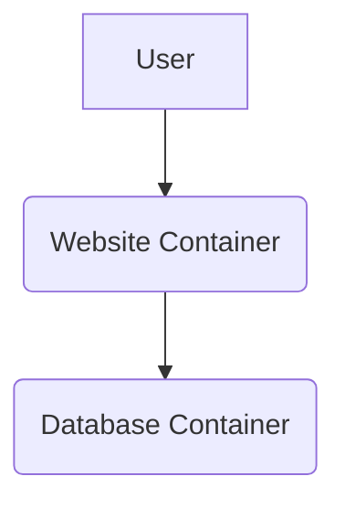
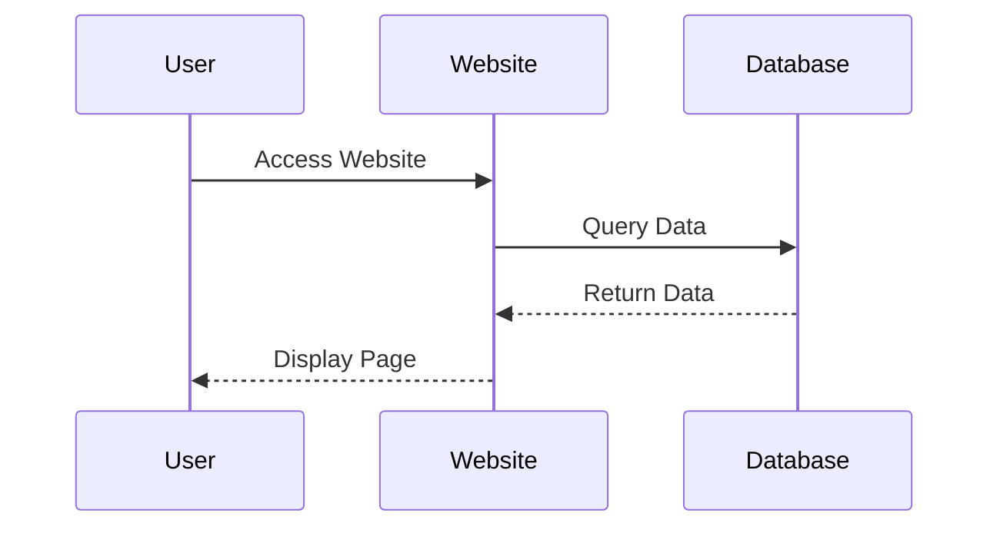

# Overview

The programming languages and technology focus in this unit will be:
- Docker Container
	- Server development`
- Report Writing
- Spreadsheet
	- formulas

# Context

In this phase of the project, you will be learning about and configuring the server development environment. You will also be producing a report on the configuration and implementation of the server environment.

This project, comprised of two tasks, focuses on the creation and configuration of an individual server for you to deploy your websites to.

You will also produce a report, detailing the process and submitting a timesheet to your client as an invoice for your work.

[[Development Process]]

# Tasks

## Task 1.1 - Docker Installation and Configuration
### Task Overview
This assignment requires you to demonstrate your understanding of containerisation by deploying a multi-service web application using Docker and Docker Compose. You will provision a Docker environment containing a website and a database, configure them to work together,

Using `docker-compose`, create a multi-service environment, according to the task specifications.

Your `docker-compose.yml` file must:
- Define the services.
- Properly configure network connectivity between the website and the database containers.
- Use volumes to ensure data persistence for the database.
- Set necessary environment variables (e.g., database credentials).

### Deliverable/s

| Deliverables                   | Submitted via  |
| ------------------------------ | -------------- |
| Docker Container configuration | GitHub project |

### Task 1.1 Competencies

| Unit Code                                                                        | Unit Title                                  | Cert II Core | Cert II Elective | Cert III Core | Cert III Elective |
| -------------------------------------------------------------------------------- | ------------------------------------------- | :----------: | :--------------: | :-----------: | :---------------: |
| [ICTICT213](https://training.gov.au/Training/Details/ICTICT213/unitdetails)	  | Use computer operating systems and hardware |      ✅       |                  |               |         ✅         |
| [ICTICT223](https://training.gov.au/Training/Details/ICTICT223/unitdetails)      | Install software applications               |              |        ✅         |               |                   |

### Assessment Task

==Link to Google Classroom==

### Learning Content

1. [[Account Creation & Software Installation]]
2. Slides - [[Virtualisation]]
3. [[Software Installation & Configuration]]
4. [[`devcontainer.json` Tutorial]]
5. [[Docker Compose Tutorial]]
6. [[Docker Configuration]]

---
## Task 1.2 - Report
### Task Overview

You are required to write a technical report detailing your installation and configuration process. The report must be a single Markdown (`.md`) file. The report should include the following sections:

1. **Introduction:** A brief overview of the project and the purpose of the report.
2. **Prerequisites:** A list of the software and tools required to follow your report's steps (e.g., Docker, Docker Compose, a text editor).
3. **Installation and Configuration Steps:** A detailed, step-by-step guide explaining how to set up the Docker environment. This section should include:
    - The complete `docker-compose.yml` code block.
    - Explanations for each part of the `docker-compose.yml` file.
    - Commands used to start and stop the containers.
4. **Verification:** Explain how a user can verify that the setup is working correctly (e.g., checking container status, accessing the web page in a browser).
5. **Mermaid Diagrams:** **You must include at least two Mermaid diagrams in your report.** These diagrams should visually represent your container architecture and service communication. Examples below:

- **Container Architecture (Graph):**

- **Service Interaction (Sequence Diagram):**

### Deliverable/s

| Deliverables       | Submitted via |
| ------------------ | ------------- |
| Technical Document | GitHub        |

### Task 1.2 Competencies

| Unit Code                                                                   | Unit Title                            | Cert II Core | Cert II Elective | Cert III Core | Cert III Elective |
| --------------------------------------------------------------------------- | ------------------------------------- | :----------: | :--------------: | :-----------: | :---------------: |
| [ICTICT214](https://training.gov.au/Training/Details/ICTICT214/unitdetails) | Operate application software packages |      ✅       |                  |               |         ✅         |
| [BSBTEC201](https://training.gov.au/training/details/BSBTEC201/unitdetails) | Use business software applications    |              |        ✅         |               |         ✅         |

### Learning Content

 1. Slides - [[E Course/WebDev/_slides/Markdown|Markdown Slides]]
 2. [[Markdown Tutorial|Markdown Tutorial]]
 3. Slides - [[E Course/WebDev/_slides/Mermaid Diagrams|Mermaid Diagrams]]
 4. [[Mermaid Tutorial|Mermaid Tutorial]]
 5. [[Software Installation & Configuration Manual]]

### Task 1.2 Assessment Task

==Link to Google Classroom==

