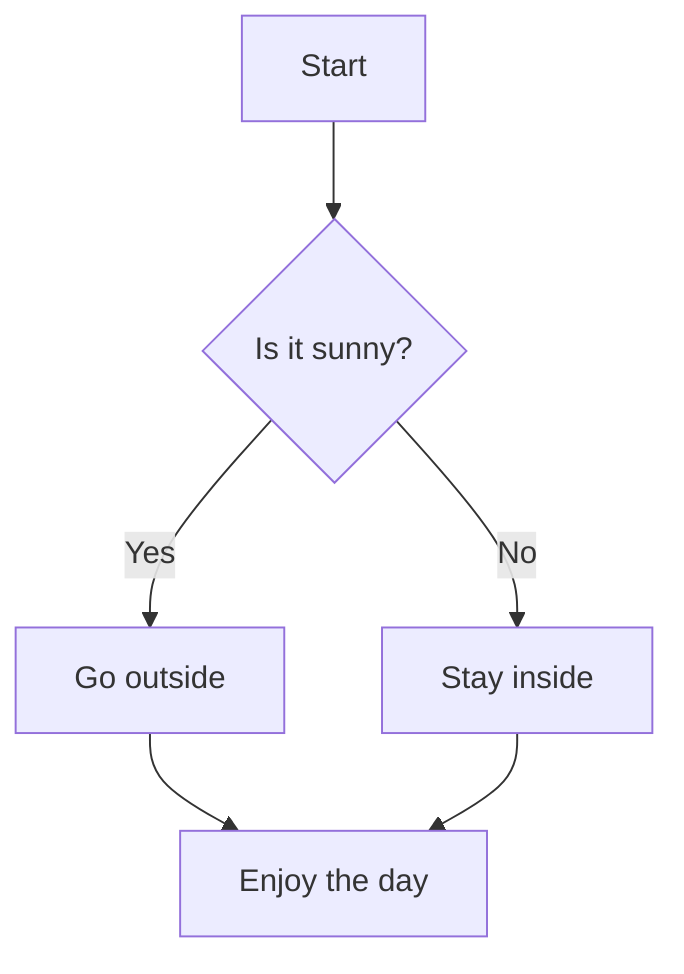

# Complete Markdown Tutorial for Students

## What is Markdown?

Markdown is a lightweight markup language that allows you to format text using simple syntax. It's widely used on GitHub, in documentation, blogs, and many other platforms. The beauty of Markdown is that it's readable in plain text but can be converted to HTML for beautiful rendering.

## Basic Syntax

### Headings

Use `#` symbols to create headings. The number of `#` symbols determines the heading level (1-6).

```markdown
# Heading 1 (Largest)
## Heading 2
### Heading 3
#### Heading 4
##### Heading 5
###### Heading 6 (Smallest)
```

**Result:**
# Heading 1 (Largest)
## Heading 2
### Heading 3
#### Heading 4
##### Heading 5
###### Heading 6 (Smallest)

### Text Formatting

#### Bold and Italic

```markdown
*This text is italic*
_This text is also italic_

**This text is bold**
__This text is also bold__

***This text is both bold and italic***
```

**Result:**
*This text is italic*
_This text is also italic_

**This text is bold**
__This text is also bold__

***This text is both bold and italic***

#### Strikethrough

```markdown
~~This text is struck through~~
```

**Result:**
~~This text is struck through~~

### Lists

#### Unordered Lists

Use `-`, `*`, or `+` for bullet points:

```markdown
- Item 1
- Item 2
  - Sub-item 2.1
  - Sub-item 2.2
- Item 3
```

**Result:**
- Item 1
- Item 2
  - Sub-item 2.1
  - Sub-item 2.2
- Item 3

#### Ordered Lists

Use numbers followed by periods:

```markdown
1. First item
2. Second item
   3. Sub-item 2.1
   4. Sub-item 2.2
5. Third item
```

**Result:**
1. First item
2. Second item
   3. Sub-item 2.1
   4. Sub-item 2.2
5. Third item

#### Task Lists (GitHub Feature)

```markdown
- [x] Completed task
- [ ] Incomplete task
- [ ] Another incomplete task
```

**Result:**
- [x] Completed task
- [ ] Incomplete task
- [ ] Another incomplete task

### Links

#### Simple Links

```markdown
[Link text](https://www.example.com)
[Link with title](https://www.example.com "This is a title")
```

**Result:**
[Link text](https://www.example.com)
[Link with title](https://www.example.com "This is a title")

#### Reference Links

```markdown
[Reference link][1]
[Another reference][github]

[1]: https://www.example.com
[github]: https://github.com
```

**Result:**
[Reference link][1]
[Another reference][github]

[1]: https://www.example.com
[github]: https://github.com

#### Automatic Links

```markdown
<https://www.example.com>
<email@example.com>
```

**Result:**
<https://www.example.com>
<email@example.com>

### Images

```markdown

![Alt text][image-reference]

[image-reference]: https://via.placeholder.com/150x100
```

**Result:**


### Code

#### Inline Code

```markdown
Use `backticks` to highlight code inline.
```

**Result:**
Use `backticks` to highlight code inline.

#### Code Blocks

Use triple backticks for code blocks. Add language name for syntax highlighting:

````markdown
```python
def hello_world():
    print("Hello, World!")
    return True
```
````

**Result:**
```python
def hello_world():
    print("Hello, World!")
    return True
```

#### Indented Code Blocks

Indent with 4 spaces:

```markdown
    This is a code block
    created with indentation
```

### Tables

```markdown
| Header 1 | Header 2 | Header 3 |
|----------|----------|----------|
| Row 1    | Data     | More data|
| Row 2    | Data     | More data|
```

**Result:**

| Header 1 | Header 2 | Header 3  |     |
| -------- | -------- | --------- | --- |
| Row 1    | Data     | More data |     |
| Row 2    | Data     | More data |     |

#### Table Alignment

```markdown
| Left-aligned | Center-aligned | Right-aligned |
|:-------------|:--------------:|--------------:|
| Left         | Center         | Right         |
| Text         | Text           | Text          |
```

**Result:**

| Left-aligned | Center-aligned | Right-aligned |
|:-------------|:--------------:|--------------:|
| Left         | Center         | Right         |
| Text         | Text           | Text          |

### Blockquotes

```markdown
> This is a blockquote.
> It can span multiple lines.
>
> > This is a nested blockquote.
```

**Result:**
> This is a blockquote.
> It can span multiple lines.
>
> > This is a nested blockquote.

### Horizontal Rules

```markdown
---
***
___
```

**Result:**

---

### Line Breaks

To create a line break, end a line with two or more spaces, or use a blank line for a paragraph break.

```markdown
This line ends with two spaces.  
This is a new line.

This is a new paragraph.
```

## GitHub-Specific Features

### Syntax Highlighting

GitHub supports syntax highlighting for many languages:

````markdown
```javascript
function greet(name) {
    return `Hello, ${name}!`;
}
```

```css
.highlight {
    background-color: yellow;
    font-weight: bold;
}
```
````

### Emoji

GitHub supports emoji using shortcodes:

```markdown
:smile: :heart: :thumbsup: :rocket: :octocat:
```

**Result:**

:smile: :heart: :thumbsup: :rocket: :octocat:

### Mentions and Issues

```markdown
@username
#123 (references issue/PR number)
```

### Math Expressions

GitHub now supports LaTeX-style math:

```markdown
$$\sqrt{3x-1}+(1+x)^2$$

$`\sqrt{3x-1}+(1+x)^2`$
```

## Best Practices

1. **Use meaningful headings** to create a clear document structure
2. **Add a table of contents** for long documents
3. **Use consistent formatting** throughout your document
4. **Preview your Markdown** before publishing
5. **Use descriptive alt text** for images
6. **Keep lines under 80 characters** when possible for readability
7. **Use reference links** for frequently referenced URLs
8. **Add blank lines** around headings and other elements for clarity

## Complex Example Document

Here's an example of a complete project README using various Markdown features:

---

# 🚀 Project Name

[](https://example.com)
[](https://opensource.org/licenses/MIT)

A brief, compelling description of what your project does.

## 📋 Table of Contents

- [Features](#features)
- [Installation](#installation)
- [Usage](#usage)
- [API Reference](#api-reference)
- [Contributing](#contributing)
- [License](#license)

## ✨ Features

- [x] Feature 1: Does something amazing
- [x] Feature 2: Handles complex scenarios
- [ ] Feature 3: Coming soon!

## 🔧 Installation

### Prerequisites

Before you begin, ensure you have met the following requirements:

* You have installed `Node.js >= 14.0.0`
* You have a Windows/Linux/Mac machine

### Install Project Name

To install Project Name, follow these steps:

```bash
# Clone the repository
git clone https://github.com/username/project-name.git

# Navigate to the project directory
cd project-name

# Install dependencies
npm install
```

## 🚀 Usage

Here's a quick example to get you started:

```javascript
const ProjectName = require('project-name');

// Initialize the project
const project = new ProjectName({
    apiKey: 'your-api-key',
    environment: 'production'
});

// Use the main feature
project.doSomethingAmazing()
    .then(result => {
        console.log('Success:', result);
    })
    .catch(error => {
        console.error('Error:', error);
    });
```

### Configuration Options

| Option | Type | Default | Description |
|--------|------|---------|-------------|
| `apiKey` | string | `null` | Your API key for authentication |
| `environment` | string | `'development'` | The environment to run in |
| `timeout` | number | `5000` | Request timeout in milliseconds |

## 📚 API Reference

### `doSomethingAmazing(options)`

Performs the main functionality of the project.

**Parameters:**
- `options` (Object): Configuration options
  - `param1` (string): Description of parameter 1
  - `param2` (boolean): Description of parameter 2

**Returns:** Promise that resolves to result object

**Example:**
```javascript
const result = await project.doSomethingAmazing({
    param1: 'value',
    param2: true
});
```

## 🤝 Contributing

Contributions are what make the open source community such an amazing place to learn, inspire, and create. Any contributions you make are **greatly appreciated**.

1. Fork the Project
2. Create your Feature Branch (`git checkout -b feature/AmazingFeature`)
3. Commit your Changes (`git commit -m 'Add some AmazingFeature'`)
4. Push to the Branch (`git push origin feature/AmazingFeature`)
5. Open a Pull Request

### Development Setup

```bash
# Install development dependencies
npm install --dev

# Run tests
npm test

# Run linter
npm run lint
```

## 📄 License

This project is licensed under the MIT License - see the [LICENSE](LICENSE) file for details.

## 🙏 Acknowledgments

* Hat tip to anyone whose code was used
* Inspiration from [similar project](https://example.com)
* Special thanks to contributors

---

> **Note:** This project is actively maintained. If you encounter any issues, please [open an issue](https://github.com/username/project-name/issues).

For more examples and detailed documentation, visit our [Wiki](https://github.com/username/project-name/wiki).


---
# Mermaid Diagrams

## What Is Mermaid?

**Mermaid** is a JavaScript-based diagramming and charting tool that lets you create diagrams using a simple text syntax. It’s especially useful in Markdown files and is supported natively by GitHub.


## Step-by-Step Tutorial


### **Write a Mermaid Diagram**

Use triple backticks with `mermaid` to define a diagram block:


```



This creates a **flowchart** with decision logic.

---

### Types of Diagrams You Can Create**

Mermaid supports several diagram types:

- **Flowcharts** (`graph TD` or `graph LR`)
- **Sequence diagrams**
- **Gantt charts**
- **Class diagrams**
- **State diagrams**
- **Entity Relationship diagrams**

#### Example: Sequence Diagram

```markdown
```mermaid
sequenceDiagram
    participant Alice
    participant Bob
    Alice->>Bob: Hello Bob, how are you?
    Bob-->>Alice: I'm good thanks!
````


---

### 4. **Previewing Mermaid Diagrams**

#### On GitHub

GitHub **automatically renders Mermaid diagrams** in Markdown files. Just commit and push your `.md` file to a repository, and view it in the browser.

#### Locally

To preview Mermaid diagrams locally, VS Code.

---

### 5. **Publishing to GitHub**

1. Open the `.md` file you wish to edit.
2. Add your Mermaid diagrams.
3. Commit and push.
4. View the file on GitHub — Mermaid diagrams will be rendered automatically.

---

## Tips for Writing Mermaid Diagrams

- Use **clear labels** and **consistent formatting**
- Use `graph TD` for top-down flowcharts and `graph LR` for left-to-right
- Use `-->` for arrows and `{}` for decisions
- Use `[Text]` for boxes and `(Text)` for circles

## Resources

https://mermaid.js.org/

