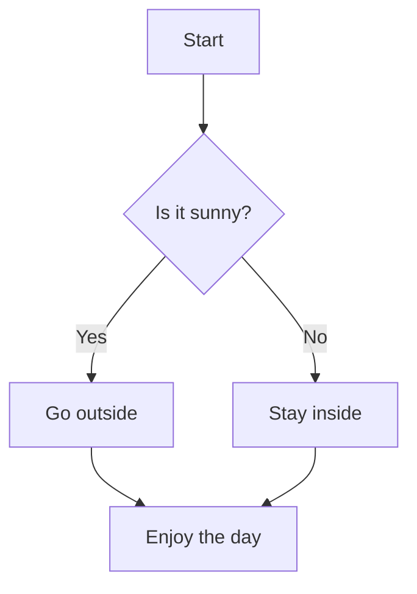

# Markdown

## What is Markdown?

**Markdown** is a plain text formatting syntax that converts easily to HTML. It’s designed to be readable and writable without looking like code.

Markdown is extremely useful to write documents with as it focuses on the content and is rendered by Github into readable documents.

---

##  Basic Markdown Syntax

### 1. **Headings**

Use `#` symbols to create headings:

```Markdown
# Heading 1
## Heading 2
### Heading 3
#### Heading 4
```

### 2. **Emphasis**

- _Italic_: `*italic*` or `_italic_`
- **Bold**: `**bold**` or `__bold__`
- **_Bold & Italic_**: `***bold & italic***`

### 3. **Lists**

- **Unordered list** (bullets):

```Markdown
- Item 1
- Item 2
  - Subitem
```

- **Ordered list** (numbers):

```Markdown
1. First item
2. Second item
   3. Subitem
```

### 4. **Links**

```Markdown

```


### 5. **Images**

```markdown

```

### 6. **Code**

- **Inline code**: ``Use `backticks` for inline code.``
- **Code block**:

```python
def hello():
    print("Hello, Markdown!")
```

### 7. **Blockquotes**

```Markdown
&gt; This is a blockquote.
&gt; It can span multiple lines.
```

### 8. **Horizontal Rule**

```Markdown
---
```

### 9. **Tables**

```Markdown
| Name     | Role     |
|----------|----------|
| Alice    | Developer|
| Bob      | Designer |
```

---

## 🧪 Advanced Features

### Task Lists

```Markdown
- [x] Completed task
- [ ] Incomplete task
```

### Footnotes (some platforms)

```Markdown
Here is a footnote reference[^1].

[^1]: This is the footnote.
```


# Mermaid Diagrams

## What Is Mermaid?

**Mermaid** is a JavaScript-based diagramming and charting tool that lets you create diagrams using a simple text syntax. It’s especially useful in Markdown files and is supported natively by GitHub.


## Step-by-Step Tutorial


### **Write a Mermaid Diagram**

Use triple backticks with `mermaid` to define a diagram block:


```



This creates a **flowchart** with decision logic.

---

### Types of Diagrams You Can Create**

Mermaid supports several diagram types:

- **Flowcharts** (`graph TD` or `graph LR`)
- **Sequence diagrams**
- **Gantt charts**
- **Class diagrams**
- **State diagrams**
- **Entity Relationship diagrams**

#### Example: Sequence Diagram

```markdown
```mermaid
sequenceDiagram
    participant Alice
    participant Bob
    Alice->>Bob: Hello Bob, how are you?
    Bob-->>Alice: I'm good thanks!
````


---

### 4. **Previewing Mermaid Diagrams**

#### On GitHub

GitHub **automatically renders Mermaid diagrams** in Markdown files. Just commit and push your `.md` file to a repository, and view it in the browser.

#### Locally

To preview Mermaid diagrams locally, VS Code.

---

### 5. **Publishing to GitHub**

1. Open the `.md` file you wish to edit.
2. Add your Mermaid diagrams.
3. Commit and push.
4. View the file on GitHub — Mermaid diagrams will be rendered automatically.

---

## Tips for Writing Mermaid Diagrams

- Use **clear labels** and **consistent formatting**
- Use `graph TD` for top-down flowcharts and `graph LR` for left-to-right
- Use `-->` for arrows and `{}` for decisions
- Use `[Text]` for boxes and `(Text)` for circles

## Resources

https://mermaid.js.org/

