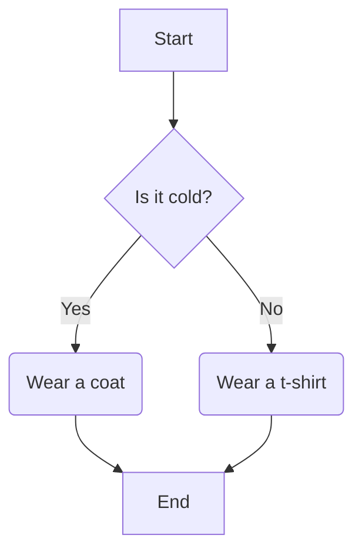
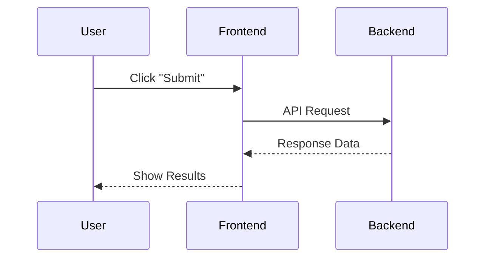
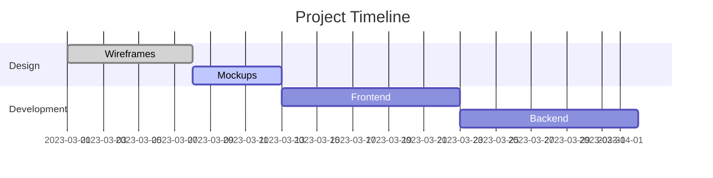
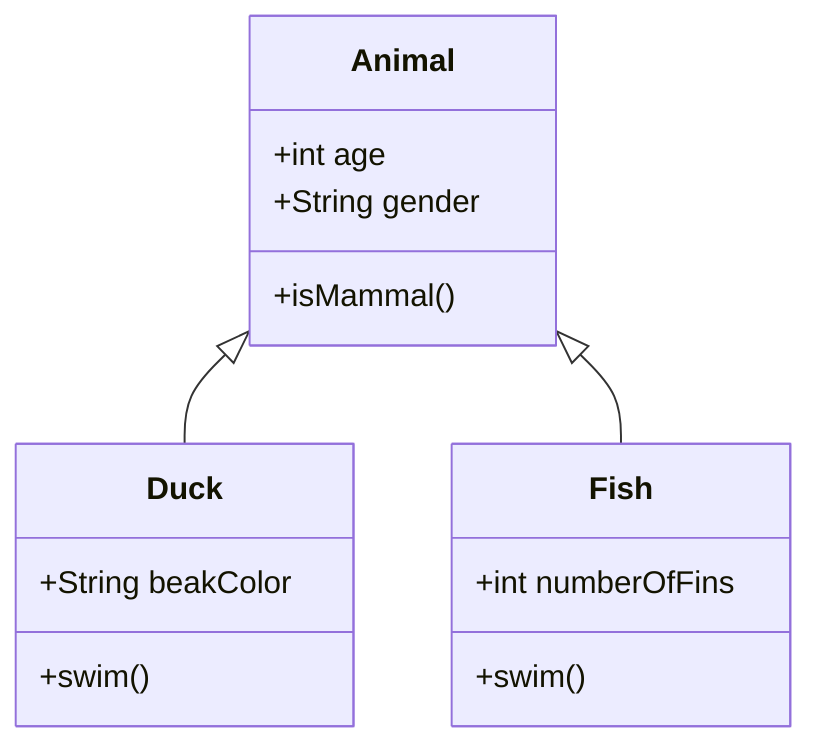
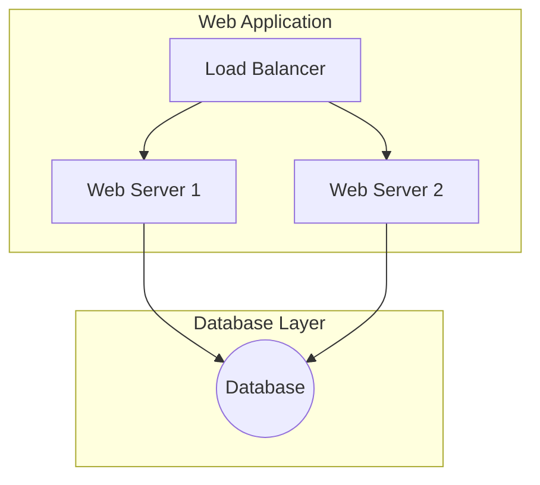
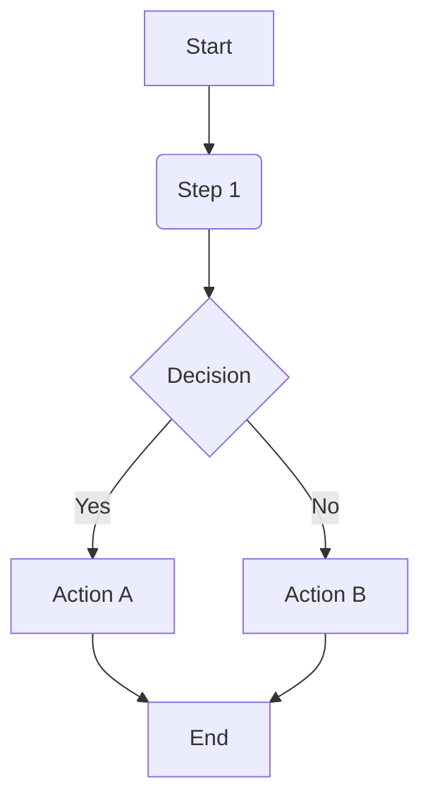
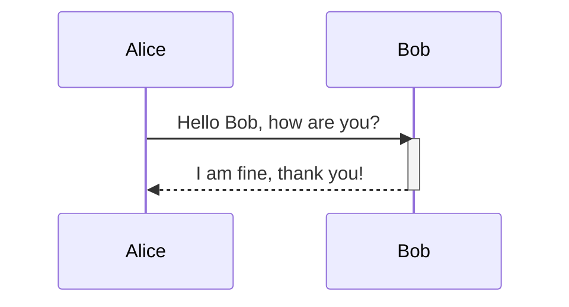
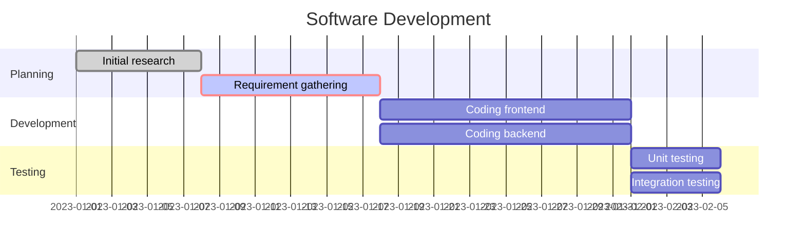
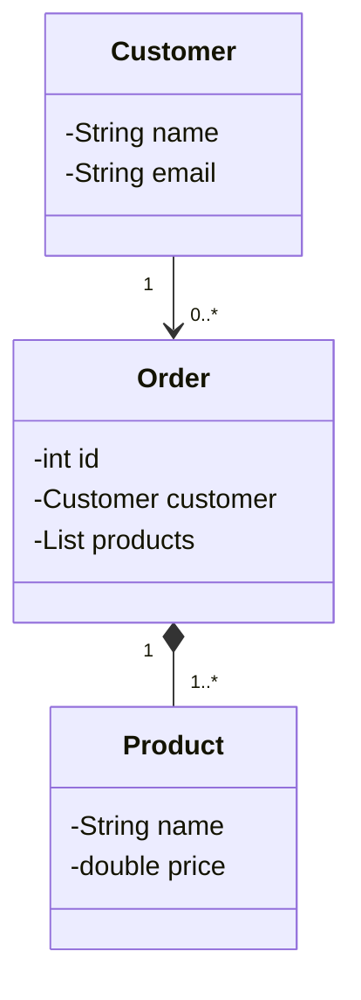
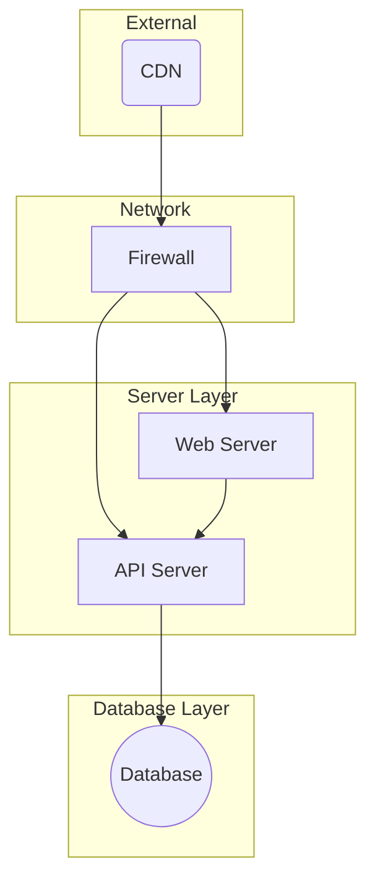

# A Comprehensive Guide to Mermaid Diagrams

### What is Mermaid?

Mermaid is a powerful and simple markup language that allows you to generate professional-looking diagrams and flowcharts from plain text. Instead of using a separate drawing tool, you write a few lines of code, and Mermaid renders a complete visual. This makes it an ideal tool for developers, technical writers, and anyone who wants to create clear, maintainable visuals that live alongside their code and documentation.

### Why Use Mermaid in GitHub?

Mermaid is particularly useful for documenting projects on platforms like GitHub because it provides several key benefits:

- **Readability:** Visuals break up long blocks of text and make complex ideas easier to understand at a glance.
- **Version Control:** The diagram's source code is just plain text, which means you can track changes using Git, just like you would with your code. This is much easier than managing image files.
- **Efficiency:** There's no need to save and upload image files. The diagram is part of the markdown document, simplifying your workflow.
- **Maintainability:** When you need to update a diagram, you simply edit a few lines of text. This is far more efficient than redrawing a chart and re-uploading the image.

### Getting Started: The Basic Syntax

To create a Mermaid diagram, you simply enclose your Mermaid code within a fenced code block with the language specifier `mermaid`.

```
graph TD;
    A-->B;
    A-->C;
    B-->D;
    C-->D;
```


Everything inside this block will be rendered as a diagram by GitHub's markdown engine.

### Core Diagram Types

Mermaid supports a wide range of diagrams. Here are some of the most common types you'll use in technical documentation.

#### Flowcharts (Graphs)

Flowcharts are perfect for illustrating processes and decision paths. The syntax starts with `graph`, followed by a direction.

- `graph TD`: Creates a graph with a Top-to-Down orientation. Other options include `LR` (Left-to-Right), `RL` (Right-to-Left), and `BT` (Bottom-to-Top).
- `A[Node A]`: Defines a node with text. You can use different shapes for nodes.
- `A-->B`: Creates a connection (an edge) with a solid arrow from node A to node B.

```
graph TD
    start[Start] --> a{Is it cold?};
    a -- Yes --> b(Wear a coat);
    a -- No --> c(Wear a t-shirt);
    b --> end[End];
    c --> end;
```



#### Sequence Diagrams

Sequence diagrams are ideal for showing how different components or objects interact with each other over time.

- `sequenceDiagram`: Declares a sequence diagram.
- `participant A`: Defines a participant in the sequence.
- `A->>B: Message`: Creates a message from participant A to participant B.

```
sequenceDiagram
    participant User
    participant Frontend
    participant Backend
    User->>Frontend: Click "Submit"
    Frontend->>Backend: API Request
    Backend-->>Frontend: Response Data
    Frontend-->>User: Show Results
```


#### Gantt Charts

For project management and task tracking, Gantt charts are incredibly useful.

- `gantt`: Declares a Gantt chart.
- `title`: Sets the chart's title.
- `section`: Organizes tasks into logical groups.
- `task :done, 1, 2023-01-01, 2023-01-10`: Defines a task with a status (`done` or `active`), ID, and dates.


```
gantt
    title Project Timeline
    dateFormat  YYYY-MM-DD
    section Design
    Wireframes  :done, des1, 2023-03-01, 7d
    Mockups     :active, des2, 2023-03-08, 5d
    section Development
    Frontend    :dev1, 2023-03-13, 10d
    Backend     :dev2, 2023-03-23, 10d
```


#### Class Diagrams

Class diagrams model the structure of a system by showing classes, their attributes, and the relationships between them.

- `classDiagram`: Declares a class diagram.
- `class MyClass`: Defines a class.
- `MyClass: +myAttribute: string`: Defines an attribute with its type.
- `MyClass --|> AnotherClass`: Shows inheritance (is a).
- `MyClass --* AnotherClass`: Shows composition (has a).

```
classDiagram
    class Animal
    Animal <|-- Duck
    Animal <|-- Fish
    Animal : +int age
    Animal : +String gender
    Animal: +isMammal()
    class Duck
    Duck : +String beakColor
    Duck : +swim()
    class Fish
    Fish : +int numberOfFins
    Fish : +swim()
```



#### Infrastructure Diagrams

Infrastructure diagrams are essential for visually representing the architecture of a system, including servers, databases, and network components. Mermaid allows you to create these diagrams using its powerful graph syntax and node styling.

You can group related nodes using subgraphs and apply specific styles to represent different types of components, such as a database or an external service. This helps make the diagram both accurate and easy to read.

```
graph TD
    subgraph "Web Application"
        A[Load Balancer] --> B[Web Server 1]
        A --> C[Web Server 2]
    end

    subgraph "Database Layer"
        D((Database))
    end

    B --> D
    C --> D
```


### Setting Up Your Local Environment

While GitHub natively supports Mermaid, you can also set up your local development environment to preview the diagrams as you write.

#### Visual Studio Code

Visual Studio Code is an excellent editor for working with markdown and Mermaid. To get started, you'll need a simple extension.

1. Open Visual Studio Code.
2. Navigate to the **Extensions** sidebar (the icon that looks like four squares).
3. Search for `Markdown Preview Mermaid Support`.
4. Click **Install**.

Once installed, you can open any markdown file with a `.md` extension, and the built-in markdown preview will render your Mermaid diagrams correctly. This allows you to see a live preview of your diagrams right in the editor, without having to push your changes to GitHub.

### Tips and Best Practices

- **Start Simple:** Don't try to draw your entire system in one diagram. Focus on one small part at a time to keep your diagrams clean and readable.
- **Keep it Clean:** Use simple node names and clear connections. The goal is to improve understanding, not to create a complex puzzle.
- **Use Comments:** You can add comments inside the `mermaid` block using `%%` to explain complex parts of the diagram's code.
- **Check the Syntax:** A small typo can prevent the diagram from rendering. If you're having trouble, use an online Mermaid editor to test your syntax first.

With these tools and tips, you're ready to start adding powerful visuals to all your GitHub markdown documents.

### Appendix: More Diagram Examples

#### Flowcharts

Here is an example of a simple flowchart that includes conditional logic and different node shapes.

```
graph TD
    A[Start] --> B(Step 1);
    B --> C{Decision};
    C -- Yes --> D[Action A];
    C -- No --> E[Action B];
    D --> F[End];
    E --> F;
```



#### Sequence Diagrams

This example shows a more detailed interaction, including an activation block to highlight when a participant is active.

```
sequenceDiagram
    participant Alice
    participant Bob
    Alice->>Bob: Hello Bob, how are you?
    activate Bob
    Bob-->>Alice: I am fine, thank you!
    deactivate Bob
```


#### Gantt Charts

This Gantt chart shows tasks with different statuses and dependencies.

```
gantt
    title Software Development
    dateFormat  YYYY-MM-DD
    section Planning
    Initial research :done, a1, 2023-01-01, 7d
    Requirement gathering :crit, active, a2, after a1, 10d
    section Development
    Coding frontend :dev1, after a2, 14d
    Coding backend :dev2, after a2, 14d
    section Testing
    Unit testing :test1, after dev1, 5d
    Integration testing :test2, after dev2, 5d
```



#### Class Diagrams

This example illustrates more complex relationships, including aggregation (`o--`) and composition (`*--`).

```
classDiagram
    class Customer{
      -String name
      -String email
    }
    class Order{
      -int id
      -Customer customer
      -List<Product> products
    }
    class Product{
      -String name
      -double price
    }
    Customer "1" --> "0..*" Order
    Order "1" *-- "1..*" Product
```



#### Infrastructure Diagrams

This infrastructure diagram provides a more comprehensive view of a system's components, including a firewall and a CDN.

```
graph TD
    subgraph "External"
        C(CDN)
    end
    subgraph "Network"
        F[Firewall]
    end
    subgraph "Server Layer"
        W[Web Server]
        A[API Server]
    end
    subgraph "Database Layer"
        D((Database))
    end
    
    C --> F
    F --> W
    F --> A
    W --> A
    A --> D
```



With these tools and tips, you're ready to start adding powerful visuals to all your GitHub markdown documents.