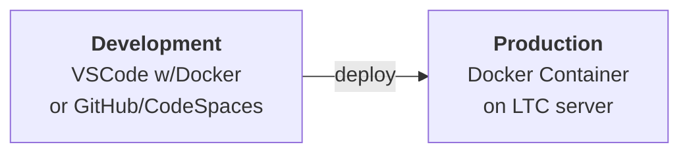

# Task Overview

| Estimated Hours | Deliverables            | Related Task (if applicable)            |
| --------------- | ----------------------- | --------------------------------------- |
| ==2==           | 1) Docker Container  | [[Task 2 - Server Installation Manual]] |
In this project, you'll set up a dedicated environment to host the websites you create throughout this course. This will be done using Docker, a powerful tool that allows you to run multiple isolated servers (called containers) on a single machine.

Docker containers are lightweight and efficient, and they provide a consistent and portable way to run your websites. This means you can easily share your websites with others and deploy them on different platforms without worrying about compatibility issues.

You will be building an individual docker 'server' and documenting the process.

**Development Environment Infrastructure**

During the remainder of the course, you will be developing the sites on your local device and then deploying to the Production Server (Docker container) you develop during this task.

## Task 1 Competencies

| Unit Code      | Unit Title                                  | Cert II Core | Cert II Elective | Cert III Core | Cert III Elective |
| -------------- | ------------------------------------------- | :----------: | :--------------: | :-----------: | :---------------: |
| ICTICT213	  | Use computer operating systems and hardware |      ✅       |                  |               |         ✅         |
| ICTICT223      | Install software applications               |              |        ✅         |               |                   |

# Task

1. [[Docker - What is it]] 
2. [[Docker - Installation]]

# Marking Scheme

The marking scheme for this task can be found on Google Classroom.

# Task Conditions

![[Competency Task Conditions#Conditions]]

![[Competency Task Conditions#Instructions]]