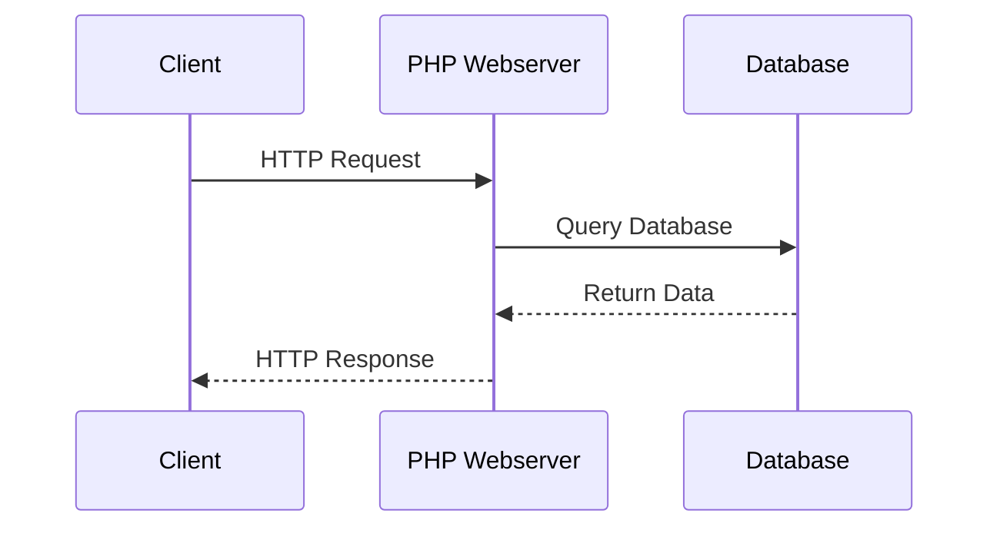
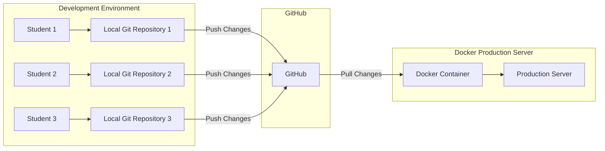
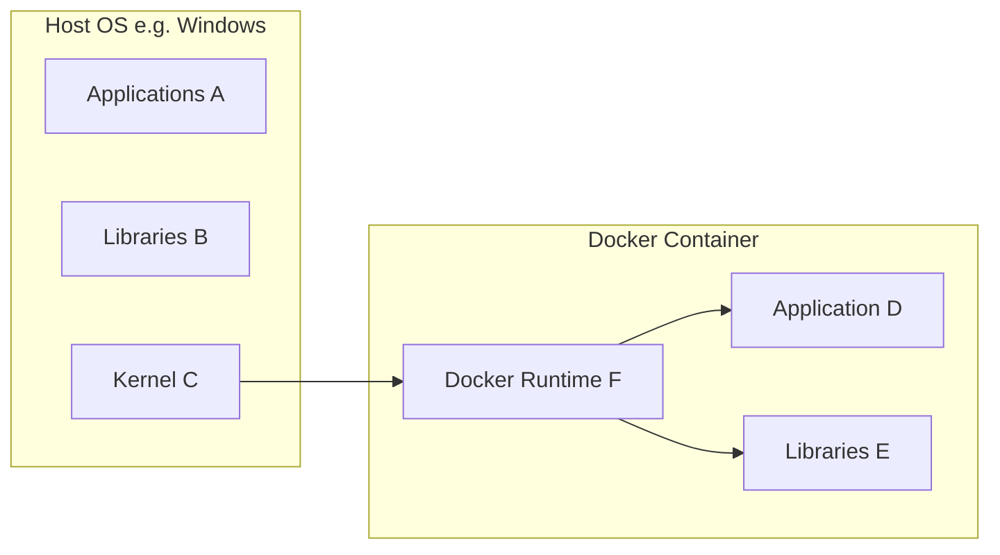

# Project 1

Welcome to the first project.

Two different, but linked tasks:

- Build a Docker container
- Write an Installation Manual for the process.

---

# Development Environment

| PC/Laptop          | Chromebook        |
| ------------------ | ----------------- |
| Visual Studio Code | GitHub Codespaces |
| Docker             |                   |
| PHP                |                   |

---

# Website Development

Software development, focusing on Website Development technologies:

- PHP
- MySQL/MariaDB
- SQL
- Bootstrap

note:
NOT website design.
Focus on programming skills with a strong emphasis on backend development.

--

# Typical Sequence

--
# Front-End vs Back-End Development

## Front-End Development

- **Focus**: User Interface (UI) and User Experience (UX)
- **Technologies**: HTML, CSS, JavaScript
- **Frameworks/Libraries**: React, Angular, Vue.js
- **Responsibilities**:
  - Designing and implementing the visual aspects of a website
  - Ensuring responsiveness and performance
  - Enhancing user interaction and experience

--

## Back-End Development

- **Focus**: Server-side logic and database management
- **Technologies**: PHP, Node.js, Python, Ruby, Java
- **Frameworks**: Laravel, Express, Django, Ruby on Rails, Spring
- **Responsibilities**:
  - Managing server, application, and database
  - Handling business logic and data processing
  - Ensuring security and data integrity

--

## Key Differences

| Aspect            | Front-End Development           | Back-End Development            |
|-------------------|---------------------------------|---------------------------------|
| **Focus**         | User Interface and Experience   | Server-Side Logic and Database  |
| **Technologies**  | HTML, CSS, JavaScript           | PHP, Node.js, Python, Java      |
| **Frameworks**    | React, Angular, Vue.js          | Laravel, Express, Django        |
| **Responsibilities** | Visual Design, UX, Performance | Data Management, Business Logic, Security |

--

## Conclusion

- **Front-End**: What users see and interact with
- **Back-End**: Behind-the-scenes functionality and data management
- Both are essential for a fully functional web application

---
# Typical Process

You'll code in VS Code or Codespaces, working towards the goal.

When you finish a feature, you'll commit changes to your GitHub repository.

---

# GitHub

## What is Version Control?

- **Version Control** is a system that records changes to a file or set of files over time.
- It allows you to revert files to a previous state, compare changes over time, and collaborate with others.

--

## What is Git?

- **Git** is a distributed version control system.
- It allows multiple people to work on a project simultaneously without overwriting each other's changes.
- Git tracks changes and helps in merging different versions of a project.

--

## What is GitHub?

- **GitHub** is a web-based platform that uses Git for version control.
- It provides a collaborative environment for developers to share and manage code.
- GitHub hosts repositories, which are collections of files and their revision history.

--

## Key Concepts in Git

### Commit

- A **commit** is a snapshot of your repository at a specific point in time.
- It records changes made to the files.
- Each commit has a unique ID (hash) and a message describing the changes.

--

## Key Concepts in Git
### Push

- **Push** is the process of sending your committed changes to a remote repository.
- It updates the remote repository with your local changes.

--

## Key Concepts in Git
### Pull

- **Pull** is the process of fetching changes from a remote repository and merging them into your local repository.
- It ensures your local repository is up-to-date with the remote repository.

--

## Workflow Example

1. **Clone** a repository from GitHub to your local machine.
2. Make changes to the files in your local repository.
3. **Commit** your changes with a descriptive message.
4. **Push** your commits to the remote repository on GitHub.
5. **Pull** any new changes from the remote repository to keep your local repository updated.

--

# Development Workflow

Core feature of the course infrastructure.

note:

---

# What is Docker?

**Docker** is a containerisation platform that allows developers to package, deploy, and run applications in isolated environments called **containers**.

[Docker Video](https://youtu.be/_dfLOzuIg2o?si=HSy74yep4VaeVCSp)

note:
A way to package your application and its dependencies together so that it can run on any computer, regardless of the operating system or software that is installed. 

It also keeps your application isolated from other applications, so they don't interfere with each other.

--
# How Docker is Used

- Application development and testing
- Deployment and scaling
- Cloud computing:
- Microservices architecture:

note:
- **Application development and testing:** Allows developers to create and test applications in isolated environments without affecting the host system.
- **Deployment and scaling:** Enables easy deployment and scaling of applications across multiple servers and environments.
- **Cloud computing:** Facilitates the deployment and management of applications on cloud platforms such as AWS, Azure, and GCP.
- **Microservices architecture:** Supports the development and deployment of independent, reusable microservices that can communicate with each other.

--

# Docker and Host OS

note:

- The host operating system (OS) consists of applications (A), libraries (B), and the kernel (C).
- Docker creates a container that includes the application (D), its necessary libraries (E), and the Docker runtime (F).
- The Docker runtime acts as a bridge between the container and the host OS, allowing the container to access the host's kernel and resources.

--
# Docker vs. Other Virtualisation

|Feature|Docker|Virtual Machines|
|---|---|---|
|**Resource usage**|Lightweight|Heavy resource consumption|
|**Isolation**|Shares kernel with host|Has its own isolated kernel|
|**Startup time**|Fast|Slow|
|**Use case**|Containerized applications|Full operating system virtualization|

Notes:

- Docker containers share the host's kernel, reducing overhead and improving resource utilization.
- Virtual machines have their own isolated kernel, which incurs more resource consumption and slower startup times.

--

# What is a Kernel?

- The core of an operating system that manages hardware resources, provides low-level services, and controls the execution of applications.
- Docker containers share the host's kernel, which reduces overhead and improves resource utilisation.

***The kernel of an operating system is like the conductor of an orchestra.***

note:

**Just as the conductor:**

- Coordinates the performance
- Provides a common language
- Maintains order
- Adapts to changes

Without a kernel, an operating system would be like an orchestra without a conductor - a chaotic and uncoordinated mess.

**Key Points:**

- The kernel is the core of the operating system.
- It manages hardware resources, provides low-level services, and controls the execution of applications.
- The kernel ensures that all components work together smoothly and efficiently.

--

# Efficiency of Docker

- Resource isolation
- Portability
- Reduced downtime
- Automation

**Notes:**

- Containers share the host's kernel, reducing overhead and improving resource utilisation.
- Docker images can be easily moved between different hosts and platforms, ensuring consistent performance.
- Containers can be quickly stopped and started, minimising downtime during application updates.
- Docker integrates with CI/CD pipelines, automating the build, deployment, and testing processes.

--

# Benefits of Docker

- Improved efficiency
- Increased portability
- Simplified deployment
- Enhanced security
- Cost reduction

**Notes:**

- Reduced resource consumption and faster startup times improve efficiency.
- Consistent performance across different environments increases portability.
- Easy deployment and scaling simplifies the deployment process.
- Isolation of applications from the host system enhances security.
- More efficient use of resources leads to reduced infrastructure costs.

---

# Task

Follow the steps in the project instructions

---

# Questions?

If you have any questions, please ask!

![[contactDetails.png]]