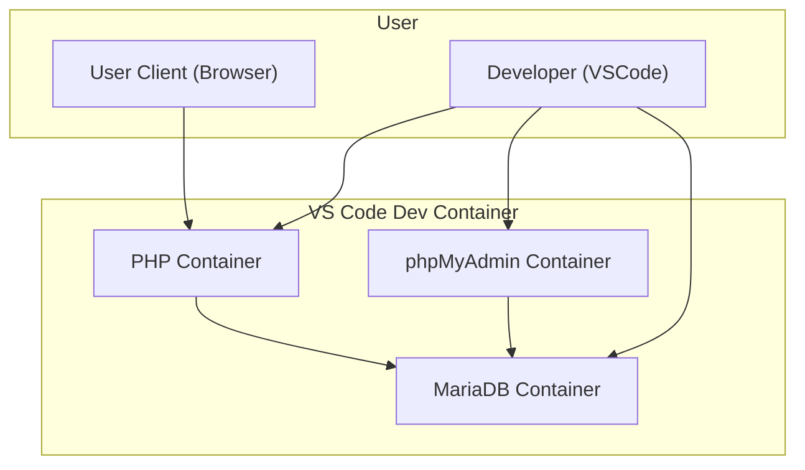

# Goals

The goal/s of this set of instructions are:
- Configure the Docker environment within Visual Studio Code

This server environment will be created:



# Prerequisites

These are required prior to starting these instructions
- [[Account Creation & Software Installation]]

# Instructions


## Devcontainer

With your project open, create a directory named `.devcontainer` (note the leading full stop!)

Inside this directory, create three files:

1. `devcontainer.json`
2. `Dockerfile`
3. `docker_compose.yml`

### `devcontainer.json` file

This file configures the container so when it starts up, it automatically configures software to work for our project and environment.


In the repository folder, create a folder called `.devcontainer`. The folder starts with a `.` which may mean it is usually hidden in Windows Explorer/Finder etc.

Inside this folder, create a file called `devcontainer.json` and replace the contents with the following:

```json
{
    "name": "PHP Apache + MariaDB Dev Container",
    "dockerComposeFile": [
        "../docker-compose.yml"
    ],
    "service": "web",
    "workspaceFolder": "/var/www/html",
    "shutdownAction": "stopCompose",
    "customizations": {
        "vscode": {
            "extensions": [
                "felixfbecker.php-debug",
                "bmewburn.vscode-intelephense-client",
                "cweijan.dbclient-jdbc",
                "cweijan.vscode-database-client2"
            ],
            "settings": {
                "php.validate.executablePath": "/usr/local/bin/php"
            }
        }
    }

}
```

### `Dockerfile`

Inside this file, include the following code:

```docker
# Use official PHP image with Apache
FROM php:8.2-apache

# Install PDO and MariaDB extensions
RUN docker-php-ext-install pdo pdo_mysql

# Enable Apache mod_rewrite (optional, useful for frameworks like Laravel)
RUN a2enmod rewrite

# Copy your PHP application into the container
# COPY ./src /var/www/html/

# Set proper permissions
RUN chown -R www-data:www-data /var/www/html
# Add a startup script to print the server URL
RUN echo '#!/bin/bash\n\
echo "Server is running at http://localhost:80"\n\
exec apache2-foreground' > /usr/local/bin/startup.sh \
    && chmod +x /usr/local/bin/startup.sh

# Use the custom startup script as the container's entrypoint
CMD ["/usr/local/bin/startup.sh"]

```

### `docker-compose.yml`

Add this code:

```bash
version: '3.8'

services:
  web:
    build:
      context: .
      dockerfile: .devcontainer/Dockerfile
    image: php:8.2-apache
    container_name: php_apache
    ports:
      - "8080:80"
    volumes:
      - .:/var/www/html
    depends_on:
      - db

  db:
    image: mariadb:latest
    container_name: db
    restart: always
    environment:
      MYSQL_ROOT_PASSWORD: rootpassword
      MYSQL_DATABASE: shopfront
      MYSQL_USER: shopfront
      MYSQL_PASSWORD: shopfront
    volumes:
      - db_data:/var/lib/mysql
    ports:
      - "3306:3306"
  
  phpmyadmin:
    image: phpmyadmin/phpmyadmin
    container_name: phpmyadmin_container
    environment:
      PMA_HOST: db # Link to the MariaDB container service name
      MYSQL_ROOT_PASSWORD: rootpassword # Use the same root password as MariaDB
      PMA_PORT: 3306 # MariaDB's internal port
    ports:
      - "8081:80" # Expose phpMyAdmin on host port 8081
    depends_on:
      - db # Ensure MariaDB starts before phpMyAdmin

volumes:
  db_data:
```

Save the file.


## Commit & Push changes

At stages of the development, such as when features have been complete, it's important to commit these changes to your repository, and then push the changes to GitHub.

> [!warning] This is especially important when developing in Codespaces. Changes you make to your files, DO NOT save back into your repository. You MUST commit and push the changes to have your repository updated.

![[commonBlocks#Commit & Push]]

# Test configuration

In the root directory, create a new file called `index.php` and replace the contents with:

```php
<?php
echo "Configuration Successful";
?>
```

Save the file.

Open in the Docker Container, and wait for Docker to download the image and configure the container.

![[projectOpenIInContainer.png]]

After the container is configured, launch the site using this URL:

http://localhost:8080

You will see the following if everything is configured correctly.

![[configurationSuccess.png]]

# Database Configuration

Before the site can be developed, the database needs to be configured to allow for user access.

If not already opened, open the project in Visual Studio Code in the Docker Container.

![[projectOpenIInContainer.png]]

If the **terminal** is not open, open the bottom panel and then click on the Terminal tab, as shown below:

![[dbOpenTerminal.png]]

Enter the following command: `mariadb-secure-installation` and press Enter.

![[dbSecureInstllation.png]]

You'll be asked a number of questions. Answering as indicated here:


| Question                               | Response                                         |
| -------------------------------------- | ------------------------------------------------ |
| the current root password              | enter the password you entered in the Dockerfile |
| **Switch to unix_socker authentication | Y                                                |
| Remove anonymous users?                | Y                                                |
| **Change the root password**           | n                                                |
| Remove anonymous users?<br>            | Y                                                |
| **Disallow root login remotely**<br>   | n                                                |
| Remove test database and access to it? | Y                                                |
| Reload privilege tables now?           | Y                                                |

![[dbSecureInstllationComplete.png]]

# Connect to Database Server

Open the Database Client exctension throught eh iton on the left hand side of Visual Studio Code.

![[dbExtension.png]]


Click the `+` to create a new connection to a database.

![[dbAddNewConnection.png]]

Enter the settings for the database. Choose **MariaDB** first, then enter the database password. Click **Save** and then **Connect**.

![[dbConnectionSettings.png]]

## Create Database and user

MariaDb can host many different databases within the server, and each databaase needs to be created.

Press the `+` button next to the active connection to add a new database.

![[dbNewDatabase.png]]

Modify the SQL to add the word `shopfront`.

```sql

-- Create the database
CREATE DATABASE shopfront;

-- Create the user and set a password
CREATE USER 'shopfront'@'localhost' IDENTIFIED BY 'shopfront';

-- Grant privileges to the user on the database
GRANT ALL PRIVILEGES ON shopfront.* TO 'shopfront'@'localhost';

-- Apply the changes
FLUSH PRIVILEGES;

```

Press the **Run** button on each command to execute the SQL commands.

![[dbExecuteSQL.png]]

The new database will now appear in the server.

![[dbShopfrontCreated.png]]

**Congratulations** you've created a database on your database server!
