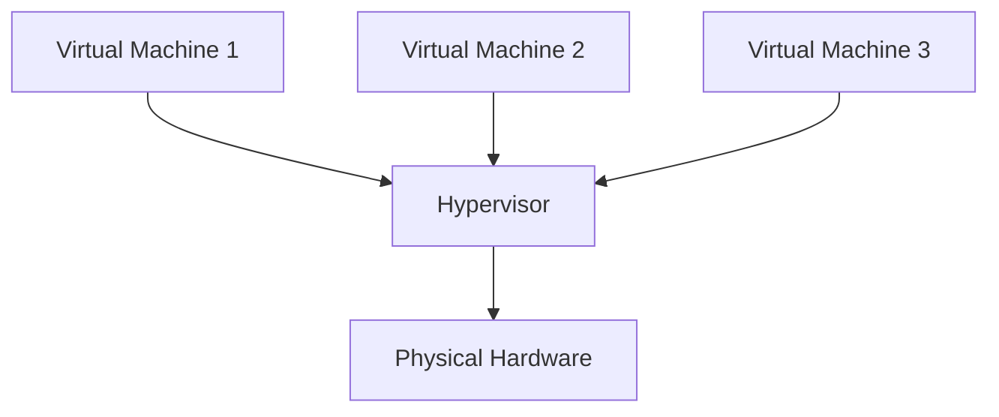
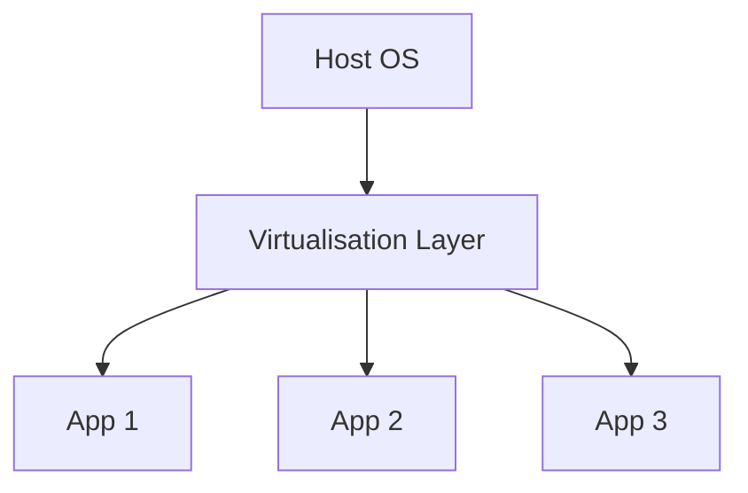
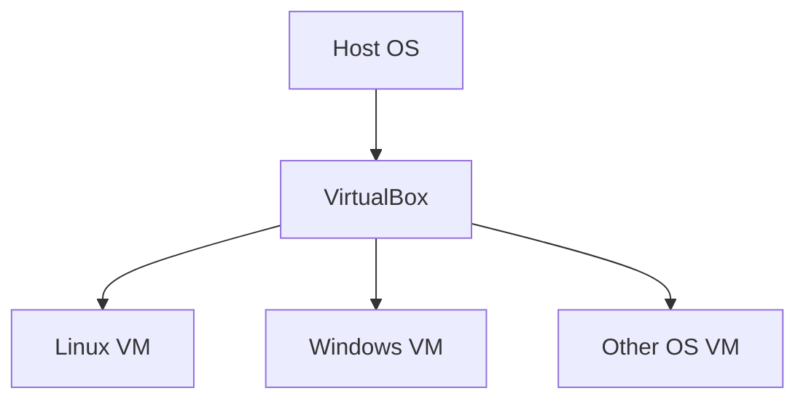
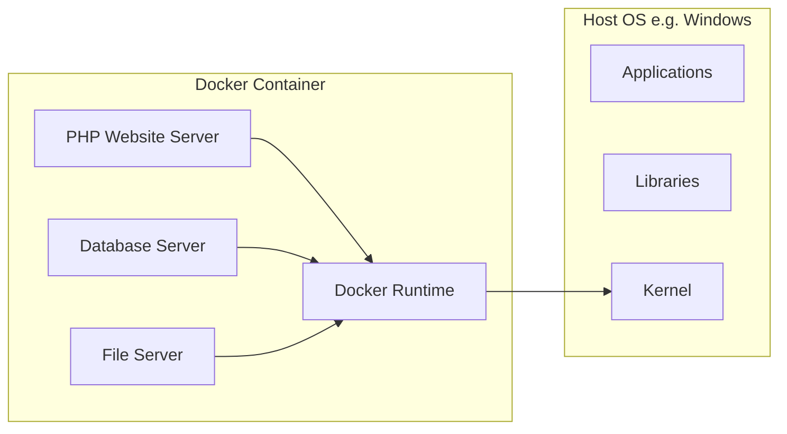

# Virtualisation

- **Virtualisation**: The process of creating a virtual version of something, such as hardware platforms, storage devices, and network resources.
- **Benefits**: Improved resource utilisation, scalability, and isolation.

--

# Types of Virtualisation
- Hardware Virtualisation
- Software Virtualisation
- Network Virtualisation
- Storage Virtualisation

note:
Hardware virtualisation is the focus for this presentation.

--

# Hardware Virtualisation
- **Definition**: Creating virtual machines that act like real computers with an operating system.
- **Examples**: UTM, VirtualBox

--

# Software Virtualisation

- **Definition**: Virtualising applications or entire operating systems.
- **Examples**: Containers (Docker), Application Virtualisation

--

## VirtualBox Example

- **VirtualBox**: A cross-platform virtualisation application.
- **Features**: Supports multiple OS types, extensive features.

---

# What is Docker?

**Docker** is a containerisation platform that allows developers to package, deploy, and run applications in isolated environments called **containers**.

[Docker Video](https://youtu.be/_dfLOzuIg2o?si=HSy74yep4VaeVCSp)

--

# Docker Terms

| Term                 | Description                                                                                                                                                                            |
| -------------------- | -------------------------------------------------------------------------------------------------------------------------------------------------------------------------------------- |
| Docker **image**     | Read-only templates used to create containers. Images are built from a set of instructions written in a Dockerfile, which specifies the base image, dependencies, and commands to run. |
| Docker **container** | Instances of Docker images that run applications. Containers are isolated from each other and the host system, ensuring consistency across different environments.                     |

note:
A way to package your application and its dependencies together so that it can run on any computer, regardless of the operating system or software that is installed. 

It also keeps your application isolated from other applications, so they don't interfere with each other.

--
# How Docker is Used

- Application development and testing
- Deployment and scaling
- Cloud computing
- Microservices architecture

note:
- **Application development and testing:** Allows developers to create and test applications in isolated environments without affecting the host system.
- **Deployment and scaling:** Enables easy deployment and scaling of applications across multiple servers and environments.
- **Cloud computing:** Facilitates the deployment and management of applications on cloud platforms such as AWS, Azure, and GCP.
- **Microservices architecture:** Supports the development and deployment of independent, reusable microservices that can communicate with each other.

--

# Docker and Host OS
![[dockerContainterisedApplications.png]]

--

# Docker Example

note:

- The host operating system (OS) consists of applications (A), libraries (B), and the kernel (C).
- Docker creates a container that includes the application (D), its necessary libraries (E), and the Docker runtime (F).
- The Docker runtime acts as a bridge between the container and the host OS, allowing the container to access the host's kernel and resources.

---
# `.devcontainer` vs Docker Compose

There are different approaches to using Docker.

Choose the best option for the server/s or development environment.

This project will be using Docker Compose due to the complexity.

--

# .devcontainer

- Designed for **VS Code Remote Containers**
- Uses `.devcontainer.json` to define environment
- Ideal for **individual developer environments**
- Integrates with **GitHub Codespaces** extremely well

![[exampleDockerDevContainer.png|400]]

note:
"Codespaces" = GitHub's implementation of Docker on their servers.

GitHub will delete Codespaces after a set time of inactivity.

--

# Docker Compose

- Uses `docker-compose.yml` to define multi-container apps
	- E.g. one container for PHP, another for MySQL server.
- Great for **local development and production parity**
- Works independently of any IDE

![[exampleDockerCompose.png|400]]

note:

Docker Compose can be used to 'launch' multiple `.devcontainer.json` files to manage multiple containers. If developing locally, you can access each container through different VS Code windows.

--

# When to Use What?

| Use Case                     |  .devcontainer           |  Docker Compose          |
| ---------------------------- | ------------------------ | ------------------------ |
| IDE Integration              |  ✅ VS Code               | ⚠️ Limited               |
| Multi-service architecture   | ⚠️ Limited               |  ✅                       |
| GitHub Codespaces            |  ✅ Native support        |  ⚠️ Requires config      |
| Production-like setup        | ❌ Individual Dev-focused |  ✅                       |

---
# Docker vs. Other Virtualisation

| Feature            | Docker                     | Virtual Machines                     |
| ------------------ | -------------------------- | ------------------------------------ |
| **Resource usage** | Lightweight                | Heavy resource consumption           |
| **Isolation**      | Shares kernel with host    | Has its own isolated kernel          |
| **Startup time**   | Fast                       | Slow                                 |
| **Use case**       | Containerised applications | Full operating system virtualisation |

Notes:
- Docker containers share the host's kernel, reducing overhead and improving resource utilisation.
- Virtual machines have their own isolated kernel, which incurs more resource consumption and slower startup times.

--

# What is a Kernel?

- The core of an operating system that manages hardware resources, provides low-level services, and controls the execution of applications.
- Docker containers share the host's kernel, which reduces overhead and improves resource utilisation.

***The kernel of an operating system is like the conductor of an orchestra.***

notes:

**Just as the conductor:**

- Coordinates the performance
- Provides a common language
- Maintains order
- Adapts to changes

Without a kernel, an operating system would be like an orchestra without a conductor - a chaotic and uncoordinated mess.

**Key Points:**

- The kernel is the core of the operating system.
- It manages hardware resources, provides low-level services, and controls the execution of applications.
- The kernel ensures that all components work together smoothly and efficiently.

--

# Efficiency of Docker

- Resource isolation
- Portability
- Reduced downtime
- Automation

Notes:
- Containers share the host's kernel, reducing overhead and improving resource utilisation.
- Docker images can be easily moved between different hosts and platforms, ensuring consistent performance.
- Containers can be quickly stopped and started, minimising downtime during application updates.
- Docker integrates with CI/CD pipelines, automating the build, deployment, and testing processes.

--

# Benefits of Docker

- Improved efficiency
- Increased portability
- Simplified deployment
- Enhanced security
- Cost reduction

Notes:

- Reduced resource consumption and faster startup times improve efficiency.
- Consistent performance across different environments increases portability.
- Easy deployment and scaling simplifies the deployment process.
- Isolation of applications from the host system enhances security.
- More efficient use of resources leads to reduced infrastructure costs.

---

# Questions?

If you have any questions, please ask!

![[contactDetails.png]]