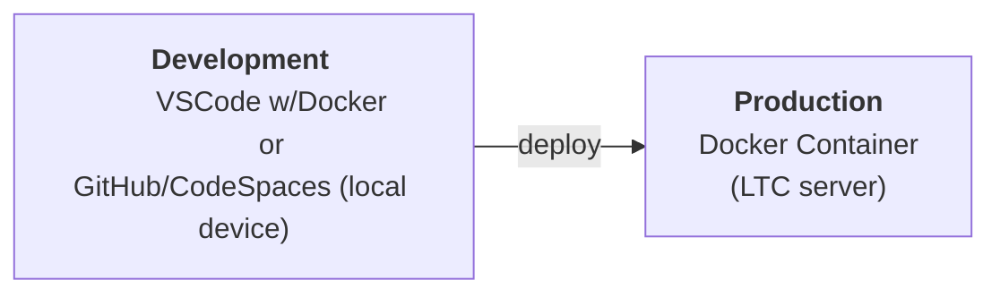

Docker containers are lightweight and efficient, and they provide a consistent and portable way to run your websites. This means you can easily share your websites with others and deploy them on different platforms without worrying about compatibility issues.

You will be building an individual docker 'server' and documenting the process.

**Development Environment Infrastructure**

During the remainder of the course, you will be developing the sites on your local device and then deploying to the Production Server (Docker container) you develop during this task.

Build a docker container using a `.devcontainer` file within your GitHub repository, which:

- Configures a PHP container
- Installs SQLite
- Launches the website (`index.php `only) on the localhost on port 8080.

# Marking Guide

==TODO==
