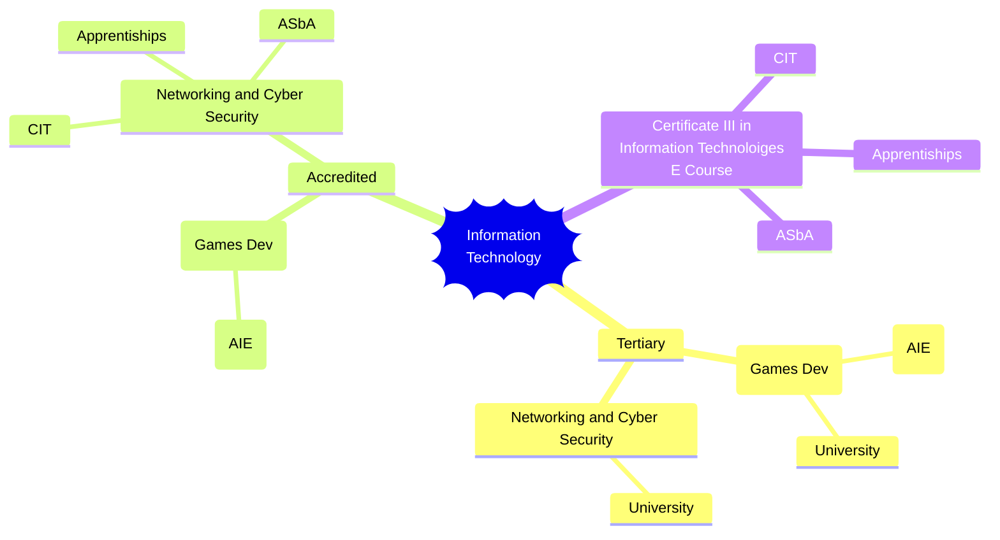

Welcome to the Holocron - the central repository for IT subjects at LTC. 

| Semester | Networking and Security                      | Digital Technologies     | Robotics & Mechatronics               | [[Certificate III in Information Technology E Course]]                    |
| -------- | -------------------------------------------- | ------------------------ | ------------------------------------- | ------------------------------------------------------------------------- |
| 1        | [[Networking and Cyber Systems]]             | [[Digital Assets]]       | [[Building and Programming Circuits]] | [[Website Development Semester 1\|Semester 1]]                            |
| 2        | [[Network Administration and Security]]      | [[Digital Applications]] | [[Robotic & Mechatronic Systems]]     | [[Website Development Semester 2\|Semester 2]]                         |
| 3        | [[Designing & Securing Enterprise Networks]] | [[Digital Solutions]]    | [[Application Of Robotics]]           | [[Website Development Semester 3\|Semester 3]]                            |
| 4        | [[Cloud and Distributed Systems]]            | [[ISD Project]]          | [[Robotics Project]]                  | [[Website Development Semester 4\|Semester 4]]                            |
|          |                                              |                          |                                       | [[Certificate II in Applied Digital Technology - Self Paced Assessments]] |

![[commonBlocks#Contact Details]]

# Career Path Options

This shows the *intended* career paths for the different IT options at LTC.

