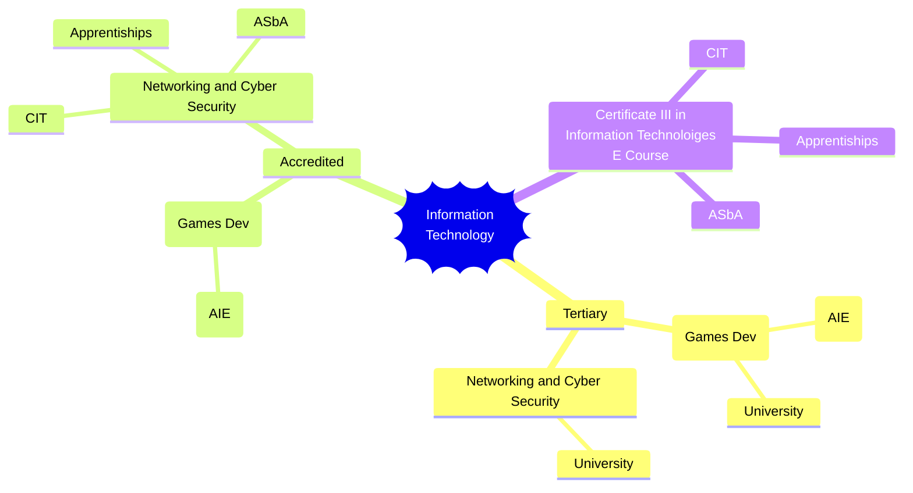

Welcome to the Holocron - the central repository for IT subjects at LTC. 

| Semester | Cyber Systems, ICT                           | Interactive Software Development | Robotics                              | Certificate III in Information Technology | ~~Website Development Remote Learning~~ |
| -------- | -------------------------------------------- | -------------------------------- | ------------------------------------- | ----------------------------------------- | ------------------------------------------ |
| 1        | [[Networking and Cyber Systems]]             | [[Digital Assets]]               | [[Building and Programming Circuits]] | ~~[[Certificate III in Information Technology E Course]]~~                  | ~~[[Digital Assets (Flask)]]~~             |
| 2        | [[Network Administration and Security]]      | [[Digital Applications]]         | [[Robotic & Mechatronic Systems]]     |                                           | ~~[[DigitalApplications-Flask]]~~          |
| 3        | [[Designing & Securing Enterprise Networks]] | [[Digital Solutions]]            | [[Application Of Robotics]]           |                                           |                                            |
| 4        | [[Cloud and Distributed Systems]]            | [[ISD Project]]                  | [[Robotics Project]]                  |                                           |                                            |

![[commonBlocks#Contact Details]]

# Career Path Options

This shows the *intended* career paths for the different IT options at LTC.

