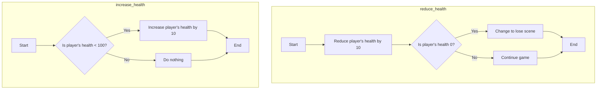
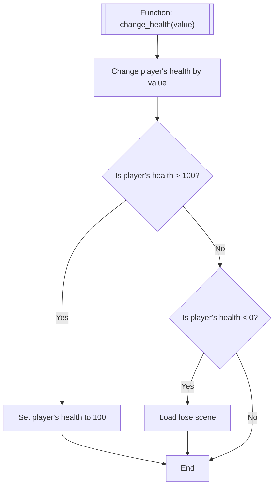

> [!important] Prerequisite: [[Enemy Shooting]]

During the game, the players health should be impacted by various game mechanics. These could include:

| Reducing Health         | Increasing Health        |
| ----------------------- | ------------------------ |
| Getting shot            | Picking up a health pack |
| Colliding with an enemy | Time                     |

This tutorial will focus on the first for each. 

Whatever the game mechanics chosen, there are a number of ways to approach the health change. You could create two functions, one to increase the players health by 10 (up to 100), and another function to reduce it by 10 (until 0).



**However**, this approach limits the flexibility in the system; by only changing the value by 10.

Another approach could be to write one single function, which takes value (an `argument` see [[Player Shooting]]), which modifies the player health value. The function would also need respond if the players health goes beyond 0 or 100. So, the logic could be:



This approach is much more flexible and can be used as the game scales up.

# Common Code

Open `Player.gd` and create a new variable to store the players health.

![[playersHealthVariable.png]]

```gdscript
@export var health: int = 10
```

> [!info] Defining it as `@export` allows the developer to set the value from the inspector tab for the node. This allows different instances of the same node to have different starting values. E.g. different enemies can have different health.

Define a new function called `change_health` with an argument called `health_modifier`.

![[playerHealthFuncDefine.png]]

Complete the function as described in the flowchart above.

![[playersHealthFuncChangeHealth.png]]

```
func change_health(health_modifier):
	health = health + health_modifier
	if health > 100:
		health = 100
	elif health < 0:
		get_tree().change_scene_to_file("res://OtherScenes/LoseScene.tscn")
```

> [!important] Note that the function only adds the `health_modifier`. This is still valid, as if the health needs to decrease the `health_modifier` would need to be negative.

Save the File.

![[commonBlocks#Commit & Push]]
# Reducing Health

The players health can be reduced when an enemy bullet collision occurs. If the bullet collides with the player, the `change_health` function will be called in `player.gd`.

Open `Bullet-Enemy.gd` and add code to the `_physics_process` function. This code will run when the bullet hits the player, and calls `change_health` with a value of -10. 

![[playerHealthReduceHealth.png]]

```gdscript
collided_object.get_collider().change_health(-10)
```

This approach can be taken for any object that collides with the player object.

Save the file.

![[commonBlocks#Commit & Push]]

# Increasing Health

TBA