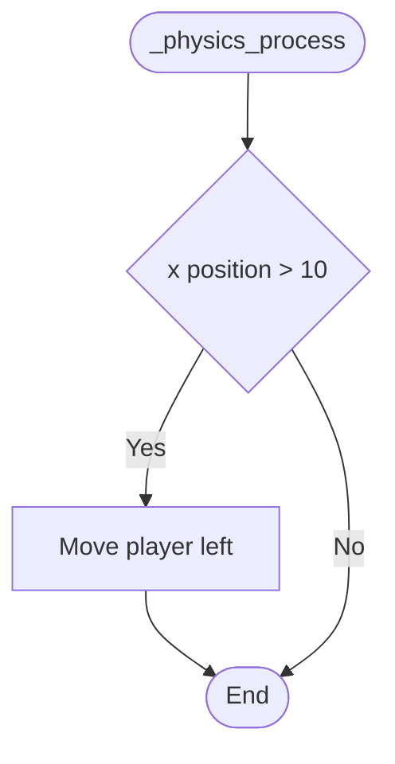

---
tags:
  - S1
  - ISD
---
![[Theory#Algorithm Design - Decisions]]
# GDScript Implementation

## if..then..

In GDScript, the if block follows the standard syntax of if statements in other languages as can be seen here. Note the semi-colon (:) at the end of the line of the if statement.

Also note how the following line statement(s) is indented. This indicates that this line or block is to be executed in the condition is true.

```
if [condition]:
	statement(s)
```

### if..then.. Example

In this sample code, at the end of the game, the players score is checked against the previously set high score. If the players score - `currentScore` - is higher than the previously set high score - `highScore` - then the high score is reset to the current score, and the player is informed by updating the user interface.

```
if currentScore > highScore:
	highScore = currentScore # Set new high score
		$HUD.dialog.text = "Well done! You got a new high score"
```

## if..then..else..

Similarly to the standard if..then.., the addition of the else follows the standard pattern. Again notice the semi-colon and the indentation.

```
if [expression]:
	statement(s)
else:
	statement(s)
```

### if..then..else.. Example

This example extends the previous version by including an else clause. If the players score is not higher than the previously set high score, then the player is informed but told to improve.

```
if currentScore > highScore:
	highScore = currentScore # Set new high score
		$HUD.dialog.text = "Well done! You got a new high score"
else:
		$HUD.dialog.text = "Not good enough. Try again!"
```

## elif

GDScript, like Python has an addition option in the if...then structure, and that’s elif. This is shorthand for `else..if`. 

This allows you to include code to test for multiple conditions in a “nicer” fashion. 

This sample code adds an additional check. If `currentScore` is not greater than highScore the code will then check if `currentScore == highScore` is true. If true, it will run the code on the following line, otherwise it will jump to the else: clause as normal.

```
if currentScore > highScore:
	highScore = currentScore # Set new high score
		$HUD.dialog.text = "Well done! You got a new high score"
elif currentScore == highScore:
		$HUD.dialog.text = "You equalled the top score. So Close! Try again!"
else:
		$HUD.dialog.text = "Not good enough. Try again!"
```

## Match

The basic syntax for a match block is shown here. 

> [!info] In GDScript, a match block is the equivalent to switch..case in other languages.


match compares the condition or a variable against possible values, listed as patterns there. If there is a match, then the associated block of code is run.

```
match [condition]:
	[[s|pattern]]:
		[block]
	[[s|pattern]]:
		[block]
	[[s|pattern]]:
		[block]
```

There are different, and more complex ways of using match blocks, which can be read [https://docs.godotengine.org/en/stable/getting_started/scripting/gdscript/gdscript_basics.html#match](https://docs.godotengine.org/en/stable/getting_started/scripting/gdscript/gdscript_basics.html#match), however a simple example given on that page is this.

In this situation, the value stored in the variable being checked - x - is compared to each of the sections. 

If x == 1, then the command `print("We are number one!")` would be executed.

If x == 2, then the command `print("Two are better than one!")` would be executed.

If x == “test”, then `print("Oh snap! It's a string!")` would be executed. As GDScript is a dynamic typed language, x could be an int or a string, so this code is completely valid.

```
match x:
	1:
		print("We are number one!")
	2:
		print("Two are better than one!")
	"test":
		print("Oh snap! It's a string!")

```

## Comparison Operators

The standard *comparison* operators in GDScript are shown here and can be used in `if` conditions.

| Operator | Description |
| --- | --- |
| `!` | Not |
| `x == y` | x is equal to y |
| `x != y` | x is not equal to y |
| `x < y` | x is less than y |
| `x > y` | x is greater than y |
| `x <= y` | x is less than or equal to y |
| `x >= y` | x is greater than or equal to y |

# Practical Exercises

In the ongoing Software Development Fundamentals project, open the `Player.gd` script in the Player folder. 

## Player Movement

In this section you’ll learn how to program the player node to move left and right based on key input from the user.

This script is attached to the Player node (which is the Firefly class freighter in the game). Currently the script has only one command, which is `pass`, meaning nothing.

The default `_ready()` function runs as soon as the node (in this case Player) enters the game scene when the scene is run. In effect, it runs on any object with a script, as soon as that object appears in the game.

![[decisionsPlayerGD.png|Screen Shot 2022-01-18 at 8.57.29 pm.png]]

Before any movement can be performed, you will need to set a base movement speed. At the top of `Player.gd` create a new variable and give it a value of 200.

![[decisionMovementSpeed.png|Screen Shot 2022-01-18 at 9.22.08 pm.png]]

```
var movement_speed = 200
```

Replace `pass` with `set_physics_process(true)` in the _ready() function.

This function, when run with the argument true, enables physics processing on the node. Physics processing will allow the ability to move the object in game.

![[decisionsSetPhysicsProcess.png]]

```
set_physics_process(true)
```


Create a new function - called `_physics_process(delta)` . 

Note the indentation of the new function and how it lines up with `func _ready()`. This means that the new function is **not** a part of the `_ready()` function.

This function is another function that is built into the Node class in GDScript, meaning that all nodes have this function available, even if it’s not coded or referenced.

You can research all the functions and settings for all Nodes [here](https://docs.godotengine.org/en/stable/classes/class_node.html).

![[decisionsPhysicsProcess.png|Screen Shot 2022-01-18 at 9.15.33 pm.png]]

Now it’s time to create the logic of the physics of the player node, which luckily is fairly simple:

- If the player presses “left”, move the player object left on the screen.
- If the player presses “right”, move the player object right on the screen.

### Logic Implementation

The logic may be simple, however how this is achieved may look complex, so focus on each section.

Both if blocks use the function `Input.is_action_pressed()`. This function is part of the Input class of functions, which handles all input events for Godot. The Input class manages inputs from keyboard, mouse, VR controller, console controllers etc.

The `is_action_pressed()` returns `true` if an input event has been detected for the given action.

Therefore, the first input block (on line 15) will return `true` if the user has pressed the button which matches `ui_left`, and the second will return true if the user pressed a button associated with `ui_right.`

If the user has pressed the left arrow button, the first if statement will be true and it will therefore execute the command `move_and_collide(Vector2(-movement_speed * delta, 0))`. `move_and_collide()` is a function which will move the Node in the direction indicated until a collision has occurred. 

![[decisionsPlayerMovement.png]]

```
func _physics_process(delta):
	if Input.is_action_pressed("ui_left"):
		move_and_collide(Vector2(-movement_speed * delta, 0))
	if Input.is_action_pressed("ui_right"):
		move_and_collide(Vector2(movement_speed * delta, 0))
```


### Move_and_Collide

The offical definition of `move_and_collide` is:

> [!info] This method takes one parameter: a [vector2](https://docs.godotengine.org/en/stable/classes/class_vector2.html#class-vector2) indicating the body's relative movement. Typically, this is your velocity vector multiplied by the frame timestep (`delta`). If the engine detects a collision anywhere along this vector, the body will immediately stop moving. If this happens, the method will return a [KinematicCollision2D](https://docs.godotengine.org/en/stable/classes/class_kinematiccollision2d.html#class-kinematiccollision2d) object.
> [https://docs.godotengine.org/en/stable/tutorials/physics/using_kinematic_body_2d.html#move-and-collide](https://docs.godotengine.org/en/stable/tutorials/physics/using_kinematic_body_2d.html#move-and-collide)

This complex answer can be cut down to - move the node by `movement_speed`, defined earlier, along the x axis. The higher the number, the faster it moves. `Vector2` has two parameters - x and y. The code given only impacts the x value (the other be `0`), meaning that the node only moves along that axis. In effect, the player (at this stage) is limited to only moving left and right and **cannot** move up and down. This functionality may be added later.

But it’s not that simple because there is a problem - what if the computer you’re running the game on is really fast, or really slow? How can this be “fixed”. The answer is delta time.

### Delta Time

Delta time is a very important topic with game development. Delta is the time since the last frame refresh (the frame rate), or more specifically, the time since the last time the `_process()` function was called. 

Multiplying `movement_speed` by delta “fixes” the problem of movement in games on computers with different frame rates.

[Understanding Delta Time](https://drewcampbell92.medium.com/understanding-delta-time-b53bf4781a03)


### What Keys match what Input event?

To review, or edit, the key mapping, go to the Project Settings (under the Project menu) and look under the Input Map tab. 

Here you can see which keys match `ui_left`, `ui_right`, `ui_up`, `ui_down` etc. You can edit them if you wish.

You can also add new actions if needed in your game. `fire` is a custom action that is not part of the default action and has already been added for use later in the project.

![[decisionsInputMap.png]]

## Run the Game

Test moving the player left and right!

Are the any bugs or unexpected behaviour?

![[decisionsPlayerMovement.gif]]

## Challenge - Boundaries

You may have noticed that the player can move out of bounds and off screen at this stage. This is not ideal. Typically, you would want the player to remain on screen during game play. The challenge is to develop code to do this. 


 > [!info] There are a number of approaches to this. Solutions are generally not “wrong” or “right”, some are more efficient or simpler than others, but rarely “wrong”.


### One approach

One approach is to check the current x or y position of the player. If that value is outside of the bounds that you, the developer, decide then the player movement is overridden. 

Start with just one boundary, get that working and then expand it to the other 3 sides of the game window. For example. Start with the left-hand side of the game window.



The code already developed does the majority of the heavy lifting for you already in the [player.gd](http://player.gd) script under `_physics_process(delta)`:

![[decisionsPlayerMovement.png]]

`move_and_collide()` in this case does the movement as indicated by the “Move Player Left” in the flowchart.

You will need to add another decision - if - to your code to check the players position before running the `move_and_collide()` command.


> [!info] Hint: using the built in variable position will give the x and y coordinates of the node that the script is attached to (in this case the player).
`position` has two sub-variables called x and y, giving the x and y coordinates.
using `position.x` will give the players x position in the game.


Once you have that working, continue the same logic and approach to the other sides. Remember: switch to `position.y` for the top and bottom.

### Video Demonstration

This video shows how to approach the above problem if you’re struggling.


![[decisionsBoundaries.jpeg]]

# Review

1. Describe a decision in programming using plain language.
	1. Update the sentence with more technical language. 
2. What’s a nested if statement?
3. What’s the difference between a nested if block and a case switch?
4. Could you implement `_physics_process()` to use `else`, `elif` or `match`?
5. How would you implement player movement up and down?

