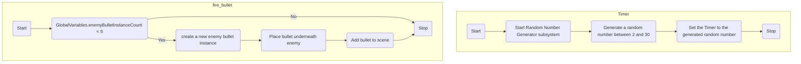

---
tags:
  - S1
  - ISD
---

There are many approaches to take to implement the enemy shooting game mechanic. The approach taken in this tutorial is:
- Attach a timer to each enemy.
	- The timer is set to a random number between 2 and 30 seconds.
	- When the timer runs out, trigger the `fire_bullet` function
- `fire_bullet` function
	- If there are less than 5 enemy bullets in the scene
		- Create a new enemy bullet instance
		- Place it below the enemy instance
		- Add bullet to the scene.
- Enemy Bullet Management
	- Increase enemy bullet instance count on instantiation.
	- Move the Enemy Bullet down the screen
	- Respond to collisions with player, enemy, etc.

The logic of this approach looks like this in flowchart form.



# Timer

Open `Enemy/Enemy.tscn`. Add a Timer node to the scene, by right-clicking on Enemy and choosing `Add Child Node`.

![[enemyShootingTimerAdd.png]]

Ensure the **Autostart** option in the inspector is turned **OFF**. 

![[enemyShootingTimerAutostart.png]]

Switch to the **Node** tab, and double click on the `timeout` signal. Change the **Receiver Method** to `fire_bullet`.

![[enemyShootingSignal.png]]

Click **Connect**

Save the Scene.

# Randomising Bullet Fire Time

By default the Timer is set to 1 second before the firing is triggered, however that doesn't make for a fun game. To fix this 'problem', the timer value will be randomised between set values. To do this, `_ready()` will be edited in `Enemy.gd`.

Add code to generate a random number, set between 2 and 30 seconds. Then start the timer.

![[enemyShootingRandomTimer.png]]

```gdscript
var rng = RandomNumberGenerator.new()
rng.randomize()
$Timer.wait_time  = rng.randf_range(2.0, 30.0)
$Timer.start()
```

# `fire_bullet`

Still within `Enemy.gd`, create a new variable to preload the enemy bullet scene.

![[enemyShootingPreloadBullet.png]]

```gdscript
var bullet = preload("res://Bullet-Enemy/Bullet-Enemy.tscn")
```

Replace the `pass` in `fire_bullet` with the following code, matching the flowchart above.

```gdscript
if GlobalVariables.enemyBulletInstanceCount < 5:
		var bulletInstance = bullet.instantiate()
		bulletInstance.position = Vector2(global_position.x, global_position.y+20)
		get_tree().get_root().add_child(bulletInstance)
```

Save the Scene.


# Enemy Bullet Management

> [!important] Prerequisite: In order for this to function correctly, you will need to have created the `enemyBulletInstanceCount` variable in `Global.gd`, as described in [[Counting the Number of Bullets]]
> ![[variablesEnemyBulletInstanceCount.png]]

## Bullet Speed

Open `Bullet-Enemy.gd`.  Create a new variable to control how fast the bullets move.

![[enemyShootingSpeed.png]]

```gdscript
var speed = 500
```

## Enemy Bullet Instance Count

Replace the contents of `_ready` with code to increase the `enemyBulletInstanceCount` by 1. Remember this code runs when the enemy bullet is instantiated in the game. Also add the code to start the physics process.

![[enemyShootingReady.png]]

```gdscript
GlobalVariables.enemyBulletInstanceCount += 1
set_physics_process(true)
```


## Bullet Movement

Create the `_physics_process` function and add the code to make the enemy bullet move down the screen based on the `speed` variable set earlier.

![[enemyShootingBulletMovement.png]]

```gdscript
func _physics_process(delta):
	var collided_object = move_and_collide(Vector2(0, +speed*delta*0.4))
```

## Respond to collisions

The bullet (hopefully) will hit something, the goal being the player. Although the bullet could also collide with :
- Another enemy
- The bottom of the screen/window.
This code can be all handled `_physics_process`.

![[enemyShootingCollisions.png]]

```gdscript
if (collided_object):
		if "Enemy" in collided_object.get_collider().name:
			pass
		elif "Player" in collided_object.get_collider().name:
			queue_free()
			GlobalVariables.enemyBulletInstanceCount -= 1
		else:
			queue_free()
			GlobalVariables.enemyBulletInstanceCount -= 1
```

You can see that if the bullet collides:
- with an object with "Enemy" in the name, does nothing
- with an object with "Player" in the name, the bullet is deleted and the instance count is reduced by 1.
- with any other object (e.g. the area at the bottom of the screen), the bullet is deleted and the instance count is reduced by 1.

Save the file.

![[commonBlocks#Commit & Push]]
# Demonstration

![[enemyShootingDemo.gif]]

# Improvements

One of the major flaws of this approach, as it is, is that that any enemy shoots even the ones at the top which can't 'see' the player (because other enemy's are in the way).

To avoid this issue, you could use [[Raycasts|Raycasts]] to check if the enemies have direct line-of-sight to the player before firing.
