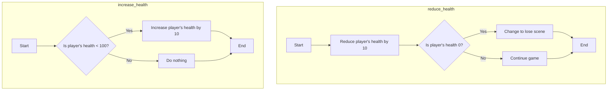
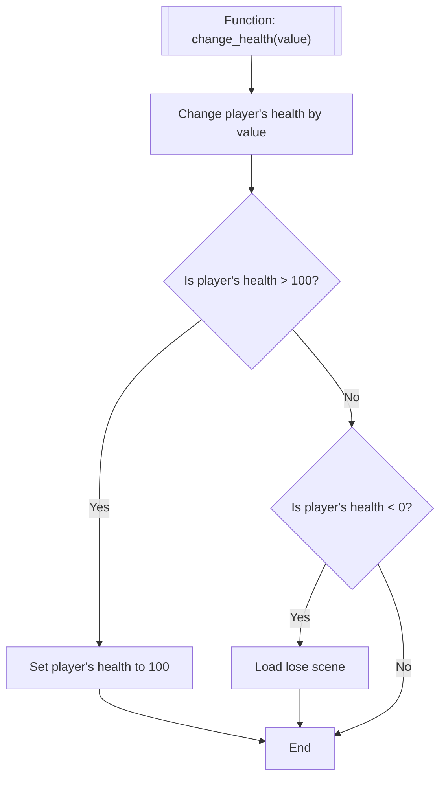

---
tags:
  - S1
  - ISD
---
> [!important] Prerequisite: [[ISD/1 - Digital Assets/_projects/Space Invaders/Enemy Shooting]]

During the game, the players health should be impacted by various game mechanics. These could include:

| Reducing Health         | Increasing Health        |
| ----------------------- | ------------------------ |
| Getting shot            | Picking up a health pack |
| Colliding with an enemy | Time                     |

This tutorial will focus on the first for each. 

Whatever the game mechanics chosen, there are a number of ways to approach the health change. You could create two functions, one to increase the players health by 10 (up to 100), and another function to reduce it by 10 (until 0).



**However**, this approach limits the flexibility in the system; by only changing the value by 10.

Another approach could be to write one single function, which takes value (an `argument` see [[Player Shooting]]), which modifies the player health value. The function would also need respond if the players health goes beyond 0 or 100. So, the logic could be:



This approach is much more flexible and can be used as the game scales up.

# Common Code

Open `Player.gd` and create a new variable to store the players health.

![[playersHealthVariable.png]]

```gdscript
@export var health: int
```

> [!info] Defining it as `@export` allows the developer to set the value from the inspector tab for the node. This allows different instances of the same node to have different starting values. E.g. different enemies can have different health.

Save the file.
# Setting the players start health

Select the Player node in the Scene tree. Change the health value to 5 (or whatever is appropriate to your game).

![[playerHealthSetStartingValue.png]]
# Health Code

Define a new function called `change_health` with an argument called `health_modifier`.

![[playerHealthFuncDefine.png]]

Complete the function as described in the flowchart above.

![[playersHealthFuncChangeHealth.png]]

```
func change_health(health_modifier):
	health = health + health_modifier
	if health > 100:
		health = 100
	elif health < 0:
		get_tree().change_scene_to_file("res://OtherScenes/LoseScene.tscn")
```

> [!important] Note that the function only adds the `health_modifier`. This is still valid, as if the health needs to decrease the `health_modifier` would need to be negative.

Save the File.

![[commonBlocks#Commit & Push]]
## Reducing Health

The players health can be reduced when an enemy bullet collision occurs. If the bullet collides with the player, the `change_health` function will be called in `player.gd`.

Open `Bullet-Enemy.gd` and add code to the `_physics_process` function. This code will run when the bullet hits the player, and calls `change_health` with a value of -10. 

![[playerHealthReduceHealth.png]]

```gdscript
collided_object.get_collider().change_health(-10)
```

This approach can be taken for any object that collides with the player object.

Save the file.

![[commonBlocks#Commit & Push]]

## Increasing Health

TBA

# Health Display

The players health is managed internally, however the user doesn't get informed of the current status.

There are many ways to display health to the user, either the raw values, or hearts or a health bar etc. In this stage of the tutorial hearts will be used. The assets for these hearts were from [https://kenney.nl/assets/platformer-art-deluxe](https://kenney.nl/assets/platformer-art-deluxe)

Download the heart images and copy them to the **Images** folder in your project.

![[hud_heartEmpty.png]]

![[hud_heartHalf.png]]

![[hud_heartFull.png]]

![[playerHealthHeartsImport.png]]


Open `MainGame.tscn`. Create a **HBoxContainer** as a child of **HUD**, renaming it `Health`. Create five **TextureRect**s as children of `Health`. Your hierarchy is to look like this.

![[playerHealthHUDNodes.png]]

For each of the TextureRects, select it in the Node list, and drag `hud_heartFull.png` to the Texture option in the inspector.

![[playerHealthAssignTexture.png]]


Attach a script to the `Health` HboxContainer, naming the file `Health.gd`. Replace the contents with the code shown.

At this stage, nothing will occur if the game is run. The `update_health` function will need to be called by the main game script to update the hearts based on the players health.

> [!important] ********************REMEMBER!!!******************** The paths to the images need to match. Check capitalisations and the **********exact********** path for each of the images. E.g. - `res://Images/hud_heartFull.png`
> 


```gdscript
extends HBoxContainer

enum MODES {simple, empty, partial}

var heart_full = preload("res://Images/hud_heartFull.png")
var heart_empty = preload("res://Images/hud_heartEmpty.png")
var heart_half = preload("res://Images/hud_heartHalf.png")

@export var mode: MODES

func update_health(value):
	match mode:
		MODES.simple:	
			update_simple(value)
		MODES.empty:
			update_empty(value)
		MODES.partial:
			update_partial(value)

func update_simple(value):
	for i in get_child_count():
		get_child(i).visible = value > i

func update_empty(value):

	for i in get_child_count():
		if value > i:
			get_child(i).texture = heart_full
		else:
			get_child(i).texture = heart_empty

func update_partial(value):
	for i in get_child_count():
		if value > i * 2 + 1:
			get_child(i).texture = heart_full
		elif value > i * 2:
			get_child(i).texture = heart_half
		else:
			get_child(i).texture = heart_empty

```

This code is relatively complex and introduces a new variable type - ENUMs.

> [!info]- Enums
> More information on enums can be found here - [[Enums]].

Save the file.

## `MainGame.gd`

Open `MainGame.gd` and edit `_process()`. Add a line of code to call the `update_health` function just created.

![[playerHealthMainGameUpdate.png]]

```gdscript
$HUD/Health.update_health($Player.health)
```


# Functionality

Depending on the values you've chosen the logic may need to be modified.

For instance, if the `Mode` is set to Simple, this assumes that the players health starts at 5, and each bullet inflicts 1 HP worth of damage.

![[playerHealthLogicSimple.png]]

You may need to tweak the values in your project to match the health system. Alternatively, you can tweak the logic of the Simple, Partial or Empty modes. 

# Demonstration

## Simple
![[playerHealthHeartsExampleFull.gif]]


## Partial

![[playerHealthHeartsExamplePartial.gif]]