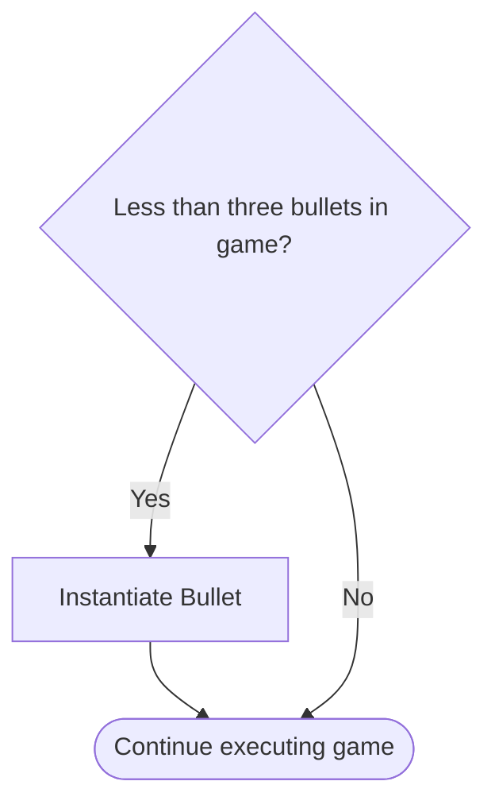

![[Theory#Variables and Data Types]]


# GDScript Implementation

In GDScript, variables are declared using the `var` keyword, but unlike some other languages, GDscript uses a technique called type inference, where the data type is *inferred* from the data that is used in the declaration. If there is no data given, then you must declare the data type.

GDScript is also a dynamically typed language, meaning that a variable can change data types as needed during execution. This is different from other languages (namely C-based languages like Java or Arduino) which are statically typed, meaning once the data type of a variable is set, it cannot change.

## Declaring variables

When declaring variables in a script, you

```
var starting_value = 5           // starting_value would be set as an integer
var welcome_message = "Hello"   // welcome_message would be set as a string.
```

## GDScript Data Types

In GDScript, there are a number of the standard primitive types. The syntax for each of these are:

| Syntax | Data type | Description | Possible Values |
| --- | --- | --- | --- |
| null | null | Empty data that contains no information - different from 0.  |  |
| int | Integer | It is stored as a 64-bit value, meaning 64 bits are allocated to memory for each integer variable. | −9223372036854775808, +9223372036854775807 |
| bool | Boolean | Each **`bool`** variable occupies one byte of memory. | `true` or `false`.  |
| float | Float | Numbers with decimal point values | 5.3 or 0.1 |
| String | String | Complex (non-primitive) data type. Comprised of a series of characters in an array. Use double quotes. An an array, Strings allow for more complex functionality, such as converting to integers, searching for substrings, converting to upper case etc. | "Lake Tuggeranong College"
"32" |

## Constants

When declaring constants in GDScript, use the const keyword *before* the data type.

```
const MAXIMUM_VALUE = 5
```

## Complex Data Types

As a language for a game engine, GDScript uses many complex data types to assist in the game development process. These are structures which contain multiple individual pieces of data and functionality to assist the developer. 

For example, [[https://docs.godotengine.org/en/stable/classes/class_vector2.html#class-vector2]]. This data type (officially referred to as a class) allows the developer to store the `x` and `y` coordinates of a point in the game window, such as the players position on a 2D screen. 

This structure, and others similar to it, will be used throughout the development process and allows for additional functionality. Read the definition for more details:

[[https://docs.godotengine.org/en/stable/classes/class_vector2.html#class-vector2](https://docs.godotengine.org/en/stable/classes/class_vector2.html#class-vector2]]

# Practical Exercises


> [!info] The goal of this tutorial is to implement a limit to how many player bullets can appear on screen at once.


Open `Global.gd`. This script will hold any code and/or variables that are required throughout the whole project, rather than relating on a specific node.

![[variablesGlobalEmpty.png]]

Start by adding the first line of any GDScript file, which is identifying what type of object this script is attached to. In this case it’s `Node` as it’s not attached to any specific node.

```gdscript
extends Node
```

Declare a new variable to store the number of bullets currently in the scene.


> [!info] GDScript *infers* that this new variable is an integer based on the assigning of 0.


![[variablesBulletInstanceCount.png]]

```gdscript
var bulletInstanceCount = 0 # Keeps track of how many bullet instances are current
```

Declare another variable for the number of enemy bullet currently in the scene.


![[variablesEnemyBulletInstanceCount.png]]

```
var enemyBulletInstanceCount = 0
```

Save the File.

![[commonBlocks#Commit & Push]]

Open `Bullet/Bullet.gd` . In this script, the `_ready()` function executes each time a bullet is instantiated in the game. This can be used to also increase the count of bullet instances through `Global.gd`. 

Increase `bulletInstanceCount` by 1.

This done through accessing the `GlobalVariables` object which is a single instance of the [`Global.gd`](http://Global.gd) script. This has been pre-defined for your benefit.

![[variablesBulletInstanceCountIncrease.png]]

```
GlobalVariables.bulletInstanceCount += 1
```

![[commonBlocks#Commit & Push]]

Open [Player.gd](http://Player.gd)

Before creating an instance of a new bullet, first check that there aren’t more than 3 bullets currently in the scene. 




> [!info] Don’t forget to indent the three lines that already exist, this will ensure that they will only execute if the if statement is `true`.


![[variablesCheckBulletInstanceCount.png]]

```
if GlobalVariables.bulletInstanceCount < 3:
```

![[commonBlocks#Commit & Push]]

Run the game and test to make sure the game only can create three bullets.

## Reducing the bullet instance count

Open `Bullet.gd`. 

`bulletInstanceCount` gets increased when a bullet is instantiated through `_ready()`. A bullet instance needs to be removed from the execution of the game under 2 conditions:

1. The bullet hits an enemy, or
2. The bullet leaves the play area (moves off the screen).

The game has been pre-built so that if the bullet moves off screen, it will collide with an invisible object. 

This means that both cases list involve collisions!

In `_physics_process(delta)` add an if statement to check to see if the bullet has collided with anything:

![[variablesDetectCollision.png]]

```
if (collidedObject):
```

<aside>
‼️ If the bullet has collided with an object, then `collidedObject` will contain some data and therefore return `true`.

</aside>

If the bullet has collided with an object, remove it from the game and then reduce by 1.

![[variablesDeleteBullet.png]]

```
queue_free()
GlobalVariables.bulletInstanceCount -= 1
```

Test the game and the bullets should disappear once they collide with anything. Once a bullet has been deleted from the game, you will then be able to shoot more, up to a maximum of 3 bullets at a time.

The last check to do is to check whether the bullet has collided with an enemy object. This is to be done **before** the `queue_free` command, because before you delete the bullet, the enemy needs to be deleted.

![[variablesDetectEnemyCollision.png]]

```
if "Enemy" in collidedObject.collider.name:
	collidedObject.get_collider().queue_free()
```

Test the game now. When the bullets hit the enemy objects, the enemy and the bullet are removed from the game.

![[variablesDemonstration.gif]]

# Review

1. How is data stored in memory?
2. What’s the difference between primitive and non-primitve data types?
3. What is type inference?
	1. Find three programming languages that use type inference.
4. What is the opposite of type inference?
	1. Find three programming languages that don’t use type inference.
5. What does strongly typed and weakly typed languages mean?


