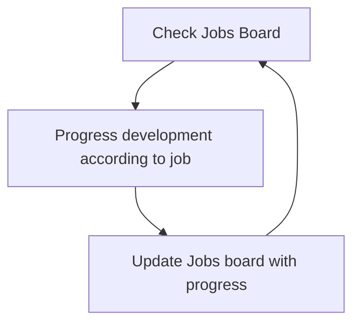

Continue working on the project!

# Workflow

Use the jobs board to track tasks, and update said jobs with your progress.

```mermaid
graph TD
    A[Check Jobs Board] --> B[Progress development according to job];
    B --> C[Update Jobs board with progress];
    C --> A
```

