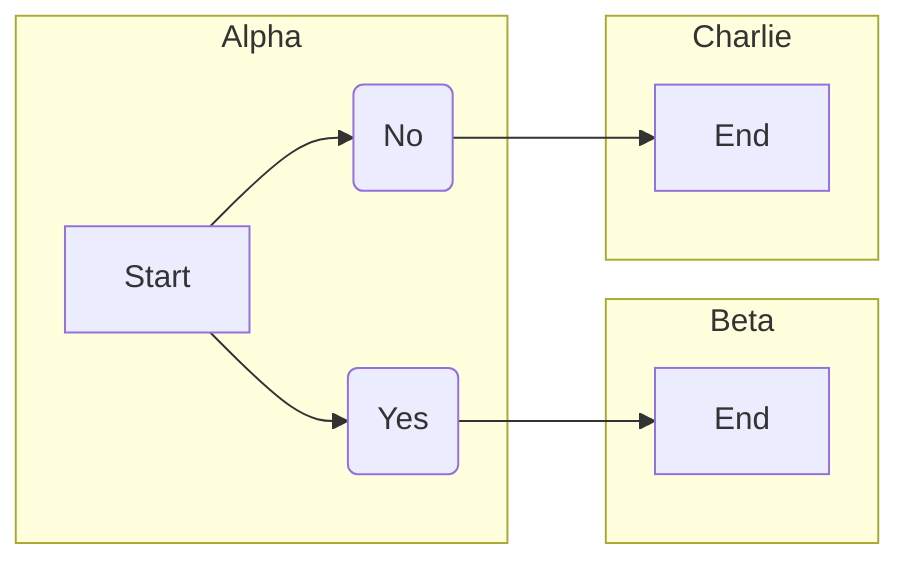
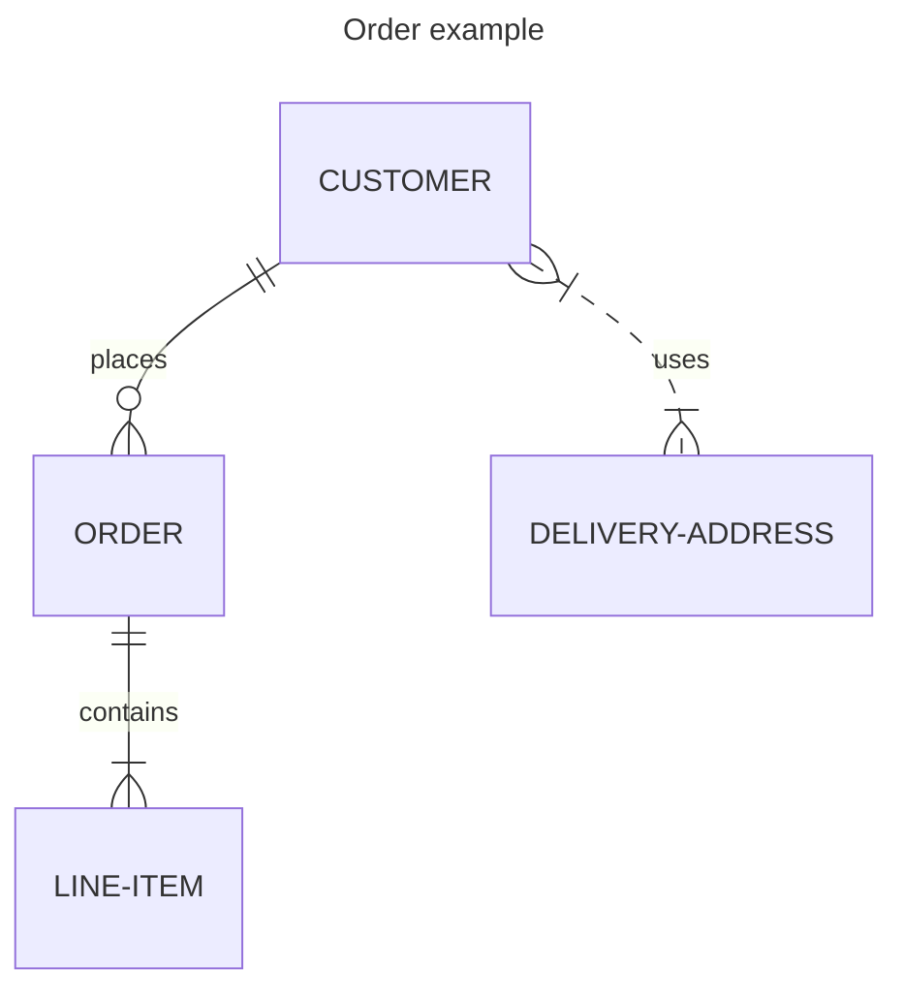
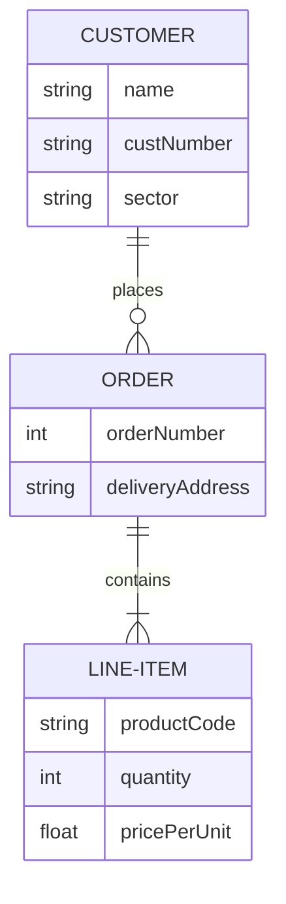

# Visual Studio Code

**Introduction**

Mermaid is a powerful diagramming language that can be used to create a variety of charts and diagrams. In this tutorial, we'll show you how to develop Mermaid charts in Visual Studio Code.

**Prerequisites**

- Visual Studio Code ([https://code.visualstudio.com/](https://code.visualstudio.com/))
- Mermaid extension for Visual Studio Code ([https://marketplace.visualstudio.com/items?itemName=bierner.mermaid](https://marketplace.visualstudio.com/items?itemName=bierner.mermaid))

**1. Install the Mermaid Extension**

To get started, install the Mermaid extension for Visual Studio Code from the marketplace.

**2. Create a New Mermaid File**

Create a new file in Visual Studio Code with the `.md` extension. This will create a new Mermaid chart file.

# Flowcharts

**3. Write Your Mermaid Code**

In the Mermaid file, write your Mermaid code. Here's an example of a simple flowchart:

**4. Preview the Chart**

To preview the chart, click the "Preview" button in the Visual Studio Code toolbar. Alternatively, you can use the keyboard shortcut `Ctrl` + `K`, `V`.

**5. Advanced Features**

The Mermaid extension for Visual Studio Code provides a number of advanced features, such as:

- **Syntax highlighting:** The extension provides syntax highlighting for Mermaid code.
- **Autocompletion:** The extension provides autocompletion for Mermaid keywords and functions.
- **Error checking:** The extension provides error checking for Mermaid code.

**6. Exporting the Chart**

To export the chart, click the "Export" button in the Visual Studio Code toolbar. You can export the chart as an SVG, PNG, or PDF file.

**Conclusion**

Developing Mermaid charts in Visual Studio Code is easy and convenient. The Mermaid extension provides a number of features that make it easy to create and export high-quality charts.

# Entity Relationship Diagrams

**Creating Entity Relationship Diagrams in Mermaid**

Entity relationship diagrams (ERDs) are a type of diagram that shows the relationships between different entities in a system. They are often used in database design and software engineering.

To create an ERD in Mermaid, you can use the following syntax:

**Example**

Here's an example of a simple ERD in Mermaid:

This ERD shows the relationship between the `Person` and `Address` entities. The `PersonAddress` entity represents the relationship between a person and their address.

**Notes:**

- The `attributes` section of an entity lists the attributes of that entity.
- The `type` section of a relationship specifies the type of relationship between the two entities.
- You can use the following types of relationships:
    - `1:1` - One-to-one relationship
    - `1:M` - One-to-many relationship
    - `M:N` - Many-to-many relationship

**Previewing and Exporting the Diagram**

To preview the ERD, click the "Preview" button in the Visual Studio Code toolbar. Alternatively, you can use the keyboard shortcut `Ctrl` + `K`, `V`.

To export the ERD, click the "Export" button in the Visual Studio Code toolbar. You can export the ERD as an SVG, PNG, or PDF file.

**Conclusion**

Creating ERDs in Mermaid is easy and convenient. The Mermaid extension for Visual Studio Code provides a number of features that make it easy to create and export high-quality ERDs.