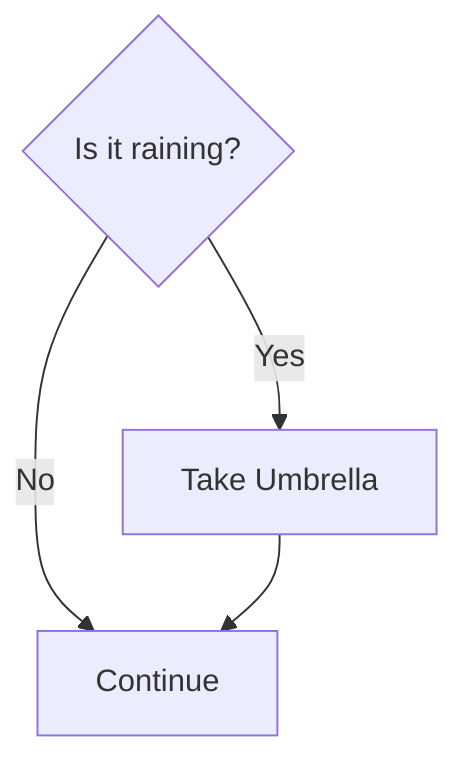
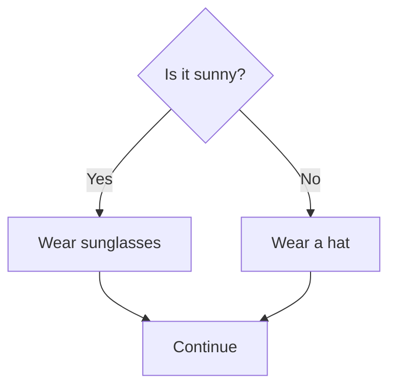
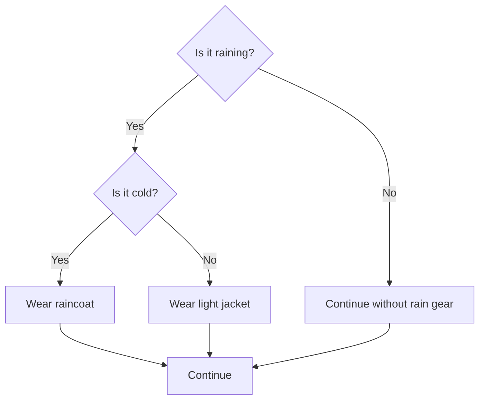

# Decisions in Software: 

## Controlling the Flow

---

# What are Decisions?

* Software often needs to make choices based on conditions.
* These choices determine the flow of the program.
* We use "decision" structures to implement these choices.

---

# The "If..Then" Statement

* **Concept:** Execute a block of code only if a condition is true.
* **Example:** "If it is raining, take an umbrella."



---

---

# "If-Then-Else" Statement: Two Choices

- **Concept:** Execute one block of code if a condition is true, and another block if it's false.
- **Example:** "If it is sunny, wear sunglasses. Else, wear a hat."




---

# "If-Then-Else" Statement: Code Example (Language Agnostic)

```
if (isSunny == true) {
  wearSunglasses(); // Do this if it's sunny
} else {
  wearHat();        // Do this if it's not sunny
}

continueWithDay(); // Always do this
```

---

# Complex Conditions: Combining Decisions

- You can combine multiple conditions using "and" and "or".
- **Example:** "If it is raining _and_ cold, wear a raincoat."
- **Example:** "If it is sunny _or_ warm, go to the park."

---

# Nested "If" Statements: Multiple Levels

- You can put "if" statements inside other "if" statements.
- **Example:** "If it is raining, then if it is cold, wear a raincoat. Else, wear a light jacket."



---

# Why are Decisions Important?

- **Flexibility:** They allow programs to adapt to different situations.
- **Logic:** They implement the rules and logic of the program.
- **User Interaction:** They respond to user input and choices.
- **Error Handling:** They allow programs to handle unexpected situations gracefully.