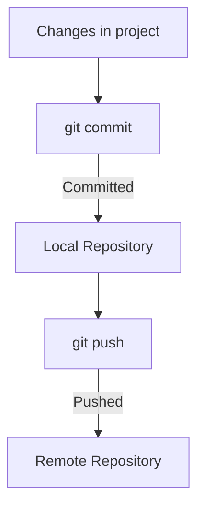

# Version Control in Software Development

- **Version Control**: System to manage changes to code.
- **Track Changes**: Record modifications over time.
- **Collaboration**: Multiple developers work together.
- **Restore Previous Versions**: Revert to earlier code states.

---

# Introduction to Git

- **Git**: Popular version control system.
- **Distributed**: Each developer has a complete history.
- **Speed & Efficiency**: Fast performance.
- **Open Source**: Free to use.

---

# Basic Git Commands

- **git clone**: Clone an existing repository.
- **git commit**: Save changes with a message.
- **git push/pull**: Sync with remote repository.

---

# Mermaid Diagram: Git Workflow

---
# Pull Requests

- **Definition**: A pull request (PR) is a way to propose changes to a codebase.
- **Collaboration**: Allows team members to review and discuss changes.
- **Integration**: Merges changes from a feature branch into the main branch.
- **Quality Control**: Ensures code meets project standards before merging.
- **Feedback**: Provides an opportunity for constructive feedback and improvements.

