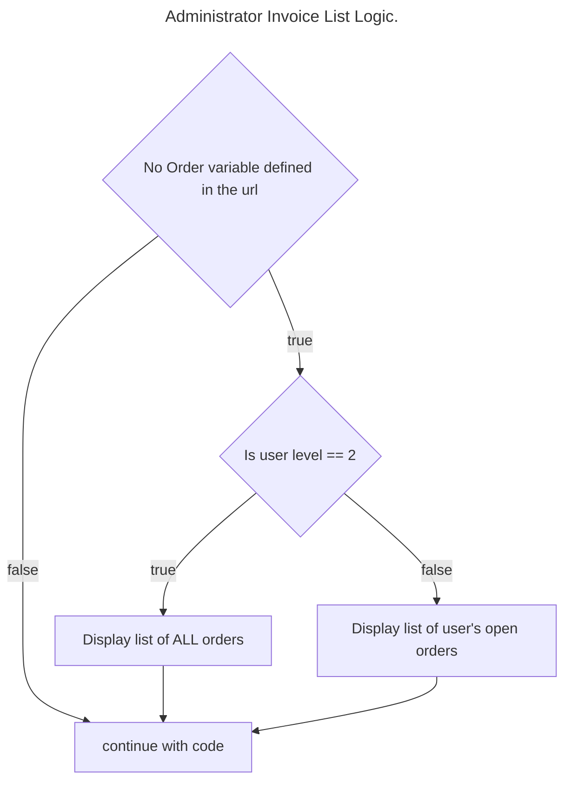

# Invoices

> [!info] Goal: The invoices page has a number of use cases to satisfy:

1. If user is not logged in, then redirect them to index.php
2. Users to view their "open" orders as a list.
3. Users to view invoices from individual orders (using the order variable in url, e.g `invoice.php?order=234`)
4. Inform users if they have not previously made any orders.
5. Administrators to view all orders
6. Administrators can OPEN and CLOSE orders

---

## Database Updates

In the Orders table, add a new column called Status with the default open as `OPEN`.

![[invoiceDBChanges.png]]

---

## Invoice.php

Create a new file called `invoice.php`. If there already is a file called this in your project, rename the existing one `invoice.php.old` or equivalent.

![[invoiceNewFile.png]]

Replace the contents with the code shown, including template.php and documenting the different cases the page has to cover.

![[invoiceComments.png]]

```php
<?php
include "template.php";
/*
 * The invoices page has a number of use cases to satisfy:
		1. If user is not logged in, then redirect them to index.php
		2. Users to view their "open" orders as a list.
		3. Users to view invoices from individual orders (using the order variable in url, e.g `invoice.php?order=234`)
		4. Inform users if they have not previously made any orders.
		5. Administrators to view all orders
		6. Administrators can OPEN and CLOSE orders

  @var $conn
 */
```

Check to see if the user is not logged in. If the user is not logged in, redirect them to the home page. 

This is done as a security measure as unauthorised users should not be able to access any invoice details.

![[invoiceGetCustomerID.png]]

```php
if (!isset($_SESSION["CustomerID"])) {
	// Case 1. The user is not logged in.
	header("Location:index.php");
}
```

Assuming the user is logged in, the page will then either produce a list of open orders (case 2) or display the details of a specific order (case 3).

Add a check to see if the order variable is found in the url. In other words, if the url appears similar to this:

`127.0.0.1/invoice.php`

or

`127.0.0.1/invoice.php?order=1234`

![[invoiceGetOrderNumber.png]]

```php
if (empty($_GET["order"])) {
	// Case 2 - no 'order' variable detected in the url.
} else {
	// Case 3 - 'order' variable detected. 
}
```

Focusing on Case 2, load all the orders from the database made by the user currently logged in.

![[invoiceRetrieveOrder.png]]

```php
$custID = $_SESSION['CustomerID'];
$query = $conn->query("SELECT OrderNumber FROM Orders WHERE CustomerID='$custID' AND Status='OPEN'");
$count = $conn->querySingle("SELECT OrderNumber FROM Orders WHERE customerID='$custID' AND status='OPEN'");
$orderCodesForUser = [];
```

Check $count. If this is greater than 0, then display the list of open orders (case 2).If the count is 0, this means that the current user does not have any open orders (Case 4). 

![[invoiceCustomerNoOrders.png]]

```php
if ($count > 0) {  // Has the User made orders previously?
	// Case 2: Display open orders

} else {
	// Case 4: No orders found for the logged in user.
	echo "<div class='badge bg-danger text-wrap fs-5'>You don't have any open orders. Please make an order to view them</div>";

}
```

**Case 4** Should appear similar to this.

![[invoiceCustomerNoOrdersOutput.png]]

Focusing on Case 2, get a list of the open orders in the table, and generate a unique list of the order numbers found.

![[invoiceListOpenOrders.png]]

```php
while ($data = $query->fetchArray()) {
	$orderCode = $data[0];
	array_push($orderCodesForUser, $orderCode);
}
//Gets the unique order numbers from the extracted table above.
$unique_orders = array_unique($orderCodesForUser);
```

For every unique order number, create a row in a container containing a link showing that order number. This link will load the invoice page again with the order number in the url, which will trigger Case 3.

```php
echo "<div class='container-fluid'>";
// Produce a list of links of the Orders for the user.
foreach ($unique_orders as $order_ID) {
	?>
	<div class='row'>
		<div class='col-12'><a href='invoice.php?order=<?= $order_ID ?>'>Order : <?= $order_ID ?></a></div>
	</div>
	<?php
}
echo "</div>";
```

**Case 2** The page should appear similar to this.

![[invoiceListOpenOrdersOutput.png]]

## Case 3 - Display Invoice

Case 3 involves displaying an individual invoice to the user. This assumes that the user has clicked through to view the list of open orders, and then selects one of them. The invoice is then displayed. A sample invoice could appear similar to this.

![[invoiceDisplayInvoice.png]]

Find where Case 3 is handled in the code (the `else` block for the `if (empty($_GET["order"]))` check).

The first step is to capture and store the order number from the url. Store the order number in a new variable called `$orderNumber`.

![[invoiceGetIndividualOrderNumber.png]]

```php
$orderNumber = $_GET["order"];
```

The next step is to extract the relevant information from the database relating to the order requested. This will involve a more complex SQL query than previously attempted due to requiring information from multiple tables.

You will need the following fields from the indicated tables.

| Field | Table |
| --- | --- |
| Product Name | Products |
| Price | Products |
| Quantity | Orders |
| Subtotal (Price * Quantity) | Products and Quantity |
| Order Date | Orders |
| Status | Orders |


> [!info] `Subtotal` is a calculated field which means that the Price and Quantity is multiplied together to calculate the result.


To achieve this in SQL, you will need to **JOIN** the tables in the query. 

The SQL for this query will be similar to this, with the specific order number dynamically applied through the `orderNumber` variable defined previously.

```sql
SELECT p.ProductName, p.Price, o.Quantity, p.Price * o.Quantity as SubTotal, o.OrderDate, o.Status
FROM Orders o
		 INNER JOIN Products p on o.ProductID = p.ProductID
WHERE o.OrderNumber = 'ORDERd1edade1'
```

Information on an INNER JOIN can be found here: 

[SQL INNER JOIN Keyword](https://www.w3schools.com/sql/sql_join_inner.asp)

![[invoiceRetrieveOrderDetails.png]]

```php
$query = $conn->query("SELECT p.ProductName, p.Price, o.Quantity, p.Price*o.Quantity as SubTotal, o.OrderDate, o.Status FROM Orders o INNER JOIN Products p on o.ProductID = p.ProductID WHERE o.OrderNumber='$orderNumber'");
```

Create a `$total` variable to store the running total of all the items.

![[invoiceDeclareTotalVariable.png]]

```php
$total = 0;
```

Create the Bootstrap grid layout to display the invoice information.


> [!info] You may see an error for `$orderDate` as this has not been defined as yet.


![[invoiceOutputCode.png]]

```php
?>
  <div class='container-fluid'>
  <div class='row'>
	  <div class='col text-success display-6'>Product Name</div>
	  <div class='col text-success display-6'>Price</div>
	  <div class='col text-success display-6'>Quantity</div>
	  <div class='col text-success display-6'>Subtotal</div>
  </div>

<!-- Invididual Rows here -->

  <div class='row'>
	  <div class='col'></div>
	  <div class='col'></div>
	  <div class='col display-6'>Total : $<?= $total ?></div>
  </div>
  <div class='row'>
	  <div class='col'></div>
	  <div class='col'></div>
	  <div class='col'><?= $orderDate ?></div>
  </div>

<?php
```

Replace the comment for Individual Rows with code to loop over each record of the SQL result. This loop will extract and store each field into individual variables, and then display the information in columns to match the structure created previously.

![[invoiceIndividualOrderLoop.png]]

```php
<?php
while ($data = $query->fetchArray()) {
	echo "<div class='row'>";
	$productName = $data["ProductName"];
	$price = $data["Price"];
	$quantity = $data["Quantity"];
	$subtotal = $data["SubTotal"];
	$orderDate = $data["OrderDate"];
	$status = $data["Status"];
	$total = $total + $subtotal; // Running Total
	echo "<div class='col'>" . $productName . "</div>";
	echo "<div class='col'>$" . $price . "</div>";
	echo "<div class='col'>" . $quantity . "</div>";
	echo "<div class='col'>$" . $subtotal . "</div>";

	echo "</div>";
}
?>
```

Save and open the page in a browser. Choose an open invoice and dynamically created invoice should appear.

## Cases 5 & 6 - Administrator Access

As yet, the invoices page does not cater for administrator control, defined by the users `AccessLevel` field in the database.  The page has the following administrator use cases:

*5. Administrators to view all orders*

*6. Administrators can OPEN and CLOSE orders*

### Case 5 Administrators to view all orders

Modifying the page to allow administrators to see all orders is a relatively simple fix. Assuming the `order` variable is not defined in the URL (case 2), the page displays a list of all the users open invoices. A check needs to be added in this logic - if the user is an administrator, create a list of all invoices, otherwise a list of all the users open invoices.



Create the if block to check if the `AccessLevel` session variable for the user is equal to 2 (they’re an administrator). 

If AccessLevel is not 2, then the SQL is the same as previously coded. Simply move the `$query` and `$count` SQL queries of code shown into the `else` block.

![[invoiceAdminRetrieveOrder.png]]

```php
if ($_SESSION["AccessLevel"] == 1) {
	// Case 5 - Generate a list of all invoices for administrators
} else {
	// Case 2 - Generate a list of open invoices for user
	$query = $conn->query("SELECT OrderNumber FROM Orders WHERE CustomerID='$custID' AND Status='OPEN'");
	$count = $conn->querySingle("SELECT OrderNumber FROM Orders WHERE customerID='$custID' AND status='OPEN'");
}
```

Add the `$query` and `$count`SQL queries to extract a list of all open orders for administrators.

![[invoiceAdminRetrieveAllOrders.png]]

```php
$query = $conn->query("SELECT OrderNumber FROM Orders");
$count = $conn->querySingle("SELECT OrderNumber FROM Orders");
```

Test the site, trying it as both a user with administrator access and one without.

## Opening and Closing Orders

Managing the ordering process is important and having administrators being able to mark orders as completed is useful. To achieve this, you’ll add a simple link which includes a new URL parameter for the status. If it’s `OPEN`, the link allows the administrator to close the order. If the status is `CLOSED` the link will allow the order to be reopened (set it to `OPEN`).

Start by looking at the end of the file for the start of the file and add a check to see if the status parameter is found in the url.

![[invoiceCheckPermissions.png]]

```php
if ($_SESSION["AccessLevel" == 1]) {
	if (!empty($_GET["status"])) {

	}
}
```

Assuming there is a status url parameter, which will be either `OPEN` or `CLOSED`.  Whichever it is, update the database by changing the status to the opposite - OPEN→CLOSED or CLOSED→OPEN.

![[invoiceAdminIfClosed.png]]

```php
if ($_GET["status"] == "CLOSED") {
	$conn->exec("UPDATE Orders SET status='CLOSED' WHERE OrderNumber='$orderNumber'");
	$orderMessage = "Order #:" . $orderNumber . " has been closed";
} else {
	$conn->exec("UPDATE Orders SET status='OPEN' WHERE OrderNumber='$orderNumber'");
	$orderMessage = "Order #:" . $orderNumber . " has been re-opened";
}
```

Finally, after the code to update the database, include the code to display a link to either Open or close the order, depending on the current status of the order.

![[invoiceAdminIfOpen.png]]

```php
$query=$conn->query("SELECT Status from Orders WHERE OrderNumber='$orderNumber'");
$data=$query->fetchArray();
$status=$data["Status"];

if ($status == "OPEN") {
	echo "STATUS: OPEN";
	echo "<p><a href='invoice.php?order=" . $orderNumber . "&status=CLOSED'>Click here to close</a></p>";
} else {
	echo "STATUS: CLOSED";
	echo "<p><a href='invoice.php?order=" . $orderNumber . "&status=OPEN'>Click here to open</a></p>";
}
```

