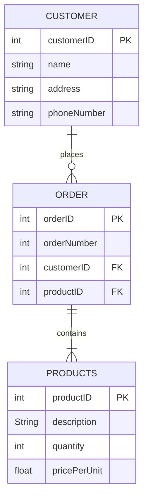

# Shopping Cart Project

The goal of implementing a database and SQL into the project is to implement CRUD - Create, Retrieve, Update and Delete - operations on the database.

## Raw Data

Consider the following un’normalised’ data from the website.

| First Name | Second Name | Address         | Email Address                           | Phone Number     | Darth Vader Helmet | Grogu Plush | ROTJ Jigsaw | Aftermath | Aftermath Squadron |
| ---------- | ----------- | --------------- | --------------------------------------- | ---------------- | ------------------ | ----------- | ----------- | --------- | ------------------ |
| Ryan       | Cather      | 123 Fake St     | [fake@email.com](mailto:fake@email.com) | 0412 123 123     | 1                  | 0           | 0           | 0         | 0                  |
| Ryan       | Cather      | 123 Fake St     | [fake@email.com](mailto:fake@email.com) | 0412 123 123     | 0                  | 2           | 0           | 0         | 0                  |
| Ryan       | Cather      | 123 Fake Street | [fake@email.com](mailto:fake@email.com) | 0412 123 123     | 0                  | 0           | 0           | 0         | 1                  |
| Ty         | Yorrick     | 99 Nine Ave     | [ty@yorrick.com](mailto:ty@yorrick.com) | 0111223111222141 | 0                  | 11          | 0           | 0         | 0                  |

This data has some issues and needs to be normalised.

### 1st Normal Form
TBA

### 2nd Normal Form
TBA

### 3rd Normal Form
TBA

## Create Database Tables

A **starting** ERD for the shopping cart site is shown here.

Is this correct?

Check:

- Tables
- Attributes for each table
- Primary & Foreign Keys
- Relationships between tables

