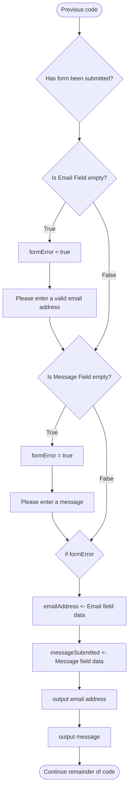

![[Theory#Algorithm Design - Decisions]]


# PHP Implementation

PHP `if` blocks are similar to C (and other languages) in their syntax.

An example of a PHP `if` is:

```php
<?php
$subtotal = 24.5;       // Subtotal of the bill
$discount = 0.1;        // discount is applied if subtotal is over $50
$total = 0;

if ($subtotal >= 50) {
	$total = $subtotal - ($subtotal * $discount);
} else {
	$total = $subtotal;
}

echo "Total = $" . $total;

?>
```

# Practical Exercises

<aside>
🏁 **Goal**

In this task, you’ll be implementing a simple error checker by updating the Contact Us page to include some feedback in case the user leaves a field empty.

</aside>

Open `contact.php` created in Variables and Data Types.

Find the code which tests if the form has been submitted.

![[_images/SCR-20230120-tl7.png|SCR-20230120-tl7.png]]

The logic of what needs to be done is shown in this flowchart



To implement this logic, first set the value of `$formError` to be `false`.

![[_images/Untitled.png|Untitled]]

```php
$formError = false;
```

Next implement the code to check each field and whether it is empty.

PHP has a helper function called `empty()` which returns `true` if the variable or object is empty and `false` if there is some data stored. If the user does not enter an email address, `$_POST['inputEmail'])` will be empty and therefore return `true` which will then run the code in the `if` block.

![[_images/Untitled 1.png|Untitled]]

```php
if (empty($_POST['inputEmail'])) {
	$formError = true;
	echo "Enter an email address.";
}
if (empty($_POST['inputMessage'])) {
	$formError = true;
	echo "Enter a message to submit.";
}
```

The remainder of the existing code which collects and then displays the email address and message entered can remain the same, although be placed in an `if` block to check if the `formError` variable has been set to `true`.

![[_images/Untitled 2.png|Untitled]]

```php
if ($formError == false) {
		...
}
```

Test the changes made. Check the functionality by testing all combinations of data (✅) and no data (❌).

| Attempt | Email Address | Message |
| --- | --- | --- |
| 1 | ❌ | ❌ |
| 2 | ❌ | ✅ |
| 3 | ✅ | ❌ |
| 4 | ✅ | ✅ |

![[commonBlocks#Commit & Push]]

# Review
