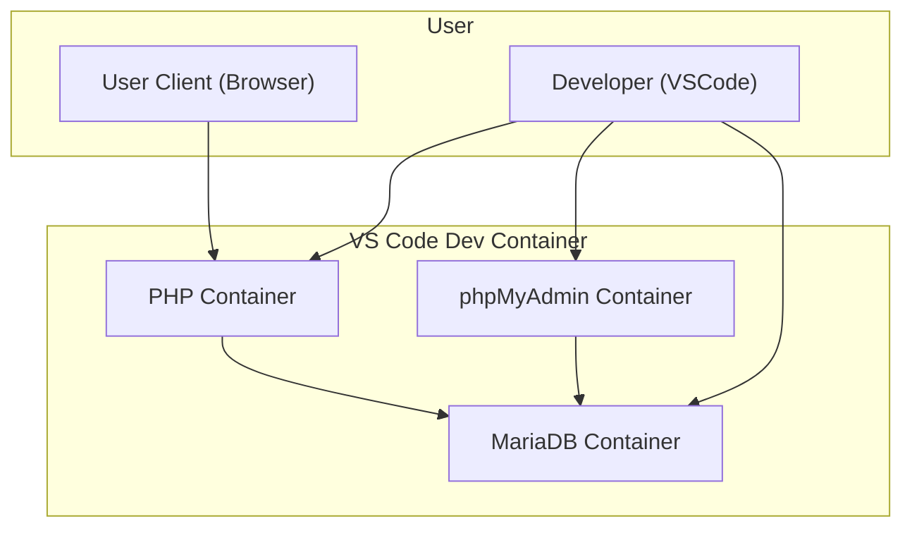

# Goals

The goal/s of this set of instructions are:
- Configure the Docker environment within Visual Studio Code

This server environment will be created:



# Prerequisites

These are required prior to starting these instructions
- [[Account Creation & Software Installation]]

# Instructions

## Container Configuration

With your project open, create a directory named `.devcontainer` (note the leading full stop!)

Inside this directory, create three files:

1. `.devcontainer/devcontainer.json`
2. `.devcontainer/Dockerfile`
3. `docker_compose.yml`

The file structure of this project (at this stage) should appear similar to:
```
your-project/
├── .devcontainer
│   └── Dockerfile
│   └── devcontainer.json
└── docker-compose.yml
```

Your task is to define the requirements for the system within the three files created.

### `devcontainer.json` file

This file configures the container so when it starts up, it automatically configures software to work for our project and environment.
In the repository folder, create a folder called `.devcontainer`. The folder starts with a `.` which may mean it is usually hidden in Windows Explorer/Finder etc.


A few items to take note of:

1. Within a PHP container using a PHP image: 
	1. The php executable pathwill most likely be `/usr/local/bin/php`
	2. The workspace folder is `/var/www/html`
2. Configure the following extensions to automatically install in Visual Studio Code within the container:
	1. "felixfbecker.php-debug",
	2. "bmewburn.vscode-intelephense-client",
	3. "cweijan.dbclient-jdbc",
	4. "cweijan.vscode-database-client2"
3. As the `devcontainer.json` file is within the `.devcontainer` directory, to access the `docker-compose.yml` file, you will need to refer to it as `../docker-compose.yml`


### `Dockerfile`

The Dockerfile will be used to configure the PHP container. 

Your Dockerfile needs to achieve these goals:
- use `docker-php-ext-install` to install `pdo` and `pdo_mysql`
- The apache webserver needs `mod_rewrite` enabled.
- Include the following command:
	- `RUN echo '#!/bin/bash\n\echo "Server is running at http://localhost:80"\n\exec apache2-foreground' > /usr/local/bin/startup.sh \&& chmod +x /usr/local/bin/startup.sh`
- Finally execute the command `/usr/local/bin/startup.sh`

### `docker-compose.yml`

The last file to create is the docker-compose.yml file which defines the different containers ("services") to create.

Define three services with the following specifications:

1. `web`
	1. The container name set to `php_apache`
	2. load  the Dockerfile created.
	3. set the directory that docker should look for files to be the current directory - named `.`
	4. The image is the most current php image
	5. Map the ports from 8080 on the localhost to port 80 in the container
	6. The volume to be `.:/var/www/html`
	7. Relies on the `db` container to be configured and working
2. `db`
	1. The image is the most current mariadb image
	2. define the container name to `db`
	3. set the `restart` option to **always**.
	4. Define the default database usernames, passwords and database:
		1. root password - rootpassword
		2. database - shopfront
		3. user - shopfront
		4. password - shopfront
	5. storage volume to be `db_data:/var/lib/mysql`
	6. Map port 3306 on the localhost to 3306 in the container.
3. `phpmyadmin`
	1. The image for this container is `phpmyadmin/phpmyadmin`
	2. define the container name to `phpmyadmin_container`
	3. Define the database connection:
		1. The host is `db`
		2. The root password is `rootpassword` (defined above)
		3. The port is 3306
	4. Map the ports from 8081 on the localhost to port 80 in the container.
	5. Relies on the `db` container to be configured and working

Finally, define a persistent storage volume called `db_data`

### Test configuration

Attempt to open the project in the containers and fix any bugs that occur.

The configuration is working when Docker Desktop shows the three containers running:

![[dockerContainersConfigured.png]]

## Commit & Push Changes

At stages of the development, such as when features have been complete, it's important to commit these changes to your repository, and then push the changes to GitHub.

> [!warning] This is especially important when developing in Codespaces. Changes you make to your files, DO NOT save back into your repository. You MUST commit and push the changes to have your repository updated.

![[commonBlocks#Commit & Push]]

# Test configuration

In the root directory, create a new file called `index.php` and replace the contents with:

```php
<?php
echo "Configuration Successful";
?>
```

Save the file.

Open in the Docker Container, and wait for Docker to download the image and configure the container.

![[projectOpenIInContainer.png]]

After the container is configured, launch the site using this URL:

http://localhost:8080

You will see the following if everything is configured correctly.

![[configurationSuccess.png]]

# Database Configuration

Before the site can be developed, the database needs to be configured to allow for user access.

If not already opened, open the project in Visual Studio Code in the Docker Container.

![[projectOpenIInContainer.png]]

If the **terminal** is not open, open the bottom panel and then click on the Terminal tab, as shown below:

![[dbOpenTerminal.png]]

Enter the following command: `mariadb-secure-installation` and press Enter.

![[dbSecureInstllation.png]]

You'll be asked a number of questions. Answering as indicated here:


| Question                               | Response                                         |
| -------------------------------------- | ------------------------------------------------ |
| the current root password              | enter the password you entered in the Dockerfile |
| **Switch to unix_socker authentication | Y                                                |
| Remove anonymous users?                | Y                                                |
| **Change the root password**           | n                                                |
| Remove anonymous users?<br>            | Y                                                |
| **Disallow root login remotely**<br>   | n                                                |
| Remove test database and access to it? | Y                                                |
| Reload privilege tables now?           | Y                                                |

![[dbSecureInstllationComplete.png]]

# Connect to Database Server

Open the Database Client exctension throught eh iton on the left hand side of Visual Studio Code.

![[dbExtension.png]]


Click the `+` to create a new connection to a database.

![[dbAddNewConnection.png]]

Enter the settings for the database. Choose **MariaDB** first, then enter the database password. Click **Save** and then **Connect**.

![[dbConnectionSettings.png]]

## Create Database and user

MariaDb can host many different databases within the server, and each databaase needs to be created.

Press the `+` button next to the active connection to add a new database.

![[dbNewDatabase.png]]

Modify the SQL to add the word `shopfront`.

```sql

-- Create the database
CREATE DATABASE shopfront;

-- Create the user and set a password
CREATE USER 'shopfront'@'localhost' IDENTIFIED BY 'shopfront';

-- Grant privileges to the user on the database
GRANT ALL PRIVILEGES ON shopfront.* TO 'shopfront'@'localhost';

-- Apply the changes
FLUSH PRIVILEGES;

```

Press the **Run** button on each command to execute the SQL commands.

![[dbExecuteSQL.png]]

The new database will now appear in the server.

![[dbShopfrontCreated.png]]

**Congratulations** you've created a database on your database server!
