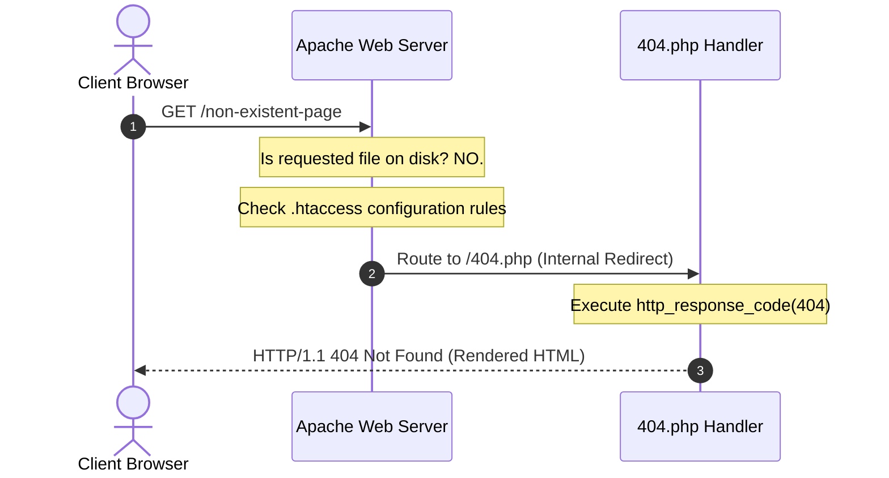

A professional web application must handle broken links or missing files without exposing underlying system details or confusing the user. This guide covers how to set up an explicit server-level error responder page and configure the web server's routing rules to redirect broken requests smoothly while preserving search engine optimisation standards.
## The PHP page

> [!note] Goal: Create a HTTP 404 error page if the user attempts to access a page that doesn't exist.

> [!important] Learning Outcome/s:
> - Configure Server-Level Overrides: Edit Apache directory-level configuration rules within an .htaccess file to rewrite server paths and redirect missing URIs.
> - Manage HTTP Response Handshakes: Execute explicit HTTP response status codes inside PHP to prevent search engines from incorrectly indexing error states as valid pages.
> - Deploy Containerized Configurations: Modify Docker build processes and Apache configurations to allow local projects to read customised override configurations.


### How To Guide

1. Create a new file in the root directory. Call it `404.php` and include the standard boilerplate code, with a slight change.

![[errorPageInit.png]]

```php
<?php
// Set the HTTP response code to 404 Not Found explicitly
http_response_code(404);

ob_start();
include "template.php";
?>


<?php
ob_end_flush();
?>
```

> [!note] The `http_response_code(404);` function in PHP sets the HTTP response status code of the server's output to 404 Not Found. This explicitly tells the client's web browser, search engines, or API clients that the requested page or resource does not exist on the server.

2. Add the following code to alert the user of the error

![[errorPageCode.png]]

```html
<div class="container py-5 text-center">
    <div class="row justify-content-center">
        <div class="col-md-8 col-lg-6">
            <!-- Utilizing native Bootstrap utility classes (card, shadow-sm, py, px) -->
            <div class="card border-0 shadow-sm py-5 px-4 rounded-3">
                <div class="card-body">
                    <!-- Icon and large display heading -->
                    <div class="mb-4 text-warning">
                        <i class="fas fa-exclamation-triangle fa-4x"></i>
                    </div>
                    
                    <h1 class="display-1 fw-bold text-secondary mb-2">404</h1>
                    <h3 class="fw-bold text-dark mb-3">Page Not Found</h3>
                    
                    <p class="text-muted mb-4">
                        The page you are looking for might have been removed, had its name changed, or is temporarily unavailable.
                    </p>

                    <!-- Simple navigation buttons -->
                    <div class="d-grid gap-2 d-sm-flex justify-content-sm-center">
                        <a href="index.php" class="btn btn-primary px-4">
                            <i class="fas fa-home me-2"></i>Home
                        </a>
                        <a href="orderform.php" class="btn btn-outline-dark px-4">
                            <i class="fas fa-shopping-bag me-2"></i>Products
                        </a>
                    </div>
                </div>
            </div>
        </div>
    </div>
</div>
```

>[!note] This page can be changed to anything that is required. This HTML is simply sample code.

![[commonBlocks#Commit & Push]]

## Configuring the server

The server needs to be configured to load the custom page if a 404 error occurs.

### How To Guide

1. Create a new file in the root directory of your project. Call this file `.htaccess`. Note the `.` at the start of the filename.
![[errorPageHtaccessInit.png]]
2. Add the following to the file.
![[errorPageHtaccessCode.png]]
```
# Redirect all 404 (Not Found) errors to your custom PHP page
ErrorDocument 404 /404.php
```
3. Save the file.
4. Open `.devcontainer/Dockerfile` and update to include the following:
![[errorPageDockerfileUpdate.png]]
```
# Update the default Apache configuration to allow .htaccess overrides
RUN sed -i '/<Directory \/var\/www\/>/,/<\/Directory>/ s/AllowOverride None/AllowOverride All/' /etc/apache2/apache2.conf
```

5. Save the file.
6. Rebuild the container by clicking the Dev Container button in the task bar and choosing Rebuild Container.
![[errorPageRebuildContainer.png]]

7. Wait for the server to be rebuilt.
8. Attempt to access a page that doesn't exist on the server. For instance: http://localhost:8880/pagedoesntexist
![[errorPageDisplayed.png]]

## Explanation

In web engineering, gracefully handling broken links or non-existent URLs is essential for secure systems. It ensures the server does not leak directory structures or system configurations when a user requests a missing resource.

### 1. HTTP Status Codes & The "Soft 404" Flaw

When a browser requests a page that does not exist, the Hypertext Transfer Protocol (HTTP) uses the **4xx class** of status codes to signal a client-side error:

- **404 Not Found:** Indicates that the server cannot map the requested Uniform Resource Identifier (URI) to a physical file or dynamic route.
- **The "Soft 404" Risk:** If you redirect a user to an error page (like `error.php`) but your server returns a standard status code of `200 OK`, search engines (such as Google) and security scanners will incorrectly index the error page as a valid content page. To prevent this, our error handler must explicitly issue an `http_response_code(404)` call in PHP before rendering any visual elements.



### 2. What is an `.htaccess` File?

An `.htaccess` (Hypertext Access) file is a directory-level configuration file supported by the Apache Web Server.

- It allows developers to customise server behaviour (such as URL rewrites, redirect rules, custom error documents, and access restrictions) on a folder-by-folder basis.
- This is highly useful in shared hosting or development environments, as it allows project-specific routing modifications without requiring changes to the global server configuration files.

### 3. Docker, Security, and `AllowOverride All`

By default, official containerised Apache images (such as `php:8.2-apache`) ship with the global setting:

```
AllowOverride None
```

- **Why is this disabled by default?** 
1. **Performance:** When overrides are enabled (`AllowOverride All`), Apache must scan every directory path for an `.htaccess` file on every single page load, which adds disk read overhead. 
2. **Security:** It prevents local developers or malicious scripts from overriding system-wide security policies established by the systems administrator.
- **Our Solution:** To make Apache read our local `.htaccess` rules, we must configure our Docker build or mount a configuration file to tell Apache's core engine to permit directory overrides (`AllowOverride All`) for our web root (`/var/www/html`).
