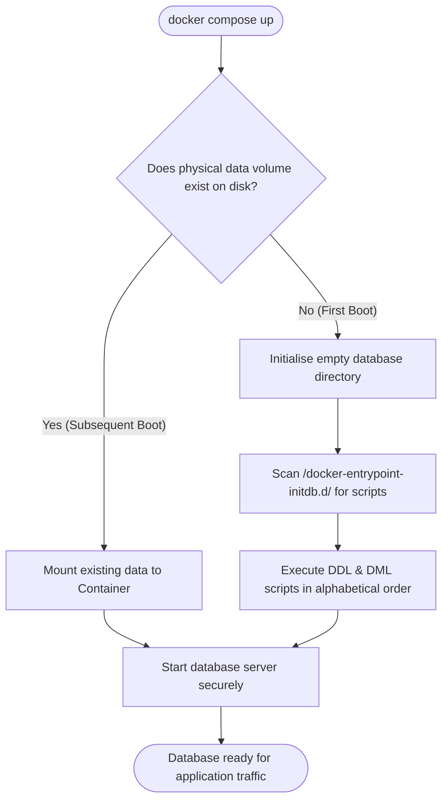

Have you ever broken your local database so badly during testing that you had to delete it entirely? Or have you ever needed a quick, automated way to purge your development data and rebuild your entire database structure and mock assets from scratch in seconds?

This engineering reference guide teaches you how to solve these headaches by building an **automated database initialisation pipeline**.

## 🔑 Core Concepts: Schema vs. Seed

Before we build our automated pipeline, let's establish the two components we need to initialise:

1. **The Database Schema (The Skeleton):** Think of the schema as the architectural blueprint of a house. It defines where the walls go, how many rooms there are, and what those rooms are called. In database terms, the **schema** defines your tables, columns, data types (like integers or text), primary keys, and relationships. It contains _no actual data_—it is purely the empty structure.
2. **The Database Seed (The Furniture):** Once your house is built, you need furniture to make it liveable. In database terms, **seeding** is the process of populating your empty schema tables with default or "mock" starter records (such as a default system administrator login, basic products, or settings). This ensures your application is instantly usable and testable on day one.

## 🛠️ Tutorial: Implementing Automatic Database Initialisation

In this tutorial, we will set up our database to configure its own schema and seed data automatically using container-native initialisation in Docker and MariaDB.

### Container-Native Initialisation (Docker & MariaDB)

This method mounts a local folder containing configuration scripts directly into a special startup directory inside our database container.

#### Step 1: Create Your Project Directory Structure

Create a new directory structure on your computer. We will use a folder called `_init_scripts/` to store our startup SQL files:

```
your-project/
├── _init_scripts/
│   ├── 01_schema.sql
│   └── 02_seed_data.sql
├── docker-compose.yml
└── index.php
```

#### Step 2: Export your Schema from phpMyAdmin (`01_schema.sql`)

Instead of writing your SQL structure by hand, you can design your tables visually in phpMyAdmin and export the blueprint. In professional development, this file represents your **DDL (Data Definition Language)** because it _defines_ the structure of your database tables, columns, and relations.

Follow these steps to extract your structure securely:

1. Open **phpMyAdmin** in your browser and select your development database from the sidebar.
2. Click on the **Export** tab in the top navigation menu.
3. Under **Export method**, select **Custom - display all possible options**. This is crucial because the default quick export will bundle your live data and structure together.
4. In the **Tables** section, ensure all of your structural tables (like `users` and `products`) are selected.
5. Scroll down to **Format-specific options** and find the **Dump table** controls:
    - **Select Structure only.** (Do _not_ check "Data", as our mock data belongs in our seeding script in Step 3).
6. Under the **Object creation options**, check the box for **Add CREATE TABLE / IF NOT EXISTS**. This is a critical security step that prevents your script from crashing if the tables already exist on startup.
7. Scroll to the bottom and click **Export** (or **Go**).
8. Move the downloaded `.sql` file into your local `_init_scripts/` folder, rename it to `01_schema.sql`, and ensure its structure looks similar to this:

```sql
-- 01_schema.sql
-- Force correct character sets for modern Unicode (and emojis!)
SET NAMES 'utf8mb4';

-- Example of exported structure for table 'users'
CREATE TABLE IF NOT EXISTS users (
    user_id INT(11) NOT NULL AUTO_INCREMENT,
    username VARCHAR(255) NOT NULL UNIQUE,
    password_hash VARCHAR(255) NOT NULL,
    first_name VARCHAR(100) NOT NULL,
    second_name VARCHAR(100) NOT NULL,
    phone_number VARCHAR(50) DEFAULT NULL,
    address TEXT DEFAULT NULL,
    access_level INT(1) DEFAULT 1,
    created_at TIMESTAMP NULL DEFAULT CURRENT_TIMESTAMP(),
    PRIMARY KEY (user_id)
) ENGINE=InnoDB DEFAULT CHARSET=utf8mb4 COLLATE=utf8mb4_unicode_ci;

-- Example of exported structure for table 'products'
CREATE TABLE IF NOT EXISTS products (
    product_id INT(11) NOT NULL AUTO_INCREMENT,
    name VARCHAR(255) NOT NULL,
    description TEXT DEFAULT NULL,
    price DECIMAL(10,2) NOT NULL,
    category VARCHAR(100) NOT NULL,
    image_path VARCHAR(255) DEFAULT 'placeholder.png',
    enabled TINYINT(1) DEFAULT 1,
    created_at TIMESTAMP NULL DEFAULT CURRENT_TIMESTAMP(),
    PRIMARY KEY (product_id)
) ENGINE=InnoDB DEFAULT CHARSET=utf8mb4 COLLATE=utf8mb4_unicode_ci;
```

#### Step 3: Export your Seed Data from phpMyAdmin (`02_seed_data.sql`)

Following on from the schema export, you can also use phpMyAdmin to export the starter records you have inserted into your database. In professional software engineering, this is known as **data seeding** and represents your **DML (Data Manipulation Language)** because it _manipulates_ or inserts the actual records.

To export your seed data cleanly and prevent duplicate errors when the database boots up, follow these steps:

1. Open **phpMyAdmin**, select your database, and click the **Export** tab in the top menu.
2. Select **Custom - display all possible options**.
3. In the **Tables** section, ensure the tables you want to seed (e.g., `users` and `products`) are selected.
4. Scroll down to **Format-specific options** and find the **Dump table** controls:
    - **Select Data only.** (Do _not_ check "Structure", as your table designs are already handled by `01_schema.sql` in the previous step).
5. Scroll down to the **Data creation options** section. To make your seed script **idempotent** (so it does not crash or create duplicate records if run more than once), update these settings:
    - Under **Function to use when dumping data**, select **INSERT IGNORE** or **REPLACE**. This tells the database server to safely skip or update rows if they already exist, rather than throwing a fatal primary key error.
6. Scroll to the bottom and click **Export** (or **Go**).
7. Move the downloaded file to your local `_init_scripts/` directory, rename it to `02_seed_data.sql`, and verify that it contains idempotent insert statements similar to this:

```sql
-- 02_seed_data.sql
SET NAMES 'utf8mb4';

-- Exported insert statement using INSERT IGNORE to guarantee idempotency
-- (Password: admin)
INSERT IGNORE INTO users (username, password_hash, first_name, second_name, phone_number, address, access_level) 
VALUES (
    'admin@admin.com', 
    '$2y$12$l1MzWDrv0d4srW/iiYjLsuGnukK9qcIEGtZe2Yk3yN/pjbnB88Qt6', 
    'System', 
    'Administrator', 
    '0412345678', 
    '100 Innovation Circuit, Canberra ACT 2601', 
    2
);

-- Seed baseline products into our inventory directory
INSERT IGNORE INTO products (name, description, price, category, image_path, enabled) 
VALUES 
('Quantum Mechanical Keyboard', 'An ergonomic split-layout mechanical keyboard with hot-swappable tactile switches.', 189.99, 'Accessories', 'keyboard-uuid.png', 1),
('Ultra-Wide Productivity Monitor', '34-inch curved monitor with high colour accuracy and built-in USB-C hub capabilities.', 549.50, 'Hardware', 'monitor-uuid.png', 1),
('Wireless Active Noise Cancelling Headphones', 'Premium over-ear headphones featuring adaptive noise cancellation and 40-hour battery life.', 299.00, 'Audio', 'headphones-uuid.png', 1);
```

#### Step 4: Map the Directory in `docker-compose.yml`

Now, we tell Docker to automatically read these files on startup. We will link our local `_init_scripts/` directory directly to Apache and MariaDB.

Open your `docker-compose.yml` and add the directory mapping under `volumes`:

![[dbInitScriptsMap.png]]

```
# READ-ONLY MOUNT (:ro): Feed our init scripts to Docker's automatic startup folder
- ./_init_scripts:/docker-entrypoint-initdb.d:ro
```

### Step 5: Verification & Testing Protocol (Docker Desktop & VS Code)

Testing is a core component of Software Engineering. Follow these steps to verify your automated pipeline works perfectly using your graphical desktop development tools:

1. **Delete the Container and Volume in Docker Desktop:**
    - Open **Docker Desktop** on your computer.
    - Navigate to the **Containers** tab, locate your stack container group, click the checkbox next to it, and click **Delete** (or use the trash icon on the container row).
    - Navigate to the **Volumes** tab, find the persistent volume associated with this stack (e.g., `web_shop_database_db_data`), and click the trash icon to delete it. This completely wipes out the database state, simulating a fresh machine configuration.
2. **Trigger a Container Rebuild in VS Code:**
    - Open your project workspace in **Visual Studio Code**.
    - If you are utilizing VS Code's Dev Containers extension, click the green Remote connection icon in the bottom-left corner of the window status bar and select **Rebuild Container**.
    - Alternatively, open your integrated terminal inside VS Code and execute the standard launch command with the build flag to pull the clean scripts into place:
        ```
        docker compose up -d --build
        ```
        
3. **Log into phpMyAdmin to Confirm Initialisation:**
    - Open **phpMyAdmin** in your browser (typically mapped to `http://localhost:8081` or your configured port).
    - Log in using your configuration developer credentials:
    - Once inside, navigate to the `web_shop_database` from the left sidebar and inspect the structural tables:
        - Verify that both `users` and `products` tables exist (indicating `01_schema.sql` executed).
        - Click on the tables to verify the data records (like the System Administrator account) are present (indicating `02_seed_data.sql` executed).
4. **Test Administrative Login:** Open your website, click your login button, and ensure that you can successfully log in using your previously created credentials.

## 📖 Explanation: Lifecycle Orchestration & Directory Mounting

Let's unpack the computer science and systems architecture behind this automated process.

### 1. What is Bootstrapping?

In computer science, **bootstrapping** refers to a self-starting process that executes automatically without external input. In our application, we bootstrap the database. When the web application starts up, it automatically configures its own tables, indexes, and starting data. This takes the responsibility away from the human developer and gives it to the machine.

### 2. Preventing "Configuration Drift"

When multiple programmers work on the same software, they might manually adjust their local databases (adding a column here, changing a field type there). Over time, their databases become different. This is called **configuration drift**.

By storing our database structure in files (`01_schema.sql` and `02_seed_data.sql`) inside our version control system (like Git), we ensure every single team member is running the _exact_ same database structure.

### 3. DDL vs. DML: The Two Flavours of SQL

To understand our init files, we must distinguish between the two categories of SQL commands:

- **DDL (Data Definition Language):** These commands build the structural skeleton of our database. Keywords include `CREATE TABLE`, `ALTER TABLE`, and `DROP TABLE`. DDL scripts do not contain actual users or products; they define the _rules_ and columns for them.
- **DML (Data Manipulation Language):** These commands manage the data _inside_ those structures. Keywords include `INSERT`, `UPDATE`, and `DELETE`.

### 4. Designing for "Idempotency"

An operation is **idempotent** if running it many times produces the exact same result as running it once.

- **The Danger:** If our setup scripts ran a standard `CREATE TABLE users` query every time the server restarted, the database would throw a crash error because the table already exists.
- **The Solution:** We design our SQL scripts defensively using idempotent statements like `CREATE TABLE IF NOT EXISTS` and `ON DUPLICATE KEY UPDATE`. This ensures that when the system starts up a second time, it safely skips existing tables and records without crashing.

### 5. Persistent Volume Mounting vs. Ephemeral Containers

Containers are **ephemeral**—which means they are temporary. If a container is stopped or deleted, any files stored inside its internal storage are instantly lost.

To save our database permanently, Docker uses **volumes**:

- The volume (`db_data`) links a folder on your real, physical computer to a folder inside the database container (`/var/lib/mysql`).
- When MariaDB starts up, it checks if this volume has files. If it is empty (**First Boot**), it runs our `_init_scripts/` to build the database. On subsequent restarts (**Subsequent Boot**), it sees the existing files and safely bypasses the startup scripts to protect your development data.


