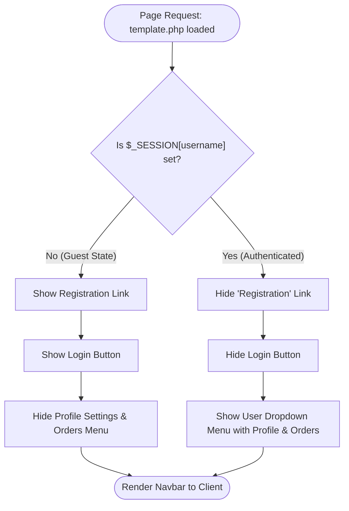

> [!note] Goal: Have the Navigation Bar show only the information relevant to the user, whether the user is logged in or not.

> [!important] LEARNING OUTCOME/S: 
> - Using `$_SESSION["username"]` to determine user authentication status.
> - Determine which information is needed depending on the user authentication status. 

## How To Guide

1. Open `template.php`.
2. Put a PHP wrapper around the link for user registration.
![[navbarRegistration.png]]
```
<?php if (!isset($_SESSION["username"])) : ?>
...
<?php endif; ?>
```

> [!note] This will only show the registration link if the user is **not** current logged in.

3. Update the view to show:
	1. **If Logged In:** A user icon, with dropdown list of links for Profile and Orders
	2. **If Not Logged In:** The Login button.

![[navbarLoginButton.png]]

```
<?php if (isset($_SESSION["username"])) : ?>
...
<?php else : ?>
...
<?php endif; ?>
```

4. Save the file & Reload the site.
5. Confirm the functionality. You will need to test the following actions:
	1. Access the front page when not logged in. Confirm the Registration & Login links appear.
	2. Access the front page when logged in. Confirm the Registration & Login links **do not** appear, but the User icon & menu does.
**Logged in**
![[navbarLoggedIn.png]]

**Not Logged in**
![[navbarNotLoggedIn.png]]

6. Highlight the logged in user by including their first name as the *heading* of the menu.
![[navbarUserHeading.png]]
```php
<?= htmlspecialchars($_SESSION['first_name']) ?>
```
![[commonBlocks#Commit & Push]]
## Explanation

In web applications, the user interface (UI) must adapt dynamically based on the user's authentication state. This ensures a clean User Experience (UX) and prevents logical errors, such as a logged-in user trying to register again.

### 1. The Role of the Session Superglobal (`$_SESSION`)

Because HTTP is inherently [[Stateless Protocol (HTTP)|stateless]], the server uses a secure cookie containing a Session ID to link the browser to a temporary storage file on the web server.

- In PHP, this file's contents are populated into the `$_SESSION` associative array when `session_start()` is called.
- By checking if a key like `$_SESSION['username']` is set, we can determine the client's authentication status before rendering any HTML.

### 2. Defensive UI vs Server-Side Authorization

- **Client-Side/UI Masking:** Hiding navigation links (like removing the "Login" button or the "Registration" link once authenticated) is a core tenet of defensive UX design. It streamlines the interface and limits user confusion.
- **Important Distinction:** Masking links in the UI does _not_ secure the backend. An unauthorised user can still type `profile.php` directly into their browser's URL bar. Therefore, UI conditional rendering must always be paired with server-side authorization checks (such as the checking logic implemented at the top of your `profile.php` or `admin_users.php` scripts).

### 3. Dynamic Navigation Control Logic

The conditional routing of your navigation bar is governed by two boolean questions:

1. **Is the user currently an unauthenticated guest?** If yes, show the "Registration" option and the "Login" CTA.
2. **Is the user currently authenticated?** If yes, suppress the entry options and mount a personalised control dropdown.


