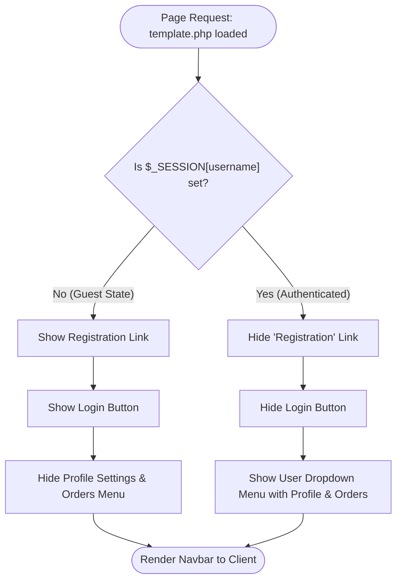

> [!note] This page will hold the whole How To Guide:  for the Gaze Electric Website. The How To Guide:  will be updated throughout the development process as the project develops.

==TODO== - db init_scripts
==TODO== 404 page. 

# Database Configuration

Before starting the website development, it is essential to understand the structure of relational databases. This background knowledge ensures you understand why tables are structured with specific data types and constraints.

Importantly, you need to understand CRUD.

![[dbCRUD.jpeg]]

See here : [[Slides - Databases]]

## How To Guide: Create your first table

> [!note] Goal: This guide will walk you through setting up the initial database infrastructure required for the shopfront web application.

> [!important] Learning Outcome/s:
> - How to configure a database table
> - Database terms,
> - SQL Fundamentals
### Step 1: Accessing the Database Manager

1. Open **PHPMyAdmin** in your browser.
2. Log in using the credentials defined in your `docker-compose.yml` file.
    - **Username:** `shopfront`
    - **Password:** `shopfront`

![[dbPHPMyAdmin.png]]

### Step 2: Selecting the Database

Once logged in, locate the sidebar and select the **shopfront** database. This ensures your commands are executed in the correct context.

![[dbInitialiseSQLTab.png]]

### Step 3: Executing the SQL Command

1. Click on the **SQL** tab in the top navigation bar.
2. Copy and paste the following code into the query box:

![[dbInitialiseUserTable.png]]

```sql
CREATE TABLE users (
  user_id int(11) NOT NULL AUTO_INCREMENT, 
  username text NOT NULL,
  password_hash text NOT NULL,
  first_name text NOT NULL,
  second_name text NOT NULL,
  address text NOT NULL,
  phone_number text NOT NULL,
  access_level int(11) NOT NULL,
  PRIMARY KEY (user_id)
) ENGINE=InnoDB DEFAULT CHARSET=utf8mb4 COLLATE=utf8mb4_uca1400_ai_ci;
```

3. Press **Go** to execute the command.

#### Reference: The `users` Table Schema

After execution, you can verify the structure by clicking the **Structure** tab.

|**Field**|**Type**|**Attributes**|**Description**|
|---|---|---|---|
|**user_id**|`int`|Primary Key, Auto Increment|Unique identifier for every user.|
|**username**|`text`|NOT NULL|The user's login handle.|
|**password_hash**|`text`|NOT NULL|Securely hashed password string.|
|**first_name**|`text`|NOT NULL|User's legal first name.|
|**second_name**|`text`|NOT NULL|User's legal surname.|


![[dbInitialiseUserTableComplete.png]]

**Key Indicator:** The 🔑 icon next to `user_id` confirms it is the **Primary Key**, ensuring no two users share the same ID.

### Step 4. How-To: Next Steps

Now that your database is initialised, you are ready to begin the application development phase. Your next task is to connect your web server to this database using the credentials provided in the login step.

## Explanation

Understanding why we configure a table with specific types and constraints is the difference between simply running code and building a scalable system. Here is the rationale behind the configuration used in your first table.

### The Necessity of the Primary Key (`user_id`)

In a relational database, every row must be uniquely identifiable. The `user_id` serves as the **Primary Key**.

- **Integrity:** Even if two users share the same name (e.g., two "John Smiths"), the `user_id` ensures the database can distinguish between them.
- **AUTO_INCREMENT:** We delegate the numbering to the system to prevent manual errors and ensure that no two users are ever assigned the same ID.

### Constraints: Why `NOT NULL`?

In the `CREATE TABLE` command, almost every field is marked as `NOT NULL`.

- **Data Completeness:** This acts as a safety barrier. It prevents the database from accepting a registration that is missing critical information, such as a password or a username.
- **Application Logic:** By enforcing this at the database level, we ensure the web application doesn't crash when trying to display "null" data in the UI.

### Storage Engines and Character Sets

You’ll notice the command specifies `ENGINE=InnoDB` and `CHARSET=utf8mb4`.

- **InnoDB:** This is the modern standard storage engine for MySQL. It supports "ACID" compliance, meaning it guarantees that database transactions are processed reliably—critical for protecting user data during a crash.
- **utf8mb4:** Unlike standard UTF-8, `utf8mb4` supports a wider range of characters, including emojis and complex international symbols. Using this ensures your shopfront is global-ready and won't "break" if a user includes a special character in their address.

### Security: The `password_hash` Field

Notice that the field is named `password_hash`, not `password`.

- **The Golden Rule:** We never store plain-text passwords.
- **The Strategy:** The `text` type provides ample space for long, encrypted strings generated by modern hashing algorithms (like Argon2 or Bcrypt). Even if the database were compromised, the actual passwords remain unreadable.

# Connecting the Website to The Database `config.php`

## How To Guide: Creating the `config.php` File

> [!note] Goal: To build the bridge between the website and the database.

> [!important] Learning Outcomes:
> - How to create a PHP Page
> - PHP syntax fundamentals
> - PHP code to connect to the database

Follow these steps to establish the "handshake" between your PHP code and the MariaDB database.

### Step 1: Create the File

1. Open **Visual Studio Code**.
2. In the **root directory** of your project, create a new file named `config.php`.

![[configInit.png]]

### Step 2: Add the Connection Logic

Copy and paste the following code into `config.php`:

![[configCodeEntered.png]]

```php
<?php
$host = 'certIII_db';
$port = 3306;
$dbname = 'shopfront'; 
$username = 'shopfront';
$password = 'shopfront';
try {
    $connectionString = "mysql:host=$host;port=$port;dbname=$dbname;charset=utf8mb4";
    $db = new PDO($connectionString, $username, $password);
    // Set error mode to exception
    $db->setAttribute(PDO::ATTR_ERRMODE, PDO::ERRMODE_EXCEPTION);
    // Connection successful
} catch (PDOException $e) {
    // Catch the PDOException and get the detailed error message
        echo "Database Error: " . $e->getMessage();
        echo "<br>Error Code: " . $e->getCode();
        echo "<br>File: " . $e->getFile();
        echo "<br>Line: " . $e->getLine() . "<br>";
        // For even more detail, you can use errorInfo()
        // echo "<br>PDO Error Info: ";
        // print_r($pdo->errorInfo(), true);
}

if (session_status() === PHP_SESSION_NONE) {
    session_start();
}
?>
```

To understand this code snippet, it helps to think of it as the "handshake" between your website and your database server.

![[commonBlocks#Commit & Push]]
## Explanation

In web development, we can use a `config.php` file to centralise database credentials and session management.

### Why centralise configuration?

- **Maintainability:** If your database password changes, you only update one file instead of hunting through dozens of pages.
- **Consistency:** It ensures every page on your site uses the same connection settings and character encoding (`utf8mb4`).
- **State Management:** By including `session_start()` here, you ensure the server remembers user data (like login status or shopping carts) across the entire application.

### Database Connection Variables

|**Variable**|**Purpose**|**Value/Default**|
|---|---|---|
|`$host`|The network location of the DB server.|`certIII-RnD_db` (Docker service name)|
|`$port`|The communication port for MariaDB/MySQL.|`3306`|
|`$dbname`|The specific schema/database to use.|`shopfront`|
|`$db`|The PDO instance used for SQL queries.|N/A|

### Core Functions & Structures

- **`try...catch`**: A control structure that "tries" to run code. If a `PDOException` occurs (e.g., wrong password), the `catch` block intercepts it to prevent a full system crash.
- **`PDO` (PHP Data Objects)**: A database access layer providing a uniform method of access to multiple databases.
- **`session_start()`**: Initialises or resumes a session. This allows the server to track a user's "Session ID" via a browser cookie, enabling persistence across different pages.
- **`session_status()` check**: Verifies if a session is already active to prevent "headers already sent" errors.


# Creating the website template

## How To Guide: Creating the standard interface

> [!note] Goal: Create the initial version of `template.php` which defines a standard interface to the whole site.

> [!important] Learning Outcomes:
> - Standardising User Interface (UI) across the whole site
> - Navigation throughout the site
 
### Step 1: Create the file

Create a new file, called `template.php` in the root directory of the project.

![[templateInit.png]]

Ensure it's in the root directory (not in any folders/directories)

### Step 2: Standard Header HTML

Add a PHP block at the top of the new file.

```php
<?php 
// Ensure config.php starts the session with session_start()
require_once 'config.php'; 
?>
```

![[templateImportsConfig.png]]

Now enter the HTML `<header>` section of the page.

```php
<!DOCTYPE html>
<html lang="en">
<head>
    <meta charset="utf-8">
    <meta name="viewport" content="width=device-width, initial-scale=1">

    <link href="css/bootstrap.min.css" rel="stylesheet" crossorigin="anonymous">
    <link rel="stylesheet" href="https://cdnjs.cloudflare.com/ajax/libs/font-awesome/6.0.0/css/all.min.css">
    
    <style>
        /* Floating container for flash messages in the top right */
        .flash-container {
            position: fixed;
            top: 20px;
            right: 20px;
            z-index: 9999;
            min-width: 320px;
        }
        /* Custom spacing for the logo */
        .navbar-brand img {
            transition: transform 0.3s ease;
        }
        .navbar-brand img:hover {
            transform: scale(1.05);
        }
    </style>
</head>
```

![[templateHeader.png]]


### Step 3: Navigation Bar

Add the following code after the HTML header code.

```html
<nav class="navbar navbar-expand-lg navbar-light bg-light shadow-sm">
    <div class="container-fluid">
        <a class="navbar-brand" href="index.php">
            
        </a>
        <button class="navbar-toggler" type="button" data-bs-toggle="collapse" data-bs-target="#navbarNav"
                aria-controls="navbarNav" aria-expanded="false" aria-label="Toggle navigation">
            <span class="navbar-toggler-icon"></span>
        </button>

        <div class="collapse navbar-collapse" id="navbarNav">
            <ul class="navbar-nav me-auto mb-2 mb-lg-0">
                <li class="nav-item">
                    <a class="nav-link" href="index.php"><i class="fas fa-home me-1"></i> Home</a>
                </li>
                <li class="nav-item">
                    <a class="nav-link" href="contact.php"><i class="fas fa-envelope me-1"></i> Contact us</a>
                </li>

                    <li class="nav-item">
                        <a class="nav-link" href="register.php">Registration</a>
                    </li>
            </ul>

            <div class="d-flex align-items-center">
                    <div class="nav-item dropdown">
                        <a class="nav-link dropdown-toggle text-success fw-bold" href="#" id="userDropdown" role="button" data-bs-toggle="dropdown" aria-expanded="false">
                            <i class="fas fa-user-circle me-1"></i> 
                        </a>
                        <ul class="dropdown-menu dropdown-menu-end shadow" aria-labelledby="userDropdown">
                            <li><a class="dropdown-item" href="profile.php"><i class="fas fa-user-cog me-2"></i>Profile Settings</a></li>
                            <li><a class="dropdown-item" href="orders.php"><i class="fas fa-shopping-bag me-2"></i>My Orders</a></li>
                            <li><hr class="dropdown-divider"></li>
                            <li>
                                <a class="dropdown-item text-danger fw-bold" href="logout.php">
                                    <i class="fas fa-sign-out-alt me-2"></i>Logout
                                </a>
                            </li>
                        </ul>
                    </div>
                    <a class="btn btn-primary px-4" href="login.php">
                        <i class="fas fa-sign-in-alt me-1"></i> Login
                    </a>
            </div>
        </div>
    </div>
</nav>
```

![[templateNavbar.png]]

### Step 4: *Footer* Code

Add the following code to the **end** of the file.

```php
<?php
/**
 * Utility function to clean user input
 */
function sanitiseData($data)
{
    return htmlspecialchars(stripslashes(trim($data)));
}
?>

<script src="js/bootstrap.bundle.min.js" crossorigin="anonymous"></script>

<script>
    document.addEventListener('DOMContentLoaded', function() {
        // Find all alerts with the 'flash-message' class
        const alerts = document.querySelectorAll('.flash-message');
        
        alerts.forEach(function(alertElement) {
            // Set a timer for 10,000 milliseconds (10 seconds)
            setTimeout(function() {
                // Use Bootstrap's built-in alert close method
                const bsAlert = new bootstrap.Alert(alertElement);
                bsAlert.close();
            }, 10000);
        });
    });
</script>

</body>
</html>
```

![[templateFooterCode.png]]

Whilst not strictly footer code as such, it is placed at the end of the file as it is processed after all other HTML and PHP has been rendered and executed.

### Step 5: Logo

Create a `/images` directory in the root directory of the project.

![[templateImagesDirectory.png]]

Find a logo online (make sure it's licsenced as Creative Commons), generate one, or use this provided logo.

![[_Certificate III E Course/WebDev/_instructions/GazeElectric/_images/logo.png]]

Save the file as `logo.png` into the images folder.

![[templateLogoSaved.png]]

Refresh the website and the logo should now appear.

![[templateLogoDisplayed.png]]


![[commonBlocks#Commit & Push]]

## Explanation

In modern web development, we rarely write the same HTML header or navigation code on every single page. Instead, we use a **template**.

### 1. The Power of `require_once`

By including `config.php` at the very top of our template, we ensure that every page on our site inherits the same core settings.

- **Session Management:** This is where `session_start()` usually lives, allowing the website to "remember" if a user is logged in as they click from page to page.
- **Consistency:** If you ever change your database password or site name, you change it in one config file, and it updates everywhere instantly.

### 2. Why use a Template?

A template acts as a "wrapper" for your content.

- **Maintenance:** Without a template, if you wanted to add a "About Us" link to your navbar, you would have to edit `index.php`, `contact.php`, `login.php`, etc. With a template, you edit **one** file.
- **Visual Identity:** It ensures that the CSS (Bootstrap) and JavaScript libraries are loaded in the same order on every page, preventing layout "flickers" or broken menus.

### 3. Responsive Navigation

The code in **Step 3** uses Bootstrap’s "Navbar-Toggler."

- **The Logic:** On a desktop, the menu is visible. On a mobile device, the menu "collapses" into a hamburger icon.
- **User Experience:** By including the Login and Profile buttons in the template, the user always has a clear "exit" or "entry" point regardless of where they are in the shop.


# User Management

> [!note] Goal: To develop the pages and logic required to allow users to register, login, logout and edit their profiles.

## Create the Registration Page (`register.php`)


> [!note] Goal: Develop a page to allow users to register an account on the website.

> [!important] Learning Outcomes:
> - Further PHP development skills
> - Building from the template
> - HTML form development
> - Embedding SQL into PHP to execute commands on the database

### How To Guide

This file handles the creation of new user accounts.

1. **Create `register.php`** and include `template.php` at the top.

```php
<?php
// Start output buffering to handle header redirection
ob_start();

// Include template (config.php inside template.php handles session_start)
include "template.php"; 

/** @var $db */
?>
```

![[userMgmtRegisterInit.png]]

2. Set the Page Title. Add a `<title>` tag to identify the page for the browser tab. For register.php: `<title>Register | Create Your Account</title>`
3. For the Registration Page: Add styles for a softer background (#f8f9fa) and defined section titles to organise the long form.
```css
<style>
    body { background-color: #f8f9fa; }
    .card-registration { border-radius: 15px; border: none; }
    .form-section-title { 
        font-size: 1.1rem; 
        font-weight: bold; 
        color: #495057; 
        border-bottom: 2px solid #e9ecef; 
        padding-bottom: 10px; 
        margin-bottom: 20px; 
    }
</style>
```

![[userMgmtRegisterTitleStyle.png]]


3. **Add the HTML Form:** Use `method="post"` and ensure each input name (`username`, `password`, `first_name`, etc.) matches the keys used in your PHP logic.


```php

<section class="py-5">
  <div class="container">
    <div class="row justify-content-center">
      <div class="col-lg-8">
        <div class="card card-registration shadow-lg">
          <div class="card-body p-5">
            <h2 class="text-center fw-bold mb-5">Create Your Account</h2>

            <form action="<?php echo htmlspecialchars($_SERVER["PHP_SELF"]); ?>" method="post">
              
              <div class="form-section-title"><i class="fas fa-lock me-2"></i>Account Security</div>
              <div class="row">
                <div class="col-md-6 mb-4">
                  <label class="form-label">Email / Username</label>
                  <input type="email" name="username" class="form-control" placeholder="name@example.com" required />
                </div>
                <div class="col-md-6 mb-4">
                  <label class="form-label">Password</label>
                  <input type="password" name="password" class="form-control" required />
                </div>
              </div>

              <div class="form-section-title"><i class="fas fa-user me-2"></i>Personal Information</div>
              <div class="row">
                <div class="col-md-6 mb-4">
                  <label class="form-label">First Name</label>
                  <input type="text" name="first_name" class="form-control" required />
                </div>
                <div class="col-md-6 mb-4">
                  <label class="form-label">Second Name</label> <input type="text" name="second_name" class="form-control" required />
                </div>
              </div>

              <div class="form-section-title"><i class="fas fa-address-book me-2"></i>Contact & Shipping</div>
              <div class="mb-4">
                <label class="form-label">Address</label> <textarea name="address" class="form-control" rows="2" required></textarea>
              </div>
              <div class="mb-4">
                <label class="form-label">Phone Number</label>
                <input type="tel" name="phone_number" class="form-control" placeholder="e.g., +1234567890" required />
              </div>

              <div class="form-check mb-4">
                <input class="form-check-input" type="checkbox" id="terms" required />
                <label class="form-check-label" for="terms">I agree to the terms and conditions</label>
              </div>

              <div class="d-grid">
                <button type="submit" name="register" class="btn btn-primary btn-lg shadow-sm">Complete Registration</button>
              </div>
              
              <p class="text-center mt-4">Already have an account? <a href="login.php">Login here</a></p>
            </form>
```

![[userMgmtRegisterFormCode.png]]

4. **Insert the Logic:**
	- Sanitise the data.
    - Check for existing users.
    - Hash the password using `password_hash()`.
    - Execute the `INSERT` query and redirect to `login.php` on success.

```php
            <?php
            if (isset($_POST['register'])) {
                // Sanitise all inputs
                $v_username    = sanitiseData($_POST['username']);
                $v_password    = $_POST['password']; 
                $v_first_name  = sanitiseData($_POST['first_name']);
                $v_second_name = sanitiseData($_POST['second_name']); // Updated variable name
                $v_address     = sanitiseData($_POST['address']);     // Updated variable name
                $v_phone       = sanitiseData($_POST['phone_number']);
                
                $hashed_password = password_hash($v_password, PASSWORD_DEFAULT);

                // Check if username exists
                $query = $db->prepare("SELECT COUNT(*) FROM users WHERE username = :username");
                $query->execute([':username' => $v_username]);
                
                if ($query->fetchColumn() > 0) {
                    $_SESSION['error_message'] = "This email is already registered.";
                    header("Location: register.php");
                    exit();
                } else {
                    // Updated SQL query to use second_name and address columns
                    $sql = "INSERT INTO users (username, password_hash, first_name, second_name, address, phone_number, access_level) 
                            VALUES (:username, :password, :fname, :sname, :address, :phone, 1)";
                    
                    $stmt = $db->prepare($sql);
                    $success = $stmt->execute([
                        ':username' => $v_username,
                        ':password' => $hashed_password,
                        ':fname'    => $v_first_name,
                        ':sname'    => $v_second_name,
                        ':address'  => $v_address,
                        ':phone'    => $v_phone
                    ]);

                    if ($success) {
                        $_SESSION['success_message'] = "Registration successful! Welcome to the Widget Shop.";
                        header("Location: login.php");
                        exit();
                    } else {
                        $_SESSION['error_message'] = "An error occurred. Please try again.";
                        header("Location: register.php");
                        exit();
                    }
                }
            }
            ?>

          </div>
        </div>
      </div>
    </div>
  </div>
</section>
```

![[userMgmtRegisterFormLogic.png]]

5. End the output buffer.

```php

<?php
ob_end_flush();
?>

```

![[userMgmtRegisterOBEnd.png]]

### Explanation

- **Password Hashing:** We never store passwords as plain text. The `password_hash()` function creates a secure, one-way cryptographic string. Even if your database is stolen, the passwords remain unreadable.
- **Validation Logic:** Before saving a new user, the script checks if the username is already taken. This maintains the **Unique Constraint** of your database.

##### Why use Output Buffering?

In the provided scripts for `login.php`, `register.php`, and `profile.php`, you will notice the functions `ob_start()` at the very top and `ob_end_flush()` at the very bottom.

##### The "Headers Already Sent" Problem

Web servers send information to your browser in two parts: **Headers** (metadata like "redirect to this page") and the **Body** (the HTML you see).

- **The Rule:** Once the server starts sending the Body (even a single empty space outside of PHP tags), it can no longer send Headers.
- **The Conflict:** Because our scripts include `template.php` (which contains HTML) before our logic determines if a user should be redirected, we would normally trigger an error when calling `header("Location: ...")`.
    

##### The Solution: `ob_start()`

- **The Buffer:** `ob_start()` tells PHP to hold all generated HTML in a "buffer" (internal memory) instead of sending it to the browser immediately.
- **Flexibility:** This allows the script to process all logic—including redirects—at any point.
- **Final Delivery:** `ob_end_flush()` releases the stored HTML to the browser only after the script has finished its logic.

## Create the Login Page (`login.php`)


> [!note] Goal: Develop a page to allow users to login to their account.

> [!important] Learning Outcomes:
> - Further PHP development skills
> - Security issues with PHP development

### How To Guide

This file authenticates existing users and starts their session.

1. **Create `login.php`**.
![[userMgmtLoginInit.png]]
2. Create the UI for the login page.

![[userMgmtLoginUI.png]]

```php
<?php
// Start output buffering to handle header redirection
ob_start();

// Include template (config.php inside template.php should have session_start())
include "template.php";

/** @var $db */
?>
<title>Login | Access Your Account</title>

<style>
    body { background-color: #eee; }
    .card-login { border-radius: 25px; }
    .form-icon { color: #aaa; margin-right: 10px; }
    .vh-100 { min-height: 100vh; }
</style>

<section class="vh-100 py-5">
    <div class="container h-100">
        <div class="row d-flex justify-content-center align-items-center h-100">
            <div class="col-lg-12 col-xl-11">
                <div class="card text-black card-login shadow-lg">
                    <div class="card-body p-md-5">
                        <div class="row justify-content-center">

                            <div class="col-md-10 col-lg-6 col-xl-7 d-flex align-items-center order-2 order-lg-1">
                                
                            </div>

                            <div class="col-md-10 col-lg-6 col-xl-5 order-1 order-lg-2">
                                <p class="text-center h1 fw-bold mb-5 mx-1 mx-md-4 mt-4">Login</p>

                                <form class="mx-1 mx-md-4" action="<?php echo htmlspecialchars($_SERVER["PHP_SELF"]); ?>" method="post">
                                    <div class="d-flex flex-row align-items-center mb-4">
                                        <i class="fas fa-envelope fa-lg me-3 fa-fw form-icon"></i>
                                        <div class="form-outline flex-fill mb-0">
                                            <label class="form-label" for="username">Email/Username</label>
                                            <input type="text" id="username" name="username" class="form-control form-control-lg" required />
                                        </div>
                                    </div>

                                    <div class="d-flex flex-row align-items-center mb-4">
                                        <i class="fas fa-lock fa-lg me-3 fa-fw form-icon"></i>
                                        <div class="form-outline flex-fill mb-0">
                                            <label class="form-label" for="password">Password</label>
                                            <input type="password" id="password" name="password" class="form-control form-control-lg" />
                                        </div>
                                    </div>

                                    <div class="text-center text-lg-start mt-4 pt-2">
                                        <button type="submit" name="login" class="btn btn-primary btn-lg px-5 shadow w-100">Login</button>
                                    </div>
                                </form>

                                <div class="mt-4">
                                    <?php
                                    if (isset($_POST['login'])) {
                                        $v_input_user = $_POST['username'];
                                        $v_input_pass = $_POST['password'];

                                        // VULNERABLE: Direct concatenation allowing SQLi
                                        $query = "SELECT user_id, username, first_name, access_level FROM users WHERE username = '$v_input_user'";
                                        
                                        // Debug helper for students to see their payload in action
                                        echo "<div class='alert alert-info small'><strong>Executed Query:</strong> <br><code>" . htmlspecialchars($query) . "</code></div>";

                                        $result = $db->query($query);
                                        $user = $result ? $result->fetch() : false;

                                        // VULNERABLE PASSTHROUGH: Checking only if a record was returned, ignoring password verification
                                        if ($user) {
                                            $_SESSION['user_id']      = $user['user_id'];
                                            $_SESSION['username']     = $user['username'];
                                            $_SESSION['first_name']   = $user['first_name'];
                                            $_SESSION['access_level'] = $user['access_level'];

                                            echo '<div class="alert alert-success">Login successful! Welcome ' . htmlspecialchars($user['first_name']) . '</div>';
                                            // header("Location: index.php");
                                            exit();
                                        } else {
                                            echo '<div class="alert alert-danger">Incorrect Username or password</div>';
                                        }
                                    }
                                    ?>
                                </div>

                            </div>
                        </div>
                    </div>
                </div>
            </div>
        </div>
    </div>
</section>

<?php
ob_end_flush();
?>
```


3. **Verify** the username and password entered against the database.

![[userMgmtLoginVerify.png]]

```php
 <div class="mt-4">
                                    <?php
                                    if (isset($_POST['login'])) {
                                        $v_input_user = sanitiseData($_POST['username']);
                                        $v_input_pass = $_POST['password'];

                                        $stmt = $db->prepare("SELECT user_id, username,  password_hash,first_name, access_level FROM users WHERE username = :username");
                                        $stmt->execute([':username' => $v_input_user]);
                                        $user = $stmt->fetch();

                                        if ($user && password_verify($v_input_pass, $user['password_hash'])) {
                                            // Set session variables
                                            $_SESSION['user_id']      = $user['user_id'];
                                            $_SESSION['username']     = $user['username'];
                                            $_SESSION['first_name']   = $user['first_name'];
                                            $_SESSION['access_level'] = $user['access_level'];

                                            // --- FLASH MESSAGE ---
                                            $_SESSION['success_message'] = "Welcome back, " . htmlspecialchars($user['first_name']) . "! You have successfully logged in.";

                                            // Redirect to index.php
                                            header("Location: index.php");
                                            exit();
                                        } else {
                                            // Note: Error messages can also be flash messages, but here we display 
                                            // it immediately on the login page for better UX.
                                            echo '<div class="alert alert-danger d-flex align-items-center">
                                  <i class="fas fa-exclamation-triangle me-2"></i>
                                  <div>Invalid email or password.</div>
                                </div>';
                                        }
                                    }
                                    ?>
                                </div>
```
> [!note] The verification code needs to be placed in the correct place within the HTML. Ensure that the code gets entered **after** the `</form>` and before the `</div>` as shown in the screenshot.

### Explanation

In a relational database system, the login process isn't just about checking a password; it’s about **Identity Management**.

##### 1. The HTML Form Structure (`POST` Method)

The form uses `method="post"`.

- **Security:** Unlike `GET` (which puts your password in the URL bar), `POST` sends the data inside the body of the HTTP request, keeping sensitive information hidden from browser history.
- **The `name` Attribute:** This is the most important part of your HTML. When you write `<input name="username">`, PHP creates a key in the `$_POST` array called `['username']`. Without the `name` attribute, PHP cannot "see" what the user typed.

##### 2. The Logic Flow: Fetch, then Verify

The PHP logic follows a specific "if-then" architecture:

- **The Fetch:** First, we ask the database: _"Does this username exist?"_ We use a Prepared Statement (`$db->prepare`) to prevent SQL injection.
- **The Verification:** If the user exists, we get the hashed password from the database. We then use `password_verify()`. This function takes the plain-text password from the form, hashes it using the same algorithm used during registration, and checks if the results match.
- **The Result:** If they match, we "set the session"—this is like giving the user a VIP wristband that they wear as they browse the rest of your shop.
- Once verified, you must store data that the template.php can use to update the navbar.
```php
$_SESSION['user_id']: Used for database queries on the profile page.
$_SESSION['first_name']: Used to say "Welcome, [Name]" in the header.
$_SESSION['access_level']: Used to hide or show "Admin" buttons.

```

## Update the Login script


> [!note] Goal: Improve the login page to resolve security issues.

> [!important] Learning Outcomes:
> - Understand security issues with PHP development
> - Attempt to 'hack' your website.
> - Resolve the issues.

After a security audit, the login script was vulnerable to SQL Injection attacks. 

Update it to use `prepare` statements - Use PDO prepared statements with placeholders. This ensures the database treats user input strictly as data, not executable code. This mitigates the potential SQL Injection attack vector.

![[userMgmtLoginUpdated.png]]

```php
<?php
// Start output buffering to handle header redirection
ob_start();

// Include template (config.php inside template.php should have session_start())
include "template.php";


/** @var $db */
?>
<title>Login | Access Your Account</title>

<style>
    body {
        background-color: #eee;
    }

    .card-login {
        border-radius: 25px;
    }

    .form-icon {
        color: #aaa;
        margin-right: 10px;
    }

    .vh-100 {
        min-height: 100vh;
    }
</style>

<section class="vh-100 py-5">
    <div class="container h-100">
        <div class="row d-flex justify-content-center align-items-center h-100">
            <div class="col-lg-12 col-xl-11">
                <div class="card text-black card-login shadow-lg">
                    <div class="card-body p-md-5">
                        <div class="row justify-content-center">

                            <div class="col-md-10 col-lg-6 col-xl-7 d-flex align-items-center order-2 order-lg-1">
                                
                            </div>

                            <div class="col-md-10 col-lg-6 col-xl-5 order-1 order-lg-2">
                                <p class="text-center h1 fw-bold mb-5 mx-1 mx-md-4 mt-4">Login</p>

                                <form class="mx-1 mx-md-4"
                                    action="<?php echo htmlspecialchars($_SERVER["PHP_SELF"]); ?>" method="post">

                                    <div class="d-flex flex-row align-items-center mb-4">
                                        <i class="fas fa-envelope fa-lg me-3 fa-fw form-icon"></i>
                                        <div class="form-outline flex-fill mb-0">
                                            <label class="form-label" for="username">Email Address</label>
                                            <input type="email" id="username" name="username"
                                                class="form-control form-control-lg" required />
                                        </div>
                                    </div>

                                    <div class="d-flex flex-row align-items-center mb-4">
                                        <i class="fas fa-lock fa-lg me-3 fa-fw form-icon"></i>
                                        <div class="form-outline flex-fill mb-0">
                                            <label class="form-label" for="password">Password</label>
                                            <input type="password" id="password" name="password"
                                                class="form-control form-control-lg" required />
                                        </div>
                                    </div>

                                    <div class="text-center text-lg-start mt-4 pt-2">
                                        <button type="submit" name="login"
                                            class="btn btn-primary btn-lg px-5 shadow w-100">Login</button>
                                        <p class="small fw-bold mt-3 pt-1 mb-0">Don't have an account?
                                            <a href="register.php" class="link-danger text-decoration-none">Register</a>
                                        </p>
                                    </div>

                                </form>

                                <div class="mt-4">
                                    <?php
                                    if (isset($_POST['login'])) {
                                        // 1. Trim input to eliminate accidental whitespace issues
                                        $v_input_user = sanitiseData($_POST['username']);
                                        $v_input_pass = sanitiseData($_POST['password']);

                                        // 2. Use a Prepared Statement to completely neutralize SQLi
                                        $stmt = $db->prepare("SELECT user_id, username, password_hash, first_name, access_level FROM users WHERE username = :username");
                                        $stmt->execute(['username' => $v_input_user]);
                                        $user = $stmt->fetch();

                                        // 3. Securely verify the password
                                        if ($user && password_verify($v_input_pass, $user['password_hash'])) {

                                            // 4. Prevent Session Fixation
                                            session_regenerate_id(true);

                                            $_SESSION['user_id'] = $user['user_id'];
                                            $_SESSION['username'] = $user['username'];
                                            $_SESSION['first_name'] = $user['first_name'];
                                            $_SESSION['access_level'] = $user['access_level'];

                                            $_SESSION['flash_message'] = "Welcome back, " . htmlspecialchars($user['first_name']) . "!";

                                            header("Location: index.php");
                                            exit();
                                        } else {
                                            // Use generic error messages to prevent user enumeration
                                            $_SESSION['error_message'] = "Invalid email/username or password.";
                                        }
                                    }
                                    ?>
                                </div>

                            </div>
                        </div>
                    </div>
                </div>
            </div>
        </div>
    </div>
</section>

<?php
ob_end_flush();
?>
```


## Create the Logout Script (`logout.php`)


> [!note] Goal: Develop a page to allow users to logout of their account.

> [!important] Learning Outcomes:
> - Simple, effective and secure logging out of account.


### How To Guide

This file ends the user's authenticated state.

1. **Create `logout.php`**.
![[userMgmtLogoutInit.png]]

2. Clear Browser Cache Data: Use `unset()` for `$_SESSION['user_id']` and other user-specific data.

![[userMgmtLogoutUnset.png]]

```php
<?php
session_start();

// Instead of destroying the whole session, just clear the user data
// This is more reliable for "Flash Messages"
unset($_SESSION['user_id']);
unset($_SESSION['username']);
unset($_SESSION['access_level']);
?>
```
This will clear the browser's memory of any private user data.

3. Notify the user of the successful action: Set a `logout_message` in the session and redirect the user back to the homepage.

![[userMgmtLogoutFlash.png]]

```php
// Set the flash message
$_SESSION['logout_message'] = "You have successfully logged out.";
```

4. Redirect the user to the home page.

![[userMgmtLogoutRedirect.png]]

```php
header("Location: index.php");
exit();
```

### Explanation

The logout process seems simple on the surface, but it represents an architectural decision regarding how user state and temporary application notifications interact.

#### 1. `session_start()` and the Session Lifecycle

Every PHP file that needs to read or write session data must invoke `session_start()` before any output is generated.

- **The Connection:** This function tells PHP to look for a unique session identifier cookie (usually called `PHPSESSID`) sent by the user's browser.
- **The Retrieval:** If it finds it, PHP reconstructs the `$_SESSION` global array with the data stored on the server for that specific user. Without this call, `$_SESSION` remains empty and unlinked.

#### 2. Selective Destruction: `unset()` vs. `session_destroy()`

A common approach to logging out a user is calling `session_destroy()`. However, the provided code purposefully takes a different approach:

```PHP
unset($_SESSION['user_id']);
unset($_SESSION['username']);
unset($_SESSION['access_level']);
```

- Calling `session_destroy()` deletes the entire session file on the server. While this completely logs out the user, it immediately wipes out any ability to carry information forward to the next page layout.
- By using `unset()`, you surgically remove only the identity indicators (`user_id`, `username`, `access_level`) that grant authenticated access. The session container itself remains alive.
	- **This will leave any other session variables in memory!**

#### 3. The Mechanics of Flash Messages

Because `unset()` leaves the session container intact, you can store temporary data right before the user leaves the page:

```PHP
$_SESSION['logout_message'] = "You have successfully logged out.";
```

- **Persistence across Redirects:** This creates a **Flash Message**. When the user is redirected to the home page, the homepage logic can read `$_SESSION['logout_message']`, render a clean Bootstrap notification alert, and then immediately run `unset($_SESSION['logout_message'])` so it never displays again on a refresh.

#### 4. Network Clean Exit (`header` and `exit`)

The final two lines manage server-to-browser network communication.

- **`header("Location: index.php")`:** This sends a raw HTTP `302 Redirect` header back to the browser, instructing it to immediately load `index.php`.
- **`exit()`:** **Crucial Security Element.** The `header()` function does not stop PHP from executing the rest of the script. If there were malicious code underneath a header redirect, a hacker could ignore the redirect and execute the downstream code. `exit()` halts script execution instantly on the server.

## Create the Profile Management Page (`profile.php`)


> [!note] Goal: Allow users to edit their details in the database

> [!important] Learning Outcomes:
> - Preloading user details
> - Allowing Update of data.

### How To Guide

This file allows logged-in users to update their information.

1. **Create `profile.php`**.
![[userMgmtProfileInit.png]]

2. Include the default output buffering, used throughout the site - [[#Why use Output Buffering?|Click Here for details.]]  Import `template.php` to standardise the UI of the site.
![[userMgmtProfileInclude.png]]

```php
<?php
// Start output buffering to handle header redirection
ob_start();

// Include template (config.php inside template.php handles session_start)
include "template.php"; 

/** @var $db */
?>


<?php
ob_end_flush();
?>
```
2. Add a check at the top: if `$_SESSION['user_id']` is not set, redirect the user to the login page. After that, set the `user_id` variable to the used later in the code.
![[userMgmtProfileCheckUser.png]]

```php
// Redirect to login if not logged in
if (!isset($_SESSION['user_id'])) {
    $_SESSION['error_message'] = "Please log in to view your profile.";
    header("Location: login.php");
    exit();
}

$user_id = $_SESSION['user_id'];
```


3. Include custom CSS to improve the User Interface (UI) for the user. 

![[userMgmtProfileStyle.png]]

```css
<style>
    body { background-color: #f0f2f5; }
    .profile-card {
        background-color: #ffffff;
        max-width: 800px;
        margin: 40px auto;
        padding: 40px;
        border-radius: 15px;
        box-shadow: 0 4px 15px rgba(0, 0, 0, 0.1);
        border: 1px solid #dee2e6;
    }
    .form-label { fw-bold; color: #495057; }
</style>
```

> [!note] Notice that the `<style>...</style>` block is located *in between* the PHP blocks. This means that it is treated as HTML code.


4. Create the form using HTML, with Bootstrap styles.
![[userMgmtProfileForm.png]]

```html
<div class="container">
    <div class="profile-card">
        <div class="text-center mb-4">
            <i class="fas fa-user-circle fa-4x text-primary mb-3"></i>
            <h2 class="fw-bold">My Profile</h2>
            <p class="text-muted">Manage your personal information and account settings</p>
        </div>

        <form action="profile.php" method="post">
            <div class="row">
                <div class="col-12 mb-4 border-bottom pb-2">
                    <h5 class="text-primary"><i class="fas fa-lock me-2"></i>Account Details</h5>
                </div>
                
                <div class="col-md-12 mb-3">
                    <label class="form-label">Email / Username</label>
                    <input type="email" name="username" class="form-control" value="<?= htmlspecialchars($user['username']) ?>" required>
                </div>

                <div class="col-12 mb-4 mt-3 border-bottom pb-2">
                    <h5 class="text-primary"><i class="fas fa-id-card me-2"></i>Personal Information</h5>
                </div>

                <div class="col-md-6 mb-3">
                    <label class="form-label">First Name</label>
                    <input type="text" name="first_name" class="form-control" value="<?= htmlspecialchars($user['first_name']) ?>" required>
                </div>

                <div class="col-md-6 mb-3">
                    <label class="form-label">Second Name</label>
                    <input type="text" name="second_name" class="form-control" value="<?= htmlspecialchars($user['second_name']) ?>" required>
                </div>

                <div class="col-md-6 mb-3">
                    <label class="form-label">Phone Number</label>
                    <input type="tel" name="phone_number" class="form-control" value="<?= htmlspecialchars($user['phone_number']) ?>" required>
                </div>

                <div class="col-md-12 mb-3">
                    <label class="form-label">Address</label>
                    <textarea name="address" class="form-control" rows="3" required><?= htmlspecialchars($user['address']) ?></textarea>
                </div>
            </div>

            <div class="d-grid gap-2 mt-4">
                <button type="submit" name="update_profile" class="btn btn-primary btn-lg">
                    <i class="fas fa-save me-2"></i>Save Changes
                </button>
                <a href="index.php" class="btn btn-outline-secondary">Cancel</a>
            </div>
        </form>
    </div>
</div>
```

This code will be rendered by the browser to show the following form.

![[userMgmtProfileRendered.png]]

5.  Focusing on the functionality, now that the UI has been completed, sanitise the form data by calling `sanitiseData()` for each form input box. 
![[userMgmtProfileSanitiseFormData.png]]

```php
// 1. Handle Form Submission (Update Data)
if (isset($_POST['update_profile'])) {
    $v_first_name  = sanitiseData($_POST['first_name']);
    $v_second_name = sanitiseData($_POST['second_name']);
    $v_address     = sanitiseData($_POST['address']);
    $v_phone       = sanitiseData($_POST['phone_number']);
    $v_username    = sanitiseData($_POST['username']);

}
```

>[!note] Each form element has a `name` attribute set. Use this name to retrieve the data for `sanitiseData()`.
>![[userMgmtProfileNameAttribute.png]]

>[!note] `isset($_POST['update_profile'])` will be `true` after the user has pressed the **Save Changes** button in the form, identified by the `name` attribute.
>![[userMgmtProfileNameAttributeSubmit.png]]

6. Build the structure to update the database with the new data previously collected.

![[userMgmtProfileTryCatch.png]]

```php
try {
       

        $_SESSION['success_message'] = "Profile updated successfully!";
        header("Location: profile.php");
        exit();
    } catch (PDOException $e) {
        $_SESSION['error_message'] = "Failed to update profile. Please try again.";
        header("Location: profile.php");
        exit();
    }

```

7. Include the code to configure the SQL to update the `users` table with the updated data for the current user.

![[userMgmtProfileSQL.png]]

```php
        $sql = "UPDATE users 
                SET username = :username, 
                    first_name = :fname, 
                    second_name = :sname, 
                    address = :address, 
                    phone_number = :phone 
                WHERE user_id = :id";
        
        $stmt = $db->prepare($sql);
        $stmt->execute([
            ':username' => $v_username,
            ':fname'    => $v_first_name,
            ':sname'    => $v_second_name,
            ':address'  => $v_address,
            ':phone'    => $v_phone,
            ':id'       => $user_id
        ]);
        
        // Update session username in case they changed their email
		$_SESSION['username'] = $v_username;
```
8. Finally, retrieve the user details for the current user from the database.

![[userMgmtProfileRetrieveUser.png]]
```php
// 2. Fetch Current User Data
$query = $db->prepare("SELECT username, first_name, second_name, address, phone_number FROM users WHERE user_id = :id");
$query->execute([':id' => $user_id]);
$user = $query->fetch();

if (!$user) {
    die("User not found.");
}
```

![[commonBlocks#Commit & Push]]

### Explanation

The `profile.php` file manages a fundamental CRUD operation: **U**pdating existing database records. Unlike registration, this file requires an active authentication state and robust defence mechanics against web vulnerabilities.

#### 1. Access Control (The Gatekeeper)

Before rendering any HTML or executing queries, the script evaluates the application state:

```PHP
if (!isset($_SESSION['user_id'])) { ... }
```

Because HTTP is inherently [[Stateless Protocol (HTTP)|stateless]], the server relies on the active session array to check if a user is logged in. If `$_SESSION['user_id']` is absent, execution is blocked immediately, and the client is forced to `login.php`. This acts as an access barrier to protect user data from unauthorised manipulation.

In a [[Stateless Protocol (HTTP)|stateless]] protocol, the web server treats every single incoming request as an entirely new, isolated event. The server has total amnesia. It retains zero context or memory of what happened a fraction of a second ago.

#### 2. Form Architecture and Superglobals (`$_POST`)

When an individual alters their account information and submits the form, the web browser builds an HTTP request container using the `POST` method. On the server side, PHP instantly parses this payload into the **`$_POST` superglobal array**.

- **Scope and Access:** `$_POST` is an associative array containing keys that identically match the `name=""` attribute values assigned to the HTML form elements (e.g., `$_POST['first_name']`).
- **State Mutation:** We leverage the `POST` method over `GET` for processing actions that write or modify database records. `GET` exposes submitted parameters inside the URL query string, making it highly unsafe and easily cached by web proxies.

#### 3. Prepared Statements vs. SQL Injection

The profile update script communicates with the relational database system through a parameterised query:

```PHP
$sql = "UPDATE users SET username = :username ... WHERE user_id = :id";
$stmt = $db->prepare($sql);
```

> [!warning]- SQL Injections
> The SQL can be coded in one step, without the preparation or binding of variables to the SQL.  An example of this method could be:
>
> ```php
// INSECURE: Building the SQL query by directly embedding variables into the string
$sql = "SELECT * FROM users WHERE username = '" . $v_input_user . "'";
>
// Execution happens immediately without separating code from data
$result = $db->query($sql);
$user = $result->fetch();
>```
>**Scenario A: Normal Input**
User inputs: john@example.com
> 
> Resulting SQL string: 
> ```sql
> SELECT * FROM users WHERE username = 'john@example.com'
> ```
> 
> Outcome: The query executes perfectly, searching safely for John's profile.
> 
> **Scenario B: The Exploitation Input (Bypassing Authentication)**
> User inputs: ' OR '1'='1
> 
> Resulting SQL string: 
> ```sql
> SELECT * FROM users WHERE username = '' OR '1'='1'
> ```
> 
> Outcome: Because `'1'='1'` is always true, the database completely ignores the username requirement and returns the very first record in your database (which is almost always the Administrator account), logging the attacker in without a valid password!
> 
> **Scenario C: The Destructive Input**
> User inputs: admin@example.com'; DROP TABLE users; --
> 
> Resulting SQL string: ```sql
> SELECT * FROM users WHERE username = 'admin@example.com'; DROP TABLE users; --'
> 
> Outcome: The semicolon instructs the database engine that the first command is finished, and it immediately executes the next command: DROP TABLE users;. The trailing dashes (--) turn the rest of your original query code into a comment, preventing a syntax error. Your user table is instantly deleted.


Constructing SQL strings by directly interpolating data from a form payload (e.g., `"SET username = " . $_POST['username']`) introduces a fatal security vulnerability known as **SQL Injection (SQLi)**.

Prepared statements completely mitigate this risk by executing the query engine in a two-step handshake:

1. **Compilation Phase:** The database compiles the SQL query structure using literal placeholders (`:username`, `:fname`). The template architecture is locked in place.
    
2. **Binding Phase:** The raw strings provided inside the `$_POST` array are sent separately and bound strictly as _data payloads_. Even if an attacker passes a string loaded with SQL commands (like `'; DROP TABLE users;--`), the database treat it purely as text data, neutralizing malicious executions.

## Dynamic Navbar

> [!note] Goal: Have the Navigation Bar show only the information relevant to the user, whether the user is logged in or not.

> [!important] LEARNING OUTCOME/S: 
> - Using `$_SESSION["username"]` to determine user authentication status.
> - Determine which information is needed depending on the user authentication status. 

### How To Guide

1. Open `template.php`.
2. Put a PHP wrapper around the link for user registration.
![[userMgmtDynamicNavRegistration.png]]
```
<?php if (!isset($_SESSION["username"])) : ?>
...
<?php endif; ?>
```

> [!note] This will only show the registration link if the user is **not** current logged in.

3. Update the view to show:
	1. **If Logged In:** A user icon, with dropdown list of links for Profile and Orders
	2. **If Not Logged In:** The Login button.

![[userMgmtDynamicNavLoginButton.png]]

```
<?php if (isset($_SESSION["username"])) : ?>
...
<?php else : ?>
...
<?php endif; ?>
```

4. Save the file & Reload the site.
5. Confirm the functionality. You will need to test the following actions:
	1. Access the front page when not logged in. Confirm the Registration & Login links appear.
	2. Access the front page when logged in. Confirm the Registration & Login links **do not** appear, but the User icon & menu does.
**Logged in**
![[userMgmtDynamicNavBarLoggedIn.png]]

**Not Logged in**
![[userMgmtDynamicNavBarNotLoggedIn.png]]

![[commonBlocks#Commit & Push]]
## Explanation

In web applications, the user interface (UI) must adapt dynamically based on the user's authentication state. This ensures a clean User Experience (UX) and prevents logical errors, such as a logged-in user trying to register again.

### 1. The Role of the Session Superglobal (`$_SESSION`)

Because HTTP is inherently [[Stateless Protocol (HTTP)|stateless]], the server uses a secure cookie containing a Session ID to link the browser to a temporary storage file on the web server.

- In PHP, this file's contents are populated into the `$_SESSION` associative array when `session_start()` is called.
- By checking if a key like `$_SESSION['username']` is set, we can determine the client's authentication status before rendering any HTML.

### 2. Defensive UI vs Server-Side Authorization

- **Client-Side/UI Masking:** Hiding navigation links (like removing the "Login" button or the "Registration" link once authenticated) is a core tenet of defensive UX design. It streamlines the interface and limits user confusion.
- **Important Distinction:** Masking links in the UI does _not_ secure the backend. An unauthorised user can still type `profile.php` directly into their browser's URL bar. Therefore, UI conditional rendering must always be paired with server-side authorization checks (such as the checking logic implemented at the top of your `profile.php` or `admin_users.php` scripts).

### 3. Dynamic Navigation Control Logic

The conditional routing of your navigation bar is governed by two boolean questions:

1. **Is the user currently an unauthenticated guest?** If yes, show the "Registration" option and the "Login" CTA.
2. **Is the user currently authenticated?** If yes, suppress the entry options and mount a personalised control dropdown.




# Administrator Tool - User Accounts


> [!note] Goal: Create a unified management terminal (`admin_users.php`) that allows authorised staff to list, provision, edit, and safely deprecate application user accounts.

> [!important] Learning Outcomes:
> - TODO

This stage of development relies heavily on the `access_level` field in the `users` table in the database.

**Recall** that the `access_level` value is retrieved from the database when the user successfully logs in to the site and is stored in a session variable.

![[adminSessionVariable.png]]

> [!important] **Prerequisite** You will need an account that has been registered, and then you will need to manually change the access level to 2 through PHPMyAdmin.
> ![[adminUsersAdminAccount.png]]


## How To Guide

1. Create a new file in the root directory of the project, named `admin_users.php`.
![[adminUsersNewFile.png]]

2. Start the file with the following code:
![[adminUsersInit.png]]

```php
<?php
ob_start();
include "template.php"; 

/** @var $db */

?>
```

>[!note] As with most other files, this starter code loads first creates a buffer to load all rendered code and applies the template code.

3. Insert the following code immediately after the `$db` comment:
![[adminUsersAccessLevelCheck.png]]

```php
// Security Check: Administrator Access Only (access_level >= 2)
if (!isset($_SESSION['access_level']) || $_SESSION['access_level'] < 2) {
    $_SESSION['error_message'] = "Access denied. Administrator privileges required.";
    header("Location: index.php");
    exit();
}
```

> [!note] This standard code should appear on any page that's required by administrators. If the user (authenticated or not) does not have an `access_level` of 2 or higher, the site will redirect them to the homepage then show them an error.
> This requires testing!

4. Get the current User ID
![[adminUsersAdminID.png]]
```php
$current_admin_id = $_SESSION['user_id'];
```

5. Write a helper block of code to allow the administrator edit a user's details. Place the code at the end of the initial php block.

![[adminUsersEditUserCode.png]]

```php
// Fetch single user for editing
$edit_user = null;
if (isset($_GET['edit'])) {
    $stmt = $db->prepare("SELECT * FROM users WHERE user_id = ?");
    $stmt->execute([(int)$_GET['edit']]);
    $edit_user = $stmt->fetch();
}
```

6. Start defining the UI for the page.
![[adminUsersUILayout.png]]

```html
<div class="container-fluid py-4" style="max-width: 1400px;">
    <h2 class="mb-4"><i class="fas fa-users-cog me-2"></i>User Account Management</h2>

    <div class="row">
        <!-- FORM COLUMN: Add / Edit User -->
        <div class="col-lg-4 mb-4">

        </div>


        <!-- LIST COLUMN: View / Manage Users -->
        <div class="col-lg-8">

        </div>
    </div>
</div>
```

> [!note] This code establishes a responsive [[Bootstrap container]] with a maximum width of 1400px and vertical padding to structure the page layout. 
> See the explanation on [[#Bootstrap Columns]] for details.
> Inside, it renders a styled second-level heading complete with a FontAwesome "users-cog" settings icon and margin spacing, serving as the main visual title for the user management dashboard.
> 
> The page will be designed as shown:
> ![[adminUsersUILayoutWireframe.png]]
7. Add the code to display a list of all the users:
![[adminUsersListUsers.png]]

```php
<div class="card shadow-sm border-0">
	<div class="card-body p-0">
		<div class="table-responsive">
			<table class="table table-hover align-middle mb-0">
				<thead class="table-light">
					<tr>
						<th class="ps-3">ID</th>
						<th>Full Name</th>
						<th>Username (Email)</th>
						<th>Phone</th>
						<th>Access</th>
						<th class="text-end pe-3">Actions</th>
					</tr>
				</thead>
				<tbody>
					<?php
					$users = $db->query("SELECT * FROM users ORDER BY user_id ASC")->fetchAll();
					foreach ($users as $u):
						$is_current_self = ($u['user_id'] === $current_admin_id);
					?>
					<tr class="<?= $is_current_self ? 'table-primary-subtle' : '' ?>">
						<td class="ps-3">#<?= $u['user_id'] ?></td>
						<td>
							<strong><?= htmlspecialchars($u['first_name'] . ' ' . $u['second_name']) ?></strong>
							<?php if ($is_current_self): ?>
								<span class="badge bg-primary ms-1">You</span>
							<?php endif; ?>
						</td>
						<td><?= htmlspecialchars($u['username']) ?></td>
						<td><?= htmlspecialchars($u['phone_number']) ?></td>
						<td>
							<?php if ($u['access_level'] >= 2): ?>
								<span class="badge bg-danger"><i class="fas fa-shield-alt me-1"></i> Admin</span>
							<?php else: ?>
								<span class="badge bg-secondary"><i class="fas fa-user me-1"></i> Customer</span>
							<?php endif; ?>
						</td>
						<td class="text-end pe-3">
							<a href="admin_users.php?edit=<?= $u['user_id'] ?>" class="btn btn-sm btn-info text-white me-1" title="Edit account">
								<i class="fas fa-edit"></i>
							</a>
							<?php if (!$is_current_self): ?>
								<a href="admin_users.php?delete=<?= $u['user_id'] ?>" 
								   class="btn btn-sm btn-danger" 
								   onclick="return confirm('Are you sure you want to permanently delete this user? This cannot be undone.')" 
								   title="Delete account">
									<i class="fas fa-trash"></i>
								</a>
							<?php else: ?>
								<button class="btn btn-sm btn-secondary" disabled title="Cannot delete yourself">
									<i class="fas fa-trash"></i>
								</button>
							<?php endif; ?>
						</td>
					</tr>
					<?php endforeach; ?>
				</tbody>
			</table>
		</div>
	</div>
</div>
```

> [!note]- Code Explanation
> This looks like, and is, complex code. However it can be broken down into a few key areas.
> # Code Explanation: Dynamic Administration Grid (`admin_users.php`)
> 
> This technical reference document provides a deep-dive line-by-line explanation of the dynamic user listing table. For ACT BSSS Software Development students, understanding how these components process data is key to demonstrating mastery in data persistence and defensive programming.
> 
> ## 1. Data Retrieval and the Loop Structure
> 
> The listing interface relies on a robust database-to-HTML mapping structure to display accounts dynamically:
> 
> ```
> $users = $db->query("SELECT * FROM users ORDER BY user_id ASC")->fetchAll();
> foreach ($users as $u):
>     $is_current_self = ($u['user_id'] === $current_admin_id);
> ?>
> ```
> I.e. The code loops over as many user accounts that are in the `users` table.
> 
> ### Key Technical Concepts:
> 
> - **`$db->query(...)`:** This directly executes a standard SQL `SELECT` statement on your relational database. We sort the output using `ORDER BY user_id ASC` so that accounts are presented sequentially from oldest to newest.    
> - **`fetchAll()`:** This method retrieves all matching rows returned by the query and packages them into a structured PHP array.
> - **`foreach ($users as $u):`** This loop iterates through the list of users. In each cycle, the variable `$u` represents a single user record (an associative array where keys match database column headers like `username`, `first_name`, etc.).
> - **State Identification (`$is_current_self`):** The boolean expression checks if the database ID of the row being rendered (`$u['user_id']`) matches the ID of the administrator currently logged in (`$current_admin_id`).
> 
> ## 2. Dynamic Style Binding & Self-Identity Highlights
> 
> To prevent administrators from losing track of their own accounts, the UI dynamically changes row styles based on who is logged in:
> 
> ```
> <tr class="<?= $is_current_self ? 'table-primary-subtle' : '' ?>">
> ```
> 
> ### Key Technical Concepts:
> 
> - **Ternary Operator (`? :`):** This is a shorthand `if-else` statement. If `$is_current_self` evaluates to `true`, PHP outputs the class name `'table-primary-subtle'`. This tells Bootstrap to apply a soft blue background to the row. If it is `false`, it outputs an empty string, keeping the default white background.
> - **Short Echo Tag (`<?= ... ?>`):** This shorthand is equivalent to `<?php echo ... ?>`, instantly outputting the evaluated string directly into the HTML markup.
> ## 3. Mitigating Cross-Site Scripting (XSS)
> 
> To protect the system from malicious script injections, all user-submitted text must be cleaned before rendering:
> 
> ```
> <strong><?= htmlspecialchars($u['first_name'] . ' ' . $u['second_name']) ?></strong>
> ```
> 
> ### Key Technical Concepts:
> 
> - **String Concatenation (`.`):** PHP joins the `first_name` and `second_name` strings together with a space character in between.
> - **`htmlspecialchars()`:** This is a vital security function. It intercepts special characters (such as `<`, `>`, and `&`) and converts them into harmless HTML entity equivalents (like `&lt;` and `&gt;`). If a malicious user sets their name to `<script>exploit()</script>`, this function ensures the browser renders the code safely as flat text rather than executing it as a script.
> 
> ## 4. Conditional Badges & Access Level Display
> 
> The interface renders distinct role indicators to help administrators quickly identify account types:
> 
> ```
> <?php if ($u['access_level'] >= 2): ?>
>     <span class="badge bg-danger"><i class="fas fa-shield-alt me-1"></i> Admin</span>
> <?php else: ?>
>     <span class="badge bg-secondary"><i class="fas fa-user me-1"></i> Customer</span>
> <?php endif; ?>
> ```
> 
> ### Key Technical Concepts:
> 
> - **Control Flow Separation:** PHP evaluates the integer value in the database's `access_level` column.
> - **Level 2 (Admin):** Users with an access level of 2 or higher are given a red badge (`bg-danger`) with a shield icon.
> - **Level 1 (Customer):** Standard users are given a neutral grey badge (`bg-secondary`) with a user icon.
> 
> ## 5. Defensive UX: Preventing Self-Deletion
> 
> To prevent an administrator from accidentally deleting their own account and locking themselves out of the system, the actions column implements a strict logical gate:
> 
> ```
> <?php if (!$is_current_self): ?>
>     <a href="admin_users.php?delete=<?= $u['user_id'] ?>" 
>        class="btn btn-sm btn-danger" 
>        onclick="return confirm('Are you sure...')" 
>        title="Delete account">
>         <i class="fas fa-trash"></i>
>     </a>
> <?php else: ?>
>    <button class="btn btn-sm btn-secondary" disabled title="Cannot delete yourself">
>         <i class="fas fa-trash"></i>
>    </button>
> <?php endif; ?>
> ```
> 
> ### Key Technical Concepts:
> 
> - **The Logical NOT (`!$is_current_self`):** If the row does _not_ belong to the logged-in administrator, the system renders an active deletion link.
> - **JavaScript Intercept (`onclick`):** The inline JS helper `confirm('...')` pops up a modal asking the user to confirm the deletion. Returning `false` from this intercept halts the browser's redirect, preventing accidental deletions.
> - **Disabled Element (`disabled`):** If the row _does_ belong to the active administrator, the system renders a disabled gray button (`.btn-secondary`). Because this is a static button and not a link (`<a>`), it cannot trigger a GET request, effectively blocking self-deletion at both the UI and backend layers.

8. Confirm the page is working correctly. Launch the site, and manually enter the `admin_users.php` page:

![[adminUsersListUsersConfirm.png]]

9. Enter the code in the first column. This code will allow the administrator to create a new user, or edit the selected user.

![[adminUsersEditUserPanel.png]]
```php
<div class="card shadow-sm border-0">
	<div class="card-header bg-dark text-white">
		<h5 class="mb-0"><?= $edit_user ? 'Edit User Details' : 'Create New Account' ?></h5>
	</div>
	<div class="card-body">
		<form action="admin_users.php" method="POST" autocomplete="off">
			<input type="hidden" name="user_id" value="<?= $edit_user['user_id'] ?? '' ?>">
			
			<div class="mb-3">
				<label class="form-label fw-bold">Email (Username)</label>
				<input type="email" name="username" class="form-control" value="<?= htmlspecialchars($edit_user['username'] ?? '') ?>" required>
			</div>

			<div class="row">
				<div class="col-md-6 mb-3">
					<label class="form-label fw-bold">First Name</label>
					<input type="text" name="first_name" class="form-control" value="<?= htmlspecialchars($edit_user['first_name'] ?? '') ?>" required>
				</div>
				<div class="col-md-6 mb-3">
					<label class="form-label fw-bold">Second Name</label>
					<input type="text" name="second_name" class="form-control" value="<?= htmlspecialchars($edit_user['second_name'] ?? '') ?>" required>
				</div>
			</div>

			<div class="mb-3">
				<label class="form-label fw-bold">Phone Number</label>
				<input type="tel" name="phone_number" class="form-control" value="<?= htmlspecialchars($edit_user['phone_number'] ?? '') ?>" required>
			</div>

			<div class="mb-3">
				<label class="form-label fw-bold">Address</label>
				<textarea name="address" class="form-control" rows="2" required><?= htmlspecialchars($edit_user['address'] ?? '') ?></textarea>
			</div>

			<div class="mb-3">
				<label class="form-label fw-bold">Access Level</label>
				<select name="access_level" class="form-select" required>
					<option value="1" <?= (isset($edit_user) && $edit_user['access_level'] == 1) ? 'selected' : '' ?>>1 - Customer</option>
					<option value="2" <?= (isset($edit_user) && $edit_user['access_level'] == 2) ? 'selected' : '' ?>>2 - Administrator</option>
				</select>
			</div>

			<div class="mb-4">
				<label class="form-label fw-bold"><?= $edit_user ? 'Reset Password' : 'Password' ?></label>
				<input type="password" name="password" class="form-control" placeholder="<?= $edit_user ? 'Leave blank to keep unchanged' : 'Enter account password' ?>" <?= $edit_user ? '' : 'required' ?>>
			</div>

			<div class="d-grid gap-2">
				<button type="submit" name="save_user" class="btn btn-primary">Save Changes</button>
				<?php if ($edit_user): ?>
					<a href="admin_users.php" class="btn btn-outline-secondary">Cancel Edit</a>
				<?php endif; ?>
			</div>
		</form>
	</div>
</div>
```

> [!note] Simply, this code displays either 
> - an empty form, allowing the administrator to add a new user, or 
> - loads the data for a particular user (`edit_user`) if the administrator has clicked the edit button.

> [!note]- Complex Code Explanation
> 
> The configuration form panel dynamically changes the display based on the action being performed
> 
> ```
> <div class="card shadow-sm border-0">
>     <div class="card-header bg-dark text-white">
>         <h5 class="mb-0"><?= $edit_user ? 'Edit User Details' : 'Create New Account' ?></h5>
>     </div>
>     ...
> ```
> 
> ### Key Technical Concepts:
> 
> - **Dynamic Header Rendering (The Ternary Operator):** The header element evaluates whether the `$edit_user` variable holds an active database record. If `$edit_user` is populated (`true`), the heading outputs **'Edit User Details'**. If it evaluates to empty or null (`false`), it defaults to **'Create New Account'** to keep the user interface contextually accurate.    
> - **Hidden State Tracker (`type="hidden"`):** 
>  ```html
> <input type="hidden" name="user_id" value="<?= $edit_user['user_id'] ?? '' ?>">
> ```
 >    This invisible input is crucial for backend processing. It uses the PHP **Null Coalescing Operator** (`??`) to echo the target user's primary key if it exists, defaulting to an empty string (`''`) if starting a fresh registration. Upon form submission, the backend checks this parameter: an empty field triggers an `INSERT` statement, while a populated field directs the query engine to execute a targeted `UPDATE`.
> - **Value Pre-population and XSS Mitigation:**
>     
>     ```html
>     value="<?= htmlspecialchars($edit_user['username'] ?? '') ?>"
>     ```
>  
>     
>     To maintain a professional user experience, inputs are pre-populated with existing records during edit mode. To prevent **Cross-Site Scripting >(XSS)** vulnerabilities, all values are parsed through `htmlspecialchars()` to neutralise script components. 
> - **Dynamic Dropdown Selection:**
 >    
>     ```php
>     <option value="2" <?= (isset($edit_user) && $edit_user['access_level'] == 2) ? 'selected' : '' ?>>2 - Administrator</option>
>     ```
>     
>     The dropdown component automatically marks the active database value as `selected` during edit mode, using inline PHP evaluations to match the form selection state with current table values.
>     
> - **Conditional Password Field Validation Rules:**
>     
>     ```
>     <input type="password" name="password" ... <?= $edit_user ? '' : 'required' ?>>
>     ```
>     
>     Password requirements shift dynamically depending on state. For a new account, a password is strictly mandatory (`required`). When modifying an existing account, the validation is removed and the placeholder text displays _'Leave blank to keep unchanged'_. This allows administrators to update other fields (like a telephone number) without being forced to modify or re-enter secure credential strings.
>     
> - **Contextual Action Buttons and Operations Cancellation:**
>     
>     ```
>     <?php if ($edit_user): ?>
>         <a href="admin_users.php" class="btn btn-outline-secondary">Cancel Edit</a>
>     <?php endif; ?>
>     ```
>    
>     If in edit mode, the UI dynamically adds a **"Cancel Edit"** button. Clicking this redirects the administrator back to a clean page instance, purging the `$edit_user` query parameters from the URL and resetting the card to its default empty state.

10. Confirm that the panel is loading correctly. Refresh the `admin_users.php` page.

![[adminUsersEditUserPanelConfirm.png]]

11. Include the code which will delete the user if the administrator chooses the delete button for an individual user. Place this code in between capturing the `user_id` session variable and the edit user code added earlier.

![[adminUsersDeleteUser.png]]

```php
// --- LOGIC: DELETE USER ---
if (isset($_GET['delete'])) {
    $delete_id = (int)$_GET['delete'];
    
    // Prevent self-deletion
    if ($delete_id === $current_admin_id) {
        $_SESSION['error_message'] = "Security protection: You cannot delete your own administrative account.";
    } else {
        $stmt = $db->prepare("DELETE FROM users WHERE user_id = ?");
        $stmt->execute([$delete_id]);
        $_SESSION['success_message'] = "User account deleted successfully.";
    }
    header("Location: admin_users.php");
    exit();
}
```

12. Implement the initial code to add or edit a user. Implement it after the delete user logic.
![[adminUsersSaveUserInit.png]]

```php
// --- LOGIC: ADD/EDIT USER ---
if (isset($_POST['save_user'])) {
    $u_id          = $_POST['user_id'] ?? null;
    $u_username    = sanitiseData($_POST['username']);
    $u_first_name  = sanitiseData($_POST['first_name']);
    $u_second_name = sanitiseData($_POST['second_name']);
    $u_address     = sanitiseData($_POST['address']);
    $u_phone       = sanitiseData($_POST['phone_number']);
    $u_access      = (int)$_POST['access_level'];
    $u_password    = $_POST['password'] ?? '';

    // Prevent administrative self-demotion
    if ($u_id == $current_admin_id && $u_access < 2) {
        $_SESSION['error_message'] = "Security protection: You cannot downgrade your own access level.";
        header("Location: admin_users.php");
        exit();
    }
}
```

> [!note] This code is executed if the user presses the **Save Changes** button at the end of the form in the Add/Edit User panel.
> Each of the fields in the form is sanitised and stored into individual variables.
> It also collects the `user_id` from the URL (if exists) or sets `$u_id` to null.
> `$_POST['password'] ?? ''` collects the password from the password field in the form, or sets it to null. This allows the administrator to edit the user details, without reseting the user's password (if the field is blank).
> 
> ![[adminUsersSaveChangesButton.png]]

13. Implement error checking on database updates. This will catch any database access errors and avoid the site crashing.

![[adminUsersTryCatch.png]]
```php
try {

} catch (PDOException $e) {
	$_SESSION['error_message'] = "Database error: " . $e->getMessage();
}
```

14. Check if the administrator is either updating a user or creating a new user. This is done in the `try` block.
![[adminUsersCheckEditAdd.png]]
```php
if (!empty($u_id)) {
	// Update Existing User
} else {
	// Create New User
}
```

> [!note] The logic that this is implementing is:
> - If the `$u_id` variable is not null, then the form would have had data loaded, meaning the administrator wanted to edit the user details. 
> - If `$u_id` is null, then nothing had been loaded yet, meaning the administrator had entered new user data into the form.

15. Implement the Update Existing User code.

![[adminUsersUpdateUser.png]]
```php
if (!empty($u_password)) {
	// If a new password was provided, update it as well
	$hashed_password = password_hash($u_password, PASSWORD_DEFAULT);
	$sql = "UPDATE users SET username=?, first_name=?, second_name=?, address=?, phone_number=?, access_level=?, password_hash=? WHERE user_id=?";
	$params = [$u_username, $u_first_name, $u_second_name, $u_address, $u_phone, $u_access, $hashed_password, $u_id];
} else {
	// Keep current password
	$sql = "UPDATE users SET username=?, first_name=?, second_name=?, address=?, phone_number=?, access_level=? WHERE user_id=?";
	$params = [$u_username, $u_first_name, $u_second_name, $u_address, $u_phone, $u_access, $u_id];
}
$db->prepare($sql)->execute($params);
$_SESSION['success_message'] = "User account updated successfully.";
```

> [!note] This code will update the user account, with or without updating the password. Whichever path is taken, the SQL is defined and then the parameters are set first.
> 
> ```mermaid
> graph TD
>     C{Is password empty?} -- No (New Password) --> D[Hash new password]
>     D --> E["UPDATE users SET ... password_hash = ? WHERE user_id = ?"]
>     C -- Yes (Unchanged) --> F["UPDATE users SET ... (Omit password_hash) WHERE user_id = ?"]
>     E --> G[Execute Statement]
>     F --> G
> ```

16. Create the logic for Creating a new user. This code is placed in the `else` block.

```php
if (empty($u_password)) {
	$_SESSION['error_message'] = "Password is required for new user accounts.";
	header("Location: admin_users.php");
	exit();
}

// Check if username already exists
$check = $db->prepare("SELECT COUNT(*) FROM users WHERE username = ?");
$check->execute([$u_username]);
if ($check->fetchColumn() > 0) {
	$_SESSION['error_message'] = "A user with that email already exists.";
	header("Location: admin_users.php");
	exit();
}

$hashed_password = password_hash($u_password, PASSWORD_DEFAULT);
$sql = "INSERT INTO users (username, first_name, second_name, address, phone_number, access_level, password_hash) VALUES (?, ?, ?, ?, ?, ?, ?)";
$db->prepare($sql)->execute([$u_username, $u_first_name, $u_second_name, $u_address, $u_phone, $u_access, $hashed_password]);
$_SESSION['success_message'] = "New user account created.";
```

> [!note]- Code explanation
> This code runs if the form was empty to start with (the administrator hadn't clicked an edit button). It performs a few actions:
> 1. First it confirms that a password has been entered in the form. Without one it won't create an account.
> 2. Then, it confirms that the username (email address) is unique.
> 3. Hashes the enters password
> 4. Defines the SQL and parameters with the form field data.
> 5. Executes the SQL (runs it on the database).
> 6. Sets a flash message to alert the user of the successful creation of the account.

17. Save the file.
18. Confirm the file is fully functional. You will need to test the following actions:
	1. Create a new user
	2. Edit the new user's details, without changing the password.
	3. Edit the new user's details, changing the password.
	4. Deleting the new user.
	5. Attempting to delete the account you're currently logged in as.

![[commonBlocks#Commit & Push]]
## Explanation

### Bootstrap Columns

- **The 12-Column Grid:** Bootstrap divides horizontal viewport space into 12 virtual grid units. This column is designated as `8` units wide (`col-*-8`).
- **The Breakpoint (`lg`):** The `lg` prefix stands for "large screens" (typically viewports with a width of $992\text{px}$ or greater). This means that on a standard desktop monitor, the column will occupy exactly two-thirds ($\frac{8}{12}$) of the screen's available width, sitting perfectly side-by-side with the left-hand form column which occupies the remaining one-third ($\frac{4}{12}$).
- **Responsive Stacking Behaviour:** Because there are no smaller breakpoint classes defined (such as `col-md-` or `col-sm-`), Bootstrap defaults to a stacked full-width layout (`col-12`) on any screens smaller than $992\text{px}$ (tablets and mobile phones).

This layout choice ensures that the administrative dashboard remains readable and clean, preventing data truncation when viewing dense directory tables on smaller screens.

#### The Six Bootstrap Breakpoint Tiers

|Breakpoint Abbreviation|Class Infix|Viewport Width Criteria|Targeted Physical Hardware|
|---|---|---|---|
|**Extra Small**|_None_ (e.g., `col-12`)|`< 576px`|Portrait mobile phones, compact hand-held devices.|
|**Small**|`sm`|`>= 576px`|Landscape mobile devices, large phablets.|
|**Medium**|`md`|`>= 768px`|Portrait tablets (e.g., Apple iPad).|
|**Large**|`lg`|`>= 992px`|Landscape tablets, standard laptops, and desktop monitors.|
|**Extra Large**|`xl`|`>= 1200px`|Mid-sized desktop monitors and widescreen workstations.|
|**Extra Extra Large**|`xxl`|`>= 1400px`|Ultra-wide monitors and high-resolution displays.|

### HTTP Methods: GET vs. POST

When building web applications, browsers communicate with servers using HTTP requests. The two most common request methods are **GET** and **POST**. Choosing the correct method is a fundamental design decision.

|Feature|GET Method (`$_GET`)|POST Method (`$_POST`)|
|---|---|---|
|**Primary Purpose**|Retrieving or fetching data from the server.|Submitting data to be processed or stored.|
|**URL Behaviour**|Appends parameters to the URL string.|Keeps the URL clean; data is sent in the request body.|
|**Data Visibility**|**Highly Visible:** Exposed in the address bar and browser history.|**Hidden:** Not visible in the address bar or browser history.|
|**Data Size Limit**|Restrictive (usually limited to around 2,000 characters).|Virtually unlimited (governed only by server configuration).|
|**Binary/File Support**|No support for binary files.|Full support (essential for uploading images/documents).|
#### The Deletion Route: `$_GET['delete']`

- **How it is triggered:** This is fired when an administrator clicks the red "Delete" trash icon in the directory table. This button is a standard HTML link (`<a>` tag) that appends the target user's ID to the URL:    
    ```php
    <a href="admin_users.php?delete=5">Delete</a>
    ```
    
- **How the logic works:** 
1. The browser sends a `GET` request, and the page reloads with `?delete=5` in the address bar. 
2. The PHP backend detects this using `if (isset($_GET['delete']))` and captures the ID. 
3. **The Defensive Gate:** The script immediately checks if the ID to be deleted matches the logged-in administrator's active session ID (`$delete_id === $current_admin_id`).

- If they match, the system blocks the request with an error message to prevent accidental self-deletion.
- If they do not match, the database securely executes the prepared SQL statement:

	
	```sql
	DELETE FROM users WHERE user_id = ?
	```
	

1. The user is redirected back to a clean `admin_users.php` page, clearing the `?delete` variable from the URL.
	

#### 2. The Save & Modify Route: `$_POST['save_user']`

- **How it is triggered:** This is fired when the administrator clicks the primary **"Save Account Record"** button inside the left-hand form.
    
- **How the logic works:** Unlike the delete link, the form sends data securely in the background (hidden from the URL bar) using the `POST` method. Once PHP detects `if (isset($_POST['save_user']))`, it performs a dual-path check:
    
    - **Path A (Create Mode):** If the hidden `user_id` input field is completely empty, the script knows this is a brand-new registration. It hashes the required password and executes an `INSERT` statement:
    
        ```sql
        INSERT INTO users (username, first_name, second_name, phone_number, address, access_level, password_hash) VALUES (?, ?, ?, ?, ?, ?, ?)
        ```
        
    - **Path B (Edit Mode):** If the hidden `user_id` contains a value, the script knows it is modifying an existing profile. It checks if the password field was left blank:
        
        - _If blank:_ It updates the text details (address, phone, name) but **omits** the password column so the user's existing password hash remains completely untouched.
            
        - _If filled:_ It hashes the new password and runs an `UPDATE` query that includes the new `password_hash` column.
            
        
        In both update scenarios, the targeted SQL statement is safely executed using prepared statements:
        
        ```sql
        UPDATE users SET username=?, first_name=?, second_name=?, ... WHERE user_id=?
        ```


# Administrator Tool - Product Management

> [!note] Goal: Allow administrators to add, edit or delete Products on the system

> [!important] Learning Outcomes:
> - TODO
## How To Guide: 

### Step 1 - Database Configuration

1. Log into phpMyAdmin. Click on the SQL tab.
![[prodMgmtPHPMyAdmin.png]]

2. Enter the following SQL into the query box. Click the Go button. This will create the `products` table in the database to hold the product information.
![[prodMgmtSQL.png]]

```sql
CREATE TABLE `products` (
  `product_id` int(11) NOT NULL,
  `product_name` varchar(255) NOT NULL,
  `description` text DEFAULT NULL,
  `price` decimal(10,2) NOT NULL,
  `category` varchar(100) NOT NULL,
  `image_path` varchar(255) DEFAULT 'placeholder.png',
  `enabled` tinyint(1) DEFAULT 1,
  `created_at` timestamp NULL DEFAULT current_timestamp()
) ENGINE=InnoDB DEFAULT CHARSET=utf8mb4 COLLATE=utf8mb4_uca1400_ai_ci;

```

> [!warning] If you receive an error stating there was no database selected, make sure the `shopfront` database has been selected.

3. Log out of phpMyAdmin.
#### Explanation

##### Database Design Logic (`products` Table)

Before writing any code, we must define how our database stores inventory items. The SQL structure is built with specific data types chosen for security, accuracy, and efficiency:

- **`product_id` (Integer):** A unique, automatic ID number given to each product. It ensures every single item can be uniquely identified.
- **`product_name` & `category` (Varchar):** Short, flexible text lines (up to 255 and 100 characters). This is ideal for names, titles, and labels.
- **`description` (Text):** A larger block of text. Unlike a `varchar`, a `text` field can hold thousands of words, making it perfect for detailed product write-ups.
    
- **`price` (Decimal):** **Crucial Software Rule:** Never store money using floating-point numbers (`float` or `double`). Computer processors struggle with binary fraction rounding, which leads to tiny, catastrophic math errors (like `$19.99` becoming `$19.9899999`). `decimal(10,2)` guarantees absolute precision for prices up to `$99,999,999.99` with exactly two decimal places.
    
- **`image_path` (Varchar):** We do **not** upload physical image files directly into the database. Doing so causes the database file to grow massive and crawl to a halt. Instead, we upload the image to the server's hard drive and save its clean, unique text filename (e.g., a UUID string) in this column. It defaults to `'placeholder.png'` if no image is uploaded.
    
- **`enabled` (Tinyint):** MySQL does not have a native "True/False" flag, so it uses `1` (Active) or `0` (Inactive) to power our soft-disable feature.
    
- **`created_at` (Timestamp):** The database automatically records the exact date and time the product was catalogued, leaving your PHP scripts with one less task to handle during an insert.

### Step 2 - Webpage Development

1. Create a new file called `admin_products.php` and include the boilerplate code.
![[prodMgmtInit.png]]
```php
<?php
ob_start();
include "template.php"; 

/** @var $db */

?>


<?php ob_end_flush(); ?>
```

2. Include the security check to confirm the user is an administrator. If they aren't redirect them to the front page.
![[prodMgmtConfirmAccessLevel.png]]
```php
// Security Check: Admin Only
if (!isset($_SESSION['access_level']) || $_SESSION['access_level'] < 2) {
    $_SESSION['error_message'] = "Access denied. Administrator privileges required.";
    header("Location: index.php");
    exit();
}
```

3. Define the location where the product images will be saved to.
![[prodMgmtImageDirectory.png]]
```php
$upload_dir = './images/product_images/';
// Ensure images directory exists
if (!is_dir($upload_dir)) {
    mkdir($upload_dir, 0777, true);
}
```

> [!note] This code also checks if the folder exists. If it doesn't, then it will create it. 

4. Include a function to generate a randomised [[Universal Unique Identifier (UUID)|UUID]]. 

```php
// Function to generate a simple UUID-like string
function generate_uuid() {
    return sprintf('%04x%04x-%04x-%04x-%04x-%04x%04x%04x',
        mt_rand(0, 0xffff), mt_rand(0, 0xffff),
        mt_rand(0, 0xffff),
        mt_rand(0, 0x0fff) | 0x4000,
        mt_rand(0, 0x3fff) | 0x8000,
        mt_rand(0, 0xffff), mt_rand(0, 0xffff), mt_rand(0, 0xffff)
    );
}
```

> [!note] This UUID will be used later in the code to generate unique names for uploaded product images. See below for details.

#### Explanation

##### UUIDs

If two administrators upload different product images named `photo.jpg`, the second upload will overwrite and corrupt the first. To prevent this, the code implements a **Universally Unique Identifier (UUID)** generator:

```php
function generate_uuid() {
    return sprintf('%04x%04x-%04x-%04x-%04x-%04x%04x%04x',
        mt_rand(0, 0xffff), mt_rand(0, 0xffff),
        mt_rand(0, 0xffff),
        mt_rand(0, 0x0fff) | 0x4000,
        mt_rand(0, 0x3fff) | 0x8000,
        mt_rand(0, 0xffff), mt_rand(0, 0xffff), mt_rand(0, 0xffff)
    );
}
```

This function compiles random hexadecimal strings to generate a virtually guaranteed, collision-free unique identifier (e.g., `4a2f89c1-8d2b-4029-a1b3-cf8a29104b2a.jpg`). The database stores this clean, unique name string in the `image_path` column, while the actual file is renamed accordingly and stored on disk.
### Step 3 - User Interface

> [!note] The User Interface for the admin_products page is designed to be very similar to the admin_users page.
> ![[prodMgmtUILayoutWireframe.png]]

1. Create the `container-fluid` layout and two columns. This uses the same column ratio as with the User Management page. Note that the HTML starts *after* the `?>` ending the initial PHP block.

![[prodMgmtUILayout.png]]

```html
<div class="container-fluid py-4" style="max-width: 1200px;">
    <h2 class="mb-4"><i class="fas fa-boxes me-2"></i>Inventory Management</h2>

    <div class="row">
        <!-- FORM COLUMN: Add/Edit -->
        <div class="col-lg-4 mb-4">

        </div>

        <!-- LIST COLUMN: View/Manage -->
        <div class="col-lg-8">

        </div>
    </div>
</div>
```
2. Add the HTML & PHP code to display all the current products in the `products` table.

![[prodMgmtListProducts.png]]
```php
<div class="card shadow-sm border-0">
	<div class="card-body">
		<div class="table-responsive">
			<table class="table table-hover align-middle">
				<thead class="table-light">
					<tr>
						<th>Image</th>
						<th>Product</th>
						<th>Price</th>
						<th>Status</th>
						<th class="text-end">Actions</th>
					</tr>
				</thead>
				<tbody>
					<?php
					$products = $db->query("SELECT * FROM products ORDER BY product_id DESC")->fetchAll();
					foreach ($products as $p):
					?>
					<tr>
						<td>
							" style="width: 40px; height: 40px; object-fit: cover;" class="rounded" onerror="this.src='https://via.placeholder.com/40'">
						</td>
						<td>
							<strong><?= htmlspecialchars($p['product_name']) ?></strong><br>
							<small class="text-muted"><?= $p['category'] ?></small>
						</td>
						<td>$<?= number_format($p['price'], 2) ?></td>
						<td>
							<a href="admin_products.php?toggle=<?= $p['product_id'] ?>" class="text-decoration-none">
								<?php if ($p['enabled']): ?>
									<span class="badge bg-success">Enabled</span>
								<?php else: ?>
									<span class="badge bg-secondary">Disabled</span>
								<?php endif; ?>
							</a>
						</td>
						<td class="text-end">
							<a href="admin_products.php?edit=<?= $p['product_id'] ?>" class="btn btn-sm btn-info text-white"><i class="fas fa-edit"></i></a>
							<a href="admin_products.php?delete=<?= $p['product_id'] ?>" class="btn btn-sm btn-danger" onclick="return confirm('Delete this product?')"><i class="fas fa-trash"></i></a>
						</td>
					</tr>
					<?php endforeach; ?>
				</tbody>
			</table>
		</div>
	</div>
</div>
```

> [!note] Make sure the code is placed in the indicated position.

3. Add the HTML and PHP code to allow the administrator to:
	1. Create new product listings,
	2. Edit products listings

![[prodMgmtAddEditProducts.png]]

```php
<div class="card shadow-sm border-0">
	<div class="card-header bg-dark text-white">
		<h5 class="mb-0"><?= $edit_item ? 'Edit Product' : 'Add New Product' ?></h5>
	</div>
	<div class="card-body">
		<form action="admin_products.php" method="post" enctype="multipart/form-data">
			<input type="hidden" name="product_id" value="<?= $edit_item['product_id'] ?? '' ?>">
			<input type="hidden" name="current_image" value="<?= $edit_item['image_path'] ?? 'placeholder.png' ?>">
			
			<div class="mb-3 text-center">
				<?php 
					$img_src = $upload_dir . ($edit_item['image_path'] ?? 'placeholder.png');
					if (!file_exists($img_src)) $img_src = 'https://via.placeholder.com/150';
				?>
				" class="img-thumbnail mb-2" style="height: 120px; width: 120px; object-fit: cover;">
				<input type="file" name="product_image" class="form-control form-control-sm" accept="image/*">
			</div>

			<div class="mb-3">
				<label class="form-label fw-bold">Product Name</label>
				<input type="text" name="product_name" class="form-control" value="<?= $edit_item['product_name'] ?? '' ?>" required>
			</div>

			<div class="mb-3">
				<label class="form-label fw-bold">Category</label>
				<select name="category" class="form-select" required>
					<?php 
					$cats = ['Electronics', 'Home & Garden', 'Clothing', 'Toys', 'Health'];
					foreach($cats as $c) {
						$sel = (isset($edit_item['category']) && $edit_item['category'] == $c) ? 'selected' : '';
						echo "<option value='$c' $sel>$c</option>";
					}
					?>
				</select>
			</div>

			<div class="mb-3">
				<label class="form-label fw-bold">Price ($)</label>
				<input type="number" step="0.01" name="price" class="form-control" value="<?= $edit_item['price'] ?? '' ?>" required>
			</div>

			<div class="mb-3">
				<label class="form-label fw-bold">Description</label>
				<textarea name="description" class="form-control" rows="3"><?= $edit_item['description'] ?? '' ?></textarea>
			</div>

			<div class="form-check form-switch mb-4">
				<input class="form-check-input" type="checkbox" name="enabled" id="p_enabled" <?= (!isset($edit_item) || $edit_item['enabled']) ? 'checked' : '' ?>>
				<label class="form-check-label" for="p_enabled">Visible to Customers</label>
			</div>

			<div class="d-grid gap-2">
				<button type="submit" name="save_product" class="btn btn-primary">Save Product</button>
				<?php if ($edit_item): ?>
					<a href="admin_products.php" class="btn btn-outline-secondary">Cancel Edit</a>
				<?php endif; ?>
			</div>
		</form>
	</div>
</div>
```

4. Add the code allowing the administrator to delete a product from the `products` table. Place this function in the initial PHP block under `generate_uuid()`.

![[prodMgmtFunctionDelete.png]]

```php
// --- LOGIC: DELETE PRODUCT ---
if (isset($_GET['delete'])) {
    $id = (int)$_GET['delete'];
    
    // Optional: Delete physical image file
    $stmt = $db->prepare("SELECT image_path FROM products WHERE product_id = ?");
    $stmt->execute([$id]);
    $img = $stmt->fetchColumn();
    if ($img && $img != 'placeholder.png' && file_exists($upload_dir . $img)) {
        unlink($upload_dir . $img);
    }

    $db->prepare("DELETE FROM products WHERE product_id = ?")->execute([$id]);
    $_SESSION['success_message'] = "Product removed successfully.";
    header("Location: admin_products.php");
    exit();
}
```

> [!note] This function will be executed when the administrator clicks the 🗑️ button for a particular product.
> ![[prodMgmtDeleteIcon.png]]
> The code that makes this possible is:
> `<a href="admin_products.php?delete=<?= $p['product_id'] ?>" class="btn btn-sm btn-danger" onclick="return confirm('Delete this product?')"><i class="fas fa-trash"></i></a>`
> This operates in the same manner as with User Management. See that page for details on GET vs. POST.

5. Add the code to allow the administrator to *toggle* a product. This will enable or disable the product listing in the site.

![[prodMgmtToggleCode.png]]

```php
// --- LOGIC: TOGGLE STATUS ---
if (isset($_GET['toggle'])) {
    $id = (int)$_GET['toggle'];
    $db->prepare("UPDATE products SET enabled = NOT enabled WHERE product_id = ?")->execute([$id]);
    $_SESSION['success_message'] = "Product status updated.";
    header("Location: admin_products.php");
    exit();
}
```

> [!note] This functionality was not included for User accounts. How could you update that page to include it?

6. Start the function to save a new product.

![[prodMgmtSave1.png]]

```php
// --- LOGIC: ADD/EDIT PRODUCT ---
if (isset($_POST['save_product'])) {
    $p_id      = $_POST['product_id'] ?? null;
    $p_name    = sanitiseData($_POST['product_name']);
    $p_cat     = sanitiseData($_POST['category']);
    $p_price   = (float)$_POST['price'];
    $p_desc    = sanitiseData($_POST['description']);
    $p_enabled = isset($_POST['enabled']) ? 1 : 0;
    
}
```

>[!note] Note the use of `$_POST` in this function. This is because the code will be uploading data and files to the webserver.

7. Handle the image upload functionality.
![[prodMgmtSave2.png]]
```php
// Handle Image Upload
$image_name = $_POST['current_image'] ?? 'placeholder.png';
if (isset($_FILES['product_image']) && $_FILES['product_image']['error'] === UPLOAD_ERR_OK) {
	$file_tmp = $_FILES['product_image']['tmp_name'];
	$file_ext = pathinfo($_FILES['product_image']['name'], PATHINFO_EXTENSION);
	$new_name = generate_uuid() . '.' . $file_ext;
	
	if (move_uploaded_file($file_tmp, $upload_dir . $new_name)) {
		// Delete old image if updating and it's not the placeholder
		if ($p_id && $image_name != 'placeholder.png' && file_exists($upload_dir . $image_name)) {
			unlink($upload_dir . $image_name);
		}
		$image_name = $new_name;
	}
}
```

> [!note] The code is fairly complex for a 'simple' process of uploading a image. See below for a detailed explanation. Also note how this function uses the `generate_uuid()` function to rename the image.

8. Write the product data to the database. This collects all the required fields and executes SQL to write the changes to the database.
![[prodMgmtSave3.png]]
```php
if ($p_id) {
	$sql = "UPDATE products SET product_name=?, category=?, price=?, description=?, enabled=?, image_path=? WHERE product_id=?";
	$db->prepare($sql)->execute([$p_name, $p_cat, $p_price, $p_desc, $p_enabled, $image_name, $p_id]);
	$_SESSION['success_message'] = "Product updated.";
} else {
	$sql = "INSERT INTO products (product_name, category, price, description, enabled, image_path) VALUES (?, ?, ?, ?, ?, ?)";
	$db->prepare($sql)->execute([$p_name, $p_cat, $p_price, $p_desc, $p_enabled, $image_name]);
	$_SESSION['success_message'] = "New product added.";
}
header("Location: admin_products.php");
exit();
```

> [!note] Depending on whether the `p_id` variable is set, this code either 
> - creates a new product entry (`INSERT`), or
> - updates an existing entry (`UPDATE`).

9. Set the `edit_item` variable if the administrator wishes to edit an existing entry.
![[prodMgmtSave4.png]]
```php
$edit_item = null;
if (isset($_GET['edit'])) {
    $stmt = $db->prepare("SELECT * FROM products WHERE product_id = ?");
    $stmt->execute([(int)$_GET['edit']]);
    $edit_item = $stmt->fetch();
}
```

10. Save the file. 
11. Launch the page in the browser to test the process. You will need to test:
	1. Adding a new product
	2. Editing a product.
	3. Toggling a product (set enabled to disabled and vice versa)
	4. Deleting a product.

![[prodMgmtTestFunctionality.png]]

![[commonBlocks#Commit & Push]]
## Explanation

### Demystifying our Custom Logic Routes

Our admin interface triggers backend scripts using specific combinations of GET and POST parameters. Understanding how these parameters operate is crucial for software engineering portfolios.

#### Route A: `$_GET['delete']` (Permanent Deletion)

- **How it is triggered:** The administrator clicks a red delete trash button, which is an HTML anchor link:
    
    ```php
    <a href="admin_products.php?delete=15">Delete</a>
    ```
    
- **URL Transformation:** * Original URL: `admin_products.php`
    
    - Action URL: `admin_products.php?delete=15`
        
- **Why we use GET here:** Standard hyperlinks can only send GET requests. By appending `?delete=15` to the query string, we inform our PHP script to immediately identify the targeted `product_id` (15), fetch its image path to purge the file from disk, and then permanently execute the SQL `DELETE` query.
    

#### Route B: `$_GET['toggle']` (Soft-Disable Visibility)

- **How it is triggered:** The administrator clicks the visibility eyeball icon link:
    
    ```php
    <a href="admin_products.php?toggle=15&state=0">Toggle</a>
    ```
    
- **URL Transformation:** * Original URL: `admin_products.php`
    
    - Action URL: `admin_products.php?toggle=15&state=0`
        
- **Why we use GET here:** Like the delete operation, this quick-toggle action is triggered directly from a table row hyperlink. By sending both `toggle` (the product ID) and `state` (the desired active/inactive value) via the URL query string, the PHP backend can instantly determine how to update the `enabled` column without forcing the administrator to load an entire editing form.
    

#### Route C: `$_POST['save_product']` (Saving/Editing Products)

- **How it is triggered:** The administrator clicks the "Save Product Record" button inside an HTML form:
    
    ```php
    <form action="admin_products.php" method="post" enctype="multipart/form-data">
    ```
    
- **URL Transformation:** * Original URL: `admin_products.php`
    
    - Submitting URL: `admin_products.php` (The URL remains **unchanged** in the address bar)
        
- **Why we use POST here:** 
1. **Data Size:** Product descriptions can contain thousands of words, easily exceeding the character limits of GET. 
2. **File Uploads:** We are transmitting binary data (the image file). GET requests cannot handle raw binary streams, making POST with `enctype="multipart/form-data"` an absolute technical requirement. 
3. **Security and Cleanliness:** It prevents sensitive or bulky details (like long description text blocks) from cluttering the address bar or appearing in browser history logs.

### The Mechanics of File Uploading in HTML & PHP

To transmit a physical file (like an image) from a user's machine to our server, standard text forms are insufficient. We must adjust both the client and server setups:

- **`enctype="multipart/form-data"`:** This attribute is mandatory on the `<form>` element. It tells the browser to split the form submission into multiple parts, sending the input strings as normal text but packaging the image file as a stream of raw binary data.
    
- **The `$_FILES` Superglobal:** When the server receives a file, PHP intercepts it and places it in a temporary staging directory on the server. The metadata (file name, temp location, size, and errors) is populated into `$_FILES['product_image']`. We must write code to validate this file and move it to its permanent location.

### Mitigating Upload Vector Exploits (Defensive Verification)

Allowing file uploads is one of the most high-risk vectors in web development. An attacker might attempt to upload a file named `shell.php` masked with an image extension. If the web server runs this file, they gain terminal access to your system. To prevent this, we implement two defensive check gates:

1. **MIME-Type Verification:** We do not rely on the user's file extension. Instead, we inspect the file's binary signature on the server to verify it is genuinely a `image/jpeg`, `image/png`, or `image/webp`.
    
2. **File Size Constraints:** We enforce a strict size ceiling (e.g., maximum 2MB) to prevent Denial of Service (DoS) attacks aimed at filling the server's hard drive space.

### Dynamic Product Visibility (Toggling States)

The database contains an `enabled` boolean field (storing `1` for active or `0` for inactive). This provides a defensive design feature known as a **soft-disable**:

- Rather than permanently deleting a product from the database (which would corrupt historic sales records or order invoices linked to that product ID), administrators can simply toggle its visibility.
    
- Products with `enabled = 0` are dynamically excluded from customer-facing catalog pages while remaining fully preserved inside the admin inventory panel for accounting and auditing purposes.
# Order Form


> [!note] Goal: TODO

> [!important] Learning Outcomes:
> - TODO
## How To Guide: 

### Step 1: 

![[commonBlocks#Commit & Push]]
## Explanation


# Shopping Cart


> [!note] Goal: TODO

> [!important] Learning Outcomes:
> - TODO
## How To Guide: 

### Step 1: 

![[commonBlocks#Commit & Push]]
## Explanation


# Invoicing


> [!note] Goal: TODO

> [!important] Learning Outcomes:
> - TODO
## How To Guide: 

### Step 1: 

![[commonBlocks#Commit & Push]]
## Explanation


