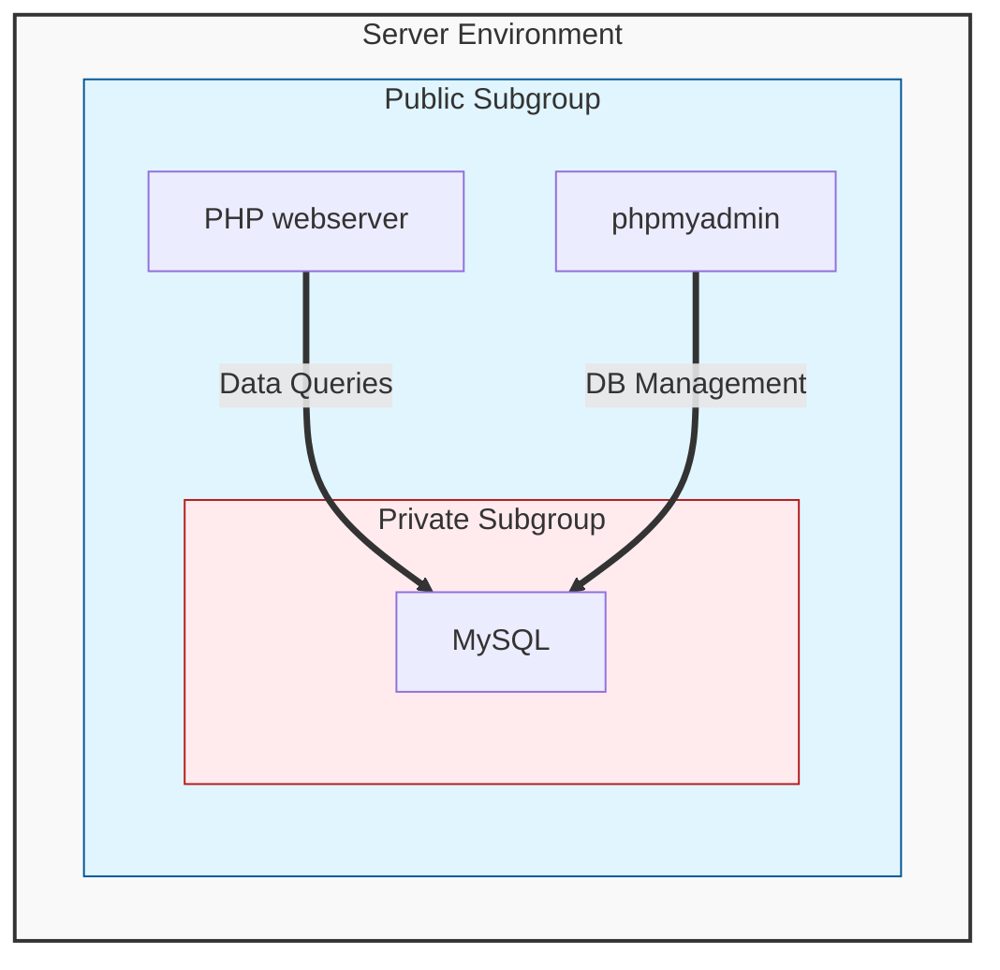

Write report detailing the installation of the server, specifically for the project requirements and goals. 

# Prerequisites

> [!important] Prior to starting this report, you need to ensure that your workstation is set up correctly and in an ergonomic manner.

![[setting-up-your-workstation-factsheet.pdf]]

After configuring your workstation to the guidelines, have someone take a photo of you at your desk.

# Requirements

To complete this task, you need to understand the requirements for the following:

- Written Report
- Spreadsheet
- Intended Audience
- How the documents are to be presented.

You will need to read the full task and be able to provide evidence for the above requirements.

The specific requirements are detailed on the Google Classroom assignment.


# Architecture Diagram

One method for visually describing the server configuration is through a mermaid diagram such as this one:



The code for this diagram is:
```text
graph TB
    subgraph Server_Environment [Server Environment]
        style Server_Environment fill:#f9f9f9,stroke:#333,stroke-width:2px

        subgraph Public_Subgroup [Public Subgroup]
            style Public_Subgroup fill:#e1f5fe,stroke:#01579b
            
            S1[PHP webserver]
            S2[phpmyadmin]

            subgraph Private_Subgroup [Private Subgroup]
                style Private_Subgroup fill:#ffebee,stroke:#b71c1c
                S3[MySQL]
            end
        end

        %% Database Connections
        S1 ==>|Data Queries| S3
        S2 ==>|DB Management| S3
    end
```
```
```