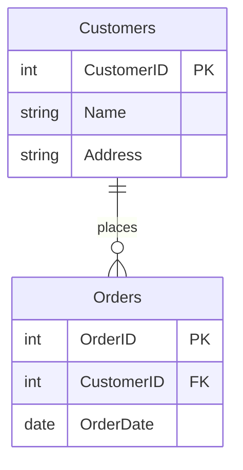

# Introduction to Databases

Goals:
- What is a database?
- Database terms

---

## What is MariaDB?

You might hear the term **MySQL**, but we are using **MariaDB**.

- **The History:** When MySQL was bought by a big corporation (Oracle), the original creators "forked" the code to keep it truly open-source and community-driven.
- **The Name:** It’s named after the founder's younger daughter, Maria. (MySQL was named after his older daughter, My!)
- **Compatibility:** It is a "drop-in replacement." This means all your PHP code and phpMyAdmin tools work exactly the same way.

---
## What is a Database?

In simple terms, a database is an **organised collection of structured information**.

Think of it like a digital filing cabinet. Instead of paper folders, we use **Tables**.

**Example:**

An E-commerce website stores products, customer details, and order history in a database so it can quickly find "All orders from User #105."

---
## Why not just use Excel?

Spreadsheets are for people; Databases are for **applications**.

- **Relationships:** Easily link a 'Customer' to their 'Orders'.
- **Security:** Control who can see or edit specific data (e.g., hiding passwords).
- **Concurrency:** Hundreds of people can buy items on a website at the exact same second without the file "locking."

---

## Key Terms: The Hierarchy

1. **Database:** The container for the whole project (e.g., `school_website`).
2. **Table:** A specific category (e.g., `students`).
3. **Row (Record):** A single entry (e.g., "John Smith").
4. **Column (Field):** An attribute (e.g., `email_address`).

---
# Anatomy of a Table

| **id (PK)** | **product_name**    | **price** | **stock** |
| ----------- | ------------------- | --------- | --------- |
| 1           | Gaming Mouse        | 45.00     | 12        |
| 2           | Mechanical Keyboard | 89.00     | 5         |
| 3           | USB-C Cable         | 12.50     | 50        |

- **Columns:** The "headers" that define what data we store.
- **Rows:** The actual data entries.

---
## Data Types

In MariaDB, every column must have a "Type." This helps the computer save space and prevent errors.

- **INT:** Whole numbers (ID numbers, quantities).
- **VARCHAR(length):** Short text like names or emails (Variable Character).
- **DECIMAL(10,2):** Perfect for money/prices.
- **TEXT:** For long descriptions or blog posts.
- **DATE:** For birthdays or "joined on" dates.

---
# Primary Keys (PK)

Every table **must** have a Primary Key.

- It is a **unique identifier** for every row.
- **Pro Tip:** We usually set this to **Auto Increment (A_I)** so MariaDB gives every new entry the next number (1, 2, 3...) automatically.

**Example:** Even if two students are both named "Alex Tan," they will have different `student_id` values.

---
# Foreign Keys - Establishing Relationships

**What are Foreign Keys?**

*   A foreign key is a column (or set of columns) in one database table that refers to the primary key in another table.
*   It establishes a link or relationship between the two tables.
*   It enforces *referential integrity*, ensuring that relationships between data remain consistent.  You can't insert a value into a foreign key column if that value doesn't exist in the primary key column of the related table.

--

# How Foreign Keys Work:

1.  **Primary Key:** The primary key uniquely identifies each row in a table.
2.  **Foreign Key:**  A foreign key in another table points to the primary key of the first table.
3.  **Relationship:** This creates a relationship where data in one table is connected to data in another.

--
# Foreign Key Example:

Let's say we have two tables:

*   **Customers:** (CustomerID, Name, Address) - `CustomerID` is the primary key.
*   **Orders:** (OrderID, CustomerID, OrderDate) - `CustomerID` is a foreign key referencing `Customers`.

This means each order is associated with a specific customer.  The `CustomerID` in the `Orders` table tells us which customer placed that order.

--

**Mermaid Diagram:**

note:

**Explanation of the Mermaid Diagram:**

*   `erDiagram`:  This declares that we're creating an Entity-Relationship Diagram.
*   `Customers { ... }`: Defines the `Customers` table.
*   `Orders { ... }`: Defines the `Orders` table.
*   `int CustomerID PK`:  Specifies that `CustomerID` is an integer and the primary key (PK) in the `Customers` table.
*   `int OrderID PK`: Specifies that `OrderID` is an integer and the primary key (PK) in the `Orders` table.
*   `int CustomerID FK`: Specifies that `CustomerID` is an integer and a foreign key (FK) in the `Orders` table.
*   `date OrderDate`:  Specifies the `OrderDate` column.
*   `Customers ||--o{ Orders : places`: This is the relationship line.
    *   `||--o{`:  Represents a one-to-many relationship (one customer can have many orders).
    *   `places`:  This is the label for the relationship, indicating the connection.

**Key takeaways from the diagram:**

*   The `Orders` table has a `CustomerID` column that is a foreign key referencing the `Customers` table.
*   The `CustomerID` in the `Orders` table is linked to the `CustomerID` in the `Customers` table.
*   The relationship is represented by the line connecting the tables, with the label "places" indicating the nature of the relationship.

---

**How to Use This:**

1.  **Copy the Text:** Copy the text content above.
2.  **Create a Slide:** In your presentation software, create a new slide.
3.  **Paste the Text:** Paste the text into the slide.
4.  **Insert the Mermaid Diagram:**  Most presentation tools have a way to embed Mermaid diagrams.  You'll typically need to:
    *   Use a Mermaid Live editor (e.g., [https://mermaid.live/](https://mermaid.live/)) to generate the diagram's code.
    *   Copy the code from the Mermaid diagram section above.
    *   Paste the code into the appropriate field in your presentation software.  The software should then render the diagram.

**Important Notes:**

*   **Mermaid Support:** Ensure your presentation software fully supports Mermaid diagrams.  Not all tools have native support; some require plugins.
*   **Customization:**  You can customize the Mermaid diagram further to match your specific database schema.

Let me know if you'd like me to modify this slide in any way (e.g., change the example tables, add more detail, or adjust the Mermaid diagram).

---

# Data vs. Information 

## Data

*   **Definition:** Raw, unorganised facts and figures.  It represents observations or measurements.
*   **Characteristics:**
    *   Unprocessed
    *   Lacks context
    *   Can be ambiguous
    *   Often quantitative (numbers) or qualitative (descriptions)
*   **Examples:**
    *   `123` (a number)
    *   `"John Doe"` (a name)
    *   `"Red"` (a color)
    *   A single temperature reading: `25°C`
    *   A list of customer IDs: `CustomerID1, CustomerID2, CustomerID3`

--

# Information

*   **Definition:** Data that has been processed, organised, and given context, making it meaningful and useful.
*   **Characteristics:**
    *   Processed Data
    *   Contextualised
    *   Reduces Ambiguity
    *   Often qualitative (insights, conclusions)
*   **Examples:**
    *   "Sales increased by 15% last quarter." (Based on sales data)
    *   "The average customer age is 32." (Based on customer data)
    *   "Customers prefer blue products." (Based on product sales data and customer feedback)
    *   A sales report showing monthly revenue trends.

---

## phpMyAdmin: Your Control Panel

We use **phpMyAdmin** to talk to MariaDB without writing raw code yet.

- **Structure Tab:** Where you define your columns and data types.
- **Browse Tab:** Where you see the rows of data you've entered.
- **Insert Tab:** A simple form to add new data to a table.
- **SQL Tab:** Where you can type manual commands to the database.

## Relationships: The "Relational" Part

Tables can "talk" to each other using **Foreign Keys**.

- **Scenario:** You have a `users` table and an `orders` table.
- Instead of typing the user's name in the order, you just store their `user_id`.
- This creates a **One-to-Many** relationship: One user can have many orders.

---

# Questions?

If you have any questions, please ask!

![[contactDetails.png]]