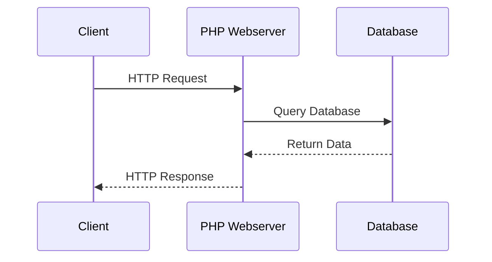
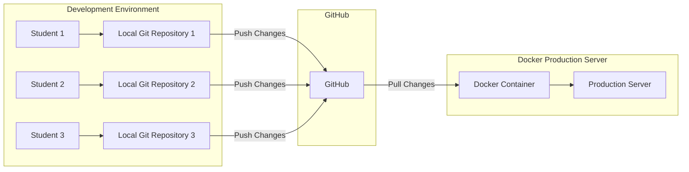

# Project 1

Welcome to the first project.

Two different, but linked tasks:

- Build a Docker container
- Write an Installation Manual for the process.

---

# Development Environment

| PC/Laptop          | Chromebook        |
| ------------------ | ----------------- |
| Visual Studio Code | GitHub Codespaces |
| Docker             |                   |
| PHP                |                   |

---

# Website Development

Software development, focusing on Website Development technologies:

- PHP
- MySQL/MariaDB
- SQL
- Bootstrap

note:
NOT website design.
Focus on programming skills with a strong emphasis on backend development. 

--

# Typical Sequence

--
# Front-End vs Back-End Development

## Front-End Development

- **Focus**: User Interface (UI) and User Experience (UX)
- **Technologies**: HTML, CSS, JavaScript
- **Frameworks/Libraries**: React, Angular, Vue.js
- **Responsibilities**:
  - Designing and implementing the visual aspects of a website
  - Ensuring responsiveness and performance
  - Enhancing user interaction and experience

--

## Back-End Development

- **Focus**: Server-side logic and database management
- **Technologies**: PHP, Node.js, Python, Ruby, Java
- **Frameworks**: Laravel, Express, Django, Ruby on Rails, Spring
- **Responsibilities**:
  - Managing server, application, and database
  - Handling business logic and data processing
  - Ensuring security and data integrity

--

## Key Differences

| Aspect            | Front-End Development           | Back-End Development            |
|-------------------|---------------------------------|---------------------------------|
| **Focus**         | User Interface and Experience   | Server-Side Logic and Database  |
| **Technologies**  | HTML, CSS, JavaScript           | PHP, Node.js, Python, Java      |
| **Frameworks**    | React, Angular, Vue.js          | Laravel, Express, Django        |
| **Responsibilities** | Visual Design, UX, Performance | Data Management, Business Logic, Security |

--

# Summary

- **Front-End**: What users see and interact with
- **Back-End**: Behind-the-scenes functionality and data management
- Both are essential for a fully functional web application

note:
During this course, you will be developing both front and back-end technologies.

---
# Typical Process

During this project, you'll code in VS Code or Codespaces, working towards the goal.

When you finish a feature, you'll **commit** and **push** changes to your GitHub repository.

note:
The project goes over the entire course.

---

# GitHub

## What is Version Control?

- **Version Control** is a system that records changes to a file or set of files over time.
- It allows you to revert files to a previous state, compare changes over time, and collaborate with others.

--

## What is Git?

- **Git** is a distributed version control system.
- It allows multiple people to work on a project simultaneously without overwriting each other's changes.
- Git tracks changes and helps in merging different versions of a project.

--

## What is GitHub?

- **GitHub** is a web-based platform that uses Git for version control.
- It provides a collaborative environment for developers to share and manage code.
- GitHub hosts repositories, which are collections of files and their revision history.

--

## Key Concepts in Git

### Commit

- A **commit** is a snapshot of your repository at a specific point in time.
- It records changes made to the files.
- Each commit has a unique ID (hash) and a message describing the changes.

--

## Key Concepts in Git
### Push

- **Push** is the process of sending your committed changes to a remote repository.
- It updates the remote repository with your local changes.

--

## Key Concepts in Git
### Pull

- **Pull** is the process of fetching changes from a remote repository and merging them into your local repository.
- It ensures your local repository is up-to-date with the remote repository.

--

## Workflow Example

1. **Clone** a repository from GitHub to your local machine.
2. Make changes to the files in your local repository.
3. **Commit** your changes with a descriptive message.
4. **Push** your commits to the remote repository on GitHub.
5. **Pull** any new changes from the remote repository to keep your local repository updated.

--

# Development Workflow

Core feature of the course infrastructure.

note:

---

# Questions?

If you have any questions, please ask!

![[contactDetails.png]]