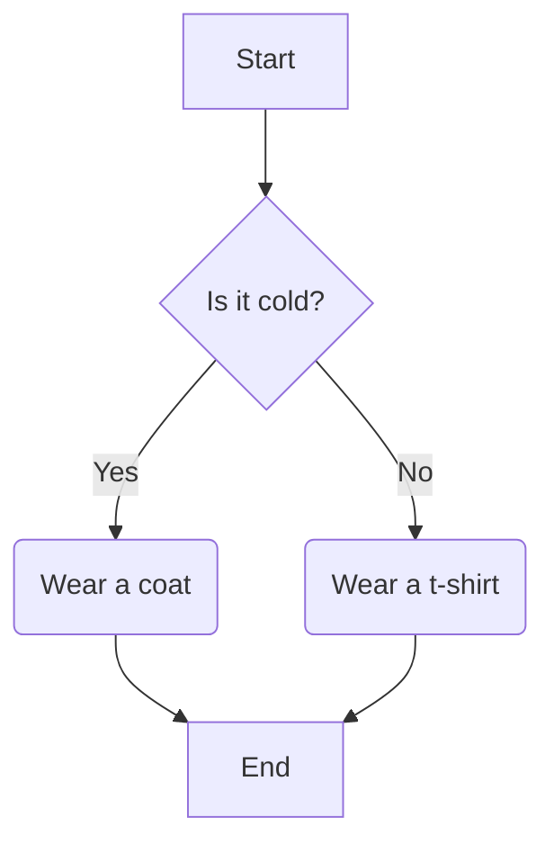
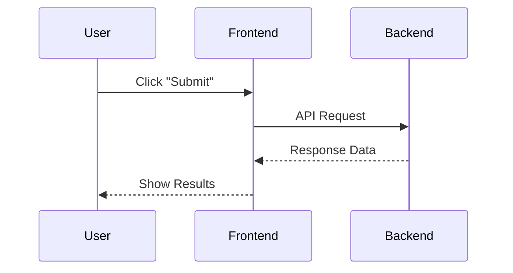
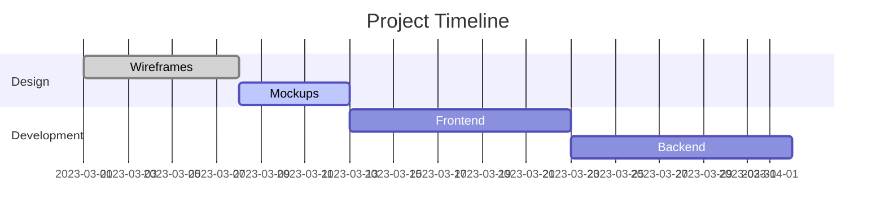
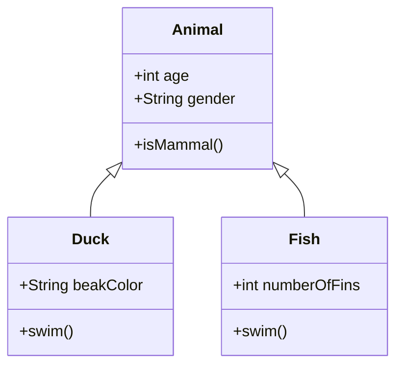

# What is Mermaid?

Mermaid is a simple markup language that lets you generate diagrams and flowcharts from text.

It's a fantastic tool for developers and technical writers because you can create complex visuals without needing a separate program.

The best part? GitHub can render Mermaid diagrams directly in your markdown files!

---

# Why Use Mermaid in GitHub?

- **Readability:** Visuals make complex ideas easier to understand than a wall of text.
- **Version Control:** The diagram's source code is just plain text. This means you can track changes to your diagrams using Git, just like you would with your code.
- **Efficiency:** No need to save and upload image files. The diagram is part of your markdown document.
- **Maintainability:** It's much easier to update a few lines of text than to re-draw a diagram.
---

# How to Create a Diagram

To create a Mermaid diagram, you simply use a fenced code block with the language specifier `mermaid`.

![[mermaidExample.png]]

Everything inside this block will be rendered as a diagram by GitHub.

---
# Flowcharts (Graph)

Flowcharts are great for showing processes and decision paths.

- `graph TD`: Declares a graph with Top-to-Down orientation. Other options include `LR` (Left-to-Right), `RL` (Right-to-Left), and `BT` (Bottom-to-Top).
- `A[Node A]`: Defines a node with text.
- `A-->B`: Creates a connection (edge) with a solid arrow.

```
graph TD
    start[Start] --> a{Is it cold?};
    a -- Yes --> b(Wear a coat);
    a -- No --> c(Wear a t-shirt);
    b --> end[End];
    c --> end;
```
--
# Rendered Flowchart




---
# Sequence Diagrams

Sequence diagrams illustrate how objects and components interact with each other over time.

- `sequenceDiagram`: Declares a sequence diagram.
- `participant A`: Defines a participant in the sequence.
- `A->>B: Message`: Creates a message from A to B.

```
sequenceDiagram
    participant User
    participant Frontend
    participant Backend
    User->>Frontend: Click "Submit"
    Frontend->>Backend: API Request
    Backend-->>Frontend: Response Data
    Frontend-->>User: Show Results
```

--

# Rendered Sequence Diagram



---
#  Gantt Charts

Gantt charts are useful for project management, showing tasks and their durations.

- `gantt`: Declares a Gantt chart.
- `title`: Sets the chart's title.
- `section`: Organises tasks into sections.
- `task :done, 1, 2023-01-01, 2023-01-10`: Defines a task.
    - `:done` or `:active` indicates the task's status.
    - The following numbers are the duration or start/end dates.

```
gantt
    title Project Timeline
    dateFormat  YYYY-MM-DD
    section Design
    Wireframes  :done, des1, 2023-03-01, 7d
    Mockups     :active, des2, 2023-03-08, 5d
    section Development
    Frontend    :dev1, 2023-03-13, 10d
    Backend     :dev2, 2023-03-23, 10d
```


--

# Rendered Gantt Chart



---
# Class Diagrams

Class diagrams model the structure of a system.
- `class MyClass`: Defines a class.
- `MyClass: +myAttribute: string`: Defines an attribute with its type.
- `MyClass --|> AnotherClass`: Shows inheritance (is a).

```
classDiagram
    class Animal
    Animal <|-- Duck
    Animal <|-- Fish
    Animal : +int age
    Animal : +String gender
    class Duck
    Duck : +String beakColor
    Duck : +swim()
    class Fish
    Fish : +int numberOfFins
    Fish : +swim()
```

note:
Class diagrams model a system by showing classes, their attributes, and relationships.

For example, a Duck is a type of animal. A Fish is a type of animal.
But both are different types of animals, and require some additional attributes.

--

# Rendered Class Diagram


---
# Tips and Best Practices

- **Start simple:** Don't try to draw your entire system at once. Focus on one small part.
- **Keep it clean:** Use simple node names and clear connections.
- **Use comments:** Just like code, you can add comments inside the `mermaid` block using `%%`.
- **Check the syntax:** A small typo can prevent the diagram from rendering. Use an online editor to test your syntax first.

---

# Setting up VS Code

To see your Mermaid diagrams render directly in Visual Studio Code, you'll need to install an extension. This saves you from having to push to GitHub just to see your changes.

1. Open the project in Visual Studio Code.
2. Go to the **Extensions** sidebar.
3. Search for `Markdown Preview Mermaid Support`.
4. Click **Install**.

Now, when you open a markdown file, you'll be able to see a live preview of your diagrams right in the editor.

---
# Further Reading

- **Mermaid Official Docs:** The official documentation is the best place to learn about all the different diagram types and their options.

https://mermaid.js.org/

Now you have the basics to start adding powerful visuals to your GitHub markdown!

---
# Questions?

If you have any questions, please ask!

![[contactDetails.png]]