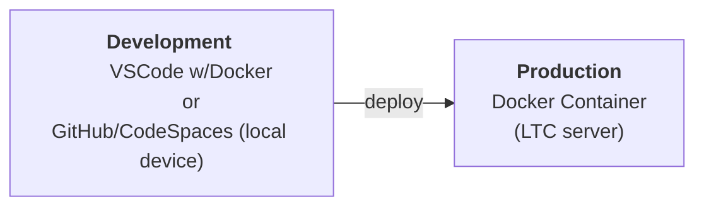

# Task Details

You are working in a simulated IT support role. Your task is to set up and manage a Docker-based server environment on a local machine.

Docker containers are lightweight and efficient, and they provide a consistent and portable way to run your websites. This means you can easily share your websites with others and deploy them on different platforms without worrying about compatibility issues.

# Development Environment Infrastructure

During the remainder of the course, you will be developing the sites on your local device and then deploying to the Production Server (Docker container) you develop during this task.

# Activity

Build a docker container using a `.devcontainer` file and related files within your GitHub repository (ICTICT213 2.5) (ICTICT223 1.1, 1.2) , which:

- Configures a PHP container (ICTICT213 2.1, 2.2)
- Updates the OS and installed software to the latest version (ICTICT213 3.1)
- Installs SQLite (ICTICT213 2.4, 2.5) (ICTICT223 1.3, 2.3, 3.1, 3.2, )
- Gives the ability to launches the website (`index.php `only) on the localhost on port 8080. (ICTICT213 2.3)

Confirm that all requirements are met prior to final submission. (ICTICT223 2.5, 3.3).

Commit task with the commit message "task 1 complete" (ICTICT223 3.5)

# Questions

Your assessor will ask you a number of questions:

1. What host operating system are you using, and why is it suitable for Docker? (ICTICT213 1.1)
2. What operating system is installed within the docker container? (ICTICT213 1.2, 1.3)
3. In this project, why use `.devcontainer` rather than the more robust Docker Compose to create multi-container applications?
4. Using Docker Desktop, how do you start, stop and restart containers? (ICTICT213 2.4)
5. How would you configure the container to be able to communicate with an Arduino device? (ICTICT213 1.4, 2.6, 3.3)
6. In this project, why use SQLite over more robust, comprehensive and industry-standard Database Management Systems such as MySQL? (ICTICT223 2.1, 2.2)

