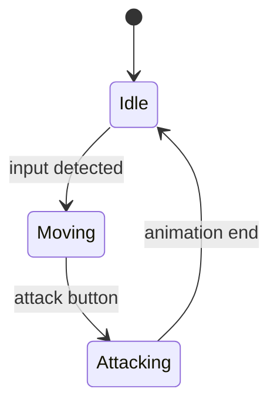
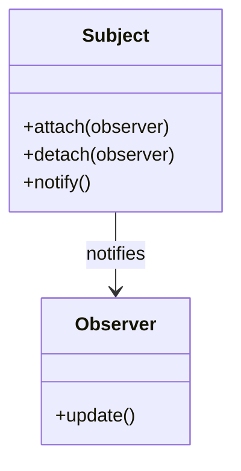
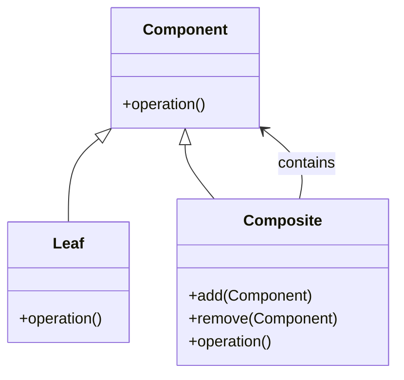

# 🎮 Design Patterns in Game Development

--- 

## 🧠 What Are Design Patterns?

- **Design patterns** are reusable solutions to common problems in software design.
- In game development, they help structure code for **clarity**, **efficiency**, and **scalability**.
- Think of them as **best practices** for solving recurring design challenges.

---

## 🕹️ Why Use Design Patterns in Games?

- Games are **complex systems** with many interacting parts.
- Patterns help manage:
    - Game states (menus, gameplay, pause)
    - Object behaviors (AI, input handling)
    - Resource management (audio, assets)

---

# 🧩 Pattern 1: Singleton


A singleton pattern ensures a class has only one instance and provides a global point of access to it.

## Purpose

Used to ensure a class has only one instance and provides a global point of access to it.


--

# 🧩 Pattern 1: Singleton
## ✅ Use Case:

- When you need **one global instance** of a class.
- Game settings manager (e.g., resolution, audio levels)
- Audio manager to control background music and sound effects
- Game state manager (e.g., pause, resume, save/load)

--
# 🧩 Pattern 1: Singleton
## 🧪 GDScript Example:

```gdscript
# GameManager.gd
extends Node
class_name GameManager

var score = 0

func add_score(points):
    score += points
```

```gdscript
# Autoload this script in Project Settings > AutoLoad
# Access it globally:
GameManager.add_score(10)
print(GameManager.score)
```

--
# 🧩 Pattern 1: Singleton
## 🧠 Benefits:

- Easy global access.
- Centralised control.


---

# 🧩 Pattern 2: Finite State Machine (FSM)

A finite state machine is a model with a limited number of states and transitions between them.

## Purpose

Used to model behaviour that changes based on internal state.

--

# 🧩 Pattern 2: Finite State Machine (FSM)

## ✅ Use Case:

- When an object has **distinct states** with different behaviors.
- Examples: Enemy AI (Idle, Patrol, Attack), Game States (Menu, Playing, Paused).
- Character behavior (idle, walking, jumping, attacking)
- Enemy AI states (patrolling, chasing, attacking)
- Game UI navigation (main menu, settings, pause menu)

--
# 🧩 Pattern 2: Finite State Machine (FSM)

## Structure





--
## 🧪 GDScript Example:

```gdscript
# Enemy.gd
extends Node

enum State { IDLE, PATROL, ATTACK }
var current_state = State.IDLE

func _process(delta):
    match current_state:
        State.IDLE:
            idle_behavior()
        State.PATROL:
            patrol_behavior()
        State.ATTACK:
            attack_behavior()

func idle_behavior():
    print("Idling...")

func patrol_behavior():
    print("Patrolling...")

func attack_behavior():
    print("Attacking!")
```

--
## 🧠 Benefits:

- Clear separation of behaviors.
- Easy to extend and debug.


---


# 🧩 Pattern 3: Observer


Defines a one-to-many relationship so that when one object changes state, all dependents are notified.

## Purpose

Used to decouple objects so that changes in one can automatically update others.

--

# 🧩 Pattern 3: Observer
## Structure




--

# 🧩 Pattern 3: Observer

## ✅ Use Case:

- When one object needs to **notify others** about changes.
- Examples: UI updates when player health changes, event systems.
-  Updating UI elements when player health or score changes
- Event systems (e.g., achievement unlocked, level completed)
- Inventory systems reacting to item pickups


--

## 🧪 GDScript Example:

```gdscript
# Subject.gd
extends Node
signal health_changed(new_health)

var health = 100

func take_damage(amount):
    health -= amount
    emit_signal("health_changed", health)
```

```gdscript
# UI.gd
extends Label

func _ready():
    get_node("/root/Player").connect("health_changed", self, "_on_health_changed")

func _on_health_changed(new_health):
    text = "Health: %d" % new_health
```


--

# 🧩 Pattern 3: Observer
## 🧠 Benefits:

- Decouples sender and receiver.
- Promotes modularity and reusability.

---

# 🧩 Pattern 4: Component


Allows treating individual objects and compositions of objects uniformly.

## Purpose

Used to build complex objects from simpler ones using composition.

--

## Structure




--

## ✅ Use Case:

- When you want to **compose behavior** using reusable parts.
- Examples: Adding movement, health, or AI to different entities.
- Game objects with multiple components (e.g., physics, rendering, input)
- UI elements composed of buttons, panels, and text
- Scene graphs for rendering hierarchies

--

## 🧪 GDScript Example:

```gdscript
# HealthComponent.gd
extends Node
class_name HealthComponent

var health = 100

func take_damage(amount):
    health -= amount
    if health <= 0:
        die()

func die():
    print("Entity died")
```

```gdscript
# Enemy.gd
extends Node

onready var health = $HealthComponent

func _ready():
    health.take_damage(20)
```
--

## 🧠 Benefits:

- Promotes **composition over inheritance**.
- Encourages **modular, reusable** code.

---

## 🧩 Pattern 5: Command


Encapsulates a request as an object, allowing for parameterisation and queuing.

## Purpose

Used to decouple the sender of a request from its receiver.


--

## ✅ Use Case:

- When you want to **encapsulate actions** as objects.
- Examples: Input handling, undo/redo systems, scripting.
-  Input handling (e.g., mapping keys to actions)
- Undo/redo systems (e.g., level editor)
- Scripting in cutscenes or tutorials

--
## 🧪 GDScript Example:

```gdscript
# Command.gd
extends Reference
class_name Command

func execute():
    pass
```

```gdscript
# MoveCommand.gd
extends Command

var actor
var direction

func _init(_actor, _direction):
    actor = _actor
    direction = _direction

func execute():
    actor.move(direction)
```

```gdscript
# InputHandler.gd
extends Node

func _input(event):
    if event.is_action_pressed("ui_right"):
        var cmd = MoveCommand.new(player, Vector2.RIGHT)
        cmd.execute()
```

--
## 🧠 Benefits:

- Decouples input from execution.
- Enables **undo**, **macro commands**, and **scripting**.

---

## 🧠 Summary (Extended)

|Pattern|Use Case| Pros                           |Cons|
|---|---|---|---|
|Singleton|Global access to one instance| Simple, centralised            |Tight coupling|
|FSM|Managing object/game states| Organised, scalable            |Can get complex|
|Observer|Notify multiple listeners| Decoupled, modular             |Harder to trace flow|
|Component|Reusable behaviors| Flexible, promotes composition |Can be overused|
|Command|Encapsulate actions| Decouples input, enables undo  |More boilerplate|
