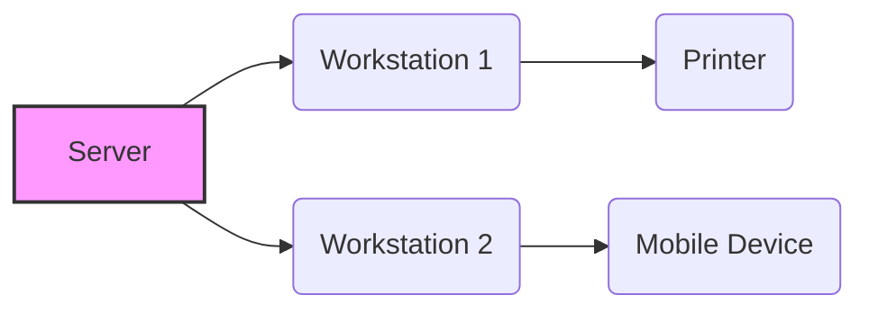
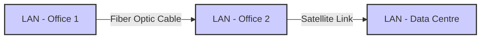
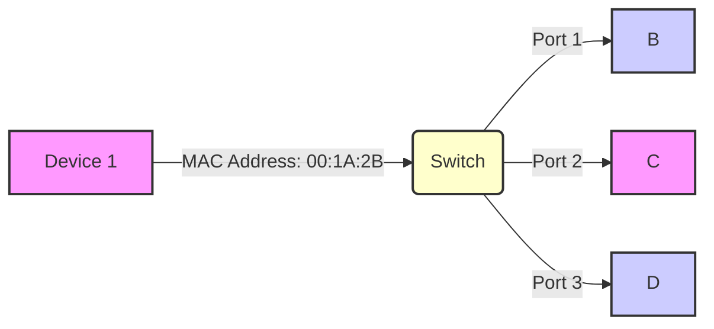
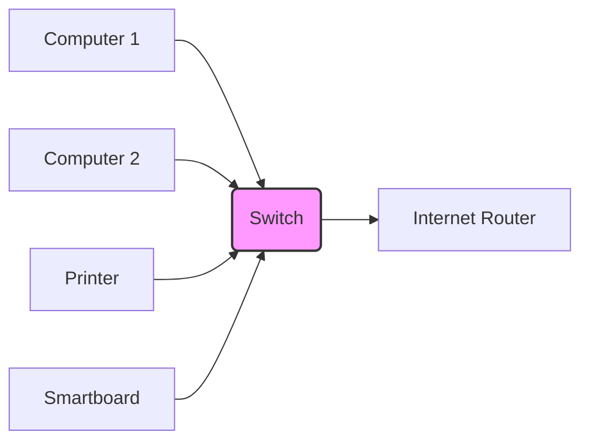

## Learning Objective

Students will be able to identify and describe the characteristics, advantages, and disadvantages of Bus, Star, and Mesh network topologies, and explain how these architectures combine to form the global infrastructure of the Internet using IP addressing and routing protocols.

# Network Topologies and the Architecture of the Internet

## Local Area Networks (LANs) vs. Wide Area Networks (WANs)

The distinction between Local Area Networks (LANs) and Wide Area Networks (WANs) is crucial for understanding network architecture and design. They represent fundamentally different approaches to connectivity, primarily differentiated by scale, speed, and geographical coverage.

### Local Area Networks (LANs)

A LAN is a network confined to a relatively small area, typically a single building, campus, or office.  They are the foundation of many home and business networks.

**Key Characteristics of LANs:**

*   **Scale:** Small geographical area (e.g., a single building).
*   **Technologies:** Primarily Ethernet and Wi-Fi.
*   **Speed:** High data transfer rates.
*   **Latency:** Low delay – crucial for real-time applications.
*   **Control:** Often centrally managed by a single organization.
*   **Cost:** Generally lower setup and maintenance costs compared to WANs.

**Visualisation - Network Topology**

### Wide Area Networks (WANs)

A WAN, in contrast, spans a much larger geographical area – cities, countries, or even globally.  They connect multiple LANs together.

**Key Characteristics of WANs:**

*   **Scale:** Large geographical area (e.g., across a country or the world).
*   **Technologies:** Fiber optics, satellite links, microwave transmission, and leased lines.
*   **Speed:** Generally lower data transfer rates than LANs due to distance and infrastructure complexity.
*   **Latency:** Higher delay – a significant factor in application performance.
*   **Complexity:**  More complex to manage and maintain.
*   **Cost:** Significantly higher setup and maintenance costs.

**Visualisation - WAN Architecture**

### Connecting LANs and WANs

WANs are often used to connect multiple LANs together.  This allows resources and data to be shared across geographically dispersed locations.  The Internet itself is the largest and most complex WAN.

**Key Differences Summarised:**

| Feature          | LAN                     | WAN                       |
|------------------|--------------------------|---------------------------|
| **Geographic Area** | Small (Building/Campus)   | Large (City/Country/Global)|
| **Speed**         | High                     | Lower                      |
| **Latency**       | Low                      | High                       |
| **Technology**    | Ethernet, Wi-Fi          | Fiber, Satellite, Leased Lines|
| **Management**    | Centralized              | Distributed               |

**Further Learning Resources:**

*   [Cisco Networking Academy - LANs and WANs](https://www.netacad.com/courses/lan-wan-fundamentals) (A comprehensive course covering LAN and WAN concepts)
*   [GeeksforGeeks - LAN vs WAN](https://www.geeksforgeeks.org/lan-vs-wan/) (A concise comparison of the two network types)

# Physical vs. Logical Topology

Before exploring network topologies, it’s crucial to differentiate between two key concepts:

*   **Physical Topology:** This refers to the tangible arrangement of hardware within a network – encompassing cabling, wireless access points, and the physical connections made via ports. It’s the *actual* physical layout.
*   **Logical Topology:** This describes the *virtual* path that data follows across the physical medium.  A network can be physically structured as a Star topology, but if data is broadcast to all nodes, it will functionally behave as a Bus topology. This illustrates how logical and physical topologies can differ, and highlights the importance of understanding both for effective network design and troubleshooting.”

## MAC Addresses: Physical Network Identifiers

In contrast to IP addresses, a MAC address (Media Access Control address) is a unique hardware identifier assigned to a network interface controller (NIC) – the physical network card – within a device.  It’s like a device’s serial number at the hardware level. MAC addresses are used for communication *within* a local network segment.

**Key Characteristics of MAC Addresses:**

*   **Physical Addressing:** MAC addresses are *physical* addresses, directly tied to the hardware.
*   **Unique Hardware ID:** Each NIC has a unique 48-bit MAC address, typically represented in hexadecimal format (e.g., `00:1A:2B:3C:4D:5E`).
*   **Layer 2 Addressing:** MAC addresses operate at the Data Link Layer (Layer 2) of the OSI model, dealing with physical transmission of data.

**How Switches Use MAC Addresses:**

Switches, particularly those used in Star topologies, rely heavily on MAC addresses for efficient data forwarding. When a switch receives a packet, it examines the destination MAC address.  Instead of broadcasting the packet to all connected ports (as a hub would), the switch consults its MAC address table to determine the port connected to the device with that specific MAC address and forwards the packet directly to that port. This significantly reduces network congestion and improves performance.

**Visualisation:**

**YouTube Video:** [MAC Address Explained](https://m.youtube.com/watch?v=Q-Q42zX-Q4U) - *This video clearly illustrates the role of MAC addresses in network communication.*

## Routers and Network Topologies

*   **Routers:** Routers use IP addresses to determine the best path for data packets to travel between different networks. They operate at the Network Layer (Layer 3) of the OSI model.
*   **Network Topologies:** The arrangement of devices in a network (e.g., Star, Bus, Ring, Mesh) impacts how data flows and the efficiency of the network. Star topologies, common in many networks, utilise switches to direct traffic based on MAC addresses.

# Common Network Architectures

## Bus Topology

In a Bus network, all nodes share a single central cable.

- **Technical Detail**: It uses **CSMA/CD** (Carrier Sense Multiple Access with Collision Detection). Computers "listen" to the line; if it's quiet, they send data. If two computers talk at once, a "collision" occurs, and they must wait a random amount of time to retry.
- **Pros**: Low cost and simple for small, temporary setups.
- **Cons**: No privacy (every node sees every packet) and a single point of failure (the backbone cable).

 
 

 <!-- Nodes --> 

 

 

 <!-- Packet --> 
IP Header
 
 
Animation: Data broadcasts down the backbone; only the matching IP accepts it.
 

️️
## Star Topology

The standard for modern schools and offices. Every device connects to a central **Switch**.

- **Technical Detail**: The switch maintains a **MAC Address Table**. When a packet arrives, the switch looks at the destination and flips a high-speed internal circuit to connect the sender's port directly to the receiver's port. This prevents collisions.
- **Pros**: Highly scalable and font-tolerant.
- **Cons**: Requires much more cabling than a Bus.

 
 <!-- Switch --> 
SW
 <!-- Nodes --> 

 

 

 <!-- Packet --> 
Dest: .10
 
 
Animation: The Switch routes the packet directly to the destination node via its port.
 

## Mesh Topology

**Network Architecture Overview: A Fully Meshed Topology**

This network architecture is based on a fundamental principle: each node is directly connected to every other node within the system – a configuration known as a fully meshed topology. This dense connectivity provides a highly resilient and adaptable network, offering significant advantages in terms of fault tolerance and performance.

**Technical Detail:**

The core of this design relies on sophisticated **Routing Protocols**. These protocols, such as OSPF (Open Shortest Path First) and BGP (Border Gateway Protocol), are responsible for dynamically determining the optimal paths for data transmission.  Upon detection of a link failure – whether caused by hardware malfunction, network congestion, or other disruptions – the routing protocols immediately trigger a recalculation of the network topology. Nodes then automatically communicate, exchanging information and identifying the next fastest path to their destination. This process, termed **Dynamic Routing**, ensures continuous connectivity and allows the network to adapt in real-time. The system prioritises speed and efficiency by constantly responding to changing network conditions.  Furthermore, the use of sophisticated algorithms within these protocols allows for efficient bandwidth allocation.

**Advantages (Pros):**

*   **Unparalleled Redundancy:** The inherent interconnectedness and dynamic routing capabilities provide exceptional redundancy. The network can withstand multiple simultaneous failures without significant disruption to service. Data automatically reroutes through alternative paths, guaranteeing continued operation and minimising service interruption.
*   **Rapid Failure Recovery:** Dynamic routing protocols enable extremely fast response times when a link fails. The network effectively ‘self-heals’, minimising downtime and maintaining service availability.
*   **Scalability Potential (with Considerations):** While inherently complex, this design *can* be scaled by adding more nodes. The routing protocols will adapt to the expanded network; however, careful planning and monitoring are crucial to manage complexity effectively.

**Disadvantages (Cons):**

*   **Substantially High Cost:** The extensive cabling and associated hardware required to achieve full node-to-node connectivity result in a significantly higher initial investment compared to alternative network designs.  The cost of deployment and ongoing maintenance will be considerably elevated.
*   **Complex Configuration and Management:** Managing and configuring the numerous routing protocols, ensuring optimal performance, and troubleshooting potential issues demands a highly skilled and experienced network engineering team. The complexity increases exponentially with the number of nodes, requiring robust monitoring and management tools.
*   **Risk of Routing Loops:** Without meticulous design, rigorous testing, and continuous monitoring, dynamic routing can sometimes lead to routing loops – where data packets endlessly circulate within the network. This can severely degrade performance and requires sophisticated loop detection and prevention mechanisms.

 
 <!-- Connections --> <svg style="position: absolute; width: 100%; height: 100%;"> <line x1="15%" y1="80%" x2="85%" y2="20%" stroke="#444" stroke-width="2" /> <line x1="15%" y1="80%" x2="85%" y2="80%" stroke="#444" stroke-width="2" /> <line x1="85%" y1="20%" x2="85%" y2="80%" stroke="#444" stroke-width="2" /> <!-- Broken link indicator --> <text x="50%" y="45%" fill="#e74c3c" font-size="20" font-weight="bold">X</text> </svg> <!-- Nodes --> 

 

 

 <!-- Packet --> 

 
 
Animation: Dynamic Routing reroutes data through an alternative node when a primary link fails.
 

# The Internet: A Network of Networks

The Internet is a **Hybrid Mesh**. It functions through a hierarchy:

1. **Tier 3 (Local)**: Your home/school **Star** network.
2. **Tier 2 (Regional)**: Your ISP connects multiple local networks.
3. **Tier 1 (Backbone)**: Massive fiber-optic cables spanning oceans, connected in a **Partial Mesh**.

If an IP address is outside your local network (e.g., `8.8.8.8`), your router sends it to the ISP, which passes it through the Mesh until it reaches the destination.

 
 <!-- Visual Layers --> 
Local (Star)
 
ISP (Regional)
 
Backbone (Mesh)
 <!-- Nodes --> 

 

 

 <!-- Connectivity Lines --> <svg style="position: absolute; width: 100%; height: 100%; opacity: 0.3;"> <line x1="10%" y1="80%" x2="45%" y2="50%" stroke="white" /> <line x1="45%" y1="50%" x2="90%" y2="20%" stroke="white" /> </svg> <!-- Hybrid Packet --> 

 
 
Animation: A packet traversing the hierarchy from a local Star network to the global Mesh backbone.
 

## Summary Checklist

- Can you explain the difference between a Physical and Logical topology?
- What is the role of an IP Address in a packet header?
- Why is a Switch better than a Hub in a Star topology? (Hint: MAC addresses and collisions).
- How does the Internet's Mesh structure prevent a global outage if one cable breaks?
- What protocol does a Bus network use to handle two computers talking at once? (CSMA/CD).
