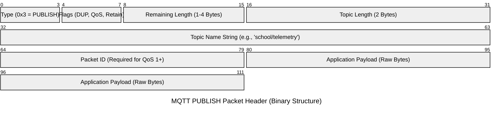
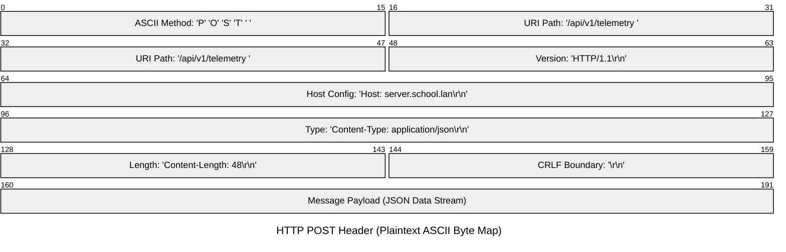

For a student analysing network traffic in Wireshark, understanding how packet headers are structured is critical. This guide breaks down the structural design of **MQTT (Message Queuing Telemetry Transport)** and **HTTP (Hypertext Transfer Protocol)**, illustrating why MQTT is the preferred standard for constrained edge devices like the ESP32, while HTTP remains the backbone of web-based environments.

## 1. MQTT Packet Architecture (Binary Design)

MQTT is a **binary-based protocol**. It compiles commands and flags into individual bits and bytes rather than readable text strings. This design choice minimises packet overhead, reducing the strain on microcontrollers and narrow bandwidth networks.

An MQTT packet is structured into three main sections:

1. **Fixed Header** (Mandatory, always present)
    
2. **Variable Header** (Optional, depends on the packet type)
    
3. **Payload** (Optional, contains the actual sensor data)
    

### MQTT PUBLISH Packet Structure

Using a standard bit-level visualisation (where each row represents 32 bits / 4 bytes), we can map out how compact an MQTT PUBLISH header is:



### Analysis of the MQTT Byte Stream

In Wireshark, a standard unencrypted MQTT connection publishing temperature data to `school/telemetry` looks remarkably compact:

- **Fixed Header (**$2$ **Bytes):**
    
    - The first byte specifies the MQTT control packet type (e.g., `0x3` represents `PUBLISH`) and control flags (DUP, QoS, and Retain).
        
    - The second byte represents the _Remaining Length_ field, utilising a variable-length byte encoding scheme that can scale up to $4$ bytes if needed.
        
- **Variable Header:** Specifies the topic path. Because the broker needs to route the message, the topic is transmitted as a UTF-8 string preceded by a $2$-byte length indicator.
    
- **Payload:** The raw application payload (often a compact JSON string like `{"t":24.5}`).
    

Because the headers can be as small as $2$ bytes, the overhead is extremely low.

## 2. HTTP Packet Architecture (Textual Design)

Unlike MQTT, HTTP is a **textual (ASCII-based) protocol**. It is designed to be easily read by humans and parsed by robust web servers. However, this human-readability comes at a severe cost: high packet overhead.

An HTTP POST request consists of:

1. **Request Line** (Method, URI, Protocol Version)
    
2. **HTTP Headers** (Metadata key-value pairs, terminated by `\r\n` newlines)
    
3. **Empty Line** (A single `\r\n` character sequence separating headers from body)
    
4. **Message Body** (The actual payload/JSON)
    

### HTTP POST Request Packet Structure

Because HTTP is a stream of text characters, every letter consumes a full byte (8 bits). Let's visualise how the starting blocks of an HTTP packet fill up sequential byte structures compared to the binary efficiency of MQTT:



### Analysis of the HTTP Byte Stream

An HTTP request cannot transmit a payload without sending a massive block of plaintext headers first. In Wireshark, this looks like:

```
POST /api/v1/telemetry HTTP/1.1\r\n
Host: server.school.lan\r\n
Content-Type: application/json\r\n
Content-Length: 48\r\n
User-Agent: ESP32-HTTP-Client\r\n
Connection: keep-alive\r\n
\r\n
{"device_id":"ESP32","temperature":24.5}

```

Every letter, space, and newline in the header block consumes $1$ byte of data. An HTTP packet routinely carries between $200$ and $800$ bytes of header overhead just to transmit a $40$-byte sensor payload.

## 3. Protocol Comparison

When evaluating these protocols for an IoT system, we can mathematically express the network overhead using the **Header Overhead Ratio (**$R_o$**)**:

$$R_o = \frac{\text{Header Size (bytes)}}{\text{Total Packet Size (bytes)}} \times 100$$

On low-powered edge devices, keeping $R_o$ as low as possible reduces radio frequency transmission time, saving processing cycles and battery life.

| **Feature** | **MQTT (Message Queuing Telemetry Transport)** | **HTTP (Hypertext Transfer Protocol)** |

| **Data Format** | Binary (Compact, byte-aligned structure) | Plaintext ASCII (Verbosity-oriented structure) |

| **Minimum Overhead** | $2$ **Bytes** (Fixed Header) | $>200$ **Bytes** (Headers depend heavily on path & browser metadata) |

| **Connection Model** | **Persistent (Stateful):** A single TCP socket connection is kept open via periodic PING requests. | **Transactional (Stateless):** Client opens a TCP connection, sends a request, receives a response, and closes (typically). |

| **Messaging Paradigm** | **Publish/Subscribe:** One-to-many. Multiple clients can receive the same sensor reading. | **Request/Response:** One-to-one client-server communication. |

| **Quality of Service** | Built-in QoS levels ($0$ = At most once, $1$ = At least once, $2$ = Exactly once) | No native QoS. Must be implemented at the application layer. |

| **Power Consumption** | Extremely low. Ideal for battery-powered ESP32 nodes. | Moderate to high due to connection setup/teardown and long payload processing. |

| **Network Interface** | Uses TCP Port $1883$ (unencrypted) or $8883$ (MQTTS). | Uses TCP Port $80$ (unencrypted) or $443$ (HTTPS). |

## 4. Key Classroom Takeaway

For your student projects:

1. **The ESP32 Edge Device** should use **MQTT** to publish readings. Because it operates on a restricted Wi-Fi loop and has small physical memory allocations, transmitting binary MQTT packets ensures maximum reliability.
    
2. **The Local PHP Web Application** is highly transactional. It uses **HTTP** to query the centralised database and render dashboard widgets dynamically in a web browser.