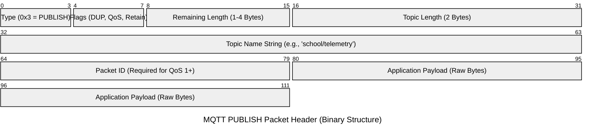
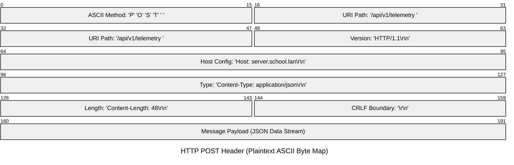

# MQTT vs HTTP

## Packet Architectures in IoT

---

## Core Network Architectures

- MQTT uses binary-aligned bit blocks.
    
- HTTP relies on plaintext ASCII.
    
- Binary design minimises network overhead.
    
- Textual design prioritises human readability.
    
- Microcontrollers struggle parsing long strings.
    
- Web servers handle text easily.
    
---
## MQTT Fixed Header

- Mandatory header consumes $2$ bytes.
    
- First byte defines packet type.
    
- Flags specify QoS and retain.
    
- Second byte encodes remaining length.
    
- Variable length extends to $4$ bytes.
    
- Binary structures scale dynamically.
    
---
## MQTT Packet Layout

- Fixed header is always present.
    
- Variable header contains topic string.
    
- Payload holds raw sensor telemetry.
    
- Topic names require UTF-8 encoding.
    
- Packet ID tracks delivery states.
    
- JSON payloads fit inside directly.
    
--
## MQTT PUBLISH Structure

---
## HTTP Request Structure

- Request line defines the method.
    
- ASCII headers store key-value pairs.
    
- Carriage returns terminate every line.
    
- Empty line separates metadata body.
    
- Message body contains application payload.
    
- Every character consumes $1$ byte.
    
--
## HTTP Overhead Bloat

- Textual metadata creates substantial bloat.
    
- Headers span $200$ to $800$ bytes.
    
- Payloads are frequently only $40$ bytes.
    
- Unused user-agent strings are transmitted.
    
- Keep-alive connections add extra bytes.
    
- Extremely inefficient for edge devices.
    
--
## HTTP POST Byte Map

---
## Network Efficiency Formula

$$R_o = \frac{\text{Header Size}}{\text{Total Size}} \times 100$$

- Lower ratios preserve battery life.
    
- Higher ratios drain physical power.
    
- Overhead dictates radio transmission times.
    
- Optimisation reduces packet transmission costs.
    
---
## Comparison: Data Format

- MQTT utilises strict binary alignments.
    
- HTTP processes standard plaintext structures.
    
- MQTT minimum overhead is $2$ bytes.
    
- HTTP minimum overhead exceeds $200$ bytes.
    
- Binary ensures highly compact footprints.
    
- Text guarantees complete human readability.
    
---
## Comparison: Network Session

- MQTT maintains persistent stateful sessions.
    
- HTTP relies on transactional handshakes.
    
- MQTT utilises lightweight keep-alive pings.
    
- HTTP rebuilds TCP tunnels continuously.
    
- Stateful sessions reduce connection latency.
    
- Stateless designs increase network load.
    
---
## Comparison: Messaging Pattern

- MQTT employs Publish/Subscribe topology.
    
- HTTP operates on Request/Response.
    
- MQTT supports decoupling multiple subscribers.
    
- HTTP executes strict point-to-point requests.
    
- One-to-many communication suits distributed systems.
    
- One-to-one models fit static web.
    
---
## Comparison: Quality of Service

- MQTT guarantees three QoS levels.
    
- HTTP lacks native QoS protocols.
    
- Level $0$ delivers at most once.
    
- Level $1$ guarantees at least once.
    
- Level $2$ ensures exactly once delivery.
    
- HTTP requires manual application verification.
    
---
## Classroom Deployment Plan

- ESP32 hardware executes MQTT publishing.
    
- Local PHP services process HTTP.
    
- Edge devices bypass heavy frameworks.
    
- Web servers easily parse JSON.
    
- Deploy MQTT over local subnets.
    
- Render dashboards inside web browsers.
    

---

# Questions?

If you have any questions, please ask!

![[contactDetails.png]]