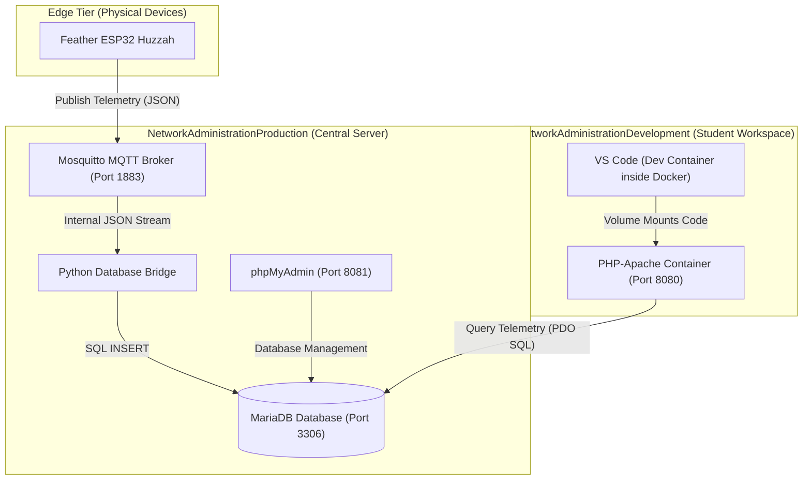

# **Technical Setup Guide: IoT Network Administration Infrastructure**

This document provides the technical specifications, directory structures, and exact configuration files required to deploy the infrastructure for the "Network Administration and Security" unit.

The system is split into two environments:

1. **NetworkAdministrationProduction**: The centralised server infrastructure hosting the database, administration panel, MQTT broker, and a custom data ingestion bridge.  
2. **NetworkAdministrationDevelopment**: The isolated student workspace containing a containerised PHP Apache application pre-configured to interface with VS Code Dev Containers.

## **Architecture Overview**



* **The Edge:** ESP32 hardware units publish sensor readings as structured JSON messages over local Wi-Fi to the central server.  
* **The Server:** The MQTT broker processes incoming packets, a Python script routes them directly to a MariaDB database, and phpMyAdmin is available for database administrative tasks.  
* **The Workspace:** Students run an isolated Apache/PHP container on their local laptop via VS Code Dev Containers. Their application connects directly to the centralised server over the network to query and display telemetry.

## **1\. Central Server Setup (NetworkAdministrationProduction)**

This environment is designed to run on a shared classroom server or a dedicated host machine within the school subnet (e.g., static IP 192.168.1.100). Managing this stack through a Dev Container allows teachers to debug Python routing logic or database queries easily.

### **Directory Layout**

Create the following directory layout on your target host server:

```
NetworkAdministrationProduction/  
├── .devcontainer/  
│   └── devcontainer.json  
├── docker-compose.yml  
├── mosquitto/  
│   └── config/  
│       └── mosquitto.conf  
└── bridge/  
    ├── Dockerfile  
    ├── requirements.txt  
    └── bridge.py
```
### **Production VS Code Dev Container (.devcontainer/devcontainer.json)**

This configuration allows administrators to attach VS Code directly to the Python telemetry bridge service. This enables real-time syntax checking, interactive library development, and live execution testing of the bridge script.

```
{
    "name": "Network Administration Production Server",
    "dockerComposeFile": [
        "../docker-compose.yml"
    ],
    "service": "mqtt_db_bridge",
    "workspaceFolder": "/app",
    "customizations": {
        "vscode": {
            "settings": {
                "python.defaultInterpreterPath": "/usr/local/bin/python",
                "editor.formatOnSave": true
            },
            "extensions": [
                "ms-python.python",
                "ms-python.vscode-pylance"
            ]
        }
    },
    "shutdownAction": "stopCompose"
}
```

### **Production docker-compose.yml**

This file orchestrates the storage, management, message broker, and routing systems. Note that the ./bridge volume mount is added to facilitate live script editing via VS Code.

```
services:
  database:
    image: mariadb:10.11
    container_name: production_mariadb
    restart: always
    environment:
      MARIADB_ROOT_PASSWORD: RootSecurePassword123!
      MARIADB_DATABASE: telemetry_db
      MARIADB_USER: student_user
      MARIADB_PASSWORD: Password123!
    ports:
      - "3306:3306"
    volumes:
      - db_data:/var/lib/mysql
    networks:
      - iot_net

  phpmyadmin:
    image: phpmyadmin:5.2
    container_name: production_phpmyadmin
    restart: always
    ports:
      - "8081:80"
    environment:
      PMA_HOST: database
      UPLOAD_LIMIT: 300M
    depends_on:
      - database
    networks:
      - iot_net

  mqtt_broker:
    image: eclipse-mosquitto:2.0
    container_name: production_mosquitto
    restart: always
    ports:
      - "1883:1883"
    volumes:
      - ./mosquitto/config/mosquitto.conf:/mosquitto/config/mosquitto.conf
    networks:
      - iot_net

  mqtt_db_bridge:
    build: ./bridge
    container_name: production_mqtt_bridge
    restart: always
    environment:
      MQTT_BROKER: mqtt_broker
      MQTT_PORT: 1883
      MQTT_TOPIC: "school/telemetry/#"
      DB_HOST: database
      DB_USER: student_user
      DB_PASSWORD: Password123!
      DB_NAME: telemetry_db
    depends_on:
      - database
      - mqtt_broker
    volumes:
      - ./bridge:/app
    networks:
      - iot_net

volumes:
  db_data:

networks:
  iot_net:
    driver: bridge
```

### **Mosquitto Configuration (mosquitto/config/mosquitto.conf)**

Configure Mosquitto to allow local, unauthenticated traffic inside the school lab network. (This will be hardened to use password file authentication in Phase 3 of the project plan).

```
listener 1883 0.0.0.0  
allow_anonymous true  
persistence false  
log_dest stdout**
```

### **Python Database Bridge Configuration**

The bridge service subscribes to the MQTT broker, decodes incoming JSON payloads published by the ESP32 units, and writes the structured records directly into the centralised MariaDB database.

#### **bridge/requirements.txt**

```
paho-mqtt\>=1.6.1  
pymysql\>=1.0.2
```

#### **bridge/Dockerfile**

```Dockerfile
FROM python:3.11-slim

WORKDIR /app

COPY requirements.txt .
RUN pip install --no-cache-dir -r requirements.txt

COPY bridge.py .

CMD ["python", "-u", "bridge.py"]
```

#### **bridge/bridge.py**

This script contains robust logic to pre-configure database structures dynamically on launch if they do not yet exist.

```
import os
import json
import time
import paho.mqtt.client as mqtt
import pymysql

# Load configuration parameters from environment variables
MQTT_BROKER = os.getenv("MQTT_BROKER", "localhost")
MQTT_PORT = int(os.getenv("MQTT_PORT", 1883))
MQTT_TOPIC = os.getenv("MQTT_TOPIC", "school/telemetry/#")
DB_HOST = os.getenv("DB_HOST", "localhost")
DB_USER = os.getenv("DB_USER", "root")
DB_PASSWORD = os.getenv("DB_PASSWORD", "")
DB_NAME = os.getenv("DB_NAME", "telemetry_db")

def get_db_connection():
    """Attempts to establish a stable database connection with retries."""
    while True:
        try:
            conn = pymysql.connect(
                host=DB_HOST,
                user=DB_USER,
                password=DB_PASSWORD,
                database=DB_NAME,
                autocommit=True
            )
            return conn
        except pymysql.MySQLError as e:
            print(f"[DB] Waiting for database connection... Error: {e}")
            time.sleep(3)

def init_db():
    """Initialises the telemetry table structure if it is absent."""
    conn = get_db_connection()
    try:
        with conn.cursor() as cursor:
            # Create a telemetry table tracking device parameters
            cursor.execute("""
                CREATE TABLE IF NOT EXISTS sensor_readings (
                    id INT AUTO_INCREMENT PRIMARY KEY,
                    device_id VARCHAR(50) NOT NULL,
                    sequence INT NOT NULL,
                    temperature FLOAT NOT NULL,
                    humidity FLOAT NOT NULL,
                    received_at TIMESTAMP DEFAULT CURRENT_TIMESTAMP
                )
            """)
            print("[DB] Telemetry table schema verified successfully.")
    finally:
        conn.close()

def on_connect(client, userdata, flags, rc):
    print(f"[MQTT] Connected to MQTT Broker with result code: {rc}")
    client.subscribe(MQTT_TOPIC)
    print(f"[MQTT] Successfully subscribed to topic filter: {MQTT_TOPIC}")

def on_message(client, userdata, msg):
    try:
        # Decode incoming payload string
        payload_str = msg.payload.decode("utf-8")
        print(f"[MQTT] Raw Packet received on {msg.topic}: {payload_str}")
        
        # Parse payload as valid JSON
        data = json.loads(payload_str)
        
        # Extrapolate keys
        device_id = data.get("device_id")
        sequence = int(data.get("sequence", 0))
        temperature = float(data.get("temperature"))
        humidity = float(data.get("humidity"))
        
        # Insert statement
        conn = get_db_connection()
        try:
            with conn.cursor() as cursor:
                sql = """
                    INSERT INTO sensor_readings (device_id, sequence, temperature, humidity) 
                    VALUES (%s, %s, %s, %s)
                """
                cursor.execute(sql, (device_id, sequence, temperature, humidity))
                print(f"[DB] Inserted record successfully from {device_id}")
        except pymysql.MySQLError as db_err:
            print(f"[DB] Execution failure during query insertion: {db_err}")
        finally:
            conn.close()
            
    except (json.JSONDecodeError, ValueError, TypeError) as parse_err:
        print(f"[ERROR] Discarded non-conforming packet payload: {parse_err}")
    except Exception as general_err:
        print(f"[ERROR] Unhandled ingestion error: {general_err}")

# Setup core execution routines
if __name__ == "__main__":
    time.sleep(5)  # Let database port open completely
    init_db()
    
    mqtt_client = mqtt.Client()
    mqtt_client.on_connect = on_connect
    mqtt_client.on_message = on_message
    
    try:
        mqtt_client.connect(MQTT_BROKER, MQTT_PORT, 60)
        mqtt_client.loop_forever()
    except Exception as e:
        print(f"[MQTT] Fatal error during client connection: {e}")

```
## **2\. Student Development Workspace (NetworkAdministrationDevelopment)**

Each student workspace functions as an isolated, containerised PHP website that mounts the student's development directory directly into the active server path.

### **Directory Layout**

Deploy this structure inside the template Git repository distributed to students:

```
NetworkAdministrationDevelopment/  
├── .devcontainer/  
│   └── devcontainer.json  
├── docker-compose.yml  
├── Dockerfile  
└── src/  
    └── index.php
```

### **VS Code Dev Containers Configuration (.devcontainer/devcontainer.json)**

Allows students to run and develop inside their containerised workspace using VS Code.

```
{
    "name": "Scarif PHP Development Environment",
    "dockerComposeFile": [
        "../docker-compose.yml"
    ],
    "service": "web",
    "workspaceFolder": "/var/www/html",
    "customizations": {
        "vscode": {
            "settings": {
                "php.validate.executablePath": "/usr/local/bin/php",
                "editor.formatOnSave": true
            },
            "extensions": [
                "bmewburn.vscode-intelephense-client",
                "xdebug.php-debug",
                "eamodio.gitlens"
            ]
        }
    },
    "shutdownAction": "stopCompose"
}
```

### **Student Workspace Dockerfile**

Installs necessary database drivers enabling the PHP application to interface with the remote MariaDB server using PHP Data Objects (PDO).

```Dockerfile
FROM php:8.2-apache

# Install and configure missing system database dependencies
RUN apt-get update && apt-get install -y \
    libpq-dev \
    && docker-php-ext-install pdo pdo_mysql \
    && apt-get clean && rm -rf /var/lib/apt/lists/*

# Enforce system module configurations
RUN a2enmod rewrite

# Setup appropriate document permissions
WORKDIR /var/www/html
```

### **Student Workspace docker-compose.yml**

Spins up the Apache instance and mounts the local code directories.

```
services:
  web:
    build: .
    container_name: student_php_dev
    ports:
      - "8080:80"
    volumes:
      - ./src:/var/www/html
    environment:
      # Direct connections over the network to the central server
      # Instruct students to adjust this to the teacher's static classroom server IP
      - DB_HOST=192.168.1.100
      - DB_PORT=3306
      - DB_NAME=telemetry_db
      - DB_USER=student_user
      - DB_PASSWORD=Password123!
    restart: unless-stopped
```

### **Student Landing File (src/index.php)**

A functional, foundational PHP template script allowing students to verify active connections to the centralised database and output table rows to their browser.
```php
<?php
// Extrapolate environment configurations assigned via Docker Compose
$host = getenv('DB_HOST') ?: 'localhost';
$port = getenv('DB_PORT') ?: '3306';
$db   = getenv('DB_NAME') ?: 'telemetry_db';
$user = getenv('DB_USER') ?: 'student_user';
$pass = getenv('DB_PASSWORD') ?: 'Password123!';
$charset = 'utf8mb4';

$dsn = "mysql:host=$host;port=$port;dbname=$db;charset=$charset";
$options = [
    PDO::ATTR_ERRMODE            => PDO::ERRMODE_EXCEPTION,
    PDO::ATTR_DEFAULT_FETCH_MODE => PDO::FETCH_ASSOC,
    PDO::ATTR_EMULATE_PREPARES   => false,
];

$connected = false;
$errorMsg = "";
$readings = [];

try {
    // Attempt PDO connection configuration
    $pdo = new PDO($dsn, $user, $pass, $options);
    $connected = true;

    // Fetch the 10 most recent telemetry records
    $stmt = $pdo->query("SELECT * FROM sensor_readings ORDER BY received_at DESC LIMIT 10");
    $readings = $stmt->fetchAll();

} catch (\PDOException $e) {
    $errorMsg = $e->getMessage();
}
?>
<!DOCTYPE html>
<html lang="en">
<head>
    <meta charset="UTF-8">
    <title>IoT Live Telemetry Dashboard</title>
    <style>
        body { font-family: -apple-system, BlinkMacSystemFont, "Segoe UI", Roboto, sans-serif; background: #f4f6f9; color: #333; margin: 40px; }
        .container { max-width: 900px; margin: 0 auto; background: white; padding: 30px; border-radius: 8px; box-shadow: 0 4px 6px rgba(0,0,0,0.1); }
        h1 { color: #2c3e50; border-bottom: 2px solid #ecf0f1; padding-bottom: 15px; }
        .status { padding: 15px; border-radius: 6px; margin-bottom: 20px; font-weight: bold; }
        .status.success { background-color: #d4edda; color: #155724; border: 1px solid #c3e6cb; }
        .status.danger { background-color: #f8d7da; color: #721c24; border: 1px solid #f5c6cb; }
        table { width: 100%; border-collapse: collapse; margin-top: 20px; }
        th, td { padding: 12px; text-align: left; border-bottom: 1px solid #ddd; }
        th { background-color: #f8f9fa; color: #2c3e50; }
        tr:hover { background-color: #f1f1f1; }
    </style>
</head>
<body>
<div class="container">
    <h1>Live Telemetry Dashboard</h1>
    
    <!-- Connectivity Diagnostics Display -->
    <?php if ($connected): ?>
        <div class="status success">
            ✓ Successfully connected to Centralised Database on host: <?= htmlspecialchars($host) ?>
        </div>
    <?php else: ?>
        <div class="status danger">
            ✗ Database Connection Failed!<br>
            <small>Error: <?= htmlspecialchars($errorMsg) ?></small>
        </div>
    <?php endif; ?>

    <h2>Recent Sensor Readings</h2>
    <?php if (empty($readings)): ?>
        <p>No telemetry data found in the database. Ensure the ESP32 is actively publishing data.</p>
    <?php else: ?>
        <table>
            <thead>
                <tr>
                    <th>ID</th>
                    <th>Device ID</th>
                    <th>Sequence</th>
                    <th>Temperature (°C)</th>
                    <th>Humidity (%)</th>
                    <th>Received At</th>
                </tr>
            </thead>
            <tbody>
                <?php foreach ($readings as $row): ?>
                    <tr>
                        <td><?= htmlspecialchars($row['id']) ?></td>
                        <td><?= htmlspecialchars($row['device_id']) ?></td>
                        <td><?= htmlspecialchars($row['sequence']) ?></td>
                        <td><?= htmlspecialchars(number_format($row['temperature'], 1)) ?></td>
                        <td><?= htmlspecialchars(number_format($row['humidity'], 1)) ?></td>
                        <td><?= htmlspecialchars($row['received_at']) ?></td>
                    </tr>
                <?php endforeach; ?>
            </tbody>
        </table>
    <?php endif; ?>
</div>
</body>
</html>

```