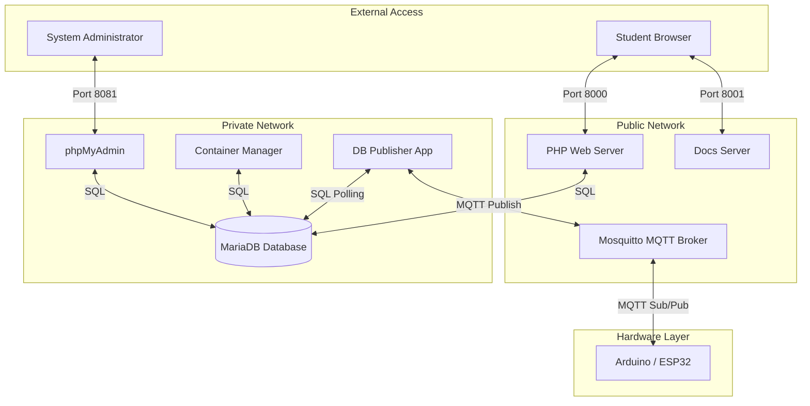

# High Level Recap

This is a complex project and has many different technologies integrated together.

The technologies involved with data being transferred throughout the system are:

- Arduino language 
- MQTT
- LORA Communication
- Wifi Communication
- MySQL
- PHP
- Web server technologies
- Docker containers

There is also various amounts of cyber security techniques and technologies to be implemented in the challenges.

# CyberCity CTF Infrastructure: Service & Integration Guide

This Docker Compose file sets up a multi-layered "Capture The Flag" (CTF) environment. It uses **containerisation** to isolate different parts of the system, ensuring that if one part is "hacked" or fails, the rest of the system stays secure and stable.

# The Core Services (The Servers)

| Service Name               | Technology        | Port     | Role / Purpose                                                                                 |
| -------------------------- | ----------------- | -------- | ---------------------------------------------------------------------------------------------- |
| **Web Front-end (`php`)**  | PHP 8.2 & Apache  | 8000     | The face of the application. Displays the game interface and challenge descriptions.           |
| **Database (`mysql`)**     | MariaDB           | Internal | The "brain" of the operation. Stores user scores, challenge data, and city status.             |
| **phpMyAdmin**             | Web UI for MySQL  | 8081     | A management tool for admins to view and edit database tables without writing raw SQL.         |
| **Mosquitto**              | MQTT Broker       | 1883     | An IoT messaging protocol. Handles "live" updates for virtual city elements like streetlights. |
| **db_publisher**           | Python/Node App   | Internal | Custom logic that bridges the database and the live city.                                      |
| **container_manager**      | Custom Management | Internal | Orchestrates the environment by starting or stopping other Docker containers.                  |
| **Documentation (`docs`)** | Docsify / Node    | 8001     | Knowledge base hosting the infrastructure guide and student cheatsheets.                       |

# Integration & Connectivity

### System Integration Map

The following diagram shows how the services are physically and logically grouped. This "Architecture Diagram" illustrates how the different layers (Web, Logic, Data, and Hardware) connect through the virtual networks.

## The Two-Network System

The setup uses two distinct virtual networks to implement a "Security in Depth" strategy:

1. **Public Network:** Only the services that need to be seen by the outside world (Website, MQTT, Docs) are here.
2. **Private Network:** The database and backend logic live here. This prevents a random person on the internet from connecting directly to your database.

# Development Workflow

To ensure a consistent experience for all students, we use **VS Code Dev Containers**:

1. **Environment Isolation**: The primary VS Code window runs "Inside the Container," meaning all PHP and SQL extensions are pre-configured.
2. **Parallel Access**: A second VS Code window is opened to the local folder (not in a container) to allow students to read documentation and manage local files while the server is running.

# Arduino & IoT Integration

The Mosquitto broker allows physical or simulated Arduino devices to interact with your server:

- **Reading Data (Subscribing):** An Arduino can listen to a topic like `city/lights`. When the database changes, `db_publisher` sends a message to Mosquitto, which then "pushes" it to the Arduino to turn on a physical LED.
- **Updating Data (Publishing):** If an Arduino sensor detects "motion" in the physical city, it sends an MQTT message to the broker. The backend services listen for this message and update the MariaDB database to reflect the new state in the web UI.

# Technology Summary Table

| Technology  | Purpose          | Real-World Comparison                                                         |
| ----------- | ---------------- | ----------------------------------------------------------------------------- |
| **Docker**  | Containerisation | Like a shipping container: everything needed to run the app is packed inside. |
| **Apache**  | Web Hosting      | The "waiter" that takes your request for a webpage and brings it to you.      |
| **MQTT**    | IoT Messaging    | A "post office" for very small, fast messages between devices.                |
| **Docsify** | Documentation    | Turns simple text files into a professional, searchable website instantly.    |
