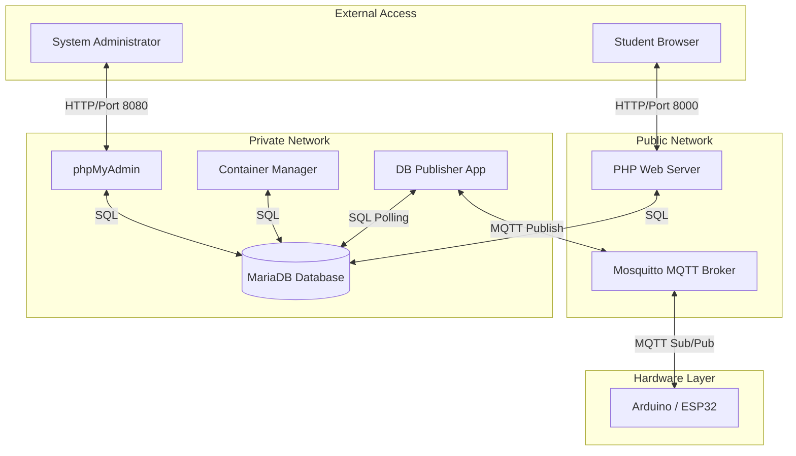

# High Level Recap

This is a complex project and has many different technologies integrated intergrated together.

The technologies involved with data being transferred throughout the system are:
- Arduino language
- MQTT
- LORA Communication
- Wifi Communication
- MySQL
- PHP
- Web server technologies
- Docker containers

There is also various amounts of cyber security techniques and technologies to be implemented in the challenges. 

---

# CyberCity CTF Infrastructure: Service & Integration Guide

This Docker Compose file sets up a multi-layered "Capture The Flag" (CTF) environment. It uses **containerization** to isolate different parts of the system, ensuring that if one part is "hacked" or fails, the rest of the system stays secure and stable.

## The Core Services (The Servers)

| **Service Name**          | **Technology**    | **Role / Purpose**                                                                             | **Integration & Features**                                                                                                                                                                                                 |
| ------------------------- | ----------------- | ---------------------------------------------------------------------------------------------- | -------------------------------------------------------------------------------------------------------------------------------------------------------------------------------------------------------------------------- |
| **Web Front-end (`php`)** | PHP 8.2 & Apache  | The face of the application. Displays the game interface and challenge descriptions.           | Connected to `public` (for users) and `private` (for database) networks.                                                                                                                                                   |
| **Database (`mysql`)**    | MariaDB           | The "brain" of the operation. Stores user scores, challenge data, and city status.             | Uses **Volumes** (`mysql-data`) so data persists even if the container is deleted.                                                                                                                                         |
| **phpMyAdmin**            | Web UI for MySQL  | A management tool for admins to view and edit database tables without writing raw SQL.         | Purely administrative; connects to the database over the private network.                                                                                                                                                  |
| **Mosquitto**             | MQTT Broker       | An IoT messaging protocol. Handles "live" updates for virtual city elements like streetlights. | Acts as a central "post office" for small, fast data messages. Arduino devices (like an ESP32) can **subscribe** to topics to read city states or **publish** messages to trigger database updates via the `db_publisher`. |
| **db_publisher**          | Python/Node App   | Custom logic that bridges the database and the live city.                                      | Watches the database and "publishes" any changes to the MQTT broker.                                                                                                                                                       |
| **container_manager**     | Custom Management | Orchestrates the environment by starting or stopping other Docker containers.                  | Handles "instancing" of challenges when a player starts a specific task.                                                                                                                                                   |

## Integration & Connectivity

### System Integration Map

The following diagram shows how the services are physically and logically grouped. This "Architecture Diagram" illustrates how the different layers (Web, Logic, Data, and Hardware) connect through the virtual networks.

## The Two-Network System

The setup uses two distinct virtual networks to implement a "Security in Depth" strategy:

1. **Public Network:** Only the services that _need_ to be seen by the outside world (like the website) are here.
    
2. **Private Network:** The database and backend logic live here. This prevents a random person on the internet from connecting directly to your database.
    

## Service Discovery

Inside this environment, containers don't need to know each other's IP addresses. They use **DNS resolution**. For example, the `php` app connects to the database using the hostname `CTF-MySQL`. Docker automatically figures out which internal IP that refers to.

## Arduino & IoT Integration

The Mosquitto broker allows physical or simulated Arduino devices to interact with your server:

- **Reading Data (Subscribing):** An Arduino can listen to a topic like `city/lights`. When the database changes, `db_publisher` sends a message to Mosquitto, which then "pushes" it to the Arduino to turn on a physical LED.
- **Updating Data (Publishing):** If an Arduino sensor detects "motion" in the physical city, it sends an MQTT message to the broker. The backend services listen for this message and update the MariaDB database to reflect the new state in the web UI.

## 3. Technology Summary Table

| **Technology**  | **Purpose**      | **Real-World Comparison**                                                     |
| --------------- | ---------------- | ----------------------------------------------------------------------------- |
| **Docker**      | Containerization | Like a shipping container: everything needed to run the app is packed inside. |
| **Apache**      | Web Hosting      | The "waiter" that takes your request for a webpage and brings it to you.      |
| **MQTT**        | IoT Messaging    | A "post office" for very small, fast messages between devices.                |
| **Bind Mounts** | Live Code Sync   | A "portal" between your laptop folder and the server for instant updates.     |