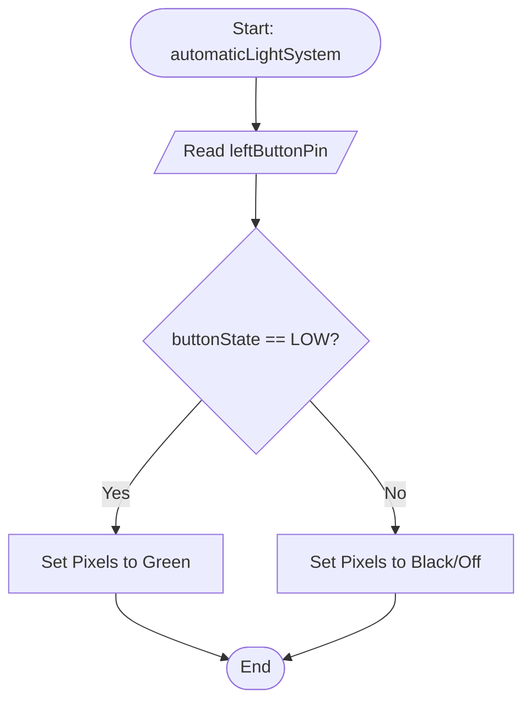
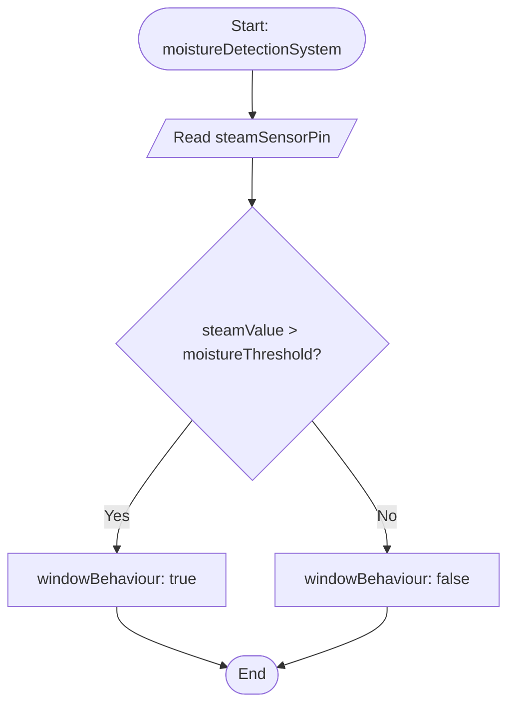

> [!important] Prerequisite - Before starting this process, you must [[_Robotics and Mechatronics/1 - Building and Programming Circuits/_ap/2026S1/Accept Assignment|clone the repository]] to your computer.

This project explores the design and programming of an intelligent living space. You will use an ESP32 microcontroller, sensors (inputs), and actuators (outputs) to automate a physical model house.

![[smartHousePromo.jpg]]
## 🤖 Understanding Robotic Behaviours

In robotics, a **Behaviour** is a specific way an entity (like your house) reacts to its environment. Instead of thinking of your code as one long list of instructions, we think of it as a collection of independent behaviours—such as "Regulate Temperature" or "Secure the Entryway"—that run simultaneously to make the house seem "smart."

## 🛠 Quick Reference: Pin Map

_The house is already pre-wired for you. Use this table to understand which pins are connected to which devices before you begin programming._

|Pin|Device|Type|Logic / Signal|
|---|---|---|---|
|**IO12**|Yellow LED|Output|Digital (High/Low)|
|**IO18/19**|Fan (DC Motor)|Output|PWM (Speed)|
|**IO26**|NeoPixel Square|Output|Serial Data|
|**IO5**|Window Servo|Output|PWM (Angle)|
|**IO13**|Door Servo|Output|PWM (Angle)|
|**IO25**|Buzzer|Output|Frequency|
|**IO27**|Right Button|Input|Digital (PULLUP)|
|**IO16**|Left Button|Input|Digital (PULLUP)|
|**IO14**|PIR (Motion)|Input|Digital|
|**IO34**|Steam (Rain)|Input|Analogue (0-4095)|
|**IO17**|DHT11 (Temp)|Input|OneWire Data|

> [!TIP] **Pre-Programming Checklist:**
> 
> 1. **Visual Audit:** Check that the physical components match the pins listed above.
>     
> 2. **Common Ground:** Ensure the ESP32 and the house power supply share a common **GND**.
>     
> 3. **Library Check:** Ensure your environment has the required libraries (NeoPixel, ESP32Servo) installed before deploying code.

## Code Design Organisation

The code design should follow the features discussed in [[_Robotics and Mechatronics/1 - Building and Programming Circuits/_projects/Smart House/_topics/Algorithm Design - Modularisation|Modularisation]]. Therefore the high-level view of the code would appear to be something similar to this:

![[smartHouseHighLevelCode.png]]

> [!note] In this flowchart you should be able to see that `loop()` has only got minimal amount of code in it, just calls to the other functions. 
> This allows the loop function to focus on the high-level logic (what order the functionality is in). 
> The low-level code is implemented in the specific functions. 
> This benefits the code to make it easier for the programmer to know where the code is located for each part of the project.
## 1. Tutorial: Manual Lighting Behaviour

_Learning-oriented: A guided start to get your first system running._

In this tutorial, we will create a **Manual Lighting Behaviour**. When you press a button, a yellow LED will turn on and stay on until you press the button again.

### Step 1: The Basic Skeleton

Every PlatformIO project needs a basic structure. Open `main.cpp` and add this setup:

```
#include <Arduino.h> 

// 1. Define our physical "addresses" (Pins)
#define yellowLedPin 12
#define rightButtonPin 27

// 2. Global variables to remember the "State" of the house
bool ledState = LOW;
bool lastButtonState = HIGH; // Standard buttons are HIGH when not pressed

void setup() {
  Serial.begin(9600);
  pinMode(yellowLedPin, OUTPUT);
  pinMode(rightButtonPin, INPUT_PULLUP); // Uses internal resistor for stability
}

void loop() {
  // We call our behaviour here so it runs repeatedly
  delay(100);
}
```

![[smartHouseBasicSkeleton.png]]

> [!IMPORTANT] **Why include `Arduino.h`?** Unlike the standard Arduino IDE which adds this automatically behind the scenes, **PlatformIO** requires you to explicitly include this header file. It tells the compiler how to understand standard commands like `digitalWrite`, `pinMode`, and `delay`.

### Step 2: Coding the Behaviour

We need a function that checks if the button was _just_ pressed. We call this **State Tracking**.

Add the function for the new behaviour:

```arduino
void handleManualLighting() {
  int currentButtonReading = digitalRead(rightButtonPin);

  // If the button is pressed (LOW) AND it was released (HIGH) last time we checked
  if (currentButtonReading == LOW && lastButtonState == HIGH) {
    ledState = !ledState; // Flip the state
    digitalWrite(yellowLedPin, ledState);
    Serial.println(ledState ? "Light ON" : "Light OFF");
    delay(50); // Small delay to prevent "bouncing"
  }

  lastButtonState = currentButtonReading; 
}
```

Add the function call to `loop()`:

```arduino
  handleManualLighting();
```

![[smartHouseCodingBehaviour.png]]

Upload the code to your smart house! This is the behaviour in action.

![[smartHouseBehaviourAutomaticLight.gif]]

### Explanation

This code demonstrates a **State Toggle** logic combined with **Edge Detection**. Instead of the light being on only while the button is held down, this code allows a single press to flip the light from OFF to ON (and vice versa).

#### 1. Tracking State (The "Memory")

- **`ledState = !ledState;`**: This is the core logic. The `!` (NOT) operator takes the current boolean value (True or False) and flips it. This allows the Arduino to "remember" whether the light should be on or off even after the user lets go of the button.
- **`lastButtonState`**: This variable is crucial for **Edge Detection**. By comparing the `currentButtonReading` to the `lastButtonState`, the code can identify the exact moment the button transitions from "not pressed" to "pressed." Without this, the `loop()` would run so fast that a single finger press would flip the light state thousands of times per second.

#### 2. The Conditional Logic (`if` statement)

The `if` statement uses a **Logical AND (`&&`)** to check for two conditions simultaneously:

1. **`currentButtonReading == LOW`**: The button is currently being pulled to ground (pressed).
2. **`lastButtonState == HIGH`**: In the _previous_ frame of the loop, the button was not pressed.
- **Result:** The code inside the `{}` only runs once per click.

#### 3. Handling Hardware Noise (Debouncing)

- **`delay(50);`**: Real mechanical buttons are "noisy." When you press them, the metal contacts literally bounce against each other for a few milliseconds, sending dozens of ON/OFF signals to the Arduino. This small delay tells the processor to "ignore" those micro-bounces and wait for the signal to stabilize.

#### 4. The `loop()` and Function Structure

- **Encapsulation:** By placing the logic inside `handleManualLighting()`, the code follows good software engineering practices. It keeps the `loop()` clean and allows you to easily add other "robotic behaviours" (like sensors or motors) without cluttering the main execution path.
## 2. How-To Guides: Advanced Behaviours

_Task-oriented: Recipes for specific house features._

### Ambient Mood Behaviour (NeoPixels)

This behaviour allows the house to change its internal atmosphere using addressable LEDs on the NeoPixel board.  The LEDs will turn on and green if the left button is being pressed, and will turn off if the button **isn't** being pressed.

The logic can be shown as 



**Requirements:** `#include <Adafruit_NeoPixel.h>`

Add the following code to the start of `main.cpp` to define the pins and NeoPixel object:
```arduino
#define neopixelPin 26
#define numPixels 4
#define leftButtonPin 16

Adafruit_NeoPixel neoPixelBoard(numPixels, neopixelPin, NEO_GRB + NEO_KHZ800);
```

![[smartHouseBehaviourAmbientMood1.png]]

Update `setup()` to configure the NeoPixel board to initialise the button and the NeoPixel board.![[smartHouseBehaviourAmbientMood2.png]]

```arduino
pinMode(leftButtonPin, INPUT_PULLUP);
```

and

```arduino
neoPixelBoard.begin();
neoPixelBoard.show();
```

![[smartHouseBehaviourAmbientMood2.png]]

Include the behaviour to set the colours of the individual pixels.

```arduino
void setMoodBehaviour(int r, int g, int b) {
  for(int i=0; i<numPixels; i++) {
    strip.setPixelColor(i, strip.Color(r, g, b));
  }
  strip.show();
}
```

> [!IMPORTANT] **Understanding the Buffer (`setPixelColor` vs `show`)** When you call `strip.setPixelColor()`, you aren't talking to the LED yet. You are updating a **"Buffer"** (a temporary list in the ESP32's memory). Think of it like painting a picture behind a curtain. The house only "sees" the changes when you call `strip.show()`, which pulls back the curtain and sends the whole buffer to the LEDs at once.

![[smartHouseBehaviourAmbientMood3.png]]

The logic for displaying colours has been defined, now the focus is on reading in the value of the button and then calling the setMoodBehaviour() function appropriately.

```arduino
void automaticLightSystem() {
  int buttonState = digitalRead(leftButtonPin);
  if (buttonState == LOW) {
	   setMoodBehaviour(0, 255, 0); // Set the NeoPixels to Green
  } else {
	  setMoodBehaviour(0, 0, 0); // Set the NeoPixels to Black (off)
  }
}
```

![[smartHouseBehaviourAmbientMood4.png]]

Update `loop()` to call the new function.

```arduino
automaticLightSystem()
```

![[smartHouseBehaviourAmbientMood5.png]]


> [!tip] Understanding RGB Values
> See this page for more details: [[RGB Values]]

Currently, this code simply sets all four pixels on the board to be green and nothing else which doesn't provide much in terms of functionality. The next step is to expand the code so that the pixels turn green *if* certain conditions are met and turns the pixels off if those conditions aren't met.

Upload the code to your smart house and the new behaviour will be accessible:

![[smartHouseBehaviourAmbientMood.gif]]
### Environmental Ventilation Behaviour

This behaviour automates the window to respond to internal conditions. 

**The Goal:** Program a ventilation behaviour which will open a window if the house gets too humid.
- **Sensor:** Steam Sensor.
- **Actuator:** Servo.
- **The Logic:** Use an `if` statement to check if the steam sensor pin reads a value over a set threshold. If it does, trigger the servo to move the window to the open position.


First, include the library required for servo motors on an ESP32 microcontroller.

```arduino
#include <ESP32Servo.h>
```

![[smartHouseBehaviourVentilation1.png]]

Define the pins, moisture threshold and servo object at the top of your code. 
`moistureThreshold` is the value read from the steam sensor which will determine whether the window will need to be open or closed.

```arduino
#define windowServoPin 5
#define steamSensorPin 34
#define moistureThreshold 500
```
and
```arduino
Servo windowServo;
```

![[smartHouseBehaviourVentilation2.png]]

Update `setup()` to initialise the servo.

```arduino
ESP32PWM::allocateTimer(0);
ESP32PWM::allocateTimer(1);
ESP32PWM::allocateTimer(2);
ESP32PWM::allocateTimer(3);
windowServo.setPeriodHertz(50); // standard 50 hz servo
windowServo.attach(windowServoPin, 500, 2400);
windowServo.write(0);
```

Now set the steam sensor pin to be input:

```arduino
pinMode(steamSensorPin, INPUT);
```

![[smartHouseBehaviourVentilation3.png]]

Add the `windowBehaviour()` custom function. This function will open the window if `true` is passed as a parameter, and will close the window if `false` is passed.

```
void windowBehaviour(bool open) {
  if (open) windowServo.write(90); 
  else windowServo.write(0);
}
```

![[smartHouseBehaviourVentilation4.png]]

The main behaviour logic is next. The logic is as follows:



To implement this logic, the code is:

```arduino
void moistureDetectionSystem() {
  int steamValue = analogRead(steamSensorPin);
  if (steamValue > moistureThreshold) {
    // Moisture detected
    windowBehaviour(true);
  } else {
    // Dry
    windowBehaviour(false);
  }
}
```

![[smartHouseBehaviourVentilation5.png]]

Finally, call `moistureDetectionSystem()` from the `loop()`:

![[smartHouseBehaviourVentilation6.png]]

Compile and upload the code to test the functionality!

![[smartHouseBehaviourVentilationDemo.gif]]
#### Explanation: windowBehaviour()

This provides a breakdown of how the function operates, specifically focusing on the logic within the conditional block and the role of its input parameter.

##### 1. The Parameter

The **parameter** acts as a placeholder for the data that the function needs to perform its task.

- **Input:** When the function is "called," you pass an actual value (an argument) into this parameter.
- **Scope:** This variable exists only inside the function. It allows the function to be dynamic—instead of doing the same thing every time, it can process different data depending on what is passed in.

##### 2. The `if` Statement

The `if` statement is the "decision-maker" of the function. It evaluates a specific condition to determine which path the code should take.

##### How it Works:

1. **Evaluation:** The code inside the parentheses of the `if` statement is checked. It results in either `true` or `false`.
2. **The Branch:**
    - **If True:** The block of code immediately following (inside the curly braces `{}`) is executed.
    - **If False:** The computer skips that block entirely. If there is an `else` block, it runs that instead; otherwise, it simply moves to the next line of code after the function.

### Purpose in this Context:

In this specific function, the `if` statement likely guards against invalid data (like checking if the parameter is empty) or checks if a certain threshold has been met before proceeding with the main logic.

### Summary

By combining a **parameter** (the data) with an **if statement** (the logic), the function becomes a reusable tool that can intelligently handle different scenarios based on the input it receives.


## 3. Explanation: Managing Multiple Behaviours

_Understanding-oriented: The "Why" and the "How it works"._

### Modular Code Design

As your house gets smarter, your `loop()` function will become messy.

- **The Loop:** Should only contain high-level "orders" (e.g., `checkTemperature()`).
- **Custom Functions:** Contain the "low-level" details (e.g., exactly how many volts to send to the motor).

## 4. Style Guide & Standards

_Information-oriented: Keeping your code professional._

- **Variables/Functions:** `lowerCamelCase` (e.g., `isWindowOpen`)
- **Comments:** Every function must have a one-line comment explaining its purpose.
### Required Theory Links

- [[_Robotics and Mechatronics/1 - Building and Programming Circuits/_projects/Smart House/_topics/Variables and Data Types|Variables and Data Types]]
- [[_Robotics and Mechatronics/1 - Building and Programming Circuits/_projects/Smart House/_topics/Style Guide|Style Guide]]
- [[_Robotics and Mechatronics/1 - Building and Programming Circuits/_projects/Smart House/_topics/Algorithm Design - Sequence|Sequences]]
- [[_Robotics and Mechatronics/1 - Building and Programming Circuits/_projects/Smart House/_topics/Algorithm Design - Decisions|Decisions]]
- [[_Robotics and Mechatronics/1 - Building and Programming Circuits/_projects/Smart House/_topics/Algorithm Design - Loops|Loops]]
- [[_Robotics and Mechatronics/1 - Building and Programming Circuits/_projects/Smart House/_topics/Data Structures|Data Structures]]

# Level Up: Robotic Behaviours

Now that you have the basic smart home system running, it is time to expand its capabilities! A truly "smart" house doesn't just turn on a light; it exhibits **robotic behaviours**—reacting to its environment autonomously to keep its occupants safe and comfortable.

Use the additional sensors and actuators in your kit to programmed the following behaviours:

## The Sentinel Behaviour (Motion Sensor + Buzzer)

**The Goal:** Program a security behaviour that allows the house to "guard" itself, sounding an alarm if movement is detected while the system is armed.
- **Sensor:** PIR Motion Sensor.
- **Actuator:** Active Buzzer.
- **The Logic:** Use an `if` statement to check if the motion sensor pin reads `HIGH`. If it does, trigger the buzzer to beep in a pattern.
### Required Code

This section indicates any specialised code that is required for this behaviour.

| Module            | Libraries Required | Definitions at top of code                                                                | `setup()`                                             | Usage                                                                                                                       |
| ----------------- | ------------------ | ----------------------------------------------------------------------------------------- | ----------------------------------------------------- | --------------------------------------------------------------------------------------------------------------------------- |
| PIR Motion Sensor | N/A                | Standard Pin definition.                                                                  | Set pin to input                                      | `digitalRead()`                                                                                                             |
| Buzzer            | `BuzzerESP32.h`    | `#define buzzerPin 25`<br>`BuzzerESP32 buzzer(buzzerPin); // Initialize buzzer on GPIO25` | `buzzer.setTimbre(30); // Set timbre (sound quality)` | `buzzer.playTone(532, 500);  // C5 (slightly sharp) - longer duration`<br> `buzzer.playTone(0, 0);      // Turn off buzzer` |

## The Homeostatic Behaviour (Temperature Sensor + DC Motor)

**The Goal:** Program a self-regulating behaviour to prevent the house from overheating. If the temperature rises above a certain threshold, a cooling fan should activate automatically to restore balance.
- **Sensor:** DHT11 Temperature Sensor.
- **Actuator:** DC Motor (with a fan blade).
- **The Logic:** Define a variable for your "Max Temperature" (e.g., 27°C). Use the `if` statement to compare the current sensor reading to that variable.

### Required Code

This section indicates any specialised code that is required for this behaviour.

| Module   | Libraries Required | Definitions at top of code                                     | `setup()`               | Usage                                                                                                                                                                                                                                                                    |
| -------- | ------------------ | -------------------------------------------------------------- | ----------------------- | ------------------------------------------------------------------------------------------------------------------------------------------------------------------------------------------------------------------------------------------------------------------------ |
| DHT11    | `dht11.h`          | Normal pin defintion<br>`dht11 DHT11; // Initialize dht11`<br> | N/A                     | `int chk = DHT11.read(DHT11PIN);`<br>`int Temperature = DHT11.temperature;`<br>`int Humidity = DHT11.humidity;`                                                                                                                                                          |
| DC Motor | N/A                | Standard Pin definition.                                       | Set both pins to output | ` digitalWrite(fanPin1, LOW); //INA`<br>  `analogWrite(fanPin2, 180);  //INB`<br>  `delay(1000)`<br><br>  Note: If INA-INB <-45 the fan will rotate clockwise<br>  if INA - INB > 45 the fan will rotate anticlockwise<br>  if INA == 0 and INB == 0, the fan will stop. |


## The Security Door Behaviour (RFID + Door Servo)

**The Goal:** Program a RFID reader to accept only certain RFID tags. If the correct tag is read the rotating door opens, otherwise it closes.
- **Sensor:** RFID reader.
- **Actuator:** Servo
- **The Logic:** Read the value of a detected RFID tag. If the value is correct, move the door servo to the open position. If the value is incorrect, then move the door to the closed position.

### Required Code

This section indicates any specialised code that is required for this behaviour.

| Module     | Libraries Required                | Definitions at top of code                     | `setup()`                                                                              | Usage                |
| ---------- | --------------------------------- | ---------------------------------------------- | -------------------------------------------------------------------------------------- | -------------------- |
| RFID       | `<Wire.h>`<br>`"MFRC522_I2C.h"`   | `MFRC522 mfrc522(0x28);`                       | `Wire.begin();       // initialize I2C`<br>`mfrc522.PCD_Init(); // initialize MFRC522` | See Below<br>        |
| Door Servo | Already imported for Window Servo | `Servo doorServo`<br>`#define doorServoPin 13` | `myservo.attach(doorServoPin, 1000, 2000);`                                            | Same as Window Servo |
#### Reading RFID Values

```
String rfidUidString = "";
if (!mfrc522.PICC_IsNewCardPresent() || !mfrc522.PICC_ReadCardSerial()) {
	delay(50);
	rfidUidString = "";
	return;
}

// Build the UID string from the raw bytes provided by the reader
rfidUidString = "";
for (byte i = 0; i < mfrc522.uid.size; i++) {
	rfidUidString += String(mfrc522.uid.uidByte[i]);
}

if (rfidUidString == "1391624650") {
	Serial.println("Access Granted: Revolving door opening.");
} else {
	Serial.println("Access Denied: Invalid UID " + rfidUidString);
}
rfidUidString = "";
```

## Harmful Gas Behaviour (Gas Sensor + LCD)

**The Goal:** Detect if there are any harmful gases in the house and alert the occupant. 
- **Sensor:** Gas Sensor
- **Actuator:** LCD Screen
- **The Logic:** Read the gas level and display "Safe" or "Harmful" on the screen depending on value. If the reading is Harmful, then a buzzer plays a different buzz from other behaviour.

### Required Code

This section indicates any specialised code that is required for this behaviour.


| Module     | Libraries Required    | Definitions at top of code                  | `setup()`                                                      | Usage                                                                     |
| ---------- | --------------------- | ------------------------------------------- | -------------------------------------------------------------- | ------------------------------------------------------------------------- |
| LCD Screen | `LiquidCrystal_I2C.h` | `LiquidCrystal_I2C lcdScreen(0x27, 16, 2);` | <code>lcdScreen.init();  <br>lcdScreen.backlight();<br></code> | <code>lcdScreen.setCursor(0, 0);<br>lcdScreen.print("safety");<br></code> |
| Gas Sensor | N/A                   | Standard Pin definition.                    | Set pin to input                                               | `digitalRead()`                                                           |

##  Programming Reflection

When you add these robotic behaviours, ask yourself:
1. **Variables:** What new names do I need to give these pins?
2. **Thresholds:** How do I decide what "too hot" or "too dark" looks like in code?
3. **Efficiency:** Can I use one `if` statement to check two conditions at once (like "if it is dark AND I am home")?

**Share your creation:** Once you've added a new behaviour, demonstrate it to a classmate and explain exactly how your `if` statement handles the new sensor data!
