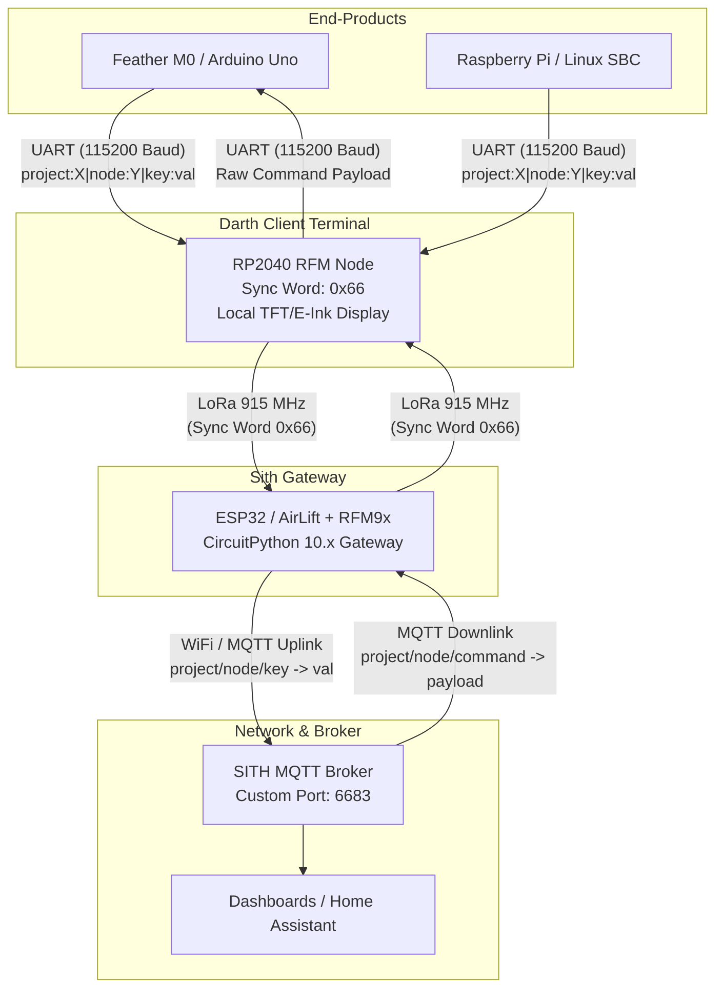
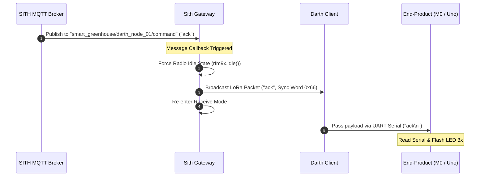

# System Installation, Configuration, & Developer Manual

> **PREREQUISITE NOTICE:**
> This project relies on the **SITH Backend Server Infrastructure**. Before configuring and deploying the gateway or client hardware, please consult the SITH server documentation and verify that the backend services are running via Docker Compose (`docker-compose.yml`).

# 1. System Overview & Purpose

## Purpose

The Imperial LoRa Mesh system provides a decoupled, bi-directional communication bridge connecting diverse edge devices (e.g., environmental sensors, smart home nodes, robotics platforms) to a centralised MQTT broker over long-range radio (LoRa).

The architecture enforces two core design mandates:

1. **Zero-Knowledge Pass-Through Terminals ("Darth Clients"):** Local client terminals act as transparent serial-to-LoRa transceivers. They possess no hardcoded logic regarding specific sensor types, node identities, or backend broker configurations.

2. **Dynamic Routing & Topic Mapping ("Sith Gateway"):** A central gateway ingests pipe-delimited telemetry strings over LoRa, dynamically parses key-value pairs, and maps each sensor attribute to its own structured MQTT topic branch (`<project>/<node_id>/<sensor_key>`).

## Topology & Data Flow

![[gatewayLoraMQTT.excalidraw.png]]



# 2. Hardware & Software Requirements

## Hardware Required

| Component                | Role                        | Details / Specifications                                                     |
| ------------------------ | --------------------------- | ---------------------------------------------------------------------------- |
| **Sith Gateway**         | LoRa-to-MQTT Gateway        | Feather RP2040 RFM95 (915 MHz) + AirLift FeatherWing (ESP32 SPI Coprocessor) |
| **Darth Client**         | Pass-Through Radio Terminal | Adafruit Feather RP2040 RFM95 (915 MHz)                                      |
| **Darth Client Display** | Local Status Display        | Adafruit Mini Color TFT FeatherWing or E-Ink FeatherWing (SSD1680)           |
| **End-Product Nodes**    | Edge Computing / Sensing    | Adafruit Feather M0 Basic, Arduino Uno/Nano, ESP32, or Raspberry Pi          |

## Software Dependencies & Libraries

### 1. Sith Gateway (CircuitPython 10.x)

Ensure the following libraries from the Adafruit CircuitPython Bundle are installed in `CIRCUITPY/lib`:

* `adafruit_rfm9x.mpy`
* `adafruit_minimqtt/`
* `adafruit_connection_manager.mpy`
* `adafruit_esp32spi/`
* `adafruit_requests.mpy`

### 2. Darth Client Terminal & Arduino End-Products (C++ / PlatformIO)

All C++ projects are designed for development in **Visual Studio Code** using the **PlatformIO IDE** extension:

* `RadioHead` (`RH_RF95.h`)
* `Adafruit_GFX`
* `Adafruit_ST7735`
* `Adafruit_EPD`
* `SoftwareSerial.h` (Standard library for Arduino Uno/Nano end-products)

### 3. Test & Host Scripts (Python 3.x)

* `paho-mqtt`
* `pyserial`

# 3. Hardware Interfacing & Wiring Guide

Connecting an End-Product (such as an Arduino Uno) to a Darth Client Terminal (Adafruit Feather RP2040 RFM) requires strict adherence to asynchronous UART serial conventions and voltage level compatibility.

## Core Wiring Rules

1. **Crossover (Null-Modem) Connection:** Transmit ($\text{TX}$) from the sender always connects to Receive ($\text{RX}$) on the listener, and vice-versa.

   $$\text{End-Product TX} \longrightarrow \text{Darth Client RX}$$

   $$\text{End-Product RX} \longleftarrow \text{Darth Client TX}$$

2. **Common Ground Reference ($\text{GND}$):** A direct, low-impedance ground connection between both boards is strictly mandatory. Without a shared ground reference, signal voltages will float, leading to corrupted UART packets.

3. **Logic Level Shifting ($5\text{V} \leftrightarrow 3.3\text{V}$):**

   * **Feather RP2040 RFM:** Operates strictly on $3.3\text{V}$ logic levels. GPIO pins are **not** $5\text{V}$ tolerant.
   * **Arduino Uno:** Operates on $5\text{V}$ logic levels.
   * *Safety Mandate:* The $5\text{V}$ output from an Arduino Uno's $\text{TX}$ pin **must be stepped down** to $3.3\text{V}$ before reaching the RP2040's $\text{RX}$ pin. This can be accomplished using a bi-directional logic level converter or a simple resistor divider ($1\text{ k}\Omega$ and $2.2\text{ k}\Omega$).
   * *Note:* The $3.3\text{V}$ $\text{TX}$ signal output from the RP2040 is high enough to register as a logic `HIGH` ($V_{IH} \ge 3.0\text{V}$) on the Arduino Uno $\text{RX}$ pin without amplification.

## Example Wiring Matrix: Arduino Uno (End-Product) $\leftrightarrow$ Feather RP2040 RFM (Darth Client)

To preserve the Arduino Uno's native hardware `Serial` interface (Pins `0` and `1`) for USB debugging via the PlatformIO Serial Monitor, we use `SoftwareSerial` on Pins `10` ($\text{RX}$) and `11` ($\text{TX}$).

| Arduino Uno Pin (End-Product) | Interface / Signal | Interconnection Path | Feather RP2040 Pin (Darth Client) | Notes / Details | 
| ----- | ----- | ----- | ----- | ----- | 
| **GND** | Power / Logic Ground | Direct Wire | **GND** | Shared common ground baseline | 
| **Pin 11 (TX)** | SoftwareSerial $\text{TX}$ ($5\text{V}$) | Via $1\text{ k}\Omega / 2.2\text{ k}\Omega$ Divider | **RX1 (GP1)** | Stepped down to $3.3\text{V}$ for RP2040 protection | 
| **Pin 10 (RX)** | SoftwareSerial $\text{RX}$ ($5\text{V}$) | Direct Wire | **TX1 (GP0)** | $3.3\text{V}$ signal from RP2040 is Uno safe | 
| **5V or USB** | Main Power Supply | External / USB | **USB / BAT** | Power boards via respective USB connectors | 

## Level Shifter & Divider Schematics

### Option A: Voltage Divider Circuit (Resistor-Based)

```
  Arduino Uno                    Darth Client (RP2040)
 Pin 11 (TX 5V) ----[ 1 kΩ ]----+----> RX1 (GP1 3.3V)
                                |
                             [ 2.2 kΩ ]
                                |
 GND ---------------------------+----> GND
```

### Option B: Hardware Logic Level Converter Module

```
  Arduino Uno              4-Channel Level Converter           RP2040 Client
  +5V Pin    ------------> HV (High Voltage)
  GND Pin    ------------> GND (High Voltage)
  Pin 11 (TX) -----------> HV1 ---------------> LV1 ----------> RX1 (GP1)
  Pin 10 (RX) <----------- HV2 <--------------- LV2 <---------- TX1 (GP0)
                           LV (Low Voltage)  <---------------- 3V Pin
                           GND (Low Voltage) <---------------- GND Pin
```


4. Section B: CircuitPython Gateway Node (Receiver & MQTT Bridge)

## CircuitPython Installation Instructions
1. Download the latest **CircuitPython 10.x `.uf2` file** for the Adafruit Feather RP2040 RFM from [circuitpython.org](https://circuitpython.org/).
2. Connect the RP2040 Feather to your computer via USB.
3. Hold down the **BOOT** button, press and release the **RESET** button, then release the **BOOT** button to enter the bootloader.
4. A drive named `RPI-RP2` will appear on your computer.
5. Drag and drop the downloaded `.uf2` file onto the `RPI-RP2` drive.
6. The board will reboot automatically and mount as a drive named **`CIRCUITPY`**.

## CircuitPython Dependencies
Download the **Version 10.x Adafruit CircuitPython Bundle** and copy these to `CIRCUITPY/lib`:
* `adafruit_rfm9x.mpy`
* `adafruit_esp32spi/` (Folder containing `adafruit_esp32spi_socketpool.mpy`)
* `adafruit_connection_manager.mpy`
* `adafruit_requests.mpy`
* `adafruit_minimqtt/` (Folder)
* `adafruit_bus_device/` (Folder)

## Required User Configuration

Before uploading the CircuitPython script to your board, update the following parameters in the code to match your network and MQTT broker settings:

| Parameter Name | Data Type | Description | Example Value |
| :--- | :--- | :--- | :--- |
| `WIFI_SSID` | `String` | Name of your 2.4GHz WiFi network | `"YOUR_WIFI_SSID"` |
| `WIFI_PASS` | `String` | Password for your WiFi network | `"YOUR_WIFI_PASSWORD"` |
| `MQTT_BROKER` | `String` | IP address or hostname of your MQTT broker | `"192.168.1.50"` |
| `MQTT_PORT` | `Integer` | Port number configured on your MQTT broker | `1883` (or custom port like `6683`) |
| `MQTT_TOPIC` | `String` | MQTT topic where received LoRa data is published | `"lora/gateway/data"` |
| `RADIO_FREQ_MHZ` | `Float` | Operating frequency of your LoRa modules | `915.0` (or `868.0` / `433.0`) |


# 4. Gateway

The **Feather RP2040 RFM** and **AirLift FeatherWing** are designed to be stackable. **No manual soldering or jumper wires are required** when stacking the boards directly via headers.

| Component | Pin Function | Feather RP2040 Board Alias | Notes |
| :--- | :--- | :--- | :--- |
| **LoRa (RFM9x)** | Chip Select (`CS`) | `board.RFM_CS` | Onboard hardwired (GPIO 16) |
| **LoRa (RFM9x)** | Reset (`RST`) | `board.RFM_RST` | Onboard hardwired (GPIO 17) |
| **LoRa (RFM9x)** | Interrupt (`IRQ`) | `GPIO 21` | Onboard hardwired |
| **AirLift WiFi** | Chip Select (`CS`) | `board.D13` | Stacked Header |
| **AirLift WiFi** | BUSY / Ready (`ACK`)| `board.D11` | Stacked Header |
| **AirLift WiFi** | Reset (`RESETN`) | `board.D12` | Stacked Header |

> **Note on WiFi Security:** The AirLift FeatherWing supports 2.4GHz WiFi networks using **WPA/WPA2**. It does **not** support WPA3-Only networks or 5GHz bands.


# 5. Communication Protocol Specification

## Radio Parameters

* **Frequency:** $915.0\text{ MHz}$
* **TX Power:** $23\text{ dBm}$ (Maximum output)
* **Sync Word:** `0x66` (Order 66 - written to SPI Register `0x39` / `RH_RF95_REG_39_SYNC_WORD`)

## Data Formatting Guidelines

### Uplink Telemetry Structure (End-Product $\rightarrow$ Darth Client $\rightarrow$ Gateway)

All uplink payloads transmitted over UART to the Darth Client must follow a pipe-delimited format terminated by a newline (`\n`):

$$\text{project:}\langle\text{PROJECT}\rangle\vert{}\text{node:}\langle\text{NODE\_ID}\rangle\vert{}\langle\text{KEY\_1}\rangle:\langle\text{VALUE\_1}\rangle\vert{}\langle\text{KEY\_2}\rangle:\langle\text{VALUE\_2}\rangle$$

*Example:*

```text
project:smart_greenhouse|node:darth_node_01|temp:24.5|humidity:61.2|status:OK
```

### Gateway MQTT Topic Generation

Upon receiving the LoRa packet, the Sith Gateway splits the string and generates distinct MQTT publications:

* `smart_greenhouse/darth_node_01/temp` $\rightarrow$ `24.5`
* `smart_greenhouse/darth_node_01/humidity` $\rightarrow$ `61.2`
* `smart_greenhouse/darth_node_01/status` $\rightarrow$ `OK`

### Downlink Command Structure (Broker $\rightarrow$ Gateway $\rightarrow$ Darth Client $\rightarrow$ End-Product)

* **MQTT Downlink Topic Pattern:** `<project>/<node_id>/command`
* **Gateway Subscription Wildcard:** `+/+/command`
* **LoRa Payload:** Raw string command (e.g., `1`, `0`, `ack`, `RESET`).



# 6. Component Source Code

## Component 1: Sith Gateway (`code.py` - CircuitPython)

Includes an in-memory **FIFO Queue** for offline MQTT buffering during WiFi or network outages. Telemetry received during outages is buffered locally and flushed automatically in FIFO order upon MQTT reconnection.

```python
import time
import board
import busio
import digitalio
import adafruit_connection_manager
import adafruit_rfm9x
import adafruit_minimqtt.adafruit_minimqtt as MQTT
from adafruit_esp32spi import adafruit_esp32spi

# --- SOCKET IMPORT FOR CIRCUITPYTHON 9.x / 10.x ---
try:
    from adafruit_esp32spi import adafruit_esp32spi_socketpool as socket
except ImportError:
    try:
        import adafruit_esp32spi_socketpool as socket
    except ImportError:
        try:
            from adafruit_esp32spi import adafruit_esp32spi_socket as socket
        except ImportError:
            print("Error: Neither socketpool nor socket module found in lib/adafruit_esp32spi!")
            raise

# --- NETWORK & BROKER CONFIGURATION (DE-IDENTIFIED DEFAULT VALUES) ---
WIFI_SSID = "YOUR_WIFI_SSID"
WIFI_PASS = "YOUR_WIFI_PASSWORD"
MQTT_BROKER = "192.168.1.100"  # Replace with SITH Server IP address
MQTT_PORT = 6683               # SITH Custom MQTT Broker Port
RADIO_FREQ_MHZ = 915.0

# Downlink Wildcard Topic Pattern: <project>/<node_id>/command
MQTT_DOWNLINK_WILDCARD = "+/+/command"

# --- FIFO QUEUE FOR OFFLINE MQTT BUFFERING ---
MAX_QUEUE_SIZE = 100
mqtt_queue = []

def enqueue_message(topic, payload):
    """Enqueues a topic/payload tuple into the FIFO buffer when MQTT is offline."""
    if len(mqtt_queue) >= MAX_QUEUE_SIZE:
        dropped = mqtt_queue.pop(0)  # Drop oldest item on buffer overflow
        print(f"[Buffer Overflow] Queue full ({MAX_QUEUE_SIZE}). Dropped oldest packet for topic: '{dropped[0]}'")
    mqtt_queue.append((topic, payload))
    print(f"[Buffer Enqueued] Topic: '{topic}' | Payload: '{payload}' (Queue Depth: {len(mqtt_queue)})")

def flush_mqtt_queue():
    """Flushes buffered telemetry messages to the MQTT broker in FIFO order when reconnected."""
    if not mqtt_queue or not mqtt_client.is_connected():
        return
    
    print(f"[Buffer Draining] Flushing {len(mqtt_queue)} buffered messages to MQTT broker...")
    while mqtt_queue and mqtt_client.is_connected():
        topic, payload = mqtt_queue[0]
        try:
            mqtt_client.publish(topic, payload)
            mqtt_queue.pop(0)  # Remove successfully published message
            print(f"[Buffer Flushed] Published topic '{topic}' -> '{payload}' (Remaining: {len(mqtt_queue)})")
        except Exception as e:
            print(f"[Buffer Error] Failed to publish buffered item: {e}")
            break

# --- HARDWARE INITIALISATION ---
spi = busio.SPI(board.SCK, board.MOSI, board.MISO)

# AirLift Wing SPI Pinout
esp32_cs = digitalio.DigitalInOut(board.D13)
esp32_ready = digitalio.DigitalInOut(board.D11)
esp32_reset = digitalio.DigitalInOut(board.D12)
esp = adafruit_esp32spi.ESP_SPIcontrol(spi, esp32_cs, esp32_ready, esp32_reset)

# RFM9x LoRa Setup
rfm9x_cs = digitalio.DigitalInOut(board.RFM_CS)
rfm9x_reset = digitalio.DigitalInOut(board.RFM_RST)
rfm9x = adafruit_rfm9x.RFM9x(spi, rfm9x_cs, rfm9x_reset, RADIO_FREQ_MHZ)
rfm9x.tx_power = 23

# Configure Order 66 Sync Word (0x66)
rfm9x.sync_word = 0x66

# --- NETWORK CONNECTION ---
print("Connecting to WiFi...")
while not esp.is_connected:
    try:
        esp.connect_AP(WIFI_SSID, WIFI_PASS)
    except Exception as e:
        print("WiFi connection failed, retrying...", e)
        esp32_reset.value = False
        time.sleep(0.1)
        esp32_reset.value = True
        time.sleep(1)
        continue
print("Connected to WiFi!")

# --- MQTT SETUP & CALLBACKS ---
pool = adafruit_connection_manager.get_radio_socketpool(esp)
ssl_context = adafruit_connection_manager.get_radio_ssl_context(esp)

mqtt_client = MQTT.MQTT(
    broker=MQTT_BROKER,
    port=MQTT_PORT,
    client_id="LoRaGateway_CircuitPython",
    socket_pool=pool,
    ssl_context=ssl_context
)

def message_handler(client, topic, message):
    """
    Triggered when a downlink command arrives from the MQTT broker.
    Subscribed topic pattern: <project>/<node>/command
    """
    print(f"[MQTT RX] Topic: '{topic}' | Payload: '{message}'")
    
    payload_bytes = bytes(str(message), "utf-8")
    
    # Force radio state to idle before transmitting to avoid SPI conflicts
    rfm9x.idle()
    time.sleep(0.02)
    
    # Broadcast command over LoRa
    rfm9x.send(payload_bytes)
    print(f"[LoRa TX] Forwarded downlink message over LoRa: '{message}'")
    
    # Return radio to receive mode
    rfm9x.receive(timeout=0.1)

# Register MQTT callback handlers
mqtt_client.on_message = message_handler

def connect_mqtt():
    """Connects to MQTT broker, subscribes to command wildcard, and drains buffered queue."""
    if mqtt_client.is_connected():
        return True
    
    print("Connecting to MQTT broker...")
    try:
        mqtt_client.connect()
        mqtt_client.subscribe(MQTT_DOWNLINK_WILDCARD)
        print(f"Connected to MQTT! Subscribed to topic: '{MQTT_DOWNLINK_WILDCARD}'")
        flush_mqtt_queue()  # Flush any offline messages accumulated during disconnection
        return True
    except Exception as e:
        print("MQTT connection failed:", e)
        return False

connect_mqtt()

def parse_and_publish_uplink(packet_text):
    """
    Parses pipe-delimited uplink LoRa packet and publishes keys to MQTT topics.
    Buffers payload in FIFO queue if MQTT broker is currently disconnected.
    Example Input: "project:rng_generator|node:darth_node_01|rng_val:48291"
    Target Topic: rng_generator/darth_node_01/rng_val -> "48291"
    """
    pairs = packet_text.strip().split('|')
    data = {}
    
    for pair in pairs:
        if ':' in pair:
            key, val = pair.split(':', 1)
            data[key.strip()] = val.strip()

    project = data.pop('project', None)
    node_id = data.pop('node', None)

    if not project or not node_id:
        print(f"[Gateway Error] Packet missing project or node metadata: {packet_text}")
        return

    # Publish each key-value pair to MQTT or enqueue if offline
    for sensor_key, sensor_value in data.items():
        topic = f"{project}/{node_id}/{sensor_key}"
        if mqtt_client.is_connected():
            try:
                mqtt_client.publish(topic, sensor_value)
                print(f"[MQTT TX] Published topic '{topic}' -> '{sensor_value}'")
            except Exception as pub_err:
                print(f"[MQTT Publish Error] {pub_err}. Queueing message for offline buffer...")
                enqueue_message(topic, sensor_value)
        else:
            enqueue_message(topic, sensor_value)

# --- MAIN GATEWAY LOOP ---
print("Gateway active. Bi-directional LoRa <-> MQTT bridge running with Sync Word 0x66 & FIFO Buffering...")

while True:
    try:
        if not mqtt_client.is_connected():
            if not connect_mqtt():
                time.sleep(2)
                continue
        else:
            # Continuously drain buffered messages if any remain
            if mqtt_queue:
                flush_mqtt_queue()

        # 1. Process MQTT keepalives & incoming downlink messages
        try:
            mqtt_client.loop()
        except Exception as loop_err:
            print("MQTT loop ping error:", loop_err)

        # 2. Check for incoming uplink LoRa packets
        packet = rfm9x.receive(timeout=0.5)
        
        if packet is not None:
            try:
                packet_text = str(packet, "utf-8")
                rssi = rfm9x.last_rssi
                print(f"[LoRa RX] RSSI {rssi} dBm | Uplink Data: {packet_text}")
                parse_and_publish_uplink(packet_text)
            except (UnicodeError, ValueError):
                print("Garbled LoRa packet received")

    except Exception as e:
        print("Main loop error:", e)
        time.sleep(2)
```

## Component 2: Darth Client Terminal (VSCode + PlatformIO)

Features **non-blocking UART stream accumulation** to prevent blocking execution during partial serial reads or fragmented character arrivals.

### `platformio.ini` (Darth Client)

```ini
[env:adafruit_feather_rp2040_rfm]
platform = raspberrypi
board = adafruit_feather_rp2040_rfm
framework = arduino
monitor_speed = 115200

lib_deps =
    mikem/RadioHead @ ^1.120
    adafruit/Adafruit GFX Library @ ^1.11.9
    adafruit/Adafruit ST7735 and ST7789 Library @ ^1.10.3
    adafruit/Adafruit EPD @ ^4.5.4
```

### `src/main.cpp` (Darth Client)

```cpp
#include <Arduino.h>
#include <SPI.h>
#include <RH_RF95.h>

// --- DISPLAY CONFIGURATION FLAGS ---
#define USE_EINK false
#define USE_TFT  true

// --- LIBRARY INCLUDES FOR DISPLAYS ---
#if USE_EINK
  #include <Adafruit_GFX.h>
  #include <Adafruit_EPD.h>
#endif

#if USE_TFT
  #include <Adafruit_GFX.h>
  #include <Adafruit_ST7735.h>
#endif

// --- LORA CONFIGURATION ---
#define RF95_FREQ 915.0
#define RFM95_CS   16
#define RFM95_RST  17
#define RFM95_INT  21

RH_RF95 rf95(RFM95_CS, RFM95_INT);

// --- NON-BLOCKING UART BUFFER CONFIGURATION ---
const size_t MAX_UART_BUF_LEN = 256;
static char uartBuffer[MAX_UART_BUF_LEN];
static size_t uartBufIndex = 0;

// --- DISPLAY DRIVERS ---
#if USE_EINK
  #define EPD_CS      9
  #define EPD_DC      10
  #define SRAM_CS     6
  #define EPD_RESET   -1
  #define EPD_BUSY    -1
  Adafruit_SSD1680 eink_display(250, 122, EPD_DC, EPD_RESET, EPD_CS, SRAM_CS, EPD_BUSY);
#endif

#if USE_TFT
  #define TFT_CS   5
  #define TFT_DC   6
  #define TFT_RST  9
  Adafruit_ST7735 tft = Adafruit_ST7735(TFT_CS, TFT_DC, TFT_RST);
#endif

String currentProjectName = "Awaiting Data...";

// --- DISPLAY RENDER HELPERS ---
void updateTFTDisplay(const String &projectName, const String &statusText, uint16_t color) {
#if USE_TFT
  tft.fillScreen(ST7735_BLACK);
  tft.setTextSize(1);
  tft.setTextColor(ST7735_CYAN);
  tft.setCursor(5, 5);
  tft.print("PROJ: ");
  tft.println(projectName);
  tft.drawFastHLine(0, 18, 160, ST7735_WHITE);
  tft.setCursor(5, 25);
  tft.setTextColor(color);
  tft.println(statusText);
  tft.setCursor(5, 50);
  tft.setTextColor(ST7735_YELLOW);
  tft.println("Terminal Active");
#endif
}

String extractValue(const String &payload, const String &key) {
  String searchKey = key + ":";
  int keyIndex = payload.indexOf(searchKey);
  if (keyIndex == -1) return "";
  
  int valStart = keyIndex + searchKey.length();
  int valEnd = payload.indexOf('|', valStart);
  if (valEnd == -1) {
    valEnd = payload.length();
  }
  return payload.substring(valStart, valEnd);
}

void processUplinkPayload(const String &rawPayload) {
  Serial.print("[UART RX -> LoRa TX]: ");
  Serial.println(rawPayload);

  String parsedProject = extractValue(rawPayload, "project");
  if (parsedProject.length() > 0 && parsedProject != currentProjectName) {
    currentProjectName = parsedProject;
  }
  updateTFTDisplay(currentProjectName, "TX Packet Sent", ST7735_CYAN);

  digitalWrite(LED_BUILTIN, HIGH);
  rf95.send((uint8_t *)rawPayload.c_str(), rawPayload.length());
  rf95.waitPacketSent();
  digitalWrite(LED_BUILTIN, LOW);
}

void processIncomingUART() {
  // Non-blocking character ingestion stream
  while (Serial1.available() > 0) {
    char c = (char)Serial1.read();

    if (c == '\n') {
      uartBuffer[uartBufIndex] = '\0';
      String rawPayload = String(uartBuffer);
      rawPayload.trim();

      if (rawPayload.length() > 0) {
        processUplinkPayload(rawPayload);
      }

      uartBufIndex = 0; // Reset index for next line
    } else if (c != '\r') {
      if (uartBufIndex < MAX_UART_BUF_LEN - 1) {
        uartBuffer[uartBufIndex++] = c;
      } else {
        // Overflow safety guard: reset buffer on line length overflow
        Serial.println("[UART Error] Line buffer overflow. Resetting buffer index.");
        uartBufIndex = 0;
      }
    }
  }
}

void setup() {
  pinMode(LED_BUILTIN, OUTPUT);
  digitalWrite(LED_BUILTIN, LOW);

  Serial.begin(115200);  // Debug USB Serial
  Serial1.begin(115200); // UART link to End-Product (TX1 = GP0, RX1 = GP1)

#if USE_TFT
  tft.initR(INITR_MINI160x80);
  tft.setRotation(1);
  updateTFTDisplay("Waiting...", "Status: Ready", ST7735_GREEN);
#endif

  // Manual Reset of RFM95 Module
  pinMode(RFM95_RST, OUTPUT);
  digitalWrite(RFM95_RST, HIGH);
  delay(10);
  digitalWrite(RFM95_RST, LOW);
  delay(10);
  digitalWrite(RFM95_RST, HIGH);
  delay(10);

  if (!rf95.init()) {
    updateTFTDisplay("ERROR", "Radio Fail", ST7735_RED);
    while (1);
  }

  rf95.setFrequency(RF95_FREQ);
  
  // Direct Register Write for Sync Word 0x66
  rf95.spiWrite(RH_RF95_REG_39_SYNC_WORD, 0x66);

  updateTFTDisplay("Ready", "LoRa Listening", ST7735_GREEN);
}

void loop() {
  // 1. SERIAL -> LORA (NON-BLOCKING PASS-THROUGH UPLINK)
  processIncomingUART();

  // 2. LORA -> SERIAL (PASS-THROUGH DOWNLINK)
  if (rf95.available()) {
    uint8_t buf[RH_RF95_MAX_MESSAGE_LEN];
    uint8_t len = sizeof(buf);

    if (rf95.recv(buf, &len)) {
      buf[len] = 0;
      String payload = String((char*)buf);
      payload.trim();

      Serial.print("[LoRa RX -> UART TX]: ");
      Serial.println(payload);

      // Pass command string directly to End-Product
      Serial1.println(payload);

      updateTFTDisplay(currentProjectName, "RX Packet Passed", ST7735_MAGENTA);
    }
  }
}
```

# 6. End-Product Examples

## Example A: Arduino Uno End-Product (VSCode + PlatformIO)

### `platformio.ini` (Arduino Uno)

```ini
[env:uno]
platform = atmelavr
board = uno
framework = arduino
monitor_speed = 115200

lib_deps =
    featherfly/SoftwareSerial @ ^1.0
```

### `src/main.cpp` (Arduino Uno)

```cpp
#include <Arduino.h>
#include <SoftwareSerial.h>

const char* PROJECT_NAME = "garden_monitor";
const char* NODE_ID      = "uno_node_01";
const unsigned long TX_INTERVAL = 5000;
unsigned long lastTxTime = 0;

// Setup SoftwareSerial on Pins 10 (RX) and 11 (TX)
// Pin 11 (TX) connects to Darth Client RX1 via 5V->3.3V Voltage Divider!
SoftwareSerial darthSerial(10, 11); 

void sendTelemetry(const char* projectName, const char* nodeId, const char* key, const char* val) {
  String payload = "project:";
  payload += projectName;
  payload += "|node:";
  payload += nodeId;
  payload += "|";
  payload += key;
  payload += ":";
  payload += val;

  darthSerial.println(payload);
  Serial.print("[Uno TX to Darth]: ");
  Serial.println(payload);
}

void flashLedSuccession() {
  for (int i = 0; i < 3; i++) {
    digitalWrite(LED_BUILTIN, HIGH);
    delay(100);
    digitalWrite(LED_BUILTIN, LOW);
    delay(100);
  }
}

void setup() {
  pinMode(LED_BUILTIN, OUTPUT);
  digitalWrite(LED_BUILTIN, LOW);

  Serial.begin(115200);      // USB Serial Monitor for Debugging
  darthSerial.begin(115200); // Software UART link to Darth Client Terminal

  randomSeed(analogRead(A0));
  Serial.println("Arduino Uno End-Product active. Sending telemetry...");
}

void loop() {
  unsigned long currentMillis = millis();

  // Periodic Telemetry Transmission
  if (currentMillis - lastTxTime >= TX_INTERVAL) {
    lastTxTime = currentMillis;

    long rngVal = random(100, 500);
    char valStr[16];
    snprintf(valStr, sizeof(valStr), "%ld", rngVal);

    sendTelemetry(PROJECT_NAME, NODE_ID, "moisture", valStr);
  }

  // Check for Incoming Downlinks from Darth Client
  if (darthSerial.available()) {
    String incomingMsg = darthSerial.readStringUntil('\n');
    incomingMsg.trim();

    if (incomingMsg.length() > 0) {
      Serial.print("[Downlink RX from Darth]: ");
      Serial.println(incomingMsg);

      if (incomingMsg == "ack" || incomingMsg == "RECEIVED" || incomingMsg == "1") {
        flashLedSuccession();
      }
    }
  }
}
```

## Example B: Python Downlink Verification Test Script (`test_downlink.py`)

Run this script on a workstation connected to the SITH network to test downlink functionality.

```python
import time
import paho.mqtt.client as mqtt

# --- CONFIGURATION (DE-IDENTIFIED) ---
MQTT_BROKER = "192.168.1.100"  # Replace with SITH Server IP address
MQTT_PORT = 6683               # SITH Custom MQTT Broker Port
TARGET_TOPIC = "garden_monitor/uno_node_01/command"

def on_connect(client, userdata, flags, rc):
    if rc == 0:
        print(f"[Connected] Successfully connected to SITH MQTT Broker ({MQTT_BROKER}:{MQTT_PORT})")
    else:
        print(f"[Error] Connection failed with code {rc}")

client = mqtt.Client(client_id="Imperial_Downlink_Tester")
client.on_connect = on_connect

client.connect(MQTT_BROKER, MQTT_PORT, keepalive=60)
client.loop_start()

time.sleep(1)

print("\n==========================================")
print("      IMPERIAL LORA DOWNLINK TESTER       ")
print("==========================================")

while True:
    cmd = input("\nEnter command payload to send (or 'q' to quit) > ").strip()
    if cmd.lower() == 'q':
        break

    info = client.publish(TARGET_TOPIC, cmd)
    info.wait_for_publish()
    print(f"[Published] Topic: '{TARGET_TOPIC}' | Payload: '{cmd}'")

client.loop_stop()
client.disconnect()
```

# 7. System Setup & Verification Procedure

1. **Verify SITH Infrastructure:**
   * Confirm that the SITH backend server Docker containers (`docker-compose.yml`) are running and that the MQTT broker is listening on port `6683`.

2. **Gateway Deployment:**
   * Flash CircuitPython 10.x to the Gateway board.
   * Copy the required Adafruit libraries to `CIRCUITPY/lib`.
   * Update `WIFI_SSID`, `WIFI_PASS`, and `MQTT_BROKER` in `code.py` with your network credentials and save to `CIRCUITPY/`.
   * Open the REPL to verify WiFi connection, subscription to `+/+/command`, and FIFO queue readiness.

3. **Darth Client Deployment (VSCode + PlatformIO):**
   * Open the Darth Client project directory in VSCode with PlatformIO installed.
   * Build and Upload `src/main.cpp` to the RP2040 RFM board (`Ctrl+Alt+U`).
   * Verify non-blocking serial reading and display initialisation showing `Status: Ready`.

4. **End-Product Connection (Arduino Uno Example):**
   * Connect Arduino Uno Pin `11` ($\text{TX}$) through a voltage divider ($1\text{ k}\Omega / 2.2\text{ k}\Omega$) to RP2040 `RX1` ($\text{GP1}$).
   * Connect Arduino Uno Pin `10` ($\text{RX}$) directly to RP2040 `TX1` ($\text{GP0}$).
   * Connect Arduino Uno $\text{GND}$ directly to RP2040 $\text{GND}$.
   * Build and Upload the Arduino Uno project using VSCode + PlatformIO.

5. **End-to-End Verification:**
   * Check Gateway REPL log: Incoming packet `project:garden_monitor|node:uno_node_01|moisture:XXX` should be parsed and published to topic `garden_monitor/uno_node_01/moisture`.
   * Test disconnect resilience by turning off the MQTT broker or WiFi; telemetry packets will be held in `mqtt_queue` and published in FIFO order once connection is re-established.
   * Execute `test_downlink.py` and publish `ack` to topic `garden_monitor/uno_node_01/command`.
   * Observe the Arduino Uno LED flashing 3 times rapidly upon downlink reception.

---

# Appendix A: Offline MQTT FIFO Buffering Architecture & Deep Dive

## A.1 Overview & Resilience Mandate

In remote edge environments, network connectivity between the LoRa Gateway and the centralised MQTT Broker (over WiFi or cellular backhaul) can experience transient outages. However, long-range radio signals (LoRa) continue arriving continuously at the Gateway regardless of backhaul availability.

To prevent telemetry loss during network disruptions, the Sith Gateway incorporates an **in-memory FIFO (First-In, First-Out) Buffer Queue**.

```
                           +-------------------------------------+
                           |      Sith Gateway (code.py)         |
                           |                                     |
[ LoRa Uplink Telemetry ] ---> [ Parse Key-Values ]              |
                           |           |                         |
                           |      Is MQTT Connected?             |
                           |     /                  \            |
                                YES                  NO          |
                                 |                    |          |
                           [ Publish Now ]     [ Enqueue FIFO ]  |
                                 |                    |          |
                                 v                    v          |
                           (MQTT Broker)       (In-RAM Queue)    |
                           +-------------------------------------+
```

## A.2 Queue Mechanics & Overflow Policy

The buffer is initialised in memory as a Python list:

```python
MAX_QUEUE_SIZE = 100
mqtt_queue = []
```

### Enqueue Algorithm (`enqueue_message`)

When a incoming telemetry item fails to publish due to network disconnection or broker drop out:

1. **Capacity Enforcement:** The queue checks if `len(mqtt_queue) >= MAX_QUEUE_SIZE`.
2. **Oldest-Drop Overflow Policy:** If the limit ($100\text{ items}$) is reached, the buffer discards the *oldest* element using `mqtt_queue.pop(0)`. This guarantees that stale sensor readings are purged while preserving fresh, real-time context during prolonged outages.
3. **Element Insertion:** The key-value tuple `(topic, payload)` is appended to the back of the list: `mqtt_queue.append((topic, payload))`.

$$\text{Time Complexity: Enqueue } O(1) \quad \vert \quad \text{Overflow Eviction } O(N)$$

### Flush Algorithm (`flush_mqtt_queue`)

When network connectivity is restored and `mqtt_client.is_connected()` returns `True`:

1. **State Check:** The gateway inspects whether `mqtt_queue` contains pending items.
2. **Sequential Flushing:** Items are published one-by-one from the head of the queue (`mqtt_queue[0]`).
3. **Popping on Acknowledgment:** Upon successful publication, `mqtt_queue.pop(0)` removes the published item.
4. **Exception Handling:** If a publish exception occurs during a flush attempt, the loop breaks immediately to avoid dropping items prematurely, keeping remaining messages safe until the next loop iteration.

## A.3 Memory Safety & RAM Considerations on RP2040

The Feather RP2040 micro-controller features $264\text{ KB}$ of SRAM. Running CircuitPython 10.x leaves approximately $100\text{ KB} - 140\text{ KB}$ of heap space for user space execution.

* **Payload Memory Footprint:** Each tuple `("project/node/key", "value")` consumes approximately $120 - 180\text{ bytes}$ of memory.
* **Buffer Allocation Limit:** Bounding `MAX_QUEUE_SIZE` to $100$ items limits total RAM consumption of the offline queue to $\approx 15 - 18\text{ KB}$, ensuring high system stability without triggering Out-Of-Memory (`MemoryError`) exceptions or heavy garbage collection pauses.

## A.4 Edge Case Failure Scenarios & Verification

| Failure Mode                         | Gateway Behavior                                                                                             | Recovery Mechanism                                                                                         |
| ------------------------------------ | ------------------------------------------------------------------------------------------------------------ | ---------------------------------------------------------------------------------------------------------- |
| **WiFi Access Point Drop**           | Gateway fails socket publish, switches to `enqueue_message()`.                                               | Reconnect loop retries AP connection; upon re-association, `connect_mqtt()` triggers `flush_mqtt_queue()`. |
| **MQTT Server Reboot / Outage**      | `mqtt_client.is_connected()` evaluates to `False`. All incoming LoRa packets route directly to `mqtt_queue`. | Once port `6683` is reachable again, connection callback triggers auto-drain.                              |
| **Sustained Outage (> 100 packets)** | Queue fills to maximum capacity (`100`). Oldest packets evicted.                                             | Console outputs `[Buffer Overflow]` log. Newest data prioritised upon network return.                      |
