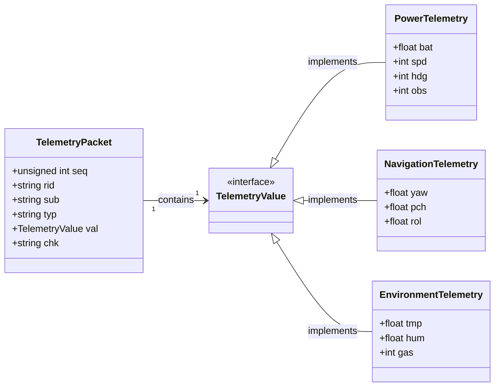

## Telemetry Data Packet & Framing Protocol

When designing mechatronic communication architectures, students must learn that a bare stream of variables is highly prone to errors, misalignment, and data corruption. To ensure robust operation, we suggest a standardised **Data Packet Protocol** for both the local UART link and the wireless LoRa link.

### 1. Recommended Telemetry Fields (JSON Payload)

For rapid prototyping and ease of debugging, human-readable **JSON** is highly recommended. Below is the structured format students should target:

| **Field Key** | **Data Type**    | **Description**         | **Example**          | **Purpose**                                                                  |
| ------------- | ---------------- | ----------------------- | -------------------- | ---------------------------------------------------------------------------- |
| **`seq`**     | `unsigned int`   | Message Sequence/ID     | `1024`               | Detects packet drops, out-of-order packets, or transmission gaps.            |
| **`rid`**     | `string` / `int` | Rover Identifier        | `"RVR_03"`           | Essential in a multi-rover classroom environment to identify sender.         |
| **`sub`**     | `string`         | Subsystem / Sensor Name | `"NAV"`              | Distinguishes between payload sensor sets (e.g., `"PWR"`, `"ENV"`, `"NAV"`). |
| **`typ`**     | `string`         | Data Type Signature     | `"VECT"`             | Identifies the formatting of the nested payload (e.g., `"JSON"`, `"RAW"`).   |
| **`val`**     | `nested object`  | Telemetry Payload       | `{"x":1.2,"y":-0.5}` | The actual sensor readings or controller values.                             |
| **`chk`**     | `string` / `hex` | Verification Checksum   | `"A4"`               | Hexadecimal checksum (like XOR-8 or CRC-8) for signal integrity checking.    |

#### Visual Data Structure (UML Class Diagram)

To visually describe this JSON structure, the UML diagram below models the relationships and data types. Students can see how the envelope wrapper remains consistent while the nested `val` (value) adapts depending on the chosen rover subsystem:



### 2. Suggested Standard Names for Subsystems & Sensors

To facilitate smooth database logging, consistent parsing, and trouble-free MQTT topic configurations across multiple student teams, we recommend adopting the following strict, shortened naming standards for all rover payloads:

#### Rover Identifiers (`rid`)

Student teams should register their rovers using a uniform prefix and zero-padded, two-digit number.

- **Standard Format:** `RVR_XX` (e.g., `RVR_01`, `RVR_02`, `RVR_11`)
    

#### Subsystem Names (`sub`)

Subsystems group related payloads together. This categorisation is vital for determining dashboard widget displays and routing databases.

- **`PWR`** (Power & Propulsion): Battery diagnostics, motor currents, speed vectors, and overall electrical health.
    
- **`NAV`** (Navigation & Kinematics): Accelerometer, gyroscope, compass heading, GPS data, and obstacle evasion stats.
    
- **`ENV`** (Environmental Analysis): Temperature, humidity, gas indicators, pressure, and weather parameters.
    
- **`SCI`** (Scientific Experiments): Dedicated student experimental sensors (e.g., soil moisture probes, UV light sensors, mechanical arm positional feedbacks).
    
- **`SYS`** (System Diagnostics): Onboard debugging metrics, core temp, clock cycles, or radio connection RSSI values.
    

#### Sensor Type Signatures (`typ`)

Sensor types define the driver or sensor family producing the reading, signalling the parser on how to scale or translate values.

- **`BAT`** (Battery Monitors / Raw ADC lines)
    
- **`MTR`** (Motor controllers, driver ICs, or wheel encoders)
    
- **`USC`** (Ultrasonic Rangefinders)
    
- **`IMU`** (Inertial Measurement Units - Gyroscopes, Accelerometers)
    
- **`MAG`** (Magnetometer / Digital Compasses)
    
- **`GPS`** (Global Positioning/Local Triangulation Modules)
    
- **`DHT`** (Digital Temp/Humidity Sensors, e.g., DHT11 or DHT22)
    
- **`MQX`** (Gas Detection sensors, e.g., MQ-2, MQ-135)
    
- **`LDR`** (Light-Dependent Resistors / Photoresistors)
    

#### Proposed MQTT Topic Structure

Standardising topics avoids confusion on the shared broker. Students should publish telemetry to structured topics like:

- `mars_rover/{rid}/{sub}` (e.g., `mars_rover/RVR_03/PWR` or `mars_rover/RVR_03/ENV`)
    

### 3. Physical Payload Examples

Below are concrete, structured examples corresponding to the visual UML models. These illustrate how students should format telemetry payloads depending on the active sensor board or task objective.

#### Example A: Power & System Status (The `PowerTelemetry` class)

This packet transmits battery diagnostics, speed, orientation heading, and obstacle clearances from the driving chassis. It corresponds to the default loop in **Appendix A**.

- **Subsystem (`sub`):** `"PWR"`
    
- **Sensor Type (`typ`):** `"SYS"`
    
- **Raw JSON Payload:**
    
    ```
    {"seq":1024,"rid":"RVR_03","sub":"PWR","typ":"SYS","val":{"bat":11.85,"spd":45,"hdg":274,"obs":42},"chk":"A7"}
    
    ```
    
- **Framed UART String (with `[` and `]` delimiters):**
    
    ```
    [{"seq":1024,"rid":"RVR_03","sub":"PWR","typ":"SYS","val":{"bat":11.85,"spd":45,"hdg":274,"obs":42},"chk":"A7"}]
    
    ```
    

#### Example B: Navigation & Kinematics (The `NavigationTelemetry` class)

This packet is generated if the rover has an active Inertial Measurement Unit (IMU) sensor to monitor orientation, pitch, and roll while traversing uneven terrain.

- **Subsystem (`sub`):** `"NAV"`
    
- **Sensor Type (`typ`):** `"IMU"`
    
- **Raw JSON Payload:**
    
    ```
    {"seq":1025,"rid":"RVR_03","sub":"NAV","typ":"IMU","val":{"yaw":274.52,"pch":3.14,"rol":-1.85},"chk":"D4"}
    
    ```
    
- **Framed UART String:**
    
    ```
    [{"seq":1025,"rid":"RVR_03","sub":"NAV","typ":"IMU","val":{"yaw":274.52,"pch":3.14,"rol":-1.85},"chk":"D4"}]
    
    ```
    

#### Example C: Environmental & Life Support (The `EnvironmentTelemetry` class)

This packet publishes habitat/weather data (Temperature, Humidity, Gas Level) gathered during stationary scientific scanning or from the Keyes Smart House gateway.

- **Subsystem (`sub`):** `"ENV"`
    
- **Sensor Type (`typ`):** `"DHT"`
    
- **Raw JSON Payload:**
    
    ```
    {"seq":1026,"rid":"RVR_03","sub":"ENV","typ":"DHT","val":{"tmp":22.40,"hum":45.20,"gas":320},"chk":"8C"}
    
    ```
    
- **Framed UART String:**
    
    ```
    [{"seq":1026,"rid":"RVR_03","sub":"ENV","typ":"DHT","val":{"tmp":22.40,"hum":45.20,"gas":320},"chk":"8C"}]
    
    ```
    

### 4. Physical UART Framing (Data Alignment)

Serial UART does not guarantee packet boundaries. If a microcontroller boots mid-transmission, it may read a partial string. Students should implement **UART Framing Markers** (e.g., wrapping JSON with start/stop characters):

```
+------------------+-------------------------------------------------------+----------------+
| START-OF-FRAME   |              TELEMETRY PAYLOAD DATA                   |  END-OF-FRAME  |
|  Char: '['       |  e.g., {"seq":238,"rid":"RVR_01", ... ,"chk":"F2"}    |   Char: ']'    |
+------------------+-------------------------------------------------------+----------------+

```

- **Start-of-Frame (SOF) Marker `[`**: Tells the RP2040's serial parser to clear its active buffer and begin saving characters.
    
- **End-of-Frame (EOF) Marker `]`**: Signals the RP2040 that the payload is complete and ready to be processed/transmitted over LoRa.
    

### 5. Key Telemetry Design Recommendations

- **Minimise Key Sizes:** LoRa has strict bandwidth limits and higher airtimes for larger packets. Students should use brief abbreviations (e.g., `"seq"` instead of `"sequence_number"`, `"rid"` instead of `"rover_identifier"`) to keep airtime minimal, save transmitter power, and prevent radio packet collisions.
    
- **Point-to-Point LoRa Frame Limit:** Ensure the total packaged string size remains below **251 bytes** (physical limits of the RFM95 transceivers), though a threshold of **under 100 bytes** should be targeted for classroom reliability.
    
- **Checksum Verification (The `chk` Field):** Challenge Tertiary (T-Path) students to write a custom CRC-8 or XOR checksum algorithm in mechatronics. The sending controller computes the mathematical sum of the JSON payload string, appends it as `chk`, and the receiving controller recalculates it upon arrival. If they do not match, the corrupted packet is discarded rather than published to the database.
    
- **Binary Telemetry Alternative (Advanced):** For high-achieving students, introduce C++ `struct` packaging or Python's `struct` library. Packing a message directly into raw binary bytes (e.g., representing telemetry integers and floats as standard 4-byte fields) can reduce packet sizes by **60% to 80%** compared to verbose string formats like JSON.
    

## Appendix A: Rover Main Controller (Multi-Hardware Platform Compatible)

Before loading the codebase, mechatronics students must reference the connection table below to physically hook up the transmitter lines. Ensure the TX pin of the main controller routes directly to the RX1 pin of the Feather RP2040, and that a common ground path is established.

### Main Controller Pin & Logic Voltage Map

| **Main Controller Board Profile**    | **TX Pin (To Feather RX1)** | **RX Pin (From Feather TX1)** | **Logic Voltage** | **Level Shifter Required?** | **Physical Connection Location**  |
| ------------------------------------ | --------------------------- | ----------------------------- | ----------------- | --------------------------- | --------------------------------- |
| **Adafruit Feather RP2040**          | **GPIO 0** (TX)             | **GPIO 1** (RX)               | 3.3V              | **No** (Direct Link)        | Onboard Native Pinout Rows        |
| **Adafruit Feather Huzzah32**        | **GPIO 17** (TX2)           | **GPIO 16** (RX2)             | 3.3V              | **No** (Direct Link)        | Standard Native Pinout Rows       |
| **Keyes ESP32 Plus** (Generic ESP32) | **GPIO 33** (TX2)           | **GPIO 32** (RX2)             | 3.3V              | **No** (Direct Link)        | Analogue Yellow G-V-S Rows        |
| **ACEBOT ESP32 Smart Car**           | **GPIO 27** (TX2)           | **GPIO 26** (RX2)             | 3.3V              | **No** (Direct Link)        | Servo Header Header Rows (QA052)  |
| **Arduino Mega 2560**                | **Pin 16** (TX2)            | **Pin 17** (RX2)              | 5.0V              | **YES (5V to 3.3V)**        | Standard Serial2 Pin Header block |

This codebase automatically detects the compiler target and assigns the corresponding hardware serial ports. For ESP32 configurations, it implements **GPIO Pin Remapping (Option 1)**, unlocking the ability to route `Serial2` away from pins 16 and 17 if those pins are currently assigned to other rover functions.

```
/*
   1. ROVER MAIN CONTROLLER (Multi-Board Configuration with Pin Remapping)
   
   This script runs on the main controller board of the rover. It compiles
   local sensor telemetrics into a JSON string and dispatches it over its designated
   UART hardware serial port.
   
   Automatic Board Pin Mapping & Remapping (Option 1):
   - Adafruit Feather RP2040:   Uses Hardware Serial1 (Fixed Pins: TX 0, RX 1)
   - Arduino Mega 2560:        Uses Hardware Serial2 (Fixed Pins: TX2 16, RX2 17)
   - ACEBOT Smart Car Shield:  Uses Hardware Serial2 + Flexible Pin Remapping.
                               GPIO 26 (RX) and GPIO 27 (TX) via the Servo header rows.
   - Generic ESP32 / Huzzah32: Uses Hardware Serial2 + Flexible Pin Remapping.
                               GPIO 16 (RX) and GPIO 17 (TX) via standard Serial2 pin configuration.
   
   Physical Wiring Safety Alert (3.3V vs 5V Logic):
   - ESP32 profiles and the Feather RP2040 use 3.3V logic. They link directly.
   - The Arduino Mega uses 5V logic. Connecting the Mega's TX pin directly to 
     the 3.3V RX pin of the Feather RP2040 will damage the RP2040! 
     Students MUST use a 5V-to-3.3V Logic Level Shifter on the Mega's TX line.
*/

#include <Arduino.h>

// Set this to true if uploading to the ACEBOT Smart Car (which uses the QA052 Car Shield)
#define USING_ACEBOT_CAR_SHIELD true

// --- SYSTEM HARDWARE CONFIGURATION via Preprocessor Macros ---
#if defined(ARDUINO_ADAFRUIT_FEATHER_RP2040) || defined(ARDUINO_ARCH_RP2040)
  // Configuration for Adafruit Feather RP2040 (running as Main Controller)
  #define BOARD_NAME "Adafruit Feather RP2040"
  #define TELEMETRY_SERIAL Serial1  // Mapped directly to fixed hardware pins RX(1) and TX(0)
  #define USING_REMAPPED_ESP32_PINS false
  #define NEW_RX2 -1 
  #define NEW_TX2 -1

#elif defined(ARDUINO_FEATHER_ESP32) || defined(ARDUINO_ESP32_FEATHER)
  // Configuration for Adafruit Feather Huzzah32
  #define BOARD_NAME "Adafruit Feather Huzzah32"
  #define TELEMETRY_SERIAL Serial2
  #define USING_REMAPPED_ESP32_PINS true
  
  // OPTION 1: CUSTOM PIN REMAPPING
  // For the Feather Huzzah32, we map this to standard hardware Serial2 pins: RX (GPIO 16) and TX (GPIO 17).
  //
  // DESIGN ARCHITECTURE CONSIDERATIONS FOR ESP32 PIN SELECTIONS:
  // - GPIO 16 & 17 (STANDARD / ACTIVE): Standard Serial2 pin footprint on the Huzzah32 board.
  // - GPIO 32 & 33 (OPTIONAL): Highly stable analogue-capable inputs that bypass strapping conflicts.
  // - GPIO 2 (DO NOT USE): A bootloader bootstrapping pin. It will halt the ESP32 startup if driven by RP2040.
  #define NEW_RX2 16
  #define NEW_TX2 17

#elif defined(__AVR_ATmega2560__) || defined(ARDUINO_AVR_MEGA2560)
  // Configuration for Arduino Mega 2560
  #define BOARD_NAME "Arduino Mega 2560"
  #define TELEMETRY_SERIAL Serial2  // Fixed Hardware Pin 16 (TX2), Pin 17 (RX2)
  #define USING_REMAPPED_ESP32_PINS false
  #define NEW_RX2 -1
  #define NEW_TX2 -1

#else
  // Default Configuration: Keyes ESP32 Plus / Generic ESP32 / ACEBOT Board
  #define USING_REMAPPED_ESP32_PINS true
  
  #if USING_ACEBOT_CAR_SHIELD
    #define BOARD_NAME "ACEBOT Smart Car (ESP32 + QA052 Shield)"
    #define TELEMETRY_SERIAL Serial2
    
    // ACEBOT CAR SHIELD (QA052) WIRELESS BRIDGING DESIGN:
    // - On the Acebott Shield, the default Serial2 pins (GPIO 16 & 17) are pre-routed to:
    //   GPIO 16 -> Trig pin of the Ultrasonic sensor / Shift Register
    //   GPIO 17 -> Echo pin of the Ultrasonic sensor / Voice Recognition header
    //   DO NOT USE GPIO 16 & 17! Connecting serial lines here breaks the car's motor and sensor systems.
    // - Instead, we use GPIO 26 and GPIO 27 which are broken out as standard 3-pin servo headers.
    //   These are safe, free mechatronic tracks.
    // - Student Wiring: Connect Servo Signal Pin 26 to Feather RX1. Connect Servo Signal Pin 27 to Feather TX1.
    #define NEW_RX2 26 
    #define NEW_TX2 27
    
  #else
    #define BOARD_NAME "Keyes ESP32 Plus / Generic ESP32"
    #define TELEMETRY_SERIAL Serial2  
    
    // KEYES ESP32 PLUS PIN SELECTIONS:
    // - GPIO 32 & 33 (RECOMMENDED): Mapped to the analogue headers. Robust and free of boot constraints.
    // - GPIO 4 (SOMETIMES USEFUL): Safe for digital, but Wi-Fi conflicts disable its analogue-to-digital reading.
    // - GPIO 2 (DO NOT USE): A bootloader bootstrapping pin. It will halt the ESP32 startup if driven by RP2040.
    #define NEW_RX2 32 
    #define NEW_TX2 33 
  #endif
#endif

// Telemetry dispatch interval (2 seconds)
const unsigned long TX_INTERVAL = 2000;
unsigned long lastTxTime = 0;

// Simulated states
float batteryVoltage = 12.6;
int driveSpeed = 0;
int compassHeading = 0;
int obstacleDistance = 150;

void setup() {
  // Main USB Serial Monitor for desktop diagnostics
  Serial.begin(115200);
  delay(1000); 
  
  Serial.print("--- Rover Main Controller Initialisation: ");
  Serial.print(BOARD_NAME);
  Serial.println(" ---");

  // Initialize designated Telemetry UART bus
  #if USING_REMAPPED_ESP32_PINS
    /* THE ESP32 INTERNAL GPIO MATRIX:
       Unlike older microcontrollers with hardwired communication tracks, the ESP32 
       can route its internal hardware UART units to almost any digital pin. 
       We pass our custom definitions directly into the .begin() function.
       Syntax: Serial2.begin(baud, serial_mode, rx_pin, tx_pin);
    */
    TELEMETRY_SERIAL.begin(9600, SERIAL_8N1, NEW_RX2, NEW_TX2);
    
    Serial.print("ESP32 GPIO Matrix active. Serial2 remapped to custom pins -> RX: ");
    Serial.print(NEW_RX2);
    Serial.print(", TX: ");
    Serial.println(NEW_TX2);
  #else
    // AVR Architecture (Mega) and RP2040 use fixed physical UART copper traces
    TELEMETRY_SERIAL.begin(9600);
    Serial.println("UART Port initialized on native hardware pins.");
  #endif
}

void loop() {
  unsigned long currentTime = millis();

  if (currentTime - lastTxTime >= TX_INTERVAL) {
    lastTxTime = currentTime;

    // Simulate real-time sensor shifts
    batteryVoltage -= 0.01;
    if (batteryVoltage < 9.6) batteryVoltage = 12.6; 
    driveSpeed = random(20, 80); 
    compassHeading = (compassHeading + random(1, 5)) % 360;
    obstacleDistance = random(10, 200);

    // Format telemetry packet as compact JSON
    char jsonPayload[128];
    snprintf(jsonPayload, sizeof(jsonPayload), 
             "{\"bat\":%.2f,\"spd\":%d,\"hdg\":%d,\"obs\":%d}", 
             batteryVoltage, driveSpeed, compassHeading, obstacleDistance);

    // Write to USB Port for PC debugging
    Serial.print("Local Diagnostics: ");
    Serial.println(jsonPayload);

    // Transmit telemetry payload to Feather RP2040 Telemetry Transmitter Module over UART
    TELEMETRY_SERIAL.println(jsonPayload);
  }
}
```

## Appendix B: Rover Telemetry Module (Feather RP2040)

Students construct this codebase in **Year 12, Semester 1**. This is the key "RF Bridge" that sits passively on the local UART line, buffering incoming packet characters and firing them over the LoRa airwaves as soon as a complete line is parsed.

```
/*
   2. TELEMETRY TRANSMITTER (Adafruit Feather RP2040 + RFM95 LoRa)
   
   This script runs on the Feather RP2040. It listens to its hardware UART 
   port (Serial1) for incoming telemetry strings from the ESP32. Once a complete 
   line (terminated by a newline '\n') is received, it broadcasts the packet 
   over point-to-point LoRa.
   
   Physical Wiring:
   - Feather RX (GPIO 1)  <---  ESP32 TX2 (GPIO 17)
   - Feather GND          <---  ESP32 GND
*/

#include <SPI.h>
#include <RH_RF95.h> // RadioHead LoRa Library

// Feather RP2040 + RFM95 LoRa FeatherWing Pinout
#define RFM95_CS    8   // Chip Select
#define RFM95_RST   4   // Reset
#define RFM95_INT   7   // Interrupt (DIO0)

// Must match base station frequency (e.g., ISM band 915.0 MHz for Australia/US)
#define RF95_FREQ   915.0 

RH_RF95 rf95(RFM95_CS, RFM95_INT);

// Buffer to store incoming UART data
const int MAX_INPUT_LENGTH = 128;
char inputBuffer[MAX_INPUT_LENGTH];
int bufferIndex = 0;

// Forward declaration of serial processor function
void processSerialTelemetry();

void setup() {
  // Local USB Serial Monitor debugging
  Serial.begin(115200);
  
  // Hardware UART port 1 (Feather RX/TX pins) to listen to the ESP32
  Serial1.begin(9600); 

  // Reset the LoRa hardware module
  pinMode(RFM95_RST, OUTPUT);
  digitalWrite(RFM95_RST, HIGH);
  delay(10);
  digitalWrite(RFM95_RST, LOW);
  delay(10);
  digitalWrite(RFM95_RST, HIGH);
  delay(10);

  // Initialize LoRa Radio
  if (!rf95.init()) {
    Serial.println("RFM95 LoRa module failed to initialize.");
    while (1);
  }
  Serial.println("RFM95 LoRa radio initialized successfully.");

  if (!rf95.setFrequency(RF95_FREQ)) {
    Serial.println("Failed to set LoRa frequency.");
    while (1);
  }
  Serial.print("LoRa frequency configured to: ");
  Serial.print(RF95_FREQ);
  Serial.println(" MHz");

  // Set transmission power (range 5 to 23 dBm)
  rf95.setTxPower(23, false); 
  
  Serial.println("Listening for telemetry packets on UART RX pin...");
}

void loop() {
  // Delegate UART polling and LoRa transmission to helper function
  processSerialTelemetry();
}

void processSerialTelemetry() {
  // Check if bytes are available from the ESP32
  while (Serial1.available() > 0) {
    char inChar = Serial1.read();

    // Check for newline character which indicates the telemetry packet is complete
    if (inChar == '\n' || inChar == '\r') {
      if (bufferIndex > 0) {
        inputBuffer[bufferIndex] = '\0'; // Null-terminate string
        
        Serial.print("UART Received. Transmitting over LoRa: ");
        Serial.println(inputBuffer);

        // Send packet over LoRa
        rf95.send((uint8_t *)inputBuffer, strlen(inputBuffer));
        rf95.waitPacketSent(); // Wait for completion
        
        // Reset buffer index for next packet
        bufferIndex = 0;
      }
    } 
    // Fill buffer as long as there is room
    else if (bufferIndex < MAX_INPUT_LENGTH - 1) {
      inputBuffer[bufferIndex++] = inChar;
    }
  }
}
```

## Appendix C: Raspberry Pi Telemetry Transmitter (Python)

For schools utilising a **Raspberry Pi (3B+, 4, or 5)** as the primary on-chassis mechatronic processor, standard serial communications are handled using the Python programming language. This appendix outlines the physical wiring requirements and provides a structured script to package and framing-packet telemetry out of the Pi's native hardware UART pins.

### Raspberry Pi Physical Serial Pinout

To interface the Raspberry Pi with the Feather RP2040 telemetry board, utilise the standard **40-pin GPIO header block**.

|   |   |   |   |   |
|---|---|---|---|---|
|**Raspberry Pi Pin Location**|**GPIO Name**|**Function**|**Destination on Feather**|**Logic Level**|
|**Header Pin 8**|`GPIO 14`|Native TXD0 (UART Output)|**RX1 (GPIO 1)**|3.3V (Safe - Direct Link)|
|**Header Pin 10**|`GPIO 15`|Native RXD0 (UART Input)|**TX1 (GPIO 0)**|3.3V (Safe - Direct Link)|
|**Header Pin 6**|`Ground`|System Ground Reference|**GND**|Ground (Crucial Common Reference)|

### Raspberry Pi Telemetry Output Script

This clean, non-blocking Python programme configures the Pi's `/dev/serial0` (primary UART mapped on GPIO 14 & 15). It automatically constructs standardised telemetry packets, calculates an XOR-8 verification checksum, applies Start-of-Frame (`[`) and End-of-Frame (`]`) serial data markers, and dispatches the payload every 2 seconds.

_Note: Before executing this script on a Raspberry Pi, ensure the hardware serial port is enabled via `sudo raspi-config` (under Interface Options -> Serial Port: disable serial console, but enable serial hardware) and install the library using `pip install pyserial`._

```
#!/usr/bin/env python3
"""
3. RASPBERRY PI MAIN TELEMETRY CONTROLLER (Python/PySerial)

This script formats mock rover sensor metrics into standard compact JSON, 
calculates a 2-character hex XOR-8 verification checksum, wraps the payload 
in Start/End-of-Frame markers, and transmits it over physical serial pins.
"""

import serial
import json
import time
import random

# --- HARDWARE SERIAL CONFIGURATION ---
# On Raspberry Pi, '/dev/serial0' points to the primary hardware UART port on Pins 8 (TX) & 10 (RX)
SERIAL_PORT = "/dev/serial0"
BAUD_RATE = 9600

def calculate_xor_checksum(payload_str: str) -> str:
    """
    Calculates a simple 8-bit XOR checksum of the string payload.
    Returns a 2-character uppercase hexadecimal string.
    """
    checksum = 0
    for char in payload_str:
        checksum ^= ord(char)
    return f"{checksum:02X}"

def send_telemetry_packet(ser_port: serial.Serial, sequence: int, rover_id: str, 
                          subsystem: str, data_type: str, value_dict: dict) -> None:
    """
    Assembles, checksums, frames, and transmits a standardized mechatronic telemetry packet.
    """
    # 1. Construct the core telemetry structure
    core_packet = {
        "seq": sequence,
        "rid": rover_id,
        "sub": subsystem,
        "typ": data_type,
        "val": value_dict
    }
    
    # 2. Convert to a compact JSON string (no spaces to minimise LoRa bandwidth)
    compact_json = json.dumps(core_packet, separators=(',', ':'))
    
    # 3. Calculate XOR Checksum on the un-framed string
    checksum_value = calculate_xor_checksum(compact_json)
    
    # 4. Integrate checksum value back into the telemetry envelope
    core_packet["chk"] = checksum_value
    final_json = json.dumps(core_packet, separators=(',', ':'))
    
    # 5. Apply physical UART Framing Markers: Start-of-Frame '[' and End-of-Frame ']' with a newline
    framed_payload = f"[{final_json}]\n"
    
    # 6. Dispatch over physical UART copper traces
    ser_port.write(framed_payload.encode('utf-8'))
    print(f"[TX - Seq {sequence}] Framed Packet Dispatched: {framed_payload.strip()}")

def run_telemetry_loop(ser_port: serial.Serial, rover_id: str) -> None:
    """
    Simulates real-time sensor measurements and transmits telemetry packets continuously.
    """
    battery_voltage = 12.60
    sequence_id = 0
    
    try:
        while True:
            # Simulate real-time sensor fluctuations
            battery_voltage = round(battery_voltage - 0.01, 2)
            if battery_voltage < 9.6:
                battery_voltage = 12.60  # Reset simulated battery curve
                
            simulated_values = {
                "bat": battery_voltage,
                "spd": random.randint(20, 80),
                "hdg": random.randint(0, 359),
                "obs": random.randint(10, 200)
            }
            
            # Send standard Power & Diagnostics telemetry packet
            send_telemetry_packet(
                ser_port=ser_port,
                sequence=sequence_id,
                rover_id=rover_id,
                subsystem="PWR",
                data_type="SYS",
                value_dict=simulated_values
            )
            
            # Increment sequence ID and sleep for transmission interval
            sequence_id += 1
            time.sleep(2.0)
            
    except KeyboardInterrupt:
        print("\nTelemetry execution loop stopped by operator.")

def main():
    print("--- Raspberry Pi Mars Rover Telemetry Module Starting ---")
    
    # Open Serial connection (with a timeout of 1 second for non-blocking reads if needed)
    try:
        ser = serial.Serial(SERIAL_PORT, baudrate=BAUD_RATE, timeout=1.0)
        print(f"Serial port {SERIAL_PORT} opened successfully at {BAUD_RATE} baud.")
    except serial.SerialException as e:
        print(f"CRITICAL: Failed to open serial port {SERIAL_PORT}. Error: {e}")
        print("Ensure GPIO Serial Port is enabled in raspi-config and you have root/dialout permissions.")
        return

    # Call the refactored telemetry simulation and dispatch function
    run_telemetry_loop(ser_port=ser, rover_id="RVR_03")
    
    # Close interface cleanly when loop completes
    ser.close()
    print("Serial port interface closed safely.")

if __name__ == "__main__":
    main()
```