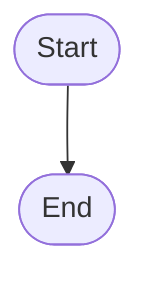
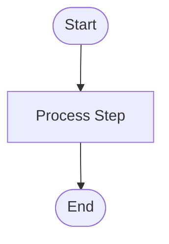
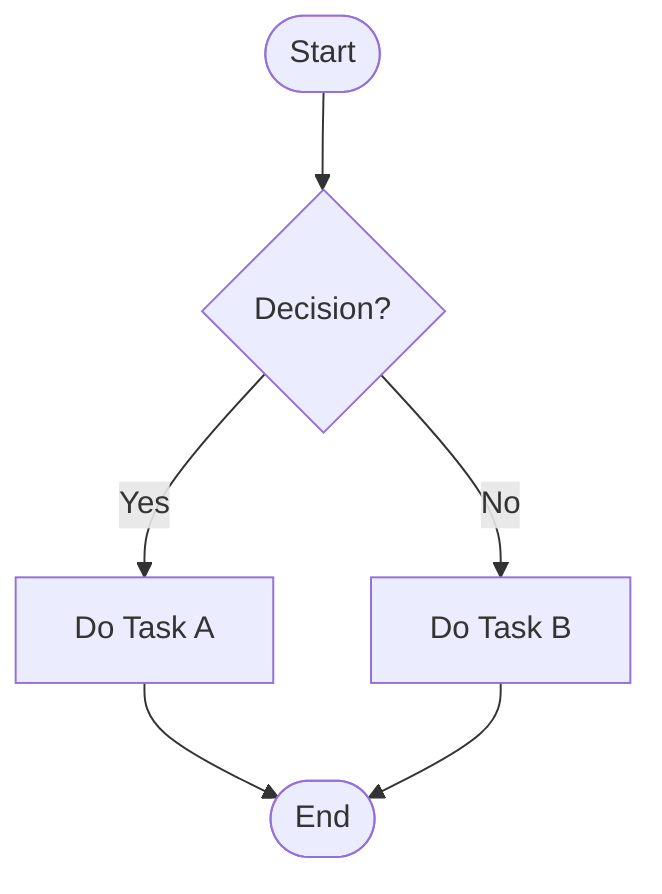
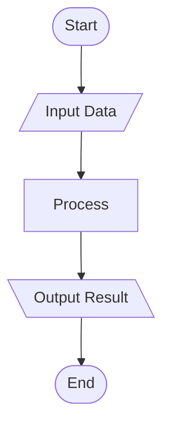
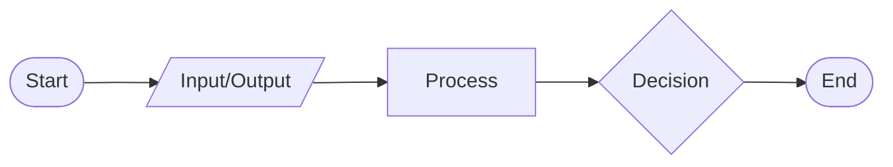
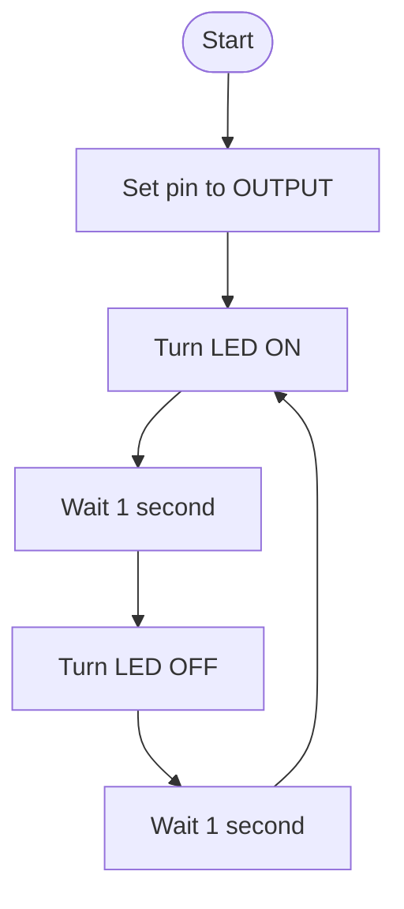
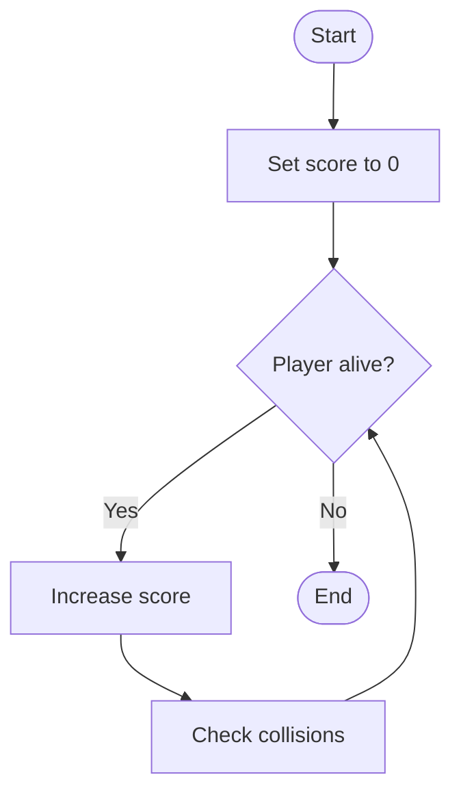
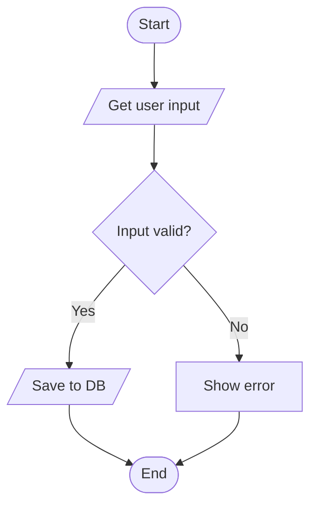

# Introduction to Algorithms

- Algorithms solve problems step-by-step
- Pseudocode expresses logic, not syntax
- Flowcharts visualize process flow
- Language-agnostic, easy to understand
- Useful for planning and debugging
- Foundation for all programming logic

---

## What is Pseudocode?

- Informal, human-readable code outline
- No strict syntax rules
- Focus on logic, not language
- Easy to translate to code
- Great for planning algorithms
- Helps communicate with non-programmers


--

## Pseudocode Example – Arduino

```Mermaid
Start
Set LED pin to OUTPUT
Loop forever:
    Turn LED ON
    Wait 1 second
    Turn LED OFF
    Wait 1 second
End
```


--

## Arduino Code

```Cpp
void setup() {
  pinMode(13, OUTPUT);
}

void loop() {
  digitalWrite(13, HIGH);
  delay(1000);
  digitalWrite(13, LOW);
  delay(1000);
}
```


--

## Pseudocode Example – GDScript

```Cpp
Start
On game start:
    Set score to 0
    While player is alive:
        Increase score
        Check for collisions
End
```


--

## GDScript Code

```GDScript
func _ready():
    var score = 0
    while player.is_alive():
        score += 1
        check_collisions()
```


--

## Pseudocode Example – PHP

```PlainText
Start
Get user input
If input is valid:
    Save to database
Else:
    Show error message
End
```


--

## PHP Code

```Php
$input = $_POST['data'];
if (validate($input)) {
    save_to_db($input);
} else {
    echo "Invalid input!";
}
```


---

# What is a Flowchart?

- Diagram of algorithm steps
- Uses standard symbols
- Arrows show control flow
- Easy to follow visually
- Great for presentations
- Complements pseudocode well

--
## Flowchart Symbols Overview

- Visual language for algorithms
- Standardized shapes and meanings
- Improves clarity and communication
- Used in planning and debugging
- Easy to read and follow
- Complements pseudocode perfectly

--

## Terminator Symbol



- Oval shape
- Represents start or end
- Always appears at boundaries
- One start, one or more ends
- Labeled as "Start" or "End"
- Entry/exit point of flow


--

## Process Symbol



- Rectangle shape
- Represents an action step
- Most common flowchart symbol
- Describes operations or tasks
- Can be repeated in loops
- Labeled with action verbs


--

## Decision Symbol


- Diamond shape
- Represents a yes/no question
- Branches into two or more paths
- Used for conditions and logic
- Must have at least two exits
- Labeled with a question

--

## Input/Output Symbol



- Parallelogram shape
- Represents data input or output
- Used for user interaction
- Also for displaying results
- Labeled with input/output text
- Often paired with processes

--

## Summary of Symbols




- **Oval**: Start or End
- **Rectangle**: Process step
- **Diamond**: Decision point
- **Parallelogram**: Input/Output
- Each has a clear purpose


---

## Flowchart – Arduino Blink



---

## Flowchart – GDScript Score



---

## Flowchart – PHP Input



---

## Summary

- Pseudocode outlines logic clearly
- Flowcharts visualize process flow
- Both aid in algorithm design
- Use before writing real code
- Language-independent planning tools
- Improve communication and debugging
