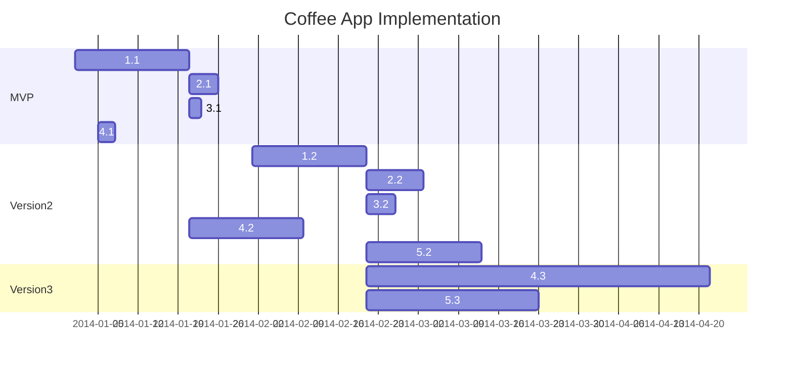

>[!info] This example shown is only the start. You may wish to add other documents to add depth to your submission.

This may have already been started in class → you can continue this if you wish.

## Step 1 - Topics

The product roadmap shows the various components of the project that will need to be developed and implemented. The Minimum Viable Product (MVP) details the minimum that needs to be developed for the product to be ‘marketable’ - in other words, the minimum of what the project needs to complete.

For your project, first compile a list of the different features, or aspects, to the project.

> [!info] If you are comprehensive and targeted, this product road map may be used to cover many of the documentation requirements.

Once you have the list, enter those under the topic column.

As an example, consider the project : `Develop an app for the iPad to find the nearest open cafe and lists prices`. The topics _may_ include items such as:

- Display cafes
- Test app on devices
- Get user feedback
- Collect prices of coffees
- Ordering
- etc

The roadmap would appear something like this:

|Topic|MVP (v1)|V2|V3|
|---|---|---|---|
|Display list of cafes||||
|Test app on devices||||
|Get user feedback||||
|Collect prices of coffees||||
|Ordering||||

## Step 2 - MVP

Once you have your first draft of the list of topics, you can start on completing the MVP column.

Start by adding dot points for each of the relevant topics.

You may wish to add images (or links to images) for certain topics, such as interface design.

> [!info] Reading all the entries of the MVP column should give an indication as to what the product would look like at ‘launch’.

**Not every box needs to be completed.**

For the example used, the MVP column may similar appear to:

| Topic                     | MVP (v1)                                                                                                                           | V2  | V3  |
| ------------------------- | ---------------------------------------------------------------------------------------------------------------------------------- | --- | --- |
| Display list of cafes     | - Tuggeranong Localised,  - Google Maps based. - When user taps on listed cafe, the price of a coffee appears in the banner. |     |     |
| Test app on devices       | - tested on 5 devices                                                                                                              |     |     |
| Get user feedback         | - Small focus group of Apple Users                                                                                                 |     |     |
| Collect prices of coffees | - Manually check and enter into database.                                                                                          |     |     |
| Ordering                  | N/A                                                                                                                                |     |     |

>[!info] Based on in the information provided, the app will be very simple - only a small number of cafes, testers and devices tested. And the prices will be manually entered.

## Step 3 - Versions 2 & 3

For each subsequent version, you would continue the process similar to the MVP, however add more features for each topic.

**As before : Not every box needs to be completed.**

For each version, the column will give an indication of the features of the product at that stage.

Note: The development process doesn’t need to complete all features of one version prior to moving to the next - this is just a overview at this stage.

For the example used, the v2 and 3 columns may similar appear to:

| Topic                     | MVP (v1)                                                                                                                           | V2                                                                                            | V3                                                                                                    |
| ------------------------- | ---------------------------------------------------------------------------------------------------------------------------------- | --------------------------------------------------------------------------------------------- | ----------------------------------------------------------------------------------------------------- |
| Display list of cafes     | - Tuggeranong Localised,  - Google Maps based. - When user taps on listed cafe, the price of a coffee appears in the banner. | All cafes across Canberra User submittable                                                 | N/A                                                                                                   |
| Test app on devices       | - tested on 5 devices                                                                                                              | - Expand testing to include minimum 80% of Android and iOS devices. Include link to research. | N/A                                                                                                   |
| Get user feedback         | - Small focus group of Apple Users                                                                                                 | - utilise platform testing facilities, such as TestFlight                                     | N/A                                                                                                   |
| Collect prices of coffees | - Manually check and enter into database.                                                                                          | - User submitable                                                                             | cafes submit their prices/menu to a centralised server as mandated by ACT Govt (similar to FuelWatch) |
| Ordering                  | N/A                                                                                                                                | - Cafes self-register to accept orders                                                        | - Partner with UserEats or similar.                                                                   |

> [!info] Based on in the information provided, the app will be very simple - only a small number of cafes, testers and devices tested. And the prices will be manually entered.

# Gantt Chart

Once you have completed this, you can use this to map to the other requirements. The gantt chart for instance, could be developed by linking the different topics to individual entries by adding id’s for each entry.

| Topic                       | MVP (v1)                                                                                                                          | V2                                                                                                             | V3                                                                                                             |
| --------------------------- | --------------------------------------------------------------------------------------------------------------------------------- | -------------------------------------------------------------------------------------------------------------- | -------------------------------------------------------------------------------------------------------------- |
| 1. Display list of cafes    | 1.1 Tuggeranong Localised Google Maps based. When user taps on listed cafe, the price of a coffee appears in the banner. | 1.2 - All cafes across Canberra - User submittable                                                       | 1.3 N/A                                                                                                     |
| 2 Test app on devices       | 2.1 - tested on 5 devices                                                                                                         | 2.2 - Expand testing to include minimum 80% of Android and iOS devices. Include link to research.           | 2.3 N/A                                                                                                     |
| 3 Get user feedback      | 3.1 - Small focus group of Tuggeranong based users - coffee fans.                                                              | 3.2 - utilise platform testing facilities, such as TestFlight - Additionally target non-coffee drinkers. | 3.3 N/A                                                                                                        |
| 4 Collect prices of coffees | 4.1 - Manually check and enter into database.                                                                                  | 4.2 - User submit able                                                                                      | 4.3 - cafes submit their prices/menu to a centralised server as mandated by ACT Govt (similar to FuelWatch) |
| 5 Ordering               | 5.1 N/A                                                                                                                        | 5.2 - Cafes self-register to accept orders                                                                  | 5.3 - Partner with UberEats or similar.                                                                     |

---

Other assessment topics can be mapped to the roadmap in a similar fashion.

> [!faq] You do NOT need to follow these suggestions if you have another approach!

