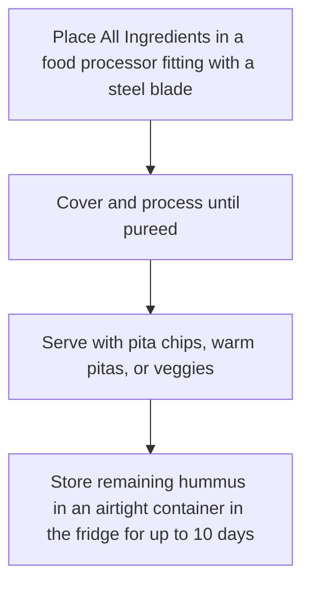
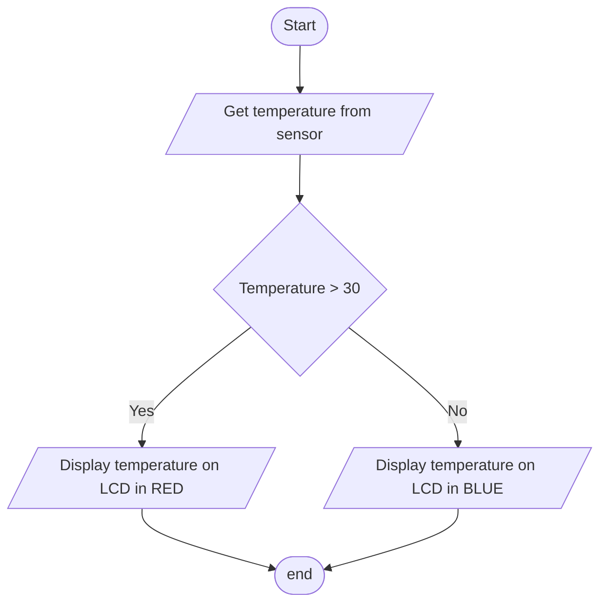
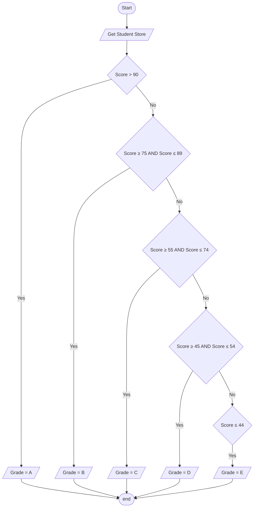
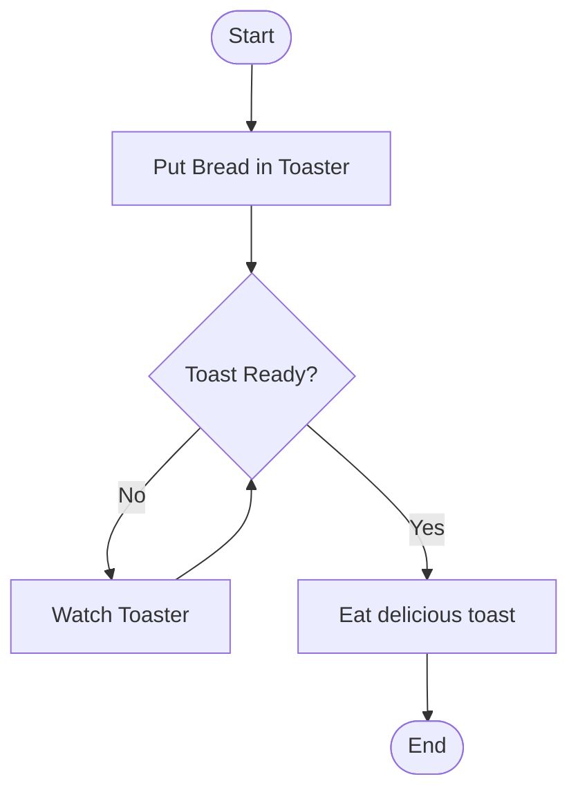
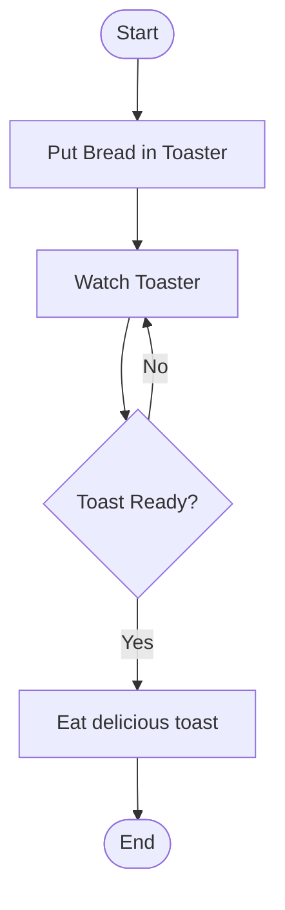
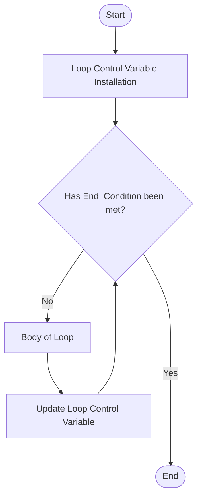
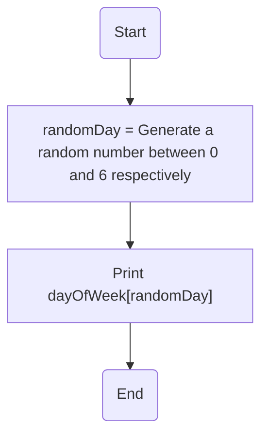
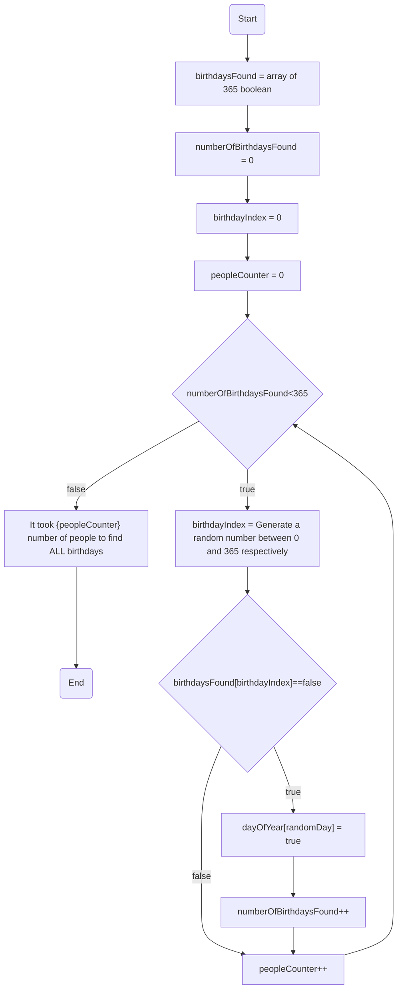

# Course Contents

[[Glossary]]

## Course Overview


> [!info] This course uses the generic, language agnostic "Software Development Fundamentals" course as a base. The Fundamentals course will introduce the topics / concepts for each stage, and this page has the language / platform specific implementation.


> [!info] In short - read and understand the theory, code the practical.


This will be general skills for programming. Not dependant on language, just the concepts.
Specific implementations of these topics, in specific languages and software will be demonstrated in the necessary courses.

Some of the languages you may code in are:

- Arduino
- GDscript
- C#
- Python
- PHP

![[overviewGeneralProgrammingSkills.png|General Programming Skills.png]]

## What is programming?

> Programming is the process of giving a computer or device a set of instructions to complete a task.
> 

![[overviewHighLevelLanguages.png|overviewHighLevelLanguages.png]]

Essentially, programming (or software development) is problem-solving. Aside from learning syntax, and your programming languages’ additional functionality and libraries, one of the skills you will want to enhance is your problem-solving skills.

## History of Programming languages

### First Generation

![[overviewFirstGeneration.png|Untitled]]

**Machine code**

- all 0’s and 1’s.

Programmers had to design all code away from the computer and then use punch cards.

If there was a mistake, the programmer would have to re-design and rewrite everything.

### Second Generation

![[overviewSecondGeneration.png|Untitled]]

**Assembly Code**

- Low-level
- More resembles English than machine code.

Code can only be written for a particular type of CPU

Extremely fast code

Still used today to optimise code (games, Operating Systems etc)

### Third Generation

![[overviewThirdGeneration.png|Untitled]]

**High-Level language**

- More English-like
- Modern Languages

Source Code ****written is converted into Assembly for the particular computer

Done by the **compiler** or **interpreter**

Introduces more programming structures:

- Loops
- Conditions
- etc

### Fourth Generation

![[overviewFourthGeneration.png|Untitled]]

**Higher abstraction**

Aims to run faster code than 3GL and with fewer lines

Database focus

- SQL

Platform independent (mostly)

### Fifth Generation

![[overviewFifthGeneration.gif]]

**Artificial Intelligence**

- Designed for the computer to solve the problem without the programmer.

The data and constraints are specified

- How the solution should look

Not successful. Yet….. or maybe???

## Programming languages

Programming languages are the languages that are used to code the computer. Similar to different human languages, each have their own set of words and symbols - referred to as the **syntax**.

![[overviewHelloWorld.jpeg|overviewHelloWorld.jpeg]]

*Most* languages can achieve the same outcome, but use different syntax to achieve the same goal.

Compare the following code snippets which produce the text “Hello World” on a console/terminal or browser.

They all achieve the same output, but using different syntax, and the place they output is different.

### Python 3

```python
print("Hello World")
```

### Javascript

```jsx
console.log("Hello World");
```

### Arduino

```arduino
Serial.println("Hello World");
```

### PHP

```php
<?php
echo "Hello World!";
?>
```

### A**ssembly**

```
; x86 32 bit Mac OSX
; to run file, compile and run with the following command
; nasm -f macho hello_world32.asm && ld -macosx_version_min 10.7.0 -o hello_world32 hello_world32.o && ./hello_world32

global start

section .text
start:
	push    dword msg.len
	push    dword msg
	push    dword 1
	mov     eax, 4
	sub     esp, 4
	int     0x80
	add     esp, 16

	push    dword 0
	mov     eax, 1
	sub     esp, 12
	int     0x80

section .data

msg:    db      "Hello, world!", 10
.len:   equ     $ - msg
```

## Executing Code

Once you write the code, you've got have the computer execute (run) it. Depending on the language and environment, there are two broad approaches to executing code - **interpreted** and **compiled**.

**Interpreted**

I**nterpreted** code is executed line by line by the *interpreter.*

This means that the interpreter takes the first line of code that it can execute, performs that function and then moves to the next line.

**Compiled**

The *compiler* analyses the entire code and then checks to make sure that it there are no syntax, or other, errors and then produces an executable (.exe on windows)


> [!info] While some languages are designed to be interpreted or compiled, some languages can be configured to do both.


### Which is better?

Neither is *better*, it depends on the circumstances. Compiling code can take time to compile the entire code base before it can execute, but once the code is running, it is generally faster.

Interpreted languages can allow for more flexible programming, however tend to execute slower than compiled languages.


> [!info] These are broad pros and cons and not representative of all languages.

## Input, Processing, Output

All code you’ll write (at least at this stage of your career) will fall into this simple structure- your code will take some input, process it in some fashion, and output a result. 

### Input

This could be a number, a user's name mouse click, a hyperlink, or a combination of a few items.

### Processing

This is generally where the majority of the logic of your code will fall. The question or problem you’re trying to solve is how to manipulate the input into a useful output.

### Output

This could be a result of a calculation used in another part of the code or writing to a database, a file, or a number of other parts types of output. 

### IPO Chart Example

![[overviewIPOChart.jpeg|overviewIPOChart.jpeg]]

### IPO Chart Template

Here is a template you can use to create your IPO Charts.

[IPO Chart Template](https://docs.google.com/document/d/15Z3BKzqbFT7EnutHYzFpX6Hff8vbE91ow20xJkksAIc/edit?usp=drivesdk)


# Version Control System / Github

## What does Git do?

- Manage projects with **Repositories**
- **Clone** a project to work on a local copy
- Control and track changes with **Staging** and **Committing**
- **Branch** and **Merge** to allow for work on different parts and versions of a project
- **Pull** the latest version of the project to a local copy
- **Push** local updates to the main project

[https://www.w3schools.com/git/git_intro.asp](https://www.w3schools.com/git/git_intro.asp)

## What is Git?

[https://www.youtube.com/watch?v=2ReR1YJrNOM](https://www.youtube.com/watch?v=2ReR1YJrNOM)

![[gitXKCD.jpeg]]

### Github Account

Create a Github Account [here](https://github.com/signup). Use your schoolsnet email address when it asks for your email address.

## How to use Git

Depending on the setup, you may use Github in different methods. Choose the option below that best suits your environment.


# What is Computational Thinking?

[https://www.bbc.com/bitesize/guides/zp92mp3/revision/1](https://www.google.com/url?q=https%3A%2F%2Fwww.bbc.com%2Fbitesize%2Fguides%2Fzp92mp3%2Frevision%2F1&sa=D&sntz=1&usg=AFQjCNFLFykzM1LBBM1Ie3VSRI-JuGUp0w)

Computers can be used to help us solve problems. However, before a problem can be tackled, the problem itself and the ways in which it could be solved need to be understood.

Computational thinking allows us to do this.

Computational thinking allows us to take a complex problem, understand what the problem is and develop possible solutions. We can then present these solutions in a way that a computer, a human, or both, can understand.

![[computationalWhatIs.jpeg]]

[https://youtu.be/mUXo-S7gzds](https://youtu.be/mUXo-S7gzds)

## The four cornerstones of computational thinking

There are four key techniques (cornerstones) to computational thinking:

- **decomposition** - breaking down a complex problem or system into smaller, more manageable parts
- **pattern recognition** – looking for similarities among and within problems
- **abstraction** – focusing on the important information only, ignoring irrelevant detail
- **algorithms** - developing a step-by-step solution to the problem, or the rules to follow to solve the problem

Each cornerstone is as important as the others. They are like legs on a table - if one leg is missing, the table will probably collapse. Correctly applying all four techniques will help when programming a computer.

![[computationalBrain.png|computationalBrain.png]]

## Computational thinking in practice

A complex problem is one that, at first glance, we don't know how to solve easily.

Computational thinking involves taking that complex problem and breaking it down into a series of small, more manageable problems (**decomposition**). Each of these smaller problems can then be looked at individually, considering how similar problems have been solved previously (**pattern recognition**) and focusing only on the important details while ignoring irrelevant information (**abstraction**). Next, simple steps or rules to solve each of the smaller problems can be designed (**algorithms**).

Finally, these simple steps or rules are used to **program** a computer to help solve complex problems in the best way.

## Decomposition

Decomposition is one of the four cornerstones of Computer Science. It **involves breaking down a complex problem or system into smaller parts** that are more manageable and easier to understand. The smaller parts can then be examined and solved, or designed individually, as they are simpler to work with.

[https://www.youtube.com/watch?v=rxsYpP2-omg](https://www.youtube.com/watch?v=rxsYpP2-omg)

## Problem Solving Approaches

### Top-Down Approach


❗ The main problem is broken into smaller subsystems.


Starting with the overall problem, and break it into stages, or areas, which are smaller more manageable tasks. Continue this process until the "problems" are small, easy to solve tasks.

For instance: **Making Pancakes.** Initially, this may be daunting (especially if you haven't made pancakes before).

Break the task into smaller manageable tasks:

1. Buy Ingredients
2. Make Pancakes
3. Eat Delicious Pancakes.

[https://www.youtube.com/watch?v=0NdThGHhX8M](https://www.youtube.com/watch?v=0NdThGHhX8M)

Then approach each individual task separately. For example.

![[computationalTopDown1.png|top-down 1.png]]

![[computationalTopDown2.png|top-down 2.png]]

![[computationalTopDown3.png]]

I really want pancakes.

### Bottom-Up Approach


❗ Solve small manageable tasks, integrating them together until an overall solution is reached.


This approach starts by creating a list of all outstanding issues or considering the system as a whole, and categorise them into similar jobs, and then solving those smaller, more specific jobs first. Once the parts of the system are solved, then work is begun to integrate them.

An example of this approach could be designing a library system using Object Oriented Programming (an advanced Programming topic) approach. In this approach, the designers of the system would first identify individual objects that the system would need - book, magazine, staff member, etc - and then model them in code. Once the individual objects are coded, then a "controller" piece of code would focus on having the individual objects interact as needed.

## Algorithm Design


# Mathematical & Logic Operations

## Mathematical Operations

When programming in any language, you can perform the usual set of mathematical equations; adding, subtracting, division and multiplication. 

You can also perform many more equations and complex processes using either built into the language or by using an external library. 


> [!info] In *most* programming situations, you need to follow the standard structure of the assignment statement. 
$variable = expression$
For instance to calculate the year the user was born:
$bornInYear = currentYear - getAgeFromUser()$


![[logicFarSide.jpg|logicFarSide.jpg]]

## Logic operations

### Logic Gates & Truth Tables

Logic gates are used to display and understand the logic in a circuit or piece of code.

Logic gates process signals which represent **true** or **false**. Normally the positive supply voltage +Vs represents true and 0V represents false. Other terms used for the true and false states are shown in the table, it is best to be familiar with them all.

Gates are identified by their function: NOT, AND, NAND, OR, NOR, EX-OR and EX-NOR. Capital letters are normally used to make it clear that the term refers to a logic gate.

![[logicStates.png|logicStates.png]]

[https://www.youtube.com/watch?v=kbXwFWMl6WA&ab_channel=MrPowell%27sComputerScienceChannel](https://www.youtube.com/watch?v=kbXwFWMl6WA&ab_channel=MrPowell%27sComputerScienceChannel)

There are a number of fundamental logic gates that you need to be aware of.

### **NOT Gate**

A NOT gate takes one input and produces a single output. The NOT gate simply "flips" the input, so TRUE becomes FALSE, and FALSE becomes TRUE.

![[logicTruthTableNOT.png|Truth Table - NOT.png]]

[https://circuitverse.org/simulator/embed/42660](https://circuitverse.org/simulator/embed/42660)

### **AND Gate**

An AND gate takes two inputs and produces a single output. For the output to be TRUE, then **both** of the inputs have to be TRUE.

![[logicTruthTableAND.png|Truth Table - AND.png]]

[https://circuitverse.org/simulator/embed/42653](https://circuitverse.org/simulator/embed/42653)

### **OR Gate**

An OR gate takes two inputs and produces a single output. For the output to be TRUE, then **either one or both** of the inputs have to be TRUE.

![[logicTruthTableOR.png|Truth Table - OR.png]]

[https://circuitverse.org/simulator/embed/42658](https://circuitverse.org/simulator/embed/42658)

### **NAND Gate**

A NAND gate takes two inputs and produces a single output and is the combination of an AND gate with a NOT gate, so it is the opposite of an AND gate. For the output to be TRUE, then **either or both** of the inputs have to the FALSE.

![[logicTruthTableNAND.png|Truth Table - NAND.png]]

[https://circuitverse.org/simulator/embed/42661](https://circuitverse.org/simulator/embed/42661)

### **NOR Gate**

A NOR gate takes two inputs and produces a single output and is the combination of an OR gate with a NOT gate, so it is the opposite of an OR gate. For the output to be TRUE, then **both** of the inputs have to the FALSE.

![[logicTruthTableNOR.png|Truth Table - NOR.png]]

[https://circuitverse.org/simulator/embed/42662](https://circuitverse.org/simulator/embed/42662)

### **XOR and XNOR**

The final two gates are **eXclusive** OR and NOR. In this case, Exclusive means the output is TRUE **only if either inputs are true, not both**.

![[logicTruthTableXORAndXNOR.png|Truth Table - XOR and XNOR.png]]

[https://circuitverse.org/simulator/embed/42663](https://circuitverse.org/simulator/embed/42663)

---

## Logic Game Symbols

Here is a summary of the Logic Gate Symbols that are standards.

These images are used to define the logic circuits.


❗ Notice how the NOR and NAND gates incorporate the small circle on the right of the symbol to indicate the NOT aspect.


![[logicGateSymbols.jpg|logicGateSymbols.jpg]]

Aaannd now for the humour:

![[logicJoke.jpeg|logicJoke.jpeg]]

## Logic Circuits

Logic Gates can be combined to make logic circuits. The output from each of the logic gates determine the input for the subsequent logic gate in the sequence

### **Simple Memory Circuit**

With a simple logic gate circuit you can design the logic of a single bit of memory.

[https://circuitverse.org/simulator/embed/memory-circuit-fd73493e-2499-45f7-ad76-d385094093f0](https://circuitverse.org/simulator/embed/memory-circuit-fd73493e-2499-45f7-ad76-d385094093f0)

## Boolean Algebra

Boolean algebra is the written, mathematical form of logic games and circuits.

Each of the logic gates described above can be written as a mathematical equation, and perform some standard, and not so standard, algebraic functions to them.

For instance, an AND gate, is written as a multiplication. Assuming you have two inputs into the AND gate, the mathematical equation would be $A.B$ or just $AB$.

### Symbols Summary

A NOT gate has a line over the top, such as:

$$
{ \overline A}
$$

An OR gate is an addition:

$$
A + B
$$

A NOR gate is a combination of the NOT gate and the OR gate - an addition with a line over the equation:

$$
{\overline{A+B}}
$$

Similarly, the NAND gate is a combination of the NOT and AND gates:

$$
{\overline{AB}}
$$

The XOR symbol is the following: ${\bigoplus}$, so an XOR statement would appear as:

$$
{A\bigoplus B}
$$

And XNOR is, again the combination of the XOR and NOT gates

$$
{ \overline{ A\bigoplus B}}
$$

### Examples

Consider the boolean equation: $((AB) + (AC))$ `(A AND B) OR (A AND C)`. This would be represented by the following logic circuit:

[https://circuitverse.org/simulator/embed/boolean-logic-exercise-1](https://circuitverse.org/simulator/embed/boolean-logic-exercise-1)

This equation - $A {\overline{B}} + C(AB)$ `(A AND NOT B) OR (C AND(A AND B))`. 

[https://circuitverse.org/simulator/embed/a-and-not-b-or-c-and-a-and-b](https://circuitverse.org/simulator/embed/a-and-not-b-or-c-and-a-and-b)

### Simplification

You can simplify Boolean algebra as with "normal" algebra.

#### Example

[Boolean Algebra Simplification Example 1.MP4](https://drive.google.com/file/d/1MIKxPdLqM5ZAwEtlnMSewu17UZ9HO4cV/view?usp=drivesdk)

![[logicBooleanAlgebraExample.jpg]]
❗ Why Simplify? Because it can make logic easier when coding logic into your system.

### Boolean Identities


![[logicBooleanIdentities.png]]

[https://www.allaboutcircuits.com/technical-articles/boolean-identities/](https://www.allaboutcircuits.com/technical-articles/boolean-identities/)

#### Example

![[logicFactoring.webp|logicFactoring.webp]]

## Karnaugh Maps

Karnaugh Maps are a useful process and tool to simplify complex boolean expression. They offer similar benefits to the simplification process in mathematical equations.


## Review

1. Go to [https://learn.electronics-course.com](https://learn.electronics-course.com/) (sign in with your school Google Account to save your progress) and complete the following projects:
	1. NAND Gate
	2. Half Adder
	3. Care Safety Buzzer


- Variables and Variables


# Variables and Data Types

## Variables


> > [!info] Variables are a way of storing data in a computer program.


Regardless of the language you’re programming in, you will at some stage need to store some data in memory (RAM)

To consider what variables are, You can think of memory in a computer as a series of boxes. 

![[variablesBoxes1.jpeg|variablesBoxes1.jpeg]]

Each one of these boxes can be given a unique name.

![[variablesBoxes2.jpeg|variablesBoxes2.jpeg]]

Variables can be named *almost* anything. Generally, they cannot start with a number. 


> [!info] The way you name variables is called the **naming convention.** Each programming language has its own standard naming convention. This is discussed in [[Style Guide]]


Now that variables have been named, you can store data in the box. For instance, you may set the following data to the four variables in the example:

```
HighScore is set to 25.
ButtonValue is set to HIGH.
Username is set to “administrator"
Password is set to “securePassword”
```

 

![[variablesBoxes3.jpeg|variablesBoxes3.jpeg]]

Once the values have been stored, you can retrieve the values by using the name of the box (variable name). For instance HighScore = HighScore + 5, would set the HighScore to 30.

Memory in the device (desktop, laptop, phone, tablet, microcontroller etc) is sandboxed to the application, and sub-divided into various sections, one being set aside for variables. That section is then used as the application needs, allocating specific memory addresses for particular variables. The number and structure of the memory addresses is dependant on many things, one of which is the **data type** of the variable.

## Data types

The type of data being stored in variables is important, and must be considered when using variables. 

Data Types can be divided up into different categories, initially into `Primitives` and `Non-Primitives`.

Primitives are the most simplest types of data, which can be used to create more complex, non-primitive data structures.

This is just an example of the breakdown of the data types - each programming language can implement variables and data types in their own manner.


> [!info] Characters may appear to be in the incorrect position, under Numeric, however this is due to the fact that Characters are stored in memory as the equivalent [ASCII character number](https://www.asciitable.com/). For instance, 'A' would be stored as `01000001`


![[variablesDataTypeTree.png|Data Type Tree.png]]

### Primitive data types

Primitives are the base types of data, including booleans, integers, characters etc. 


> [!info] Primitives may differ between programming languages.


Primitives are the most basic versions of data types - whole numbers, decimal point numbers, Booleans (true or false), individual characters, etc.

The types of data that can be stored in each of these are:

![[variablesDataTypesExamples.png|data types examples.png]]

### Non-Primitive Data Types

These data types offer more complexity, but need to be understood and managed in more detail. 

Some examples of non-primitive data types are : Arrays, Lists, Dictionaries, but the most common one you'll deal with when starting out is a `String`.

A string is a collection of characters in a sequence. In a string, each character can be considered an individual (primitive) character. In the example here, each letter is a character.

![[variablesStringsExample.png|Data Types - Strings example.png]]

Strings are useful non-primitive data types because you can manipulate the individual letters to perform certain actions, such as changing to upper or lower case, combining strings, removing unwanted characters, and many others.

## Assignment statements

Assignment statements are very important in any programming language. 

> [!info] Assignment statements are where the code assigns a value to a variable.

In the majority of modern, high-level languages an assignment statement follows this general convention:

$$
variable = expression
$$

The expression (one the right-hand side of the equals) is calculated and the “answer” or result is stored in the variable (one the left hand side).

Some examples:

| Example | Explanation |
| --- | --- |
| `Age = 42` | Sets the `Age` variable to the integer 42 |
| `Name = “Anakin Skywalker”` | Assigns “Anakin Skywalker” to the variable `Name`. |
| `Answer = value1 + value2` | Calculates the addition of the contents of `value1` and `value2` and stores the result in the variable `Answer`. |

The right hand side of the assignment statement can be incredibly complex, but the left hand side will (almost) always a single variable. But there’s always exceptions to the rule.

# Review

1. How is data stored in memory?
2. What’s the difference between primitive and non-primitve data types?
3. What is type inference?
	1. Find three programming languages that use type inference.
4. What is the opposite of type inference?
	1. Find three programming languages that don’t use type inference.
5. What does strongly typed and weakly typed languages mean?


# Algorithm Design - Sequence

## Summary

If a set of instructions are executed in the order that they appear (from the top to the bottom), then this is a sequence.

![[structuresSequenceDecisionLoop.jpeg|structuresSequenceDecisionLoop.jpeg]]

## Explanation

In programming, a sequence is a series of steps that occur in a particular order and each step must be complete before the next begins. So, `step1` is completed and then `step2` is run and when complete `step3` starts and so on.

For instance, think about your morning routine.

1. Get out of bed
2. Shower
3. Get dressed
4. Eat breakfast
5. Brush teeth
6. Leave house
7. Etc.

Now, your *actual* routine may differ from this, however each step must be complete before the next starts, and many of them can’t easily be done out of order.

Another example of Sequencing is in recipes. Once you have the ingredients, the actual making of the food item is a sequence of steps, which is the basis for an *algorithm.*

![[sequenceRecipe.jpeg]]

## Flowchart Example




# Algorithm Design - Decisions

## Summary

Decisions, or *selection*, is a programming structure where different steps can take place depending on particular *conditions.*

![[structuresSequenceDecisionLoop.jpeg]]

## Explanation

Making decisions in software development is critical as it allows the code to perform a different set of tasks depending on the current state of certain variables when the code is executed (or run).

The basic structure of the syntax to a decision in code will in one of two forms:

## if...then

The standard syntax structure for this is: 

`IF <condition>` 

`THEN` 

`<THEN block statement/s>` 

This works by checking the condition and if the condition is true, then the statements in the THEN block are executed.

## if...then...else

The standard syntax structure for this is the same as the IF...THEN, but includes an optional ELSE clause: 

`IF <condition>` 

`THEN` 

`<THEN block statement/s>` 

`ELSE` 

`<ELSE block statement/s>` 

This is executed in the same manner as the standard IF...THEN structure, however if the condition is false, the ELSE block statement/s will be executed.

One of the critical parts of the decision is the *condition.*

## Condition

The **condition** is the part of the decision which determines which path is taken after the decision is made.

As an example, consider the end of the day of school or work: You look at time - if it's after 3:30pm, you go home. In more programming terms, this could be written as `if time>3:30pm, then go home.` In this case, `time>3:30pm` is the condition.

## Example One - Temperature

### Overview

You're given the task to write a simple thermometer alert. The system is to output the temperature on an LCD screen. The instructions are:

`If the temperature is above 30℃, the temperature is shown in red.` 
`If the temperature is less than 30℃ display the temperature in blue.`

### Data

| Temperature | Output Colour |
| --- | --- |
| > 30 | Red |
| < 30 | Blue |

### Algorithm

This flowchart shows the coding **logic** required to complete the specifications of the system.



## Example Two - Grades

### Overview

Let's say you're writing a grade sorting algorithm for an exam. Grades in this algorithm are determined by the score the student receives on the exam, according to this table shown.

The code would need to be written to read the score for each student and output the correct grade. 

This would require a decision (or number of) to behave similar to:

`If the score is above 90, then output A.`

`If the score is greater than or equal to 75 AND the score is  less than or equal to 89, then output B.`

`If the score is greater than or equal to 55 AND the score is  less than or equal to 74, then output C.`

`If the score is greater than or equal to 45 AND the score is  less than or equal to 54, then output D.`

`If the output is less than 44, then output E.`

### Data

| Score | Grade |
| --- | --- |
| >90 | A |
| 75-89 | B |
| 55-74 | C |
| 45-54 | D |
| <44 | E |

## Algorithm




# Algorithm Design - Loops

## Explanation

![[structuresSequenceDecisionLoop.jpeg]]

## Video

[https://youtu.be/2e0HmKTSq2k](https://youtu.be/2e0HmKTSq2k)

## Notes

![[Presentation_-_Loops.pdf|Presentation - Loops.pdf]]

## Summary

Loops are a programming structure that allows the code to repeat blocks of code multiple times. 

This saves you coding all possible situations.

## Explanation

Computers are really good at repetitive tasks, whereas humans are, *well human*, and make mistakes. So, software development relies on loops (or repetition) to achieve goals that require the same, or similar, steps to be completed.

A loop structure allows us to code a block of code which will execute any number of times, including zero. 


> [!info] Loops, similar to decisions, rely heavily on  as part of their structure.


There are a number of general loop structures that are available in (almost) all languages.

## While Loop

This loop is a block of code that is repeated *while* the condition is true.

However the condition is only tested once the loop has completed the iteration.


> [!info] The condition is at the **top** of the loop.


### Flowchart Example



## Do... While Loop

Extremely similar to a while loop, however the block of code in a do... while loop is repeated *at least once* before the condition is checked.

> [!info] The condition is at the **bottom** of the loop.


### Flowchart Example



## For Loop

For loops are a more structured loop than either of the while loops. For loops include a **Loop Control Variable** which determine how many times the loop is run.

### Flowchart Example




# Algorithm Design - Modularisation

## Explanation

Modular programming is a software design technique that involves separating the functionality of a program into independent, interchangeable modules that can be used in different combinations to create multiple applications.

![[functionsModularProgramming.png]]

## Video


## Notes

![[Presentation_-_Modularisation.pdf|Presentation - Modularisation.pdf]]

## Summary

Modularisation is the process of splitting a large computer program into smaller, more manageable blocks of code. At this stage, the main structure for this process is called a **function.**

A function is a small subset of code which can be run (called) at different times during the execution of a program. The use of functions allow you to modularise your code to solve different, smaller problems in order to solve the overall problem.

## Functions

Functions are used to break the larger program into smaller, more manageable sections. This allows you, the developer, to focus on different parts of the program in different sections at different times.

Additionally, it can allow multiple developers to work on the same code base, but focusing on different functionality minimising interference. 

Functions allow you to reuse your functions in different parts of your code (and avoid repeating blocks of code), or in other programs, as well as provide you with a level of abstraction. 

> [!info] Functions can have many names. Depending on the context, they can be called **methods, modules, procedures** and many others.  They are all *functionally* the same, pun intended.


## Abstraction Example

Using the [top-down approach](https://www.notion.so/Computational-Thinking-16248ba104c84a14858882259cafe2f0?pvs=21), instead of writing down all the steps required for a task to be completed, you could focus on the higher level logic of the code, and identify the sections of the code to "farm out" to a function.

For instance, using the pancake analogy, you would first identify the higher level logic:

1. Buy ingredients
2. Cook Pancakes
3. Eat Pancakes

The implementation of (the details on how to complete) each of these stages would be a function. This is known as **abstraction.** 

> [!info] Abstraction is the process of identifying the overall logic (e.g. "buy ingredients") and ignoring the details (for now) of what that entails.


Another example of abstraction

## DRY vs WET

![[functionsDryVsWet.png|functionsDryVsWet.png]]

Functions are one approach to reducing repeated code. Repeated code is undesirable in code as it can be harder to maintain (I.e. update and fix in the future) as the developer will have to change multiple parts of the code to solve one problem.


## Function Parameters / Arguments

Functions have three main parts to it (discussed later in [[#IPO Charts]]), which can be simplified into Input, Processing, and Output. Some functions don't require any input to run, such as a function which loads a set file each time the program starts. However some functions require some form of input in order to start, such as a function to find the average of three numbers - the function requires the three numbers before it can calculate the result.


> [!info] Functions **do not** require input as a rule, but they all require processing and some form of output.


> [!info] Occasionally developers can use **parameters** and **arguments** interchangeably, but they are different. When the function is running, the variables defined in the function heading are called **parameters**. In the part of the code that calls the function, the data that is "sent" to the function is referred to as an **argument**.


### Parameter Example

```mermaid
flowchart TD
subgraph calculateGST
terminalStartCalculateGST(["calculateGST(productPrice)"])
terminalEndCalculateGST(["End"])
gstComponent["GSTComponent = productPrice / 11"]
displayResult[The GST Component of productPrice is GSTComponent]

terminalStartCalculateGST-->gstComponent
gstComponent-->displayResult
displayResult-->terminalEndCalculateGST
end
subgraph Main
terminalStart([Start])
terminalEnd([End])
getPrice1[/productPrice=get price from user/]
getPrice2[/productPrice=get price from user/]
callGST1[["calculateGST(productPrice)"]]
callGST2[["calculateGST(productPrice)"]]

terminalStart-->getPrice1
getPrice1-->callGST1
callGST1-->getPrice2
getPrice2-->callGST2
callGST2-->terminalEnd
end

```



This program calculates the GST component of the price of a product being sold.

The overall logic of the code is: 

- *Get the price of a product from the user, divide that price by 11, and tell the user the GST component of that price.*

The flowchart here shows that being done twice, and uses a function to calculate the GST and output it to the user.

You can see the flow of the logic here:

![[functionsLogicPlaythrough.gif]]


## Return Data

Generally, data that is modified within a function is lost when the function completes - it goes out of scope. This is not *always* true, if you're using Global variables, however this should be minimised as much as possible. More accurately, any variables that are declared within a function are "forgotten" by the program when the function completes.

Fitting with the Input...Process...Output structure, functions **return** data, which is the output stage.

Functions *generally* need to specify the data type of the data being returned from the function. This can be referred to as the **return type**, or the **methods type.**

If a function doesn't return anything, the return type is **void** meaning nothing.

```mermaid
flowchart TD
subgraph calculateGST
terminalStartCalculateGST(["calculateGST(productPrice)"])
terminalEndCalculateGST(["Return GSTComponent"])
gstComponent["GSTComponent = productPrice / 11"]

terminalStartCalculateGST-->gstComponent
gstComponent-->terminalEndCalculateGST
end
subgraph Main
terminalStart([Start])
terminalEnd([End])
getPrice1[/productPrice=get price from user/]
getPrice2[/productPrice=get price from user/]
displayResult1[The GST Component of productPrice is GSTComponent]
displayResult2[The GST Component of productPrice is GSTComponent]
callGST1[["calculateGST(productPrice)"]]
callGST2[["calculateGST(productPrice)"]]

terminalStart-->getPrice1
getPrice1-->callGST1
callGST1-->displayResult1
displayResult1-->getPrice2
getPrice2-->callGST2
callGST2-->displayResult2
displayResult2-->terminalEnd
end

```



## Functions Design

These topics describe how you could/should consider when designing your functions.

### IPO Charts

One method to start designing function is to determine and document their Inputs (if any), what processing needs to occur and then what Outputs are needed (if any).

This can be done using an IPO (Input Process Output) Chart.

![[functionsIPOChart.jpeg]]

## Implementation Hiding

The concept of Implementation Hiding is used when deciding when and how functions are used. Importantly as well, is that the concept revolves around the remainder of the program not knowing, and not needing to know, how the implementation of the function is achieved. 


> [!info] Implementation Hiding is the concept of the low level details are "hidden" from the remainder of the program through a function call.


Example:

Let's say you have an application developed which reads and writes data to a database. In testing, the application is written for SQLite (which is easier for a single user), however when the system is to be deployed in the wild, the database needs to be changed/upgraded to MySQL (much more robust and scalable). This is not necessarily an easy task.

If the application has been written well, the access to the database is only done in a certain number of functions, which would be easier to change the implementation of to the new database system. 

The remainder of the application code wouldn't need to change, and just use the functions to request or write data from/to the database, whereas the functions deal with the specific details of how to access the new/different database.

## Cohesion & Coupling


> [!info] You should strive to increasing cohesion.
You should strive to reduce coupling.

### Cohesion

Cohesion is the concept of how each function should solve one job (and one job only). 

If a function is completing two tasks, it's referred to a **low cohesion** and you you should strongly consider splitting it into more functions so each solve a smaller part of the task.

Why? It's so you can reuse the function in different stages of the code without causing expected outcomes (by it completing an unintended task).

### Coupling

Coupling is the measure of the strength of connection between two functions - as in how much information is exchanged between the two functions.

**Tight coupling** is where two functions exchange a lot of information

**Loose coupling** is where functions do not rely on each other at all, or very minimal.

![[functionsCoupling.png]]


This video focuses on classes and object oriented programming, however the concepts are similar to function design.

## Variable Scope

Variables, constants etc that are declared within a function, are only accessible from within that variable. When the function completes, the data for those variables is “lost” in memory.


# Flowcharts


## Resources

### Flowcharts

[Mermaid](https://mermaid-js.github.io/mermaid/#/./flowchart?id=flowcharts-basic-syntax](https://mermaid-js.github.io/mermaid/#/./flowchart?id=flowcharts-basic-syntax)

[Flowcharts](https://www.notion.so/Flowcharts-aefdd8293cdb46a1a4aa96ca5a3f9f48?pvs=21)

Visually create the flowcharts and copy the code.

[Mermaid Flow](https://www.mermaidflow.app/)

[https://www.youtube.com/watch?v=SWRDqTx8d4k](https://www.youtube.com/watch?v=SWRDqTx8d4k)


## Flowcharts Overview

Programming Logic, in the form of Flowcharts, are a method of documenting the logic of code (the **algorithm**) in a diagram form. 

There are many tools available to create flowcharts, both online and applications. They all use similar symbols for flowcharts, however the basic symbols are:

Flowcharts show the *logic* of an algorithm without specific code syntax.

[https://www.youtube.com/watch?v=kxZJv56BxU8](https://www.youtube.com/watch?v=kxZJv56BxU8)

![[flowchartHeyJude.jpeg|flowchartHeyJude.jpeg]]

![[flowchartSymbols.jpg]]

[https://www.smartdraw.com/flowchart/flowchart-symbols.htm](https://www.smartdraw.com/flowchart/flowchart-symbols.htm)

## Sample Project

For the purposes for this tutorial, an example of a project theme and behaviours could be:

### Theme

The electronics board project will be prototyping a **Smart Home** of the future. The concept of this Smart Home is that everything will be either automated or controlled through various environmental monitoring. 

Example Functionality: 

The system will monitor the temperature and respond appropriately.

The users will be able to open and close blinds through different inputs.

### Behaviours

The expected behaviours of the system are:

1. When a person gets too close (**sonar**) to the house, an alarm is sounded (**piezo)**.
2. When the garage door button is pressed (**button**) the Door Opens (**servo**) and the red light is turned on (**Traffic Light Red LED**). There is a pause for 5 seconds, then the door is closed and the light turned off.
3. The fan (**DC Motor**) speed is controlled through the controller (**potentiometer**).

## Flowcharts Example

This example is a quick demonstration of three different flowcharts, one for each function, in an Arduino sketch.

![[flowchartBoardGame.png|Board Game Flowchart.png]]

## **Flowchart Writing Tips**

This page is a tutorial on how to write/make tutorials: [https://www.lucidchart.com/pages/what-is-a-flowchart-tutorial](https://www.google.com/url?q=https%3A%2F%2Fwww.lucidchart.com%2Fpages%2Fwhat-is-a-flowchart-tutorial&sa=D&sntz=1&usg=AFQjCNHWnPrmDeScQr3b3ceOtgWZWRPl7g)


![[flowchartCheatSheet.png]]

## Mermaid

[Mermaid](https://mermaid.js.org/) is a text-based language for creating diagrams, and specifically Flowcharts.

There are similar languages (PlantUML for one) however mermaid has the ability to be rendered on Github when it’s included in a markdown file.

This site contains a comprehensive list of the options available using Mermaid.

[Basic overview of creating flowcharts using Mermaid](https://ckeditor.com/blog/basic-overview-of-creating-flowcharts-using-mermaid/)

As an example, in a Markdown file, you can include a block such as the one shown below and when viewing the Markdown file on Github, the flowchart is rendered as shown.

```
flowchart TD
	terminalStart([Start])
	%% Comment
	terminalEnd([End])
	thresholdSet(distanceThreshold = 30)
	setPiezoPin(piezoPin = 2)
	currentDistanceReading(distanceRead = response from Sonar)
	activatePiezo(write HIGH to piezoPin)
	deactivatePiezo(write LOW to piezoPin)

	ifDistanceLessThanThreshold{distanceRead < distanceThreshold}

	terminalStart --> thresholdSet
	thresholdSet --> setPiezoPin
	setPiezoPin --> currentDistanceReading
	currentDistanceReading --> ifDistanceLessThanThreshold
	ifDistanceLessThanThreshold --> |True| activatePiezo
	ifDistanceLessThanThreshold --> |False| deactivatePiezo
	deactivatePiezo --> terminalEnd
	activatePiezo --> terminalEnd
```


![[flowchartReadDistance.png|flowchartReadDistance.png]]


**If** you’re developing in a Jetbrains tool, you can enable Mermaid rendering in the IDE. Go to Settings, then Languages & Frameworks → Markdown and tick Mermaid. You may need to install first.

![[flowchartMermaidJetBrainsEnable.png|Untitled]]


### Creating Flowcharts - Mermaid

#### Mermaid Symbols and Syntax

This cheat sheet demonstrates the nodes available and the associated syntax.

![[flowchartMermaidSymbolsCode.png]]

[https://jojozhuang.github.io/tutorial/mermaid-cheat-sheet/](https://jojozhuang.github.io/tutorial/mermaid-cheat-sheet/)

#### Create a Markdown File

Open Visual Studio Code, or any text editor, Create a new file and immediately save it as `logic.md` into the directory identified above. ****


> [!info] .md indicates it is a Markdown file. Markdown is a simplified language which can add formatting styles to plain text documents.


![[flowchartCreateNewFile.png|Screen Shot 2022-04-29 at 10.02.00 pm.png]]

To make sure the workflow is configured correctly, go back into GitHub Desktop and it should show that the file has been created. 

![[commonBlocks#Commit & Push]]

![[logicCommitPush.png|Screen Shot 2022-04-29 at 10.06.19 pm.png]]

#### Flowchart Structure

In the text editor, create the start to the mermaid flowchart, by adding the following at the top of the file - `flowchart TD`


This indicates that the diagram will be a flowchart, and that it will be **T**op **D**own.

> [!info]  [https://mermaid-js.github.io/mermaid/#/./flowchart?id=flowchart-orientation](https://mermaid-js.github.io/mermaid/#/./flowchart?id=flowchart-orientation)
TB - top to bottom
TD - top-down/ same as top to bottom
BT - bottom to top
RL - right to left
LR - left to right


![[flowchartMermaidStart.png|Screen Shot 2022-04-29 at 10.16.25 pm.png]]

Create the two basic nodes first - the start and the end.

`terminalStart([Start])`
`terminalEnd([End])`


❓ The order of the nodes and connections in mermaid is irrelevant. The flowchart will be displayed (rendered) after reading in the whole diagram.


❓ The indentation shown is not important, and not required in Mermaid. It may make it easier to read, particularly when there are multiple flowcharts listed in one file.


![[flowchartMermaidStartEnd.png|Screen Shot 2022-04-29 at 10.16.29 pm.png]]

#### Preview Flowchart in Visual Studio Code (Optional)

If you’re using Visual Studio Code, you can install an extension to preview the mermaid flowcharts without having to commit and push to Github.

To do so, click on the Extensions button, search for Mermaid and then install the "Markdown Preview Mermaid Support” extension.

![[flowchartMermaidExtensionInstall.png|Screen Shot 2022-05-16 at 9.50.29 pm.png]]

Once that’s installed, you can open the preview of the file, with rendered flowchart by using the following key command:

| Windows | CTRL K + V |
| --- | --- |
| Mac | ⌘ K + V |
| Linux | CTRL K + V |

Alternatively, you can press the Preview button in the top right of the window.

![[flowchartMermaidExtensionPreview.png|Screen Shot 2022-05-16 at 10.04.08 pm.png]]

This splits the window with the original file on the left, and the rendered version on the right.

![[flowchartMermaidExtensionPreview2.png|Screen Shot 2022-05-16 at 10.05.27 pm.png]]

#### View the file on Github

In the browser, navigate to the Github repository, or click View on Github in Github Desktop, and click on [logic.md](http://logic.md/). The file should display as shown.

![[flowchartMermaidPreview.png|Screen Shot 2022-04-29 at 10.18.38 pm.png]]

#### Create Nodes and Connections

Determine the first steps required in the logic for each individual behaviour.

The first behaviour in the sample project (shown above) is: `When a person gets too close (**sonar**) to the house, an alarm is sounded (**piezo)**.`

To break this down, first the distance value would need to be read from the sonar sensor. **If** this value is below a certain threshold, then activate the piezo. This would require a number of nodes to achieve:

1. Set the threshold variable to a value. Let’s say 50cm.
2. Set piezoPin to pin connected to piezo.
3. Read the distance value from the sensor
4. If distance value < 50
	1. activate piezo

Create the sequence (default) nodes first.These are points 1, 2 3, and 4a above.

- Name the nodes appropriately using **lowerCamelCase**. Same with variables.
	
	![[variablesCamelCase.png|variablesCamelCase.png]]
	

![[flowchartMermaidNodes.png|Screen Shot 2022-04-29 at 10.39.02 pm.png]]

```mermaid
thresholdSet(distanceThreshold = 50)
setPiezoPin(piezoPin = 22)
currentDistanceReading(distanceRead = response from Sonar)
activatePiezo(write HIGH to piezoPin)
```

The last node to create is the if statement (point 4 above). This uses slightly different syntax. Instead of standard brackets, `{` and `}` are used to indicate a  decision symbol.

![[flowchartMermaidDecision.png|Screen Shot 2022-04-29 at 10.41.35 pm.png]]

```mermaid
ifDistanceLessThanThreshold{distanceRead < distanceThreshold>}
```

Refresh or view the document on [Github.com](http://Github.com) to see the individual nodes.

![[flowchartMermaidPreview2.png|Screen Shot 2022-04-29 at 10.47.59 pm.png]]

#### Build Connections

Now that all the individual nodes are created, it’s time to join them together to create the flowchart, showing the algorithm steps in order.

The general syntax for creating a connection with an arrow between two nodes is shown here.

The `A` and `B` in this example are the **ids** of each node.

```mermaid
A-->B
```

In the Smart House Example, to create the connection between terminalStart and thresholdSet, the code is as follows.

```mermaid
terminalStart --> thresholdSet
```

![[flowchartMermaidFlow.png|Screen Shot 2022-04-29 at 10.56.51 pm.png]]

Create all of the other connections as required.

```mermaid
terminalStart --> thresholdSet
thresholdSet --> setPiezoPin
setPiezoPin --> currentDistanceReading
currentDistanceReading --> ifDistanceLessThanThreshold
```

![[flowchartMermaidFlow2.png|Screen Shot 2022-04-29 at 11.01.42 pm.png]]

The decision connections is a little more complicated as there are two output from the decision - whether the condition is true or false. Luckily, mermaid gives you the ability to add text to the connection line. In this example the connection is made and `True` is displayed on the line in the diagram. 

```mermaid
ifDistanceLessThanThreshold --> |True| activatePiezo
```

![[flowchartMermaidFlow3.png|Screen Shot 2022-04-29 at 11.04.35 pm.png]]

Complete the output from the decision if it is false, and also the the next step after activatePiezo. At this stage, these are connecting to the same node - terminalEnd.

```mermaid
ifDistanceLessThanThreshold --> |False| terminalEnd
activatePiezo --> terminalEnd
```

![[flowchartMermaidFlow4.png|Screen Shot 2022-04-29 at 11.07.08 pm.png]]

#### View the Completed Flowchart

You can view the flowchart in Visual Studio code in the same manner that you view other Mermaid diagrams. 

Open/Refresh the file in [github.com](http://github.com/) and see the final version.

![[flowchartMermaidPreviewFinal.png|Screen Shot 2022-04-29 at 11.11.38 pm.png]]

#### Continue Development

One flowchart has been completed, however there are more behaviours.

Add in a heading above the mermaid block indicating the behaviour being attempted.

![[flowchartMermaidBehaviour1.png|Screen Shot 2022-04-29 at 11.17.01 pm.png]]

After the end of the first flowchart, add a heading in for the next behaviour algorithm, and start the mermaid block.

![[flowchartMermaidBehaviour2.png|Screen Shot 2022-04-29 at 11.18.15 pm.png]]

**Continue developing the diagrams as required.** See the link in the resources section above for more details on other possible nodes and connections.

### **Tips**

#### **"Wait for `<event>`"**

If you're writing your flowchart and you have a section which has to wait for an event, such as waiting for a button to press, you can include it in a flowchart by using a simple loop. For example:

# Style Guide

A style guide is a document in an organisation or programming environment which describes how programmers should (amongst other things) name their variables, and organise and comment their code.

![[variablesNamingConventions.png]]

## Clean code

You should strive for **clean code**. This is where your code is readable by other humans, not just executable by the computer. There are a number of considerations that fall under Clean Code - first of which is the naming conventions described above.

Some rules for writing clean code:

1. Following existing naming conventions (either project, organisation or programming language)
2. Keep is Simple!
3. Be consistent
	1. If you do things one way in the code already, keep doing them the same way
4. Avoid negative conditions
5. Functions:
	1. Do **one** thing
	2. Should be kept small
	3. Minimise arguments as much as possible
	4. Have no side effects
6. Comments
	1. Always explain yourself
	2. Don't be redundant
	3. Explain the purpose of the block of code
	4. Clarify the block of code
7. Indent code appropriately

[Clean Code: A Handbook of Agile Software Craftsmanship | 1st edition | Pearson](https://www.pearson.com/store/p/clean-code-a-handbook-of-agile-software-craftsmanship/P100002065712/9780132350884)

Clean Code, by Robert Martin, is considered one of the best resources for how to write clean cod

## Naming Conventions

Naming Conventions is a programming topic that focuses on naming variables, functions and other structures in a standardised format. There are a number of standard formats used throughout programming:

| **Term**                                 | **Defintion**                                                                                                                       | **Examples (if applicable)** |
| ---------------------------------------- | ----------------------------------------------------------------------------------------------------------------------------------- | ---------------------------- |
| **Lower Camel Case**                     | Starts with a lowercase, every subsequent word has a capital letter. There are no spaces, or other characters separating the words. | userName, thisVariable       |
| **Upper Camel Case**                     | The start of each word is capitalised. There are no spaces, or other characters separating the words.                               | UserName                     |
| **Snake Case (also called Python Case)** | All lowercase, each word separated by an underscore (_)                                                                             | list_of_user_names           |
| **Hungarian Notation**                   | The data type of the variable is included in the name, as a three letter identifier at the start of the code                        | intScore, str                |

Variable and function names generally have to start with a letter, and then can include numbers or another other character, and therefore you can generally name variables whatever you want. However, it is a Good Idea™  to name your variables and functions with useful or descriptive names.

## Naming Guidelines

Now that you know the structure needed, here are some rules on how to name your variables/functions etc.


> [!info] These guidelines can be a hot topic amongst developers - these are **not** hard and fast rules, and they will change depending on the organisation or project you're working on.


## Meaningful Names

Name your variables and functions with descriptive names that indicate what the data or purpose of it is. And avoid abbreviations.

For instance, if your variable is to store the moisture value read from a sensor, you could use the name `moistureValue`. If you, or another person, is reading the code, they will immediately understand what the variable is used for.

If your focus on brevity, and use a name similar to `mVal`, there is immediate ambiguity as to what the variable is used for.

## Avoid Generic / Temporary Names

Use names that are specific to the variable or function, and don't use temporary names. 


> [!info] **Don't** use names like `a`, `i`, `temp`, `tmp`, `variable1` etc.

## Function Names

Along with the previous guidelines, functions have an additional guideline:

**When naming functions, use verbs (doing words).** 

Function names should describe the action being performed - `loadFile()`, `saveData()`, `readSensor()`, `sanitiseData()`, `addNumbers()` etc.

If the function is returning some data, you can use "get" as the prefix - `getButtonData()`.


## Code Commenting


> [!info] Also known as **internal documentation**.


Comments are messages written in plain language to explain your code. They are used for documentation, and do not form part of the program logic.

### Block Comments

Block comments are multi-line comments at the beginning of a code file, which explain the purpose of the code, the author and date, and any other information that is relevant.

For example:

```jsx
// This code demonstrates the loading and saving of text files to the SD card.
// Written by Ryan Cather
// Last Modified : Semester 2, 2021
```

### Inline comments

Inline comments are short, usually single line comments which explain the purpose and logic of line/s of code. For example:

```jsx
// Calculate the interest.
Set interest = balance * INTEREST_RATE
// Add the interest to the balance.
Set balance = balance + interest
```

Inline comments can also be placed after the program code, to minimise the length of code file:

```jsx
Set interest = balance * INTEREST_RATE // Calculate the interest.
Set balance = balance + interest // Add the interest to the balance.
```

### Function Header Comments

Each function should have a comment explaining the purpose of the function, the arguments (if any) and the data type and description of the return value (if any).


> [!info] Also known as **docstrings** and other names in different languages.


# Data Structures

## Data Structures Overview

## Video


## Notes

![[Data_Structures.pdf|Data Structures.pdf]]

## Array

An array is a collection of variables in an organised manner. 


> [!info] The benefit of organising your code in such a manner becomes more clear with more data that is related. Additionally, sometimes you're not aware of how many values you will need to store when the code is written, and the data is collected when the program is running.


Arrays are a list of items that are related in some way - Student Scores, Student Names, Movie Release Dates, Book Titles etc.


In many languages the data stored in the array has to be the same type - strings, integers etc.

### Array Example 1 - Days Of The Week

A simple example of array usage is keeping track of the days of the week.  Instead of creating 7 different variables to hold the name of the day, you could create one array called `daysOfWeek` with a structure like this:

| Index | 0 | 1 | 2 | 3 | 4 | 5 | 6 |
| --- | --- | --- | --- | --- | --- | --- | --- |
| Element | “Sunday” | “Monday” | “Tuesday” | “Wednesday” | “Thursday” | “Friday” | “Saturday” |

There are a number of additional benefits to structuring the data in an array such as this. For instance, assume that you were writing code to store the day of the week in a text file or a database. It is much more efficient to store an integer rather than a string. 

If you were to write code to randomly generate a day of the week, rather than creating some complex code, you could simply perform the logic shown here.

Using the randomly generated integer (from 0 to 6), you could use that as the index for the data that you wish to print.

This can be used in many different situations - months for example.



### Array Example 2 - Birthday Counter

You are tasked with this problem:

`Imagine a line with an infinite number of people in it. How many people would you need to check before you found a birthday for every day of the year?` 

How would you approach this? You could do trial and error - which *could* work, however it would most like be inaccurate.

Or, you could use arrays to try and solve this problem.




## Key Value Pair


> [!info] Depending on the language, this may also be referred to as : hash, map, hashmap, associative array, dictionary. They are functionally the same.


A Key Value Pair is another collection of data, where the data is organised with a *key* and a *value*.

Key Value Pair may appear to be similar, however differs from an array in that the data is not ordered, and can’t be accessed through an index value.

When considering Key Value Pair in programming, you can think about a standard book dictionary - each entry has a key (the word) and then the value (the definition). Key Value Pair in code have the same structure, although you the developer can decide what the key and values are.

To access (read or write) the value the code would use the key: `studentScores("Ryan") = 25` would find the key "Ryan" and set the value to be 25.

![[variablesDictionary.jpeg|variablesDictionary.jpeg]]

![[variablesKeyValuePair.jpeg|variablesKeyValuePair.jpeg]]


> [!info] Key Value Pairs could be used in situations where you would need to store (in memory or on disk) settings for your application, such as high scores, user names etc.


### Key Value Pair Example - Movie Ratings

For instance, you might want to store the ratings of Star Wars movies from IMDB. Instead of creating variables for each of the Awesome Star Wars movies - A New Hope, The Last Jedi, Caravan of Courage etc - *which is possible* (but not ideal), you can create a Key Value Pair which stores the values in a list of items. 

The values (59% etc) could be stored in a Key Value Pair and accessed in code as (for example) `starWarsMovieRatings.`

![[variablesArrayStarWarsmovies.png|Array - Star Wars movies.png]]


# Debugging

![[debuggingStages.png]]

## Error Messages


> [!info] Debugging code and projects is just as important as being able to code in the first place!


## Rubber Duck Debugging

![[debuggingRubberDuck.png|debuggingRubberDuck.png]]


