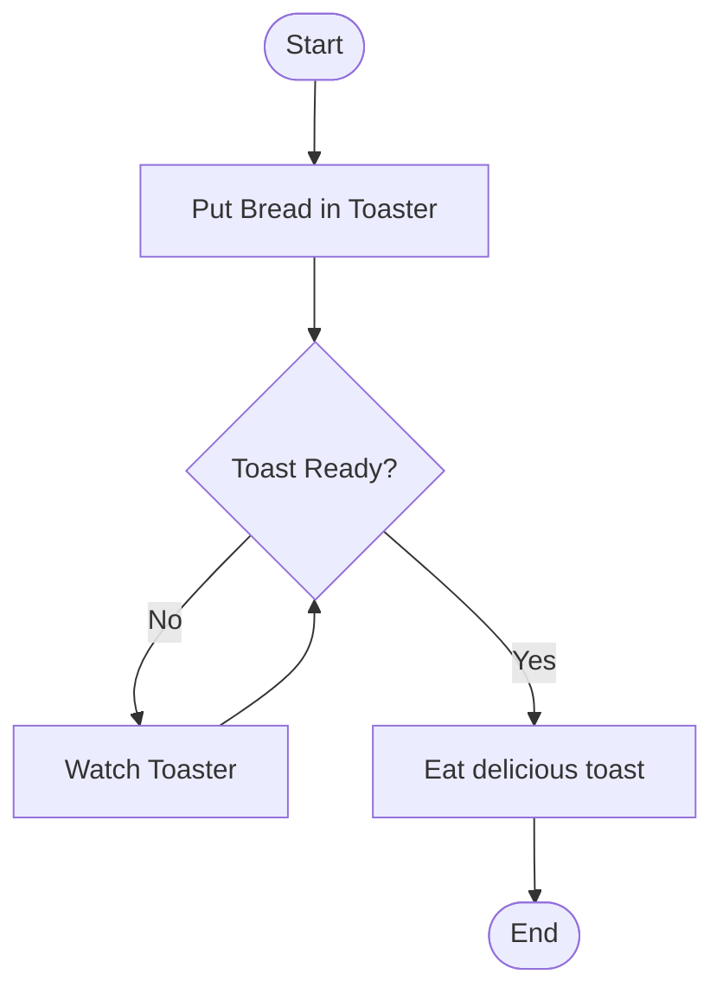

# Loops in Software Development

## What is a Loop?

A loop is a sequence of instructions that is continually repeated **until a certain condition is met**.

---

# Why Use Loops?

-   Automate repetitive tasks.
-   Reduce code duplication.
-   Make code more readable and manageable.

---

# Loop Example



---

## Types of Loops

-   `for` loops
-   `while` loops
-   `do-while` loops (Not directly available in Python or GDScript)

---


# For loops


Three sections to the for loop structure.

- Initialisation:
    - Initialises the loop control variable.
- Condition:
    - Boolean expression evaluated before each iteration.
- Increment
	- Updates the loop control variable after each iteration.

```cpp
for (int i = 0; i < 10; i++) {
	Serial.println(i);  
}
```
note:
If condition is true, the loop body executes; if false, the loop terminates.


---
# While Loop

- **Definition**: The `while` loop executes a block of code **only if** the condition is true.
- **Execution Flow**    
    - The condition is checked **before** entering the loop.
    - If the condition is true, the loop body executes.
    - The condition is re-evaluated after each iteration.
    - If the condition becomes false, the loop terminates.
- **Use Case**: When you need to repeat an action **only if** a condition is met.

---

# Do-While Loop

- **Definition**: The `do-while` loop executes a block of code **at least once** before checking the condition.
- **Execution Flow**:
    - The loop body executes **once** before the condition is checked.
    - After executing the loop body, the condition is evaluated.
    - If the condition is true, the loop body executes again.
    - The loop continues until the condition becomes false.
- **Use Case**: When you need to ensure that an action is performed **at least once**, regardless of the condition.

---

# Loops in GDScript v4

--
## `for` Loop Example (GDScript)

```gdscript
for i in range(5):
    print(i)
```


--

## `while` Loop Example (GDScript)

```gdscript
var time_left = 10
while time_left > 0:
    print("Time left:", time_left)
    time_left -= 1
    yield(get_tree().create_timer(1.0), "timeout")
```


---
# Loops in Python


--

## `while` Loop Example (Python)

```python
import time
import machine

# Initialize the temperature sensor
sensor = machine.ADC(0)  # Assuming the sensor is connected to ADC0

def read_temperature():
    # Read raw sensor value and convert it to temperature
    raw_value = sensor.read()
    temperature = (raw_value / 1024.0) * 100  # Example conversion
    return temperature

while True:
    temperature = read_temperature()
    print("Temperature:", temperature)
    time.sleep(1
```

--

## `for` Loop Example (Python)

```python
for i in range(5):
    print(i)
```


---

# Loops in Arduino

--


## Arduino Example (`for` loop)

```c++
int ledPins[] = {2, 3, 4, 5, 6};
int numOfLeds = 5;

for (int i = 0; i < numOfLeds; i++) {
  pinMode(ledPins[i], OUTPUT);
  digitalWrite(ledPins[i], HIGH);
}
```

---

## Arduino Example (`while` loop)

```arduino
float temperature = readTemperature();
while (temperature < threshold) {
  temperature = readTemperature();
}
```

--

## Arduino Example (`do..while` loop)

```arduino
int sensorPin = A0;
int sensorValue;

do {
  sensorValue = analogRead(sensorPin);
  Serial.println(sensorValue);
} while (sensorValue < threshold);
```

---

# Video

